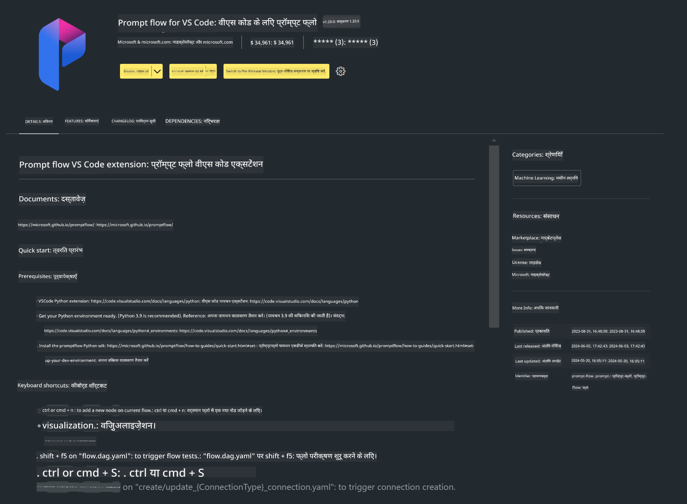

<!--
CO_OP_TRANSLATOR_METADATA:
{
  "original_hash": "e354f9cd277d8c4db97c6cc64730b8f1",
  "translation_date": "2025-04-04T18:30:47+00:00",
  "source_file": "md\\02.Application\\02.Code\\Phi3\\VSCodeExt\\HOL\\AIPC\\01.Installations.md",
  "language_code": "hi"
}
-->
# **लैब 0 - इंस्टॉलेशन**

जब हम लैब में प्रवेश करते हैं, हमें संबंधित वातावरण को कॉन्फ़िगर करना होता है:

### **1. Python 3.11+**

अपने Python वातावरण को कॉन्फ़िगर करने के लिए miniforge का उपयोग करने की सलाह दी जाती है।

miniforge को कॉन्फ़िगर करने के लिए, कृपया देखें [https://github.com/conda-forge/miniforge](https://github.com/conda-forge/miniforge)

miniforge को कॉन्फ़िगर करने के बाद, Power Shell में निम्नलिखित कमांड चलाएं:

```bash

conda create -n pyenv python==3.11.8 -y

conda activate pyenv

```

### **2. Prompt flow SDK इंस्टॉल करें**

लैब 1 में, हम Prompt flow का उपयोग करते हैं, इसलिए आपको Prompt flow SDK कॉन्फ़िगर करना होगा।

```bash

pip install promptflow --upgrade

```

आप इस कमांड के माध्यम से Prompt flow SDK को चेक कर सकते हैं:

```bash

pf --version

```

### **3. Visual Studio Code Prompt flow एक्सटेंशन इंस्टॉल करें**



### **4. Intel NPU Acceleration Library**

Intel के नए पीढ़ी के प्रोसेसर NPU का समर्थन करते हैं। यदि आप NPU का उपयोग करके LLMs / SLMs को स्थानीय रूप से चलाना चाहते हैं, तो आप ***Intel NPU Acceleration Library*** का उपयोग कर सकते हैं। अधिक जानकारी के लिए, आप [https://github.com/microsoft/PhiCookBook/blob/main/md/01.Introduction/03/AIPC_Inference.md](https://github.com/microsoft/PhiCookBook/blob/main/md/01.Introduction/03/AIPC_Inference.md) पढ़ सकते हैं।

bash में Intel NPU Acceleration Library इंस्टॉल करें:

```bash

pip install intel-npu-acceleration-library

```

***Note***: कृपया ध्यान दें कि यह लाइब्रेरी ***4.40.2*** संस्करण के ट्रांसफॉर्मर्स का समर्थन करती है, कृपया संस्करण की पुष्टि करें।

### **5. अन्य Python लाइब्रेरी**

requirements.txt बनाएं और इसमें निम्नलिखित सामग्री जोड़ें:

```txt

notebook
numpy 
scipy 
scikit-learn 
matplotlib 
pandas 
pillow 
graphviz

```

### **6. NVM इंस्टॉल करें**

Powershell में nvm इंस्टॉल करें:

```bash

winget install -e --id CoreyButler.NVMforWindows

```

nodejs 18.20 इंस्टॉल करें:

```bash

nvm install 18.20.0

nvm use 18.20.0

```

### **7. Visual Studio Code Development Support इंस्टॉल करें**

```bash

npm install --global yo generator-code

```

बधाई हो! आपने SDK को सफलतापूर्वक कॉन्फ़िगर कर लिया है। अब, अगला चरण हाथों-हाथ कार्य को पूरा करना है।

**अस्वीकरण**:  
यह दस्तावेज़ AI अनुवाद सेवा [Co-op Translator](https://github.com/Azure/co-op-translator) का उपयोग करके अनुवादित किया गया है। जबकि हम सटीकता सुनिश्चित करने का प्रयास करते हैं, कृपया ध्यान दें कि स्वचालित अनुवादों में त्रुटियाँ या अशुद्धियाँ हो सकती हैं। मूल भाषा में उपलब्ध मूल दस्तावेज़ को प्रामाणिक स्रोत माना जाना चाहिए। महत्वपूर्ण जानकारी के लिए, पेशेवर मानव अनुवाद की अनुशंसा की जाती है। इस अनुवाद के उपयोग से उत्पन्न किसी भी गलतफहमी या गलत व्याख्या के लिए हम उत्तरदायी नहीं हैं।