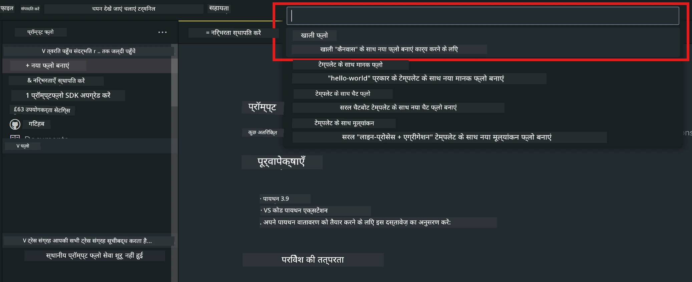
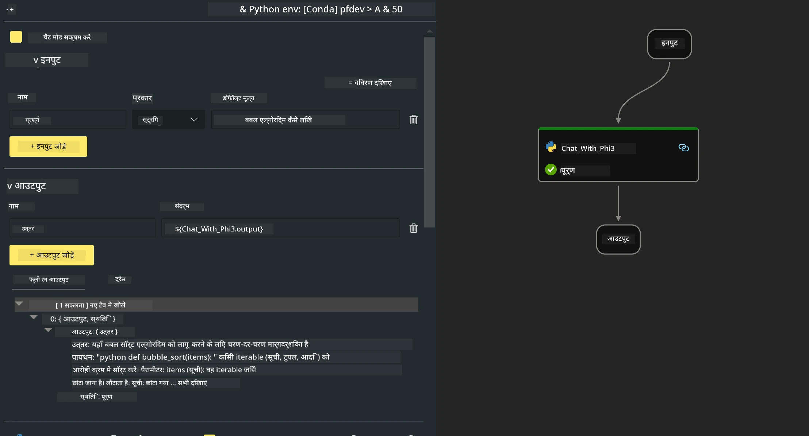
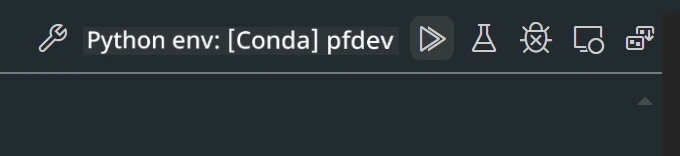

# **Lab 2 - AIPC में Phi-3-mini के साथ Prompt flow चलाना**

## **Prompt flow क्या है**

Prompt flow एक विकास उपकरणों का समूह है जो LLM-आधारित AI एप्लिकेशन के संपूर्ण विकास चक्र को सरल बनाता है, जिसमें विचार निर्माण, प्रोटोटाइपिंग, परीक्षण, मूल्यांकन से लेकर उत्पादन तैनाती और निगरानी शामिल है। यह prompt engineering को बहुत आसान बनाता है और आपको उत्पादन गुणवत्ता वाले LLM ऐप्स बनाने में सक्षम बनाता है।

Prompt flow के साथ, आप निम्न कर पाएंगे:

- ऐसे फ्लो बनाएंगे जो LLMs, prompts, Python कोड और अन्य टूल्स को एक निष्पादन योग्य वर्कफ़्लो में जोड़ते हैं।

- अपने फ्लो को डिबग और पुनरावृत्ति कर पाएंगे, खासकर LLMs के साथ इंटरैक्शन को आसानी से।

- अपने फ्लो का मूल्यांकन कर पाएंगे, बड़े डेटा सेट के साथ गुणवत्ता और प्रदर्शन मेट्रिक्स की गणना कर पाएंगे।

- अपने CI/CD सिस्टम में परीक्षण और मूल्यांकन को एकीकृत कर पाएंगे ताकि आपके फ्लो की गुणवत्ता सुनिश्चित हो सके।

- अपने फ्लो को चुने हुए सर्विंग प्लेटफ़ॉर्म पर तैनात कर पाएंगे या इसे अपने ऐप के कोड बेस में आसानी से एकीकृत कर पाएंगे।

- (वैकल्पिक लेकिन अत्यंत अनुशंसित) Azure AI में Prompt flow के क्लाउड संस्करण का उपयोग करके अपनी टीम के साथ सहयोग कर पाएंगे।

## **AIPC क्या है**

एक AI PC में CPU, GPU और NPU होते हैं, जिनमें से प्रत्येक में विशिष्ट AI त्वरक क्षमताएं होती हैं। NPU, या न्यूरल प्रोसेसिंग यूनिट, एक विशेष त्वरक है जो आपके PC पर ही आर्टिफिशियल इंटेलिजेंस (AI) और मशीन लर्निंग (ML) कार्यों को संभालता है, बजाय इसके कि डेटा को क्लाउड में प्रोसेसिंग के लिए भेजा जाए। GPU और CPU भी इन कार्यभारों को प्रोसेस कर सकते हैं, लेकिन NPU कम पावर वाले AI कैलकुलेशंस में विशेष रूप से अच्छा होता है। AI PC हमारे कंप्यूटर के काम करने के तरीके में एक मौलिक बदलाव का प्रतिनिधित्व करता है। यह किसी पहले से मौजूद समस्या का समाधान नहीं है, बल्कि रोज़मर्रा के PC उपयोग के लिए एक बड़ा सुधार है।

तो यह कैसे काम करता है? जनरेटिव AI और बड़े पैमाने पर प्रशिक्षित LLMs की तुलना में, जो सार्वजनिक डेटा पर आधारित होते हैं, आपके PC पर होने वाला AI हर स्तर पर अधिक सुलभ है। यह अवधारणा समझने में आसान है, और क्योंकि यह आपके डेटा पर प्रशिक्षित होता है, बिना क्लाउड एक्सेस की आवश्यकता के, इसके लाभ व्यापक जनसंख्या के लिए तुरंत आकर्षक होते हैं।

निकट भविष्य में, AI PC की दुनिया में व्यक्तिगत सहायक और छोटे AI मॉडल सीधे आपके PC पर चलते हैं, आपके डेटा का उपयोग करके व्यक्तिगत, निजी और अधिक सुरक्षित AI सुधार प्रदान करते हैं, जैसे कि मीटिंग मिनट लेना, फैंटेसी फुटबॉल लीग का आयोजन करना, फोटो और वीडियो संपादन के लिए स्वचालित सुधार करना, या परिवार के पुनर्मिलन के लिए सभी के आगमन और प्रस्थान समय के आधार पर परफेक्ट यात्रा कार्यक्रम बनाना।

## **AIPC पर जनरेशन कोड फ्लो बनाना**

***Note*** ：यदि आपने अभी तक पर्यावरण स्थापना पूरी नहीं की है, तो कृपया [Lab 0 -Installations](./01.Installations.md) देखें

1. Visual Studio Code में Prompt flow Extension खोलें और एक खाली फ्लो प्रोजेक्ट बनाएं



2. इनपुट और आउटपुट पैरामीटर जोड़ें और नए फ्लो के रूप में Python कोड जोड़ें



आप अपने फ्लो को बनाने के लिए इस संरचना (flow.dag.yaml) का संदर्भ ले सकते हैं

```yaml

inputs:
  question:
    type: string
    default: how to write Bubble Algorithm
outputs:
  answer:
    type: string
    reference: ${Chat_With_Phi3.output}
nodes:
- name: Chat_With_Phi3
  type: python
  source:
    type: code
    path: Chat_With_Phi3.py
  inputs:
    question: ${inputs.question}


```

3. ***Chat_With_Phi3.py*** में कोड जोड़ें

```python


from promptflow.core import tool

# import torch
from transformers import AutoTokenizer, pipeline,TextStreamer
import intel_npu_acceleration_library as npu_lib

import warnings

import asyncio
import platform

class Phi3CodeAgent:
    
    model = None
    tokenizer = None
    text_streamer = None
    
    model_id = "microsoft/Phi-3-mini-4k-instruct"

    @staticmethod
    def init_phi3():
        
        if Phi3CodeAgent.model is None or Phi3CodeAgent.tokenizer is None or Phi3CodeAgent.text_streamer is None:
            Phi3CodeAgent.model = npu_lib.NPUModelForCausalLM.from_pretrained(
                                    Phi3CodeAgent.model_id,
                                    torch_dtype="auto",
                                    dtype=npu_lib.int4,
                                    trust_remote_code=True
                                )
            Phi3CodeAgent.tokenizer = AutoTokenizer.from_pretrained(Phi3CodeAgent.model_id)
            Phi3CodeAgent.text_streamer = TextStreamer(Phi3CodeAgent.tokenizer, skip_prompt=True)

    

    @staticmethod
    def chat_with_phi3(prompt):
        
        Phi3CodeAgent.init_phi3()

        messages = "<|system|>You are a AI Python coding assistant. Please help me to generate code in Python.The answer only genertated Python code, but any comments and instructions do not need to be generated<|end|><|user|>" + prompt +"<|end|><|assistant|>"


        generation_args = {
            "max_new_tokens": 1024,
            "return_full_text": False,
            "temperature": 0.3,
            "do_sample": False,
            "streamer": Phi3CodeAgent.text_streamer,
        }

        pipe = pipeline(
            "text-generation",
            model=Phi3CodeAgent.model,
            tokenizer=Phi3CodeAgent.tokenizer,
            # **generation_args
        )

        result = ''

        with warnings.catch_warnings():
            warnings.simplefilter("ignore")
            response = pipe(messages, **generation_args)
            result =response[0]['generated_text']
            return result


@tool
def my_python_tool(question: str) -> str:
    if platform.system() == 'Windows':
        asyncio.set_event_loop_policy(asyncio.WindowsSelectorEventLoopPolicy())
    return Phi3CodeAgent.chat_with_phi3(question)


```

4. आप डिबग या रन से फ्लो का परीक्षण कर सकते हैं कि जनरेशन कोड सही काम कर रहा है या नहीं



5. टर्मिनल में विकास API के रूप में फ्लो चलाएं

```

pf flow serve --source ./ --port 8080 --host localhost   

```

आप इसे Postman / Thunder Client में टेस्ट कर सकते हैं

### **Note**

1. पहली बार रन करने में अधिक समय लगता है। यह सुझाव दिया जाता है कि आप Hugging face CLI से phi-3 मॉडल डाउनलोड करें।

2. Intel NPU की सीमित कंप्यूटिंग शक्ति को ध्यान में रखते हुए, Phi-3-mini-4k-instruct का उपयोग करने की सलाह दी जाती है।

3. हम Intel NPU Acceleration का उपयोग INT4 क्वांटाइजेशन के लिए करते हैं, लेकिन यदि आप सेवा को पुनः चलाते हैं, तो आपको cache और nc_workshop फ़ोल्डर को हटाना होगा।

## **संसाधन**

1. Promptflow सीखें [https://microsoft.github.io/promptflow/](https://microsoft.github.io/promptflow/)

2. Intel NPU Acceleration सीखें [https://github.com/intel/intel-npu-acceleration-library](https://github.com/intel/intel-npu-acceleration-library)

3. सैंपल कोड, डाउनलोड करें [Local NPU Agent Sample Code](../../../../../../../../../code/07.Lab/01/AIPC)

**अस्वीकरण**:  
यह दस्तावेज़ AI अनुवाद सेवा [Co-op Translator](https://github.com/Azure/co-op-translator) का उपयोग करके अनुवादित किया गया है। जबकि हम सटीकता के लिए प्रयासरत हैं, कृपया ध्यान दें कि स्वचालित अनुवादों में त्रुटियाँ या अशुद्धियाँ हो सकती हैं। मूल दस्तावेज़ अपनी मूल भाषा में ही अधिकारिक स्रोत माना जाना चाहिए। महत्वपूर्ण जानकारी के लिए, पेशेवर मानव अनुवाद की सलाह दी जाती है। इस अनुवाद के उपयोग से उत्पन्न किसी भी गलतफहमी या गलत व्याख्या के लिए हम जिम्मेदार नहीं हैं।