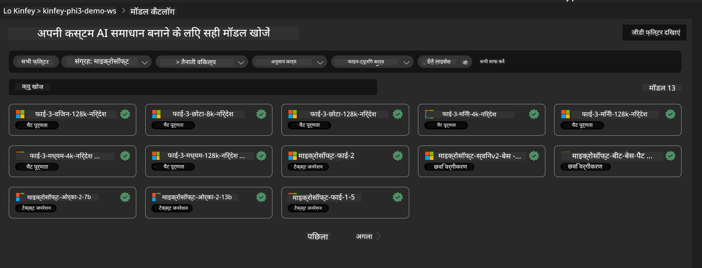
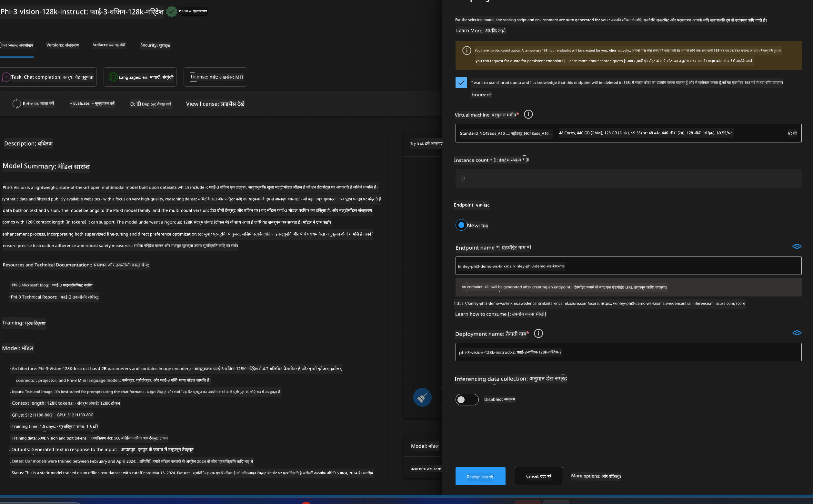
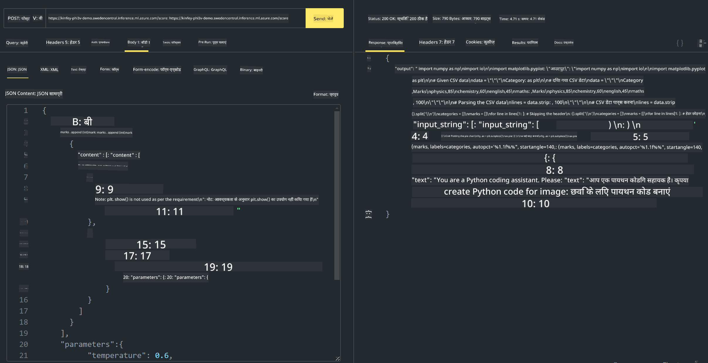

<!--
CO_OP_TRANSLATOR_METADATA:
{
  "original_hash": "20cb4e6ac1686248e8be913ccf6c2bc2",
  "translation_date": "2025-05-08T05:32:27+00:00",
  "source_file": "md/02.Application/02.Code/Phi3/VSCodeExt/HOL/AIPC/03.DeployPhi3VisionOnAzure.md",
  "language_code": "hi"
}
-->
# **Lab 3 - Azure Machine Learning Service पर Phi-3-vision तैनात करना**

हम NPU का उपयोग करके स्थानीय कोड का उत्पादन तैनाती पूरा करते हैं, और फिर हम इसके माध्यम से PHI-3-VISION को शामिल करने की क्षमता लाना चाहते हैं ताकि तस्वीरों से कोड जनरेट किया जा सके।

इस परिचय में, हम Azure Machine Learning Service में जल्दी से Model As Service Phi-3 Vision सेवा बना सकते हैं।

***Note***： Phi-3 Vision को तेज़ी से कंटेंट जनरेट करने के लिए कंप्यूटिंग पावर की आवश्यकता होती है। इसके लिए हमें क्लाउड कंप्यूटिंग पावर की मदद लेनी होती है।


### **1. Azure Machine Learning Service बनाएं**

हमें Azure Portal में एक Azure Machine Learning Service बनानी होगी। यदि आप सीखना चाहते हैं कि कैसे, तो कृपया इस लिंक पर जाएं [https://learn.microsoft.com/azure/machine-learning/quickstart-create-resources?view=azureml-api-2](https://learn.microsoft.com/azure/machine-learning/quickstart-create-resources?view=azureml-api-2)


### **2. Azure Machine Learning Service में Phi-3 Vision चुनें**




### **3. Azure में Phi-3-Vision तैनात करें**





### **4. Postman में Endpoint टेस्ट करें**





***Note***

1. भेजे जाने वाले पैरामीटर में Authorization, azureml-model-deployment, और Content-Type शामिल होना चाहिए। इसे प्राप्त करने के लिए आपको तैनाती जानकारी चेक करनी होगी।

2. पैरामीटर भेजने के लिए, Phi-3-Vision को एक इमेज लिंक भेजना होगा। कृपया GPT-4-Vision के तरीके को देखें कि पैरामीटर कैसे भेजे जाते हैं, जैसे

```json

{
  "input_data":{
    "input_string":[
      {
        "role":"user",
        "content":[ 
          {
            "type": "text",
            "text": "You are a Python coding assistant.Please create Python code for image "
          },
          {
              "type": "image_url",
              "image_url": {
                "url": "https://ajaytech.co/wp-content/uploads/2019/09/index.png"
              }
          }
        ]
      }
    ],
    "parameters":{
          "temperature": 0.6,
          "top_p": 0.9,
          "do_sample": false,
          "max_new_tokens": 2048
    }
  }
}

```

3. Post मेथड का उपयोग करके **/score** कॉल करें

**बधाई हो**! आपने तेज़ PHI-3-VISION तैनाती पूरी कर ली है और यह भी आजमाया कि कैसे तस्वीरों से कोड जनरेट किया जा सकता है। अब हम NPUs और क्लाउड के संयोजन से एप्लिकेशन बना सकते हैं।

**अस्वीकरण**:  
यह दस्तावेज़ AI अनुवाद सेवा [Co-op Translator](https://github.com/Azure/co-op-translator) का उपयोग करके अनुवादित किया गया है। जबकि हम सटीकता के लिए प्रयासरत हैं, कृपया ध्यान दें कि स्वचालित अनुवादों में त्रुटियाँ या अशुद्धियाँ हो सकती हैं। मूल दस्तावेज़ अपनी मूल भाषा में प्रामाणिक स्रोत माना जाना चाहिए। महत्वपूर्ण जानकारी के लिए, पेशेवर मानव अनुवाद की सलाह दी जाती है। इस अनुवाद के उपयोग से उत्पन्न किसी भी गलतफहमी या गलत व्याख्या के लिए हम उत्तरदायी नहीं हैं।