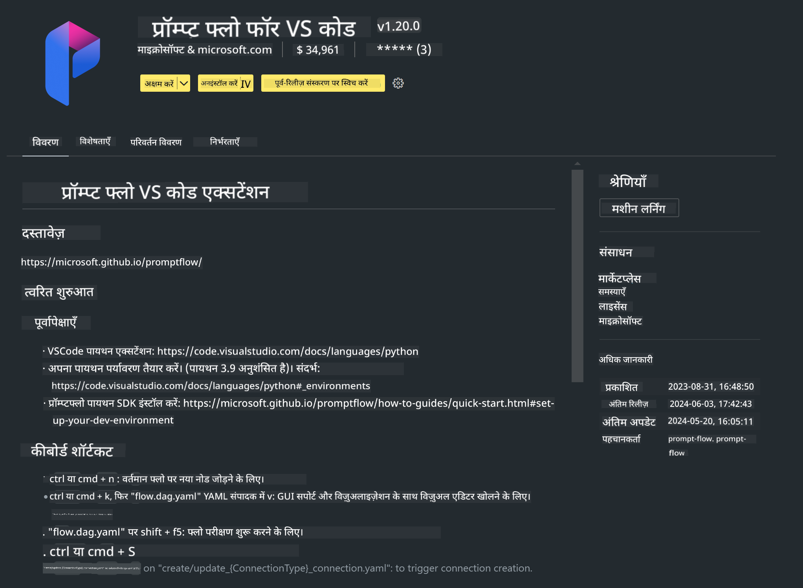

<!--
CO_OP_TRANSLATOR_METADATA:
{
  "original_hash": "4b16264917d9b93169745d92b8ce8c65",
  "translation_date": "2025-05-08T05:34:19+00:00",
  "source_file": "md/02.Application/02.Code/Phi3/VSCodeExt/HOL/Apple/01.Installations.md",
  "language_code": "hi"
}
-->
# **Lab 0 - इंस्टॉलेशन**

जब हम लैब में प्रवेश करते हैं, तो हमें संबंधित पर्यावरण को कॉन्फ़िगर करना होता है:


### **1. Python 3.11+**

अपने Python पर्यावरण को कॉन्फ़िगर करने के लिए miniforge का उपयोग करने की सलाह दी जाती है

miniforge को कॉन्फ़िगर करने के लिए, कृपया [https://github.com/conda-forge/miniforge](https://github.com/conda-forge/miniforge) देखें

miniforge कॉन्फ़िगर करने के बाद, Power Shell में निम्न कमांड चलाएँ

```bash

conda create -n pyenv python==3.11.8 -y

conda activate pyenv

```


### **2. Install Prompt flow SDK**

Lab 1 में, हम Prompt flow का उपयोग करते हैं, इसलिए आपको Prompt flow SDK कॉन्फ़िगर करना होगा।

```bash

pip install promptflow --upgrade

```

आप इस कमांड से promptflow sdk की जांच कर सकते हैं


```bash

pf --version

```

### **3. Install Visual Studio Code Prompt flow Extension**



### **4. Apple's MLX Framework**

MLX Apple सिलिकॉन पर मशीन लर्निंग रिसर्च के लिए एक array framework है, जिसे Apple मशीन लर्निंग रिसर्च द्वारा विकसित किया गया है। आप **Apple MLX framework** का उपयोग Apple सिलिकॉन के साथ LLM / SLM को तेज़ करने के लिए कर सकते हैं। यदि आप अधिक जानना चाहते हैं, तो आप पढ़ सकते हैं [https://github.com/microsoft/PhiCookBook/blob/main/md/01.Introduction/03/MLX_Inference.md](https://github.com/microsoft/PhiCookBook/blob/main/md/01.Introduction/03/MLX_Inference.md)।

bash में MLX framework लाइब्रेरी इंस्टॉल करें


```bash

pip install mlx-lm

```


### **5. Other Python Library**

requirements.txt बनाएं और इस सामग्री को जोड़ें

```txt

notebook
numpy 
scipy 
scikit-learn 
matplotlib 
pandas 
pillow 
graphviz

```


### **6. Install NVM**

Powershell में nvm इंस्टॉल करें


```bash

brew install nvm

```

nodejs 18.20 इंस्टॉल करें


```bash

nvm install 18.20.0

nvm use 18.20.0

```

### **7. Install Visual Studio Code Development Support**


```bash

npm install --global yo generator-code

```

बधाई हो! आपने SDK सफलतापूर्वक कॉन्फ़िगर कर लिया है। अब, हाथों-हाथ अभ्यास के चरणों पर आगे बढ़ें।

**अस्वीकरण**:  
इस दस्तावेज़ का अनुवाद AI अनुवाद सेवा [Co-op Translator](https://github.com/Azure/co-op-translator) का उपयोग करके किया गया है। जबकि हम सटीकता के लिए प्रयासरत हैं, कृपया ध्यान दें कि स्वचालित अनुवादों में त्रुटियाँ या असंगतियाँ हो सकती हैं। मूल दस्तावेज़ को उसकी मूल भाषा में ही अधिकारिक स्रोत माना जाना चाहिए। महत्वपूर्ण जानकारी के लिए, पेशेवर मानव अनुवाद की सलाह दी जाती है। इस अनुवाद के उपयोग से उत्पन्न किसी भी गलतफहमी या गलत व्याख्या के लिए हम जिम्मेदार नहीं हैं।