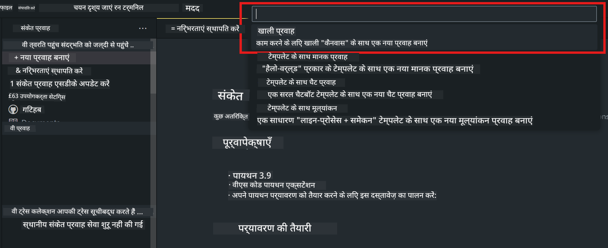
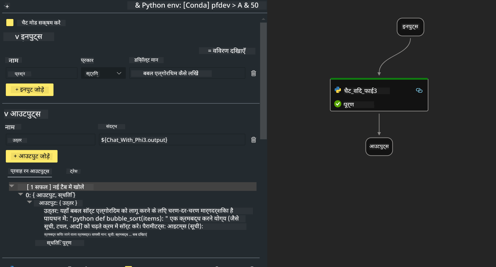

<!--
CO_OP_TRANSLATOR_METADATA:
{
  "original_hash": "830eb246b6fa04f22004b271f3294cfc",
  "translation_date": "2025-04-04T18:35:52+00:00",
  "source_file": "md\\02.Application\\02.Code\\Phi3\\VSCodeExt\\HOL\\Apple\\02.PromptflowWithMLX.md",
  "language_code": "hi"
}
-->
# **लैब 2 - AIPC में Phi-3-mini के साथ प्रॉम्प्ट फ्लो चलाना**

## **प्रॉम्प्ट फ्लो क्या है**

प्रॉम्प्ट फ्लो एक विकास उपकरणों का समूह है, जिसे LLM-आधारित AI एप्लिकेशन के विकास चक्र को सरल बनाने के लिए डिज़ाइन किया गया है। यह विचार से लेकर प्रोटोटाइप, परीक्षण, मूल्यांकन, उत्पादन परिनियोजन और निगरानी तक की प्रक्रिया को सुव्यवस्थित करता है। यह प्रॉम्प्ट इंजीनियरिंग को बहुत आसान बनाता है और आपको उत्पादन गुणवत्ता के साथ LLM एप्लिकेशन बनाने में सक्षम बनाता है।

प्रॉम्प्ट फ्लो के साथ, आप निम्नलिखित कर सकते हैं:

- ऐसे फ्लो बनाएं जो LLMs, प्रॉम्प्ट, Python कोड और अन्य उपकरणों को एक निष्पादन योग्य वर्कफ़्लो में जोड़ते हैं।

- अपने फ्लो को डिबग और संशोधित करें, खासकर LLMs के साथ इंटरैक्शन को आसानी से।

- अपने फ्लो का मूल्यांकन करें, बड़े डेटा सेट के साथ गुणवत्ता और प्रदर्शन मेट्रिक्स की गणना करें।

- अपने CI/CD सिस्टम में परीक्षण और मूल्यांकन को एकीकृत करें ताकि आपके फ्लो की गुणवत्ता सुनिश्चित हो सके।

- अपने फ्लो को उस सर्विंग प्लेटफ़ॉर्म पर परिनियोजित करें जिसे आप चुनते हैं, या इसे अपने एप्लिकेशन के कोड बेस में आसानी से एकीकृत करें।

- (वैकल्पिक लेकिन अत्यधिक अनुशंसित) Azure AI में प्रॉम्प्ट फ्लो के क्लाउड संस्करण का उपयोग करके अपनी टीम के साथ सहयोग करें।  

## **Apple Silicon पर जेनरेशन कोड फ्लो बनाना**

***नोट***: यदि आपने अभी तक पर्यावरण इंस्टॉलेशन पूरा नहीं किया है, तो कृपया [लैब 0 - इंस्टॉलेशन](./01.Installations.md) पर जाएं।

1. Visual Studio Code में प्रॉम्प्ट फ्लो एक्सटेंशन खोलें और एक खाली फ्लो प्रोजेक्ट बनाएं।



2. इनपुट और आउटपुट पैरामीटर जोड़ें और नए फ्लो के रूप में Python कोड जोड़ें।



आप इस संरचना (flow.dag.yaml) को संदर्भित कर सकते हैं ताकि अपने फ्लो को बना सकें।

```yaml

inputs:
  prompt:
    type: string
    default: Write python code for Fibonacci serie. Please use markdown as output
outputs:
  result:
    type: string
    reference: ${gen_code_by_phi3.output}
nodes:
- name: gen_code_by_phi3
  type: python
  source:
    type: code
    path: gen_code_by_phi3.py
  inputs:
    prompt: ${inputs.prompt}


```

3. Phi-3-mini को क्वांटिफाई करें।

हम चाहते हैं कि SLM स्थानीय उपकरणों पर बेहतर चले। आमतौर पर, हम मॉडल को क्वांटिफाई करते हैं (INT4, FP16, FP32)।

```bash

python -m mlx_lm.convert --hf-path microsoft/Phi-3-mini-4k-instruct

```

**नोट:** डिफॉल्ट फोल्डर mlx_model है।

4. ***Chat_With_Phi3.py*** में कोड जोड़ें।

```python


from promptflow import tool

from mlx_lm import load, generate


# The inputs section will change based on the arguments of the tool function, after you save the code
# Adding type to arguments and return value will help the system show the types properly
# Please update the function name/signature per need
@tool
def my_python_tool(prompt: str) -> str:

    model_id = './mlx_model_phi3_mini'

    model, tokenizer = load(model_id)

    # <|user|>\nWrite python code for Fibonacci serie. Please use markdown as output<|end|>\n<|assistant|>

    response = generate(model, tokenizer, prompt="<|user|>\n" + prompt  + "<|end|>\n<|assistant|>", max_tokens=2048, verbose=True)

    return response


```

4. आप फ्लो को डिबग या रन से टेस्ट कर सकते हैं ताकि जेनरेशन कोड सही तरीके से काम कर रहा है या नहीं।


5. फ्लो को टर्मिनल में डेवलपमेंट API के रूप में चलाएं।

```

pf flow serve --source ./ --port 8080 --host localhost   

```

आप इसे Postman / Thunder Client में टेस्ट कर सकते हैं।

### **नोट**

1. पहली बार चलाने में काफी समय लगता है। Hugging Face CLI से phi-3 मॉडल डाउनलोड करने की सिफारिश की जाती है।

2. Intel NPU की सीमित कंप्यूटिंग क्षमता को ध्यान में रखते हुए, Phi-3-mini-4k-instruct का उपयोग करने की सिफारिश की जाती है।

3. हम INT4 कन्वर्जन को क्वांटिफाई करने के लिए Intel NPU Acceleration का उपयोग करते हैं, लेकिन यदि आप सेवा को फिर से चलाते हैं, तो आपको कैश और nc_workshop फोल्डर को हटाने की आवश्यकता होगी।

## **संसाधन**

1. प्रॉम्प्ट फ्लो सीखें [https://microsoft.github.io/promptflow/](https://microsoft.github.io/promptflow/)

2. Intel NPU Acceleration सीखें [https://github.com/intel/intel-npu-acceleration-library](https://github.com/intel/intel-npu-acceleration-library)

3. सैंपल कोड डाउनलोड करें [Local NPU Agent Sample Code](../../../../../../../../../code/07.Lab/01/AIPC/local-npu-agent)

**अस्वीकरण**:  
यह दस्तावेज़ AI अनुवाद सेवा [Co-op Translator](https://github.com/Azure/co-op-translator) का उपयोग करके अनुवादित किया गया है। जबकि हम सटीकता सुनिश्चित करने का प्रयास करते हैं, कृपया ध्यान दें कि स्वचालित अनुवाद में त्रुटियाँ या गलतियाँ हो सकती हैं। मूल भाषा में उपलब्ध मूल दस्तावेज़ को आधिकारिक स्रोत माना जाना चाहिए। महत्वपूर्ण जानकारी के लिए, पेशेवर मानव अनुवाद की अनुशंसा की जाती है। इस अनुवाद का उपयोग करने से उत्पन्न किसी भी गलतफहमी या गलत व्याख्या के लिए हम उत्तरदायी नहीं हैं।