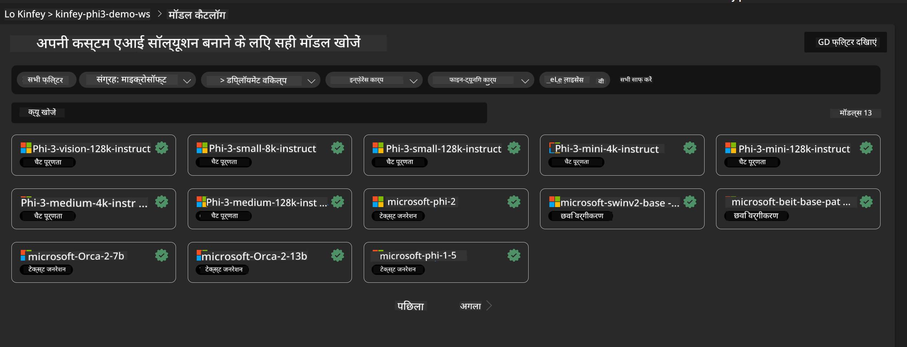
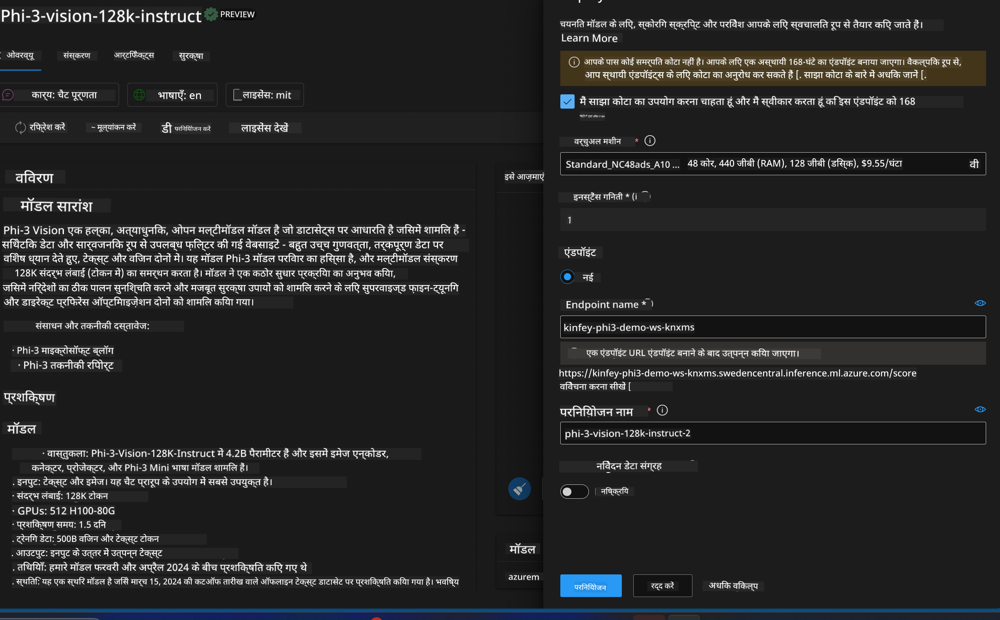
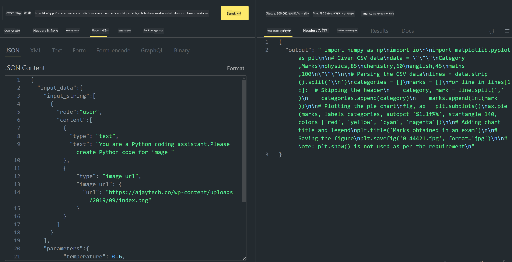

<!--
CO_OP_TRANSLATOR_METADATA:
{
  "original_hash": "594a3b553655c2ebbc0efdeb0b5040c9",
  "translation_date": "2025-04-04T18:36:53+00:00",
  "source_file": "md\\02.Application\\02.Code\\Phi3\\VSCodeExt\\HOL\\Apple\\03.DeployPhi3VisionOnAzure.md",
  "language_code": "hi"
}
-->
# **लैब 3 - Azure Machine Learning Service पर Phi-3-Vision को डिप्लॉय करें**

हम NPU का उपयोग करके स्थानीय कोड का प्रोडक्शन डिप्लॉयमेंट पूरा करते हैं, और फिर हम PHI-3-VISION की क्षमता को शामिल करना चाहते हैं ताकि तस्वीरों से कोड जनरेट किया जा सके।

इस परिचय में, हम Azure Machine Learning Service में Model As Service Phi-3 Vision सेवा को तेजी से बना सकते हैं।

***Note***: Phi-3 Vision को सामग्री तेजी से जनरेट करने के लिए कंप्यूटिंग पावर की आवश्यकता होती है। हमें इसे हासिल करने के लिए क्लाउड कंप्यूटिंग पावर की जरूरत है।


### **1. Azure Machine Learning Service बनाएं**

हमें Azure Portal में Azure Machine Learning Service बनानी होगी। यदि आप यह सीखना चाहते हैं कि इसे कैसे बनाएं, तो कृपया इस लिंक पर जाएं: [https://learn.microsoft.com/azure/machine-learning/quickstart-create-resources?view=azureml-api-2](https://learn.microsoft.com/azure/machine-learning/quickstart-create-resources?view=azureml-api-2)


### **2. Azure Machine Learning Service में Phi-3 Vision चुनें**




### **3. Azure में Phi-3-Vision को डिप्लॉय करें**




### **4. Postman में Endpoint का परीक्षण करें**




***Note***

1. ट्रांसमिट किए जाने वाले पैरामीटर में Authorization, azureml-model-deployment, और Content-Type शामिल होना चाहिए। आपको इसे प्राप्त करने के लिए डिप्लॉयमेंट जानकारी की जांच करनी होगी।

2. पैरामीटर ट्रांसमिट करने के लिए, Phi-3-Vision को एक इमेज लिंक ट्रांसमिट करने की आवश्यकता होती है। कृपया GPT-4-Vision विधि का संदर्भ लें कि पैरामीटर कैसे ट्रांसमिट करें, जैसे:

```json

{
  "input_data":{
    "input_string":[
      {
        "role":"user",
        "content":[ 
          {
            "type": "text",
            "text": "You are a Python coding assistant.Please create Python code for image "
          },
          {
              "type": "image_url",
              "image_url": {
                "url": "https://ajaytech.co/wp-content/uploads/2019/09/index.png"
              }
          }
        ]
      }
    ],
    "parameters":{
          "temperature": 0.6,
          "top_p": 0.9,
          "do_sample": false,
          "max_new_tokens": 2048
    }
  }
}

```

3. **/score** को Post विधि का उपयोग करके कॉल करें।

**बधाई हो**! आपने तेजी से PHI-3-VISION को डिप्लॉय करने और तस्वीरों से कोड जनरेट करने का तरीका आजमाने की प्रक्रिया पूरी कर ली है। अब, हम NPU और क्लाउड के संयोजन में एप्लिकेशन बना सकते हैं।

**अस्वीकरण**:  
यह दस्तावेज़ AI अनुवाद सेवा [Co-op Translator](https://github.com/Azure/co-op-translator) का उपयोग करके अनुवादित किया गया है। जबकि हम सटीकता सुनिश्चित करने का प्रयास करते हैं, कृपया ध्यान दें कि स्वचालित अनुवाद में त्रुटियां या अशुद्धियां हो सकती हैं। मूल भाषा में उपलब्ध मूल दस्तावेज़ को आधिकारिक स्रोत माना जाना चाहिए। महत्वपूर्ण जानकारी के लिए, पेशेवर मानव अनुवाद की सिफारिश की जाती है। इस अनुवाद के उपयोग से उत्पन्न किसी भी गलतफहमी या गलत व्याख्या के लिए हम उत्तरदायी नहीं हैं।