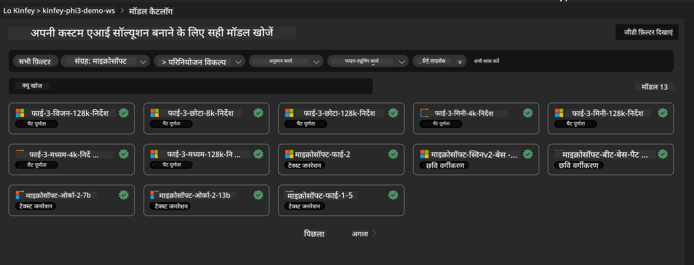
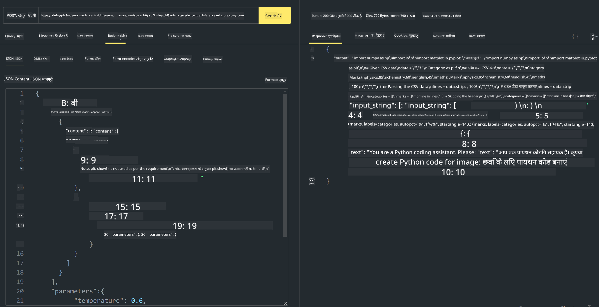

<!--
CO_OP_TRANSLATOR_METADATA:
{
  "original_hash": "20cb4e6ac1686248e8be913ccf6c2bc2",
  "translation_date": "2025-05-08T05:34:49+00:00",
  "source_file": "md/02.Application/02.Code/Phi3/VSCodeExt/HOL/Apple/03.DeployPhi3VisionOnAzure.md",
  "language_code": "hi"
}
-->
# **Lab 3 - Azure Machine Learning Service पर Phi-3-vision को डिप्लॉय करें**

हम स्थानीय कोड के प्रोडक्शन डिप्लॉयमेंट के लिए NPU का उपयोग करते हैं, और फिर इसके माध्यम से PHI-3-VISION को शामिल करने की क्षमता लाना चाहते हैं ताकि चित्रों से कोड जनरेट किया जा सके।

इस परिचय में, हम Azure Machine Learning Service में तेजी से Model As Service Phi-3 Vision सेवा बना सकते हैं।

***Note***： Phi-3 Vision को तेज़ी से कंटेंट जनरेट करने के लिए कम्प्यूटिंग पावर की आवश्यकता होती है। इसके लिए हमें क्लाउड कम्प्यूटिंग पावर की मदद लेनी होगी।


### **1. Azure Machine Learning Service बनाएं**

हमें Azure Portal में एक Azure Machine Learning Service बनानी होगी। यदि आप सीखना चाहते हैं कि कैसे, तो कृपया इस लिंक पर जाएं [https://learn.microsoft.com/azure/machine-learning/quickstart-create-resources?view=azureml-api-2](https://learn.microsoft.com/azure/machine-learning/quickstart-create-resources?view=azureml-api-2)


### **2. Azure Machine Learning Service में Phi-3 Vision चुनें**




### **3. Azure में Phi-3-Vision डिप्लॉय करें**


### **4. Postman में Endpoint टेस्ट करें**





***Note***

1. ट्रांसमिट किए जाने वाले पैरामीटर में Authorization, azureml-model-deployment, और Content-Type शामिल होना चाहिए। इसे प्राप्त करने के लिए आपको डिप्लॉयमेंट जानकारी देखनी होगी।

2. पैरामीटर ट्रांसमिट करने के लिए, Phi-3-Vision को एक इमेज लिंक भेजना होता है। कृपया GPT-4-Vision मेथड को देखें कि पैरामीटर कैसे भेजे जाते हैं, जैसे कि

```json

{
  "input_data":{
    "input_string":[
      {
        "role":"user",
        "content":[ 
          {
            "type": "text",
            "text": "You are a Python coding assistant.Please create Python code for image "
          },
          {
              "type": "image_url",
              "image_url": {
                "url": "https://ajaytech.co/wp-content/uploads/2019/09/index.png"
              }
          }
        ]
      }
    ],
    "parameters":{
          "temperature": 0.6,
          "top_p": 0.9,
          "do_sample": false,
          "max_new_tokens": 2048
    }
  }
}

```

3. Post मेथड का उपयोग करके **/score** कॉल करें

**बधाई हो**! आपने तेज़ PHI-3-VISION डिप्लॉयमेंट पूरा कर लिया है और यह भी आज़माया कि चित्रों से कोड कैसे जनरेट किया जाता है। आगे, हम NPU और क्लाउड के संयोजन से एप्लिकेशन बना सकते हैं।

**अस्वीकरण**:  
यह दस्तावेज़ AI अनुवाद सेवा [Co-op Translator](https://github.com/Azure/co-op-translator) का उपयोग करके अनुवादित किया गया है। जबकि हम सटीकता के लिए प्रयासरत हैं, कृपया ध्यान दें कि स्वचालित अनुवादों में त्रुटियाँ या असंगतियाँ हो सकती हैं। मूल दस्तावेज़ अपनी मूल भाषा में ही अधिकारिक स्रोत माना जाना चाहिए। महत्वपूर्ण जानकारी के लिए, पेशेवर मानव अनुवाद की सलाह दी जाती है। इस अनुवाद के उपयोग से उत्पन्न किसी भी गलतफहमी या गलत व्याख्या के लिए हम जिम्मेदार नहीं हैं।