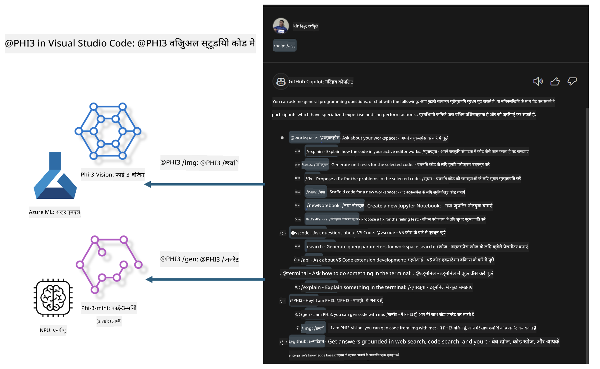

<!--
CO_OP_TRANSLATOR_METADATA:
{
  "original_hash": "00b7a699de8ac405fa821f4c0f7fc0ab",
  "translation_date": "2025-07-17T03:36:07+00:00",
  "source_file": "md/02.Application/02.Code/Phi3/VSCodeExt/README.md",
  "language_code": "hi"
}
-->
# **Microsoft Phi-3 परिवार के साथ अपना खुद का Visual Studio Code GitHub Copilot Chat बनाएं**

क्या आपने GitHub Copilot Chat में workspace agent का उपयोग किया है? क्या आप अपनी टीम का खुद का कोड एजेंट बनाना चाहते हैं? यह हैंड्स-ऑन लैब ओपन सोर्स मॉडल को मिलाकर एक एंटरप्राइज-स्तर के कोड बिजनेस एजेंट बनाने की उम्मीद करता है।

## **बुनियाद**

### **Microsoft Phi-3 क्यों चुनें**

Phi-3 एक परिवार श्रृंखला है, जिसमें phi-3-mini, phi-3-small, और phi-3-medium शामिल हैं, जो टेक्स्ट जनरेशन, संवाद पूर्णता, और कोड जनरेशन के लिए विभिन्न प्रशिक्षण पैरामीटर पर आधारित हैं। इसके अलावा phi-3-vision भी है जो Vision पर आधारित है। यह एंटरप्राइज या विभिन्न टीमों के लिए ऑफलाइन जनरेटिव AI समाधान बनाने के लिए उपयुक्त है।

सुझाव है कि इस लिंक को पढ़ें [https://github.com/microsoft/PhiCookBook/blob/main/md/01.Introduction/01/01.PhiFamily.md](https://github.com/microsoft/PhiCookBook/blob/main/md/01.Introduction/01/01.PhiFamily.md)

### **Microsoft GitHub Copilot Chat**

GitHub Copilot Chat एक्सटेंशन आपको एक चैट इंटरफ़ेस देता है जिससे आप GitHub Copilot के साथ बातचीत कर सकते हैं और VS Code के अंदर सीधे कोडिंग से संबंधित सवालों के जवाब प्राप्त कर सकते हैं, बिना दस्तावेज़ों को खोजे या ऑनलाइन फोरम में जाने की जरूरत के।

Copilot Chat सिंटैक्स हाइलाइटिंग, इंडेंटेशन, और अन्य फॉर्मेटिंग फीचर्स का उपयोग कर सकता है ताकि जनरेट किए गए जवाब को स्पष्ट बनाया जा सके। उपयोगकर्ता के सवाल के प्रकार के आधार पर, परिणाम में उन संदर्भों के लिंक हो सकते हैं जिनका Copilot ने जवाब बनाने के लिए उपयोग किया, जैसे स्रोत कोड फाइलें या दस्तावेज़, या VS Code की कार्यक्षमता तक पहुंचने के लिए बटन।

- Copilot Chat आपके डेवलपर फ्लो में एकीकृत होता है और जहां जरूरत हो वहां सहायता प्रदान करता है:

- कोडिंग करते समय एडिटर या टर्मिनल से सीधे इनलाइन चैट शुरू करें

- Chat व्यू का उपयोग करें ताकि आपके पास कभी भी AI सहायक हो

- Quick Chat लॉन्च करें ताकि आप जल्दी सवाल पूछ सकें और फिर अपने काम में वापस जा सकें

आप GitHub Copilot Chat का उपयोग विभिन्न परिदृश्यों में कर सकते हैं, जैसे:

- किसी समस्या को सबसे अच्छे तरीके से हल करने के लिए कोडिंग सवालों के जवाब देना

- किसी और के कोड को समझाना और सुधार सुझाना

- कोड फिक्स प्रस्तावित करना

- यूनिट टेस्ट केस जनरेट करना

- कोड दस्तावेज़ीकरण जनरेट करना

सुझाव है कि इस लिंक को पढ़ें [https://code.visualstudio.com/docs/copilot/copilot-chat](https://code.visualstudio.com/docs/copilot/copilot-chat?WT.mc_id=aiml-137032-kinfeylo)

###  **Microsoft GitHub Copilot Chat @workspace**

Copilot Chat में **@workspace** का संदर्भ आपके पूरे कोडबेस के बारे में सवाल पूछने की अनुमति देता है। सवाल के आधार पर, Copilot बुद्धिमानी से संबंधित फाइलें और प्रतीक (symbols) खोजता है, जिन्हें वह अपने जवाब में लिंक और कोड उदाहरण के रूप में संदर्भित करता है।

आपके सवाल का जवाब देने के लिए, **@workspace** उन स्रोतों को खोजता है जिनका उपयोग एक डेवलपर VS Code में कोडबेस नेविगेट करते समय करता है:

- वर्कस्पेस की सभी फाइलें, सिवाय उन फाइलों के जो .gitignore फाइल द्वारा अनदेखी की गई हैं

- डायरेक्टरी संरचना जिसमें नेस्टेड फोल्डर और फाइल नाम शामिल हैं

- GitHub का कोड सर्च इंडेक्स, यदि वर्कस्पेस GitHub रिपॉजिटरी है और कोड सर्च द्वारा इंडेक्स किया गया है

- वर्कस्पेस में प्रतीक और परिभाषाएं

- सक्रिय एडिटर में वर्तमान में चयनित या दिखाई दे रहा टेक्स्ट

ध्यान दें: यदि आपके पास कोई फाइल खुली है या अनदेखी की गई फाइल में टेक्स्ट चयनित है, तो .gitignore को बायपास किया जाता है।

सुझाव है कि इस लिंक को पढ़ें [[https://code.visualstudio.com/docs/copilot/copilot-chat](https://code.visualstudio.com/docs/copilot/workspace-context?WT.mc_id=aiml-137032-kinfeylo)]

## **इस लैब के बारे में अधिक जानें**

GitHub Copilot ने एंटरप्राइज की प्रोग्रामिंग दक्षता में काफी सुधार किया है, और हर एंटरप्राइज GitHub Copilot के संबंधित फ़ंक्शंस को कस्टमाइज़ करना चाहता है। कई एंटरप्राइज ने अपने व्यवसायिक परिदृश्यों और ओपन सोर्स मॉडलों के आधार पर GitHub Copilot जैसे कस्टम एक्सटेंशन्स बनाए हैं। एंटरप्राइज के लिए, कस्टम एक्सटेंशन्स को नियंत्रित करना आसान होता है, लेकिन इससे उपयोगकर्ता अनुभव प्रभावित हो सकता है। आखिरकार, GitHub Copilot सामान्य परिदृश्यों और पेशेवरता से निपटने में अधिक सक्षम है। यदि अनुभव सुसंगत रखा जा सके, तो अपनी एंटरप्राइज की कस्टम एक्सटेंशन बनाना बेहतर होगा। GitHub Copilot Chat एंटरप्राइज को चैट अनुभव में विस्तार के लिए संबंधित API प्रदान करता है। एक सुसंगत अनुभव बनाए रखना और कस्टम फ़ंक्शंस होना बेहतर उपयोगकर्ता अनुभव है।

यह लैब मुख्य रूप से Phi-3 मॉडल का उपयोग स्थानीय NPU और Azure हाइब्रिड के साथ मिलाकर GitHub Copilot Chat में एक कस्टम एजेंट ***@PHI3*** बनाती है, जो एंटरप्राइज डेवलपर्स को कोड जनरेशन ***(@PHI3 /gen)*** और इमेज के आधार पर कोड जनरेट करने में मदद करता है ***(@PHI3 /img)***।

### ***नोट:*** 

यह लैब वर्तमान में Intel CPU और Apple Silicon के AIPC में लागू है। हम Qualcomm संस्करण के NPU को अपडेट करते रहेंगे।

## **लैब**

| नाम | विवरण | AIPC | Apple |
| ------------ | ----------- | -------- |-------- |
| Lab0 - Installations(✅) | संबंधित वातावरण और इंस्टॉलेशन टूल्स को कॉन्फ़िगर और इंस्टॉल करें | [Go](./HOL/AIPC/01.Installations.md) |[Go](./HOL/Apple/01.Installations.md) |
| Lab1 - Run Prompt flow with Phi-3-mini (✅) | AIPC / Apple Silicon के साथ मिलकर, स्थानीय NPU का उपयोग करके Phi-3-mini के माध्यम से कोड जनरेशन बनाएं | [Go](./HOL/AIPC/02.PromptflowWithNPU.md) |  [Go](./HOL/Apple/02.PromptflowWithMLX.md) |
| Lab2 - Deploy Phi-3-vision on Azure Machine Learning Service(✅) | Azure Machine Learning Service के Model Catalog - Phi-3-vision इमेज को डिप्लॉय करके कोड जनरेट करें | [Go](./HOL/AIPC/03.DeployPhi3VisionOnAzure.md) |[Go](./HOL/Apple/03.DeployPhi3VisionOnAzure.md) |
| Lab3 - Create a @phi-3 agent in GitHub Copilot Chat(✅)  | GitHub Copilot Chat में एक कस्टम Phi-3 एजेंट बनाएं जो कोड जनरेशन, ग्राफ जनरेशन कोड, RAG आदि को पूरा करे | [Go](./HOL/AIPC/04.CreatePhi3AgentInVSCode.md) | [Go](./HOL/Apple/04.CreatePhi3AgentInVSCode.md) |
| Sample Code (✅)  | सैंपल कोड डाउनलोड करें | [Go](../../../../../../../code/07.Lab/01/AIPC) | [Go](../../../../../../../code/07.Lab/01/Apple) |

## **संसाधन**

1. Phi-3 Cookbook [https://github.com/microsoft/Phi-3CookBook](https://github.com/microsoft/Phi-3CookBook)

2. GitHub Copilot के बारे में अधिक जानें [https://learn.microsoft.com/training/paths/copilot/](https://learn.microsoft.com/training/paths/copilot/?WT.mc_id=aiml-137032-kinfeylo)

3. GitHub Copilot Chat के बारे में अधिक जानें [https://learn.microsoft.com/training/paths/accelerate-app-development-using-github-copilot/](https://learn.microsoft.com/training/paths/accelerate-app-development-using-github-copilot/?WT.mc_id=aiml-137032-kinfeylo)

4. GitHub Copilot Chat API के बारे में अधिक जानें [https://code.visualstudio.com/api/extension-guides/chat](https://code.visualstudio.com/api/extension-guides/chat?WT.mc_id=aiml-137032-kinfeylo)

5. Azure AI Foundry के बारे में अधिक जानें [https://learn.microsoft.com/training/paths/create-custom-copilots-ai-studio/](https://learn.microsoft.com/training/paths/create-custom-copilots-ai-studio/?WT.mc_id=aiml-137032-kinfeylo)

6. Azure AI Foundry के Model Catalog के बारे में अधिक जानें [https://learn.microsoft.com/azure/ai-studio/how-to/model-catalog-overview](https://learn.microsoft.com/azure/ai-studio/how-to/model-catalog-overview)

**अस्वीकरण**:  
यह दस्तावेज़ AI अनुवाद सेवा [Co-op Translator](https://github.com/Azure/co-op-translator) का उपयोग करके अनुवादित किया गया है। जबकि हम सटीकता के लिए प्रयासरत हैं, कृपया ध्यान दें कि स्वचालित अनुवादों में त्रुटियाँ या अशुद्धियाँ हो सकती हैं। मूल दस्तावेज़ अपनी मूल भाषा में ही अधिकारिक स्रोत माना जाना चाहिए। महत्वपूर्ण जानकारी के लिए, पेशेवर मानव अनुवाद की सलाह दी जाती है। इस अनुवाद के उपयोग से उत्पन्न किसी भी गलतफहमी या गलत व्याख्या के लिए हम जिम्मेदार नहीं हैं।