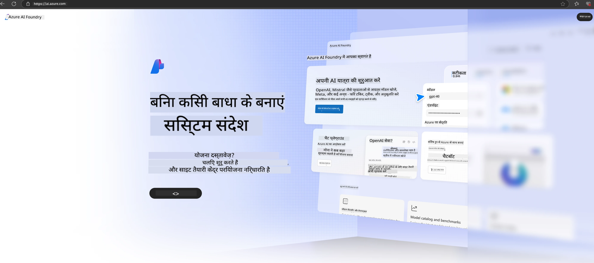

<!--
CO_OP_TRANSLATOR_METADATA:
{
  "original_hash": "3a1e48b628022485aac989c9f733e792",
  "translation_date": "2025-07-17T05:21:16+00:00",
  "source_file": "md/02.QuickStart/AzureAIFoundry_QuickStart.md",
  "language_code": "hi"
}
-->
# **Azure AI Foundry में Phi-3 का उपयोग**

Generative AI के विकास के साथ, हम एक एकीकृत प्लेटफ़ॉर्म का उपयोग करके विभिन्न LLM और SLM, एंटरप्राइज डेटा इंटीग्रेशन, फाइन-ट्यूनिंग/RAG ऑपरेशंस, और LLM और SLM के एकीकरण के बाद विभिन्न एंटरप्राइज व्यवसायों के मूल्यांकन को प्रबंधित करने की उम्मीद करते हैं, ताकि जनरेटिव AI स्मार्ट एप्लिकेशन बेहतर तरीके से लागू हो सकें। [Azure AI Foundry](https://ai.azure.com) एक एंटरप्राइज-स्तरीय जनरेटिव AI एप्लिकेशन प्लेटफ़ॉर्म है।

Azure AI Foundry के साथ, आप बड़े भाषा मॉडल (LLM) के उत्तरों का मूल्यांकन कर सकते हैं और बेहतर प्रदर्शन के लिए प्रॉम्प्ट फ्लो के साथ प्रॉम्प्ट एप्लिकेशन घटकों का समन्वय कर सकते हैं। यह प्लेटफ़ॉर्म प्रूफ ऑफ कॉन्सेप्ट को पूर्ण उत्पादन में आसानी से बदलने के लिए स्केलेबिलिटी प्रदान करता है। निरंतर निगरानी और सुधार दीर्घकालिक सफलता का समर्थन करते हैं।

हम सरल चरणों के माध्यम से Azure AI Foundry पर Phi-3 मॉडल को जल्दी से तैनात कर सकते हैं, और फिर Azure AI Foundry का उपयोग करके Phi-3 से संबंधित Playground/Chat, फाइन-ट्यूनिंग, मूल्यांकन और अन्य संबंधित कार्य पूरे कर सकते हैं।

## **1. तैयारी**

यदि आपके पास पहले से [Azure Developer CLI](https://learn.microsoft.com/azure/developer/azure-developer-cli/overview?WT.mc_id=aiml-138114-kinfeylo) आपके मशीन पर इंस्टॉल है, तो इस टेम्पलेट का उपयोग करना एक नए डायरेक्टरी में यह कमांड चलाने जितना आसान है।

## मैनुअल निर्माण

Microsoft Azure AI Foundry प्रोजेक्ट और हब बनाना आपके AI कार्य को व्यवस्थित और प्रबंधित करने का एक बेहतरीन तरीका है। शुरू करने के लिए यहां एक चरण-दर-चरण मार्गदर्शिका है:

### Azure AI Foundry में प्रोजेक्ट बनाना

1. **Azure AI Foundry पर जाएं**: Azure AI Foundry पोर्टल में साइन इन करें।
2. **प्रोजेक्ट बनाएं**:
   - यदि आप किसी प्रोजेक्ट में हैं, तो पेज के ऊपर बाएं कोने में "Azure AI Foundry" चुनें ताकि आप होम पेज पर पहुंच सकें।
   - "+ Create project" चुनें।
   - प्रोजेक्ट के लिए एक नाम दर्ज करें।
   - यदि आपके पास कोई हब है, तो वह डिफ़ॉल्ट रूप से चुना जाएगा। यदि आपके पास एक से अधिक हब तक पहुंच है, तो आप ड्रॉपडाउन से कोई अन्य हब चुन सकते हैं। यदि आप नया हब बनाना चाहते हैं, तो "Create new hub" चुनें और एक नाम दें।
   - "Create" चुनें।

### Azure AI Foundry में हब बनाना

1. **Azure AI Foundry पर जाएं**: अपने Azure खाते से साइन इन करें।
2. **हब बनाएं**:
   - बाएं मेनू से Management center चुनें।
   - "All resources" चुनें, फिर "+ New project" के बगल में नीचे की ओर तीर पर क्लिक करें और "+ New hub" चुनें।
   - "Create a new hub" डायलॉग में, अपने हब के लिए एक नाम दर्ज करें (जैसे, contoso-hub) और अन्य फ़ील्ड्स को आवश्यकतानुसार संशोधित करें।
   - "Next" चुनें, जानकारी की समीक्षा करें, और फिर "Create" चुनें।

अधिक विस्तृत निर्देशों के लिए, आप आधिकारिक [Microsoft दस्तावेज़](https://learn.microsoft.com/azure/ai-studio/how-to/create-projects) देख सकते हैं।

सफल निर्माण के बाद, आप [ai.azure.com](https://ai.azure.com/) के माध्यम से अपने बनाए गए स्टूडियो तक पहुंच सकते हैं।

एक AI Foundry पर कई प्रोजेक्ट हो सकते हैं। AI Foundry में प्रोजेक्ट बनाकर तैयारी करें।

Azure AI Foundry [QuickStarts](https://learn.microsoft.com/azure/ai-studio/quickstarts/get-started-code) बनाएं।

## **2. Azure AI Foundry में Phi मॉडल तैनात करना**

प्रोजेक्ट के Explore विकल्प पर क्लिक करें, Model Catalog में जाएं और Phi-3 चुनें।

Phi-3-mini-4k-instruct चुनें।

Phi-3-mini-4k-instruct मॉडल को तैनात करने के लिए 'Deploy' पर क्लिक करें।

> [!NOTE]
>
> तैनाती के दौरान आप कंप्यूटिंग पावर चुन सकते हैं।

## **3. Azure AI Foundry में Playground Chat Phi**

तैनाती पेज पर जाएं, Playground चुनें, और Azure AI Foundry के Phi-3 के साथ चैट करें।

## **4. Azure AI Foundry से मॉडल तैनात करना**

Azure Model Catalog से मॉडल तैनात करने के लिए, आप निम्न चरणों का पालन कर सकते हैं:

- Azure AI Foundry में साइन इन करें।
- Azure AI Foundry मॉडल कैटलॉग से वह मॉडल चुनें जिसे आप तैनात करना चाहते हैं।
- मॉडल के Details पेज पर, Deploy चुनें और फिर Azure AI Content Safety के साथ Serverless API चुनें।
- उस प्रोजेक्ट का चयन करें जिसमें आप अपने मॉडल तैनात करना चाहते हैं। Serverless API का उपयोग करने के लिए, आपका वर्कस्पेस East US 2 या Sweden Central क्षेत्र में होना चाहिए। आप Deployment नाम कस्टमाइज़ कर सकते हैं।
- तैनाती विज़ार्ड में, Pricing और terms चुनें ताकि आप मूल्य निर्धारण और उपयोग की शर्तों के बारे में जान सकें।
- Deploy चुनें। तैनाती तैयार होने तक प्रतीक्षा करें और जब आप Deployments पेज पर पुनः निर्देशित हों।
- मॉडल के साथ इंटरैक्ट करने के लिए Open in playground चुनें।
- आप Deployments पेज पर वापस जाकर तैनाती चुन सकते हैं और endpoint का Target URL और Secret Key नोट कर सकते हैं, जिनका उपयोग आप तैनाती को कॉल करने और पूर्णताएँ उत्पन्न करने के लिए कर सकते हैं।
- आप हमेशा Build टैब में जाकर और Components सेक्शन से Deployments चुनकर endpoint के विवरण, URL, और एक्सेस कीज़ पा सकते हैं।

> [!NOTE]
> कृपया ध्यान दें कि इन चरणों को करने के लिए आपके खाते में Resource Group पर Azure AI Developer रोल अनुमतियाँ होनी चाहिए।

## **5. Azure AI Foundry में Phi API का उपयोग**

आप https://{Your project name}.region.inference.ml.azure.com/swagger.json को Postman GET के माध्यम से एक्सेस कर सकते हैं और Key के साथ इसे जोड़कर उपलब्ध इंटरफेस के बारे में जान सकते हैं।

आप अनुरोध पैरामीटर और प्रतिक्रिया पैरामीटर दोनों को बहुत आसानी से प्राप्त कर सकते हैं।

**अस्वीकरण**:  
यह दस्तावेज़ AI अनुवाद सेवा [Co-op Translator](https://github.com/Azure/co-op-translator) का उपयोग करके अनुवादित किया गया है। जबकि हम सटीकता के लिए प्रयासरत हैं, कृपया ध्यान दें कि स्वचालित अनुवादों में त्रुटियाँ या अशुद्धियाँ हो सकती हैं। मूल दस्तावेज़ अपनी मूल भाषा में ही अधिकारिक स्रोत माना जाना चाहिए। महत्वपूर्ण जानकारी के लिए, पेशेवर मानव अनुवाद की सलाह दी जाती है। इस अनुवाद के उपयोग से उत्पन्न किसी भी गलतफहमी या गलत व्याख्या के लिए हम जिम्मेदार नहीं हैं।