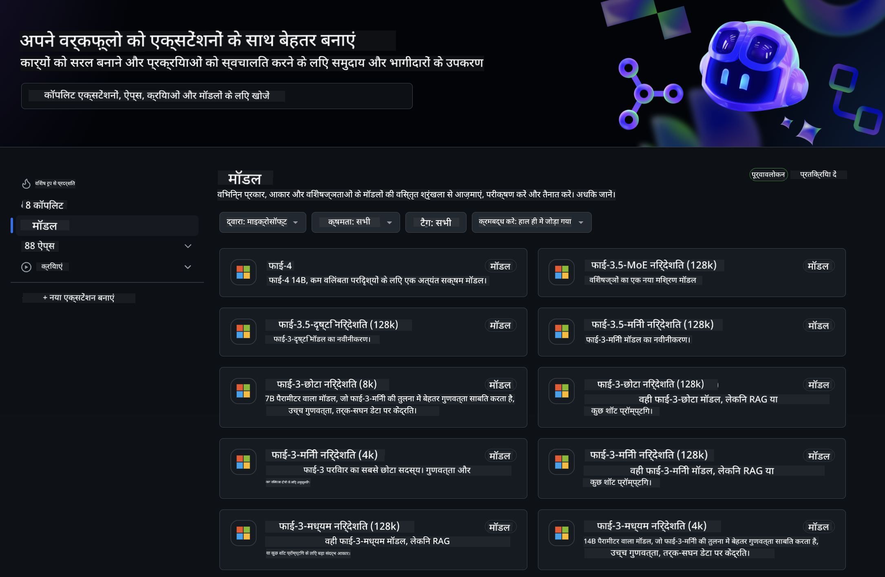
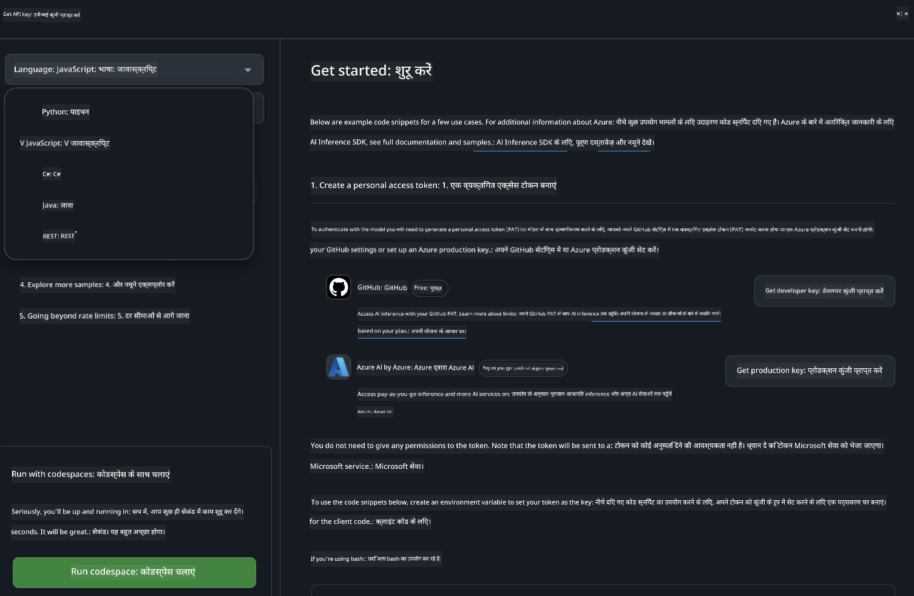
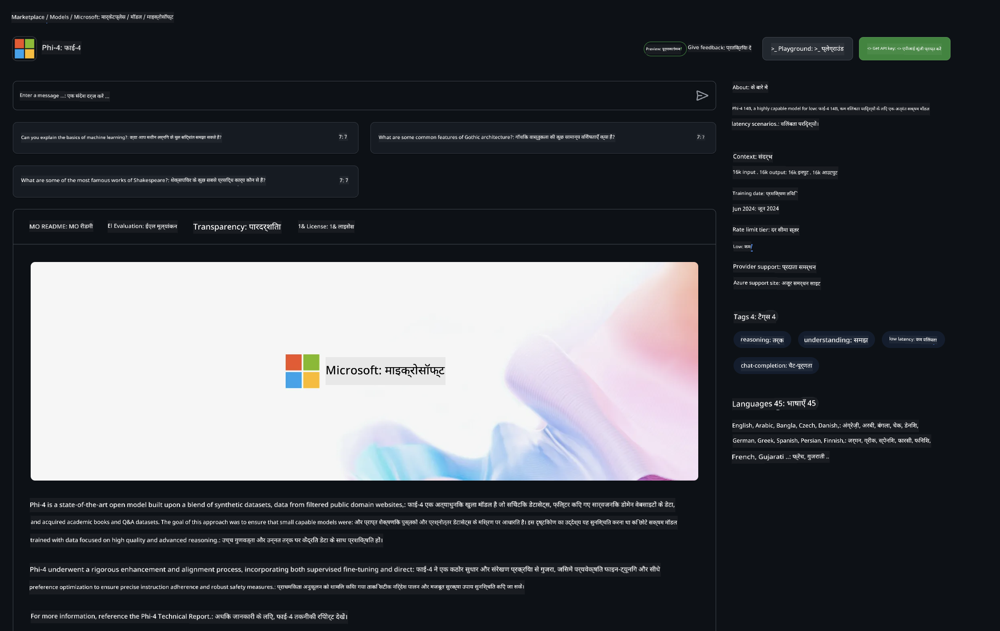

<!--
CO_OP_TRANSLATOR_METADATA:
{
  "original_hash": "5113634b77370af6790f9697d5d7de90",
  "translation_date": "2025-05-08T05:01:25+00:00",
  "source_file": "md/02.QuickStart/GitHubModel_QuickStart.md",
  "language_code": "hi"
}
-->
## GitHub Models - सीमित सार्वजनिक बीटा

[GitHub Models](https://github.com/marketplace/models) में आपका स्वागत है! हमने Azure AI पर होस्ट किए गए AI मॉडल्स को एक्सप्लोर करने के लिए सब कुछ तैयार कर दिया है।



GitHub Models पर उपलब्ध मॉडलों के बारे में अधिक जानकारी के लिए, [GitHub Model Marketplace](https://github.com/marketplace/models) देखें।

## उपलब्ध मॉडल्स

प्रत्येक मॉडल के लिए एक समर्पित प्लेग्राउंड और सैंपल कोड उपलब्ध है।


### GitHub Model Catalog में Phi-3 मॉडल्स

[Phi-3-Medium-128k-Instruct](https://github.com/marketplace/models/azureml/Phi-3-medium-128k-instruct)

[Phi-3-medium-4k-instruct](https://github.com/marketplace/models/azureml/Phi-3-medium-4k-instruct)

[Phi-3-mini-128k-instruct](https://github.com/marketplace/models/azureml/Phi-3-mini-128k-instruct)

[Phi-3-mini-4k-instruct](https://github.com/marketplace/models/azureml/Phi-3-mini-4k-instruct)

[Phi-3-small-128k-instruct](https://github.com/marketplace/models/azureml/Phi-3-small-128k-instruct)

[Phi-3-small-8k-instruct](https://github.com/marketplace/models/azureml/Phi-3-small-8k-instruct)

## शुरुआत कैसे करें

कुछ बुनियादी उदाहरण तैयार हैं जिन्हें आप तुरंत चला सकते हैं। ये आपको samples डायरेक्टरी में मिलेंगे। यदि आप सीधे अपनी पसंदीदा भाषा में जाना चाहते हैं, तो उदाहरण निम्न भाषाओं में उपलब्ध हैं:

- Python
- JavaScript
- cURL

सैंपल्स और मॉडल्स चलाने के लिए एक समर्पित Codespaces Environment भी उपलब्ध है।



## सैंपल कोड

नीचे कुछ उपयोग मामलों के लिए उदाहरण कोड स्निपेट्स दिए गए हैं। Azure AI Inference SDK के बारे में अधिक जानकारी के लिए, पूरी डाक्यूमेंटेशन और सैंपल्स देखें।

## सेटअप

1. एक personal access token बनाएं  
टोकन के लिए कोई विशेष अनुमति देने की जरूरत नहीं है। ध्यान दें कि यह टोकन Microsoft सेवा को भेजा जाएगा।

नीचे दिए गए कोड स्निपेट्स का उपयोग करने के लिए, अपने टोकन को क्लाइंट कोड की कुंजी के रूप में सेट करने के लिए एक environment variable बनाएं।

यदि आप bash उपयोग कर रहे हैं:  
```
export GITHUB_TOKEN="<your-github-token-goes-here>"
```  
यदि आप powershell में हैं:  
```
$Env:GITHUB_TOKEN="<your-github-token-goes-here>"
```  
यदि आप Windows command prompt उपयोग कर रहे हैं:  
```
set GITHUB_TOKEN=<your-github-token-goes-here>
```

## Python सैंपल

### निर्भरताएँ इंस्टॉल करें  
pip के जरिए Azure AI Inference SDK इंस्टॉल करें (आवश्यक: Python >=3.8):  
```
pip install azure-ai-inference
```

### एक बुनियादी कोड सैंपल चलाएं

यह सैंपल chat completion API को बेसिक कॉल दिखाता है। यह GitHub AI मॉडल inference endpoint और आपके GitHub टोकन का उपयोग करता है। कॉल synchronous है।

```
import os
from azure.ai.inference import ChatCompletionsClient
from azure.ai.inference.models import SystemMessage, UserMessage
from azure.core.credentials import AzureKeyCredential

endpoint = "https://models.inference.ai.azure.com"
# Replace Model_Name 
model_name = "Phi-3-small-8k-instruct"
token = os.environ["GITHUB_TOKEN"]

client = ChatCompletionsClient(
    endpoint=endpoint,
    credential=AzureKeyCredential(token),
)

response = client.complete(
    messages=[
        SystemMessage(content="You are a helpful assistant."),
        UserMessage(content="What is the capital of France?"),
    ],
    model=model_name,
    temperature=1.,
    max_tokens=1000,
    top_p=1.
)

print(response.choices[0].message.content)
```

### मल्टी-टर्न बातचीत चलाएं

यह सैंपल chat completion API के साथ मल्टी-टर्न बातचीत दिखाता है। जब आप मॉडल को चैट एप्लिकेशन के लिए उपयोग करते हैं, तो आपको बातचीत का इतिहास संभालना होगा और नवीनतम संदेश मॉडल को भेजने होंगे।

```
import os
from azure.ai.inference import ChatCompletionsClient
from azure.ai.inference.models import AssistantMessage, SystemMessage, UserMessage
from azure.core.credentials import AzureKeyCredential

token = os.environ["GITHUB_TOKEN"]
endpoint = "https://models.inference.ai.azure.com"
# Replace Model_Name
model_name = "Phi-3-small-8k-instruct"

client = ChatCompletionsClient(
    endpoint=endpoint,
    credential=AzureKeyCredential(token),
)

messages = [
    SystemMessage(content="You are a helpful assistant."),
    UserMessage(content="What is the capital of France?"),
    AssistantMessage(content="The capital of France is Paris."),
    UserMessage(content="What about Spain?"),
]

response = client.complete(messages=messages, model=model_name)

print(response.choices[0].message.content)
```

### आउटपुट स्ट्रीम करें

बेहतर उपयोगकर्ता अनुभव के लिए, आप मॉडल के जवाब को स्ट्रीम करना चाहेंगे ताकि पहला टोकन जल्दी दिखे और लंबे जवाबों के लिए इंतजार न करना पड़े।

```
import os
from azure.ai.inference import ChatCompletionsClient
from azure.ai.inference.models import SystemMessage, UserMessage
from azure.core.credentials import AzureKeyCredential

token = os.environ["GITHUB_TOKEN"]
endpoint = "https://models.inference.ai.azure.com"
# Replace Model_Name
model_name = "Phi-3-small-8k-instruct"

client = ChatCompletionsClient(
    endpoint=endpoint,
    credential=AzureKeyCredential(token),
)

response = client.complete(
    stream=True,
    messages=[
        SystemMessage(content="You are a helpful assistant."),
        UserMessage(content="Give me 5 good reasons why I should exercise every day."),
    ],
    model=model_name,
)

for update in response:
    if update.choices:
        print(update.choices[0].delta.content or "", end="")

client.close()
```

## JavaScript

### निर्भरताएँ इंस्टॉल करें

Node.js इंस्टॉल करें।

निम्न टेक्स्ट को कॉपी करें और अपनी फ़ोल्डर में package.json नाम की फ़ाइल के रूप में सेव करें।

```
{
  "type": "module",
  "dependencies": {
    "@azure-rest/ai-inference": "latest",
    "@azure/core-auth": "latest",
    "@azure/core-sse": "latest"
  }
}
```

ध्यान दें: @azure/core-sse केवल तब आवश्यक है जब आप chat completions के जवाब को स्ट्रीम करते हैं।

इस फ़ोल्डर में टर्मिनल खोलें और npm install चलाएं।

नीचे दिए गए प्रत्येक कोड स्निपेट के लिए, सामग्री को sample.js फ़ाइल में कॉपी करें और node sample.js के साथ चलाएं।

### एक बुनियादी कोड सैंपल चलाएं

यह सैंपल chat completion API को बेसिक कॉल दिखाता है। यह GitHub AI मॉडल inference endpoint और आपके GitHub टोकन का उपयोग करता है। कॉल synchronous है।

```
import ModelClient from "@azure-rest/ai-inference";
import { AzureKeyCredential } from "@azure/core-auth";

const token = process.env["GITHUB_TOKEN"];
const endpoint = "https://models.inference.ai.azure.com";
// Update your modelname
const modelName = "Phi-3-small-8k-instruct";

export async function main() {

  const client = new ModelClient(endpoint, new AzureKeyCredential(token));

  const response = await client.path("/chat/completions").post({
    body: {
      messages: [
        { role:"system", content: "You are a helpful assistant." },
        { role:"user", content: "What is the capital of France?" }
      ],
      model: modelName,
      temperature: 1.,
      max_tokens: 1000,
      top_p: 1.
    }
  });

  if (response.status !== "200") {
    throw response.body.error;
  }
  console.log(response.body.choices[0].message.content);
}

main().catch((err) => {
  console.error("The sample encountered an error:", err);
});
```

### मल्टी-टर्न बातचीत चलाएं

यह सैंपल chat completion API के साथ मल्टी-टर्न बातचीत दिखाता है। जब आप मॉडल को चैट एप्लिकेशन के लिए उपयोग करते हैं, तो आपको बातचीत का इतिहास संभालना होगा और नवीनतम संदेश मॉडल को भेजने होंगे।

```
import ModelClient from "@azure-rest/ai-inference";
import { AzureKeyCredential } from "@azure/core-auth";

const token = process.env["GITHUB_TOKEN"];
const endpoint = "https://models.inference.ai.azure.com";
// Update your modelname
const modelName = "Phi-3-small-8k-instruct";

export async function main() {

  const client = new ModelClient(endpoint, new AzureKeyCredential(token));

  const response = await client.path("/chat/completions").post({
    body: {
      messages: [
        { role: "system", content: "You are a helpful assistant." },
        { role: "user", content: "What is the capital of France?" },
        { role: "assistant", content: "The capital of France is Paris." },
        { role: "user", content: "What about Spain?" },
      ],
      model: modelName,
    }
  });

  if (response.status !== "200") {
    throw response.body.error;
  }

  for (const choice of response.body.choices) {
    console.log(choice.message.content);
  }
}

main().catch((err) => {
  console.error("The sample encountered an error:", err);
});
```

### आउटपुट स्ट्रीम करें

बेहतर उपयोगकर्ता अनुभव के लिए, आप मॉडल के जवाब को स्ट्रीम करना चाहेंगे ताकि पहला टोकन जल्दी दिखे और लंबे जवाबों के लिए इंतजार न करना पड़े।

```
import ModelClient from "@azure-rest/ai-inference";
import { AzureKeyCredential } from "@azure/core-auth";
import { createSseStream } from "@azure/core-sse";

const token = process.env["GITHUB_TOKEN"];
const endpoint = "https://models.inference.ai.azure.com";
// Update your modelname
const modelName = "Phi-3-small-8k-instruct";

export async function main() {

  const client = new ModelClient(endpoint, new AzureKeyCredential(token));

  const response = await client.path("/chat/completions").post({
    body: {
      messages: [
        { role: "system", content: "You are a helpful assistant." },
        { role: "user", content: "Give me 5 good reasons why I should exercise every day." },
      ],
      model: modelName,
      stream: true
    }
  }).asNodeStream();

  const stream = response.body;
  if (!stream) {
    throw new Error("The response stream is undefined");
  }

  if (response.status !== "200") {
    stream.destroy();
    throw new Error(`Failed to get chat completions, http operation failed with ${response.status} code`);
  }

  const sseStream = createSseStream(stream);

  for await (const event of sseStream) {
    if (event.data === "[DONE]") {
      return;
    }
    for (const choice of (JSON.parse(event.data)).choices) {
        process.stdout.write(choice.delta?.content ?? ``);
    }
  }
}

main().catch((err) => {
  console.error("The sample encountered an error:", err);
});
```

## REST

### एक बुनियादी कोड सैंपल चलाएं

निम्नलिखित को shell में पेस्ट करें:

```
curl -X POST "https://models.inference.ai.azure.com/chat/completions" \
    -H "Content-Type: application/json" \
    -H "Authorization: Bearer $GITHUB_TOKEN" \
    -d '{
        "messages": [
            {
                "role": "system",
                "content": "You are a helpful assistant."
            },
            {
                "role": "user",
                "content": "What is the capital of France?"
            }
        ],
        "model": "Phi-3-small-8k-instruct"
    }'
```

### मल्टी-टर्न बातचीत चलाएं

chat completion API को कॉल करें और चैट इतिहास पास करें:

```
curl -X POST "https://models.inference.ai.azure.com/chat/completions" \
    -H "Content-Type: application/json" \
    -H "Authorization: Bearer $GITHUB_TOKEN" \
    -d '{
        "messages": [
            {
                "role": "system",
                "content": "You are a helpful assistant."
            },
            {
                "role": "user",
                "content": "What is the capital of France?"
            },
            {
                "role": "assistant",
                "content": "The capital of France is Paris."
            },
            {
                "role": "user",
                "content": "What about Spain?"
            }
        ],
        "model": "Phi-3-small-8k-instruct"
    }'
```

### आउटपुट स्ट्रीम करें

यह endpoint कॉल करने और जवाब स्ट्रीम करने का उदाहरण है।

```
curl -X POST "https://models.inference.ai.azure.com/chat/completions" \
    -H "Content-Type: application/json" \
    -H "Authorization: Bearer $GITHUB_TOKEN" \
    -d '{
        "messages": [
            {
                "role": "system",
                "content": "You are a helpful assistant."
            },
            {
                "role": "user",
                "content": "Give me 5 good reasons why I should exercise every day."
            }
        ],
        "stream": true,
        "model": "Phi-3-small-8k-instruct"
    }'
```

## GitHub Models के लिए मुफ्त उपयोग और दर सीमाएँ



[प्लेग्राउंड और मुफ्त API उपयोग के लिए rate limits](https://docs.github.com/en/github-models/prototyping-with-ai-models#rate-limits) आपको मॉडल्स के साथ प्रयोग करने और अपने AI एप्लिकेशन का प्रोटोटाइप बनाने में मदद करते हैं। इन सीमाओं से आगे उपयोग के लिए, और अपने एप्लिकेशन को स्केल पर लाने के लिए, आपको Azure खाते से संसाधन प्रावधान करना होगा और GitHub personal access token की बजाय वहीं से प्रमाणीकरण करना होगा। आपके कोड में अन्य कोई बदलाव करने की आवश्यकता नहीं है। Azure AI में मुफ्त टियर सीमाओं से आगे जाने के लिए इस लिंक का उपयोग करें।

### खुलासे

ध्यान रखें कि मॉडल के साथ इंटरैक्ट करते समय आप AI के साथ प्रयोग कर रहे हैं, इसलिए सामग्री में गलतियाँ संभव हैं।

यह सुविधा विभिन्न सीमाओं (जैसे प्रति मिनट अनुरोध, प्रति दिन अनुरोध, प्रति अनुरोध टोकन, और समवर्ती अनुरोध) के अधीन है और उत्पादन उपयोग के मामलों के लिए डिज़ाइन नहीं की गई है।

GitHub Models Azure AI Content Safety का उपयोग करता है। ये फिल्टर GitHub Models अनुभव के हिस्से के रूप में बंद नहीं किए जा सकते। यदि आप भुगतान किए गए सेवा के माध्यम से मॉडल्स का उपयोग करना चुनते हैं, तो कृपया अपनी सामग्री फिल्टर को अपनी आवश्यकताओं के अनुसार कॉन्फ़िगर करें।

यह सेवा GitHub के Pre-release Terms के अंतर्गत है।

**अस्वीकरण**:  
यह दस्तावेज़ AI अनुवाद सेवा [Co-op Translator](https://github.com/Azure/co-op-translator) का उपयोग करके अनुवादित किया गया है। जबकि हम सटीकता के लिए प्रयासरत हैं, कृपया ध्यान रखें कि स्वचालित अनुवाद में त्रुटियाँ या गलतियाँ हो सकती हैं। मूल दस्तावेज़ अपनी मूल भाषा में प्रामाणिक स्रोत माना जाना चाहिए। महत्वपूर्ण जानकारी के लिए, पेशेवर मानव अनुवाद की सलाह दी जाती है। इस अनुवाद के उपयोग से उत्पन्न किसी भी गलतफहमी या गलत व्याख्या के लिए हम जिम्मेदार नहीं हैं।