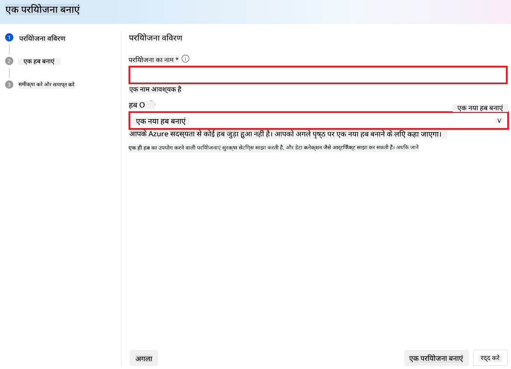
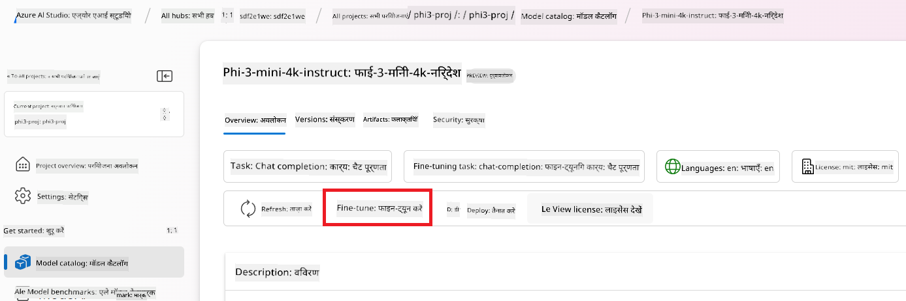
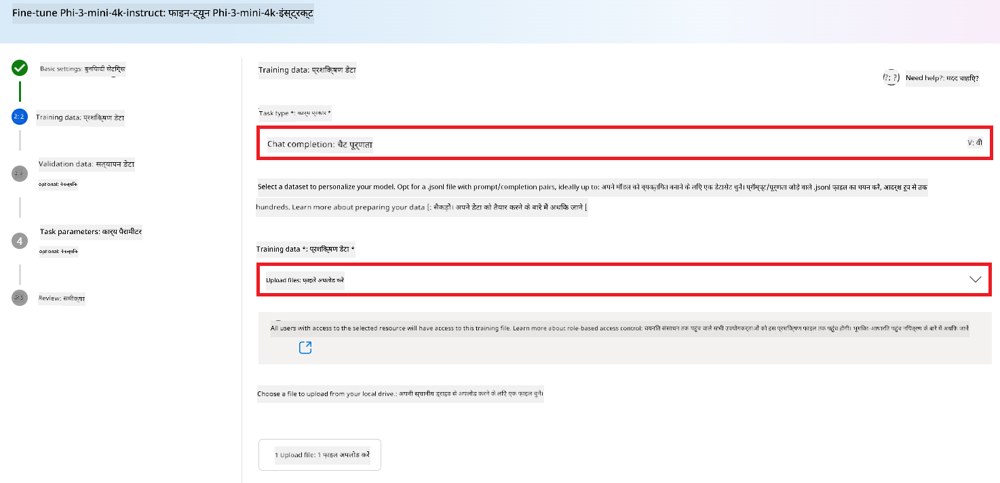
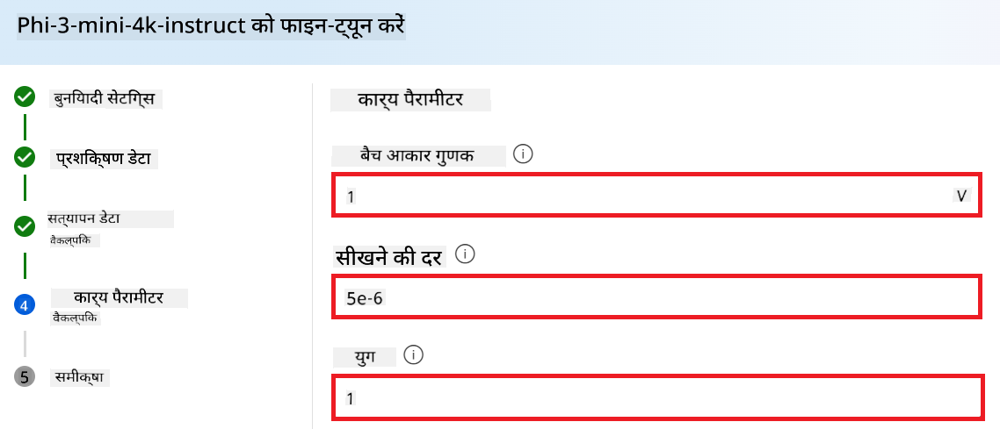
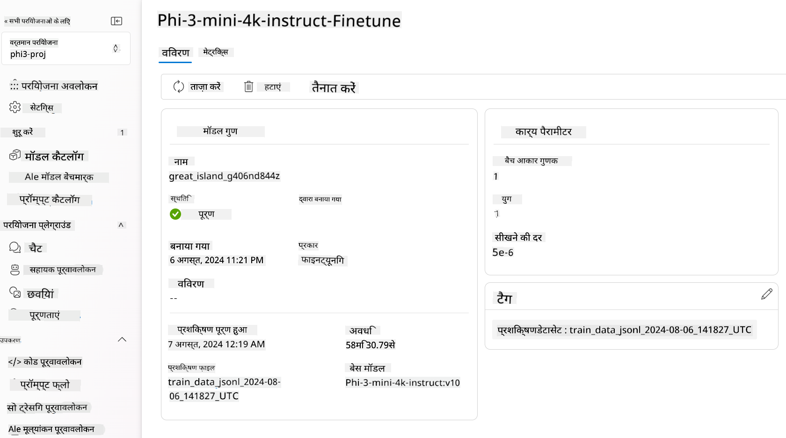

<!--
CO_OP_TRANSLATOR_METADATA:
{
  "original_hash": "c1559c5af6caccf6f623fd43a6b3a9a3",
  "translation_date": "2025-07-17T05:59:31+00:00",
  "source_file": "md/03.FineTuning/FineTuning_AIFoundry.md",
  "language_code": "hi"
}
-->
# Azure AI Foundry के साथ Phi-3 का फाइन-ट्यूनिंग

आइए देखें कि Microsoft के Phi-3 Mini भाषा मॉडल को Azure AI Foundry का उपयोग करके कैसे फाइन-ट्यून किया जा सकता है। फाइन-ट्यूनिंग आपको Phi-3 Mini को विशिष्ट कार्यों के लिए अनुकूलित करने की अनुमति देता है, जिससे यह और भी अधिक शक्तिशाली और संदर्भ-संवेदनशील बन जाता है।

## विचार करने योग्य बातें

- **क्षमताएं:** कौन से मॉडल फाइन-ट्यून किए जा सकते हैं? बेस मॉडल को किस प्रकार के कार्यों के लिए फाइन-ट्यून किया जा सकता है?
- **लागत:** फाइन-ट्यूनिंग के लिए मूल्य निर्धारण मॉडल क्या है?
- **अनुकूलन क्षमता:** मैं बेस मॉडल में कितनी और किस प्रकार की संशोधन कर सकता हूँ?
- **सुविधा:** फाइन-ट्यूनिंग वास्तव में कैसे होती है – क्या मुझे कस्टम कोड लिखना होगा? क्या मुझे अपनी कंप्यूटिंग संसाधन लानी होगी?
- **सुरक्षा:** फाइन-ट्यून किए गए मॉडल में सुरक्षा जोखिम हो सकते हैं – क्या अनचाहे नुकसान से बचाव के लिए कोई गार्डरेल्स मौजूद हैं?


## फाइन-ट्यूनिंग की तैयारी

### पूर्व आवश्यकताएँ

> [!NOTE]
> Phi-3 परिवार के मॉडलों के लिए, पे-एज़-यू-गो मॉडल फाइन-ट्यूनिंग केवल **East US 2** क्षेत्र में बनाए गए हब्स के साथ उपलब्ध है।

- एक Azure सब्सक्रिप्शन। यदि आपके पास Azure सब्सक्रिप्शन नहीं है, तो शुरू करने के लिए एक [पेड Azure अकाउंट](https://azure.microsoft.com/pricing/purchase-options/pay-as-you-go) बनाएं।

- एक [AI Foundry प्रोजेक्ट](https://ai.azure.com?WT.mc_id=aiml-138114-kinfeylo)।
- Azure रोल-आधारित एक्सेस कंट्रोल (Azure RBAC) का उपयोग Azure AI Foundry में ऑपरेशंस के लिए एक्सेस देने के लिए किया जाता है। इस लेख में दिए गए चरणों को करने के लिए, आपके यूजर अकाउंट को रिसोर्स ग्रुप पर __Azure AI Developer रोल__ असाइन किया जाना चाहिए।

### सब्सक्रिप्शन प्रदाता पंजीकरण

सुनिश्चित करें कि सब्सक्रिप्शन `Microsoft.Network` रिसोर्स प्रोवाइडर के लिए पंजीकृत है।

1. [Azure पोर्टल](https://portal.azure.com) में साइन इन करें।
2. बाएं मेनू से **Subscriptions** चुनें।
3. उस सब्सक्रिप्शन को चुनें जिसे आप उपयोग करना चाहते हैं।
4. बाएं मेनू से **AI project settings** > **Resource providers** चुनें।
5. पुष्टि करें कि **Microsoft.Network** रिसोर्स प्रोवाइडर्स की सूची में है। यदि नहीं, तो इसे जोड़ें।

### डेटा तैयारी

अपने मॉडल को फाइन-ट्यून करने के लिए प्रशिक्षण और सत्यापन डेटा तैयार करें। आपके प्रशिक्षण और सत्यापन डेटा सेट में इनपुट और आउटपुट उदाहरण होते हैं जो यह दर्शाते हैं कि आप मॉडल से कैसा प्रदर्शन चाहते हैं।

सुनिश्चित करें कि आपके सभी प्रशिक्षण उदाहरण अपेक्षित प्रारूप के अनुसार हैं। प्रभावी फाइन-ट्यूनिंग के लिए, एक संतुलित और विविध डेटा सेट होना आवश्यक है।

इसमें डेटा संतुलन बनाए रखना, विभिन्न परिदृश्यों को शामिल करना, और समय-समय पर प्रशिक्षण डेटा को वास्तविक दुनिया की अपेक्षाओं के अनुरूप संशोधित करना शामिल है, जिससे मॉडल की प्रतिक्रियाएं अधिक सटीक और संतुलित हों।

विभिन्न मॉडल प्रकारों के लिए प्रशिक्षण डेटा का प्रारूप अलग होता है।

### चैट पूर्णता

आपके द्वारा उपयोग किया जाने वाला प्रशिक्षण और सत्यापन डेटा **JSON Lines (JSONL)** दस्तावेज़ के रूप में होना चाहिए। `Phi-3-mini-128k-instruct` के लिए फाइन-ट्यूनिंग डेटासेट को चैट पूर्णता API द्वारा उपयोग किए जाने वाले संवादात्मक प्रारूप में होना चाहिए।

### उदाहरण फ़ाइल प्रारूप

```json
    {"messages": [{"role": "system", "content": "You are an Xbox customer support agent whose primary goal is to help users with issues they are experiencing with their Xbox devices. You are friendly and concise. You only provide factual answers to queries, and do not provide answers that are not related to Xbox."}, {"role": "user", "content": "Is Xbox better than PlayStation?"}, {"role": "assistant", "content": "I apologize, but I cannot provide personal opinions. My primary job is to assist you with any issues related to your Xbox device. Do you have any Xbox-related issues that need addressing?"}]}
    {"messages": [{"role": "system", "content": "You are an Xbox customer support agent whose primary goal is to help users with issues they are experiencing with their Xbox devices. You are friendly and concise. You only provide factual answers to queries, and do not provide answers that are not related to Xbox."}, {"role": "user", "content": "Can I play PC games on my Xbox?"}, {"role": "assistant", "content": "While Xbox consoles don't natively support PC games, they can play an array of Xbox games, many of which are also available on PC. Can I assist you with finding games compatible with your Xbox device?"}]}
    {"messages": [{"role": "system", "content": "You are an Xbox customer support agent whose primary goal is to help users with issues they are experiencing with their Xbox devices. You are friendly and concise. You only provide factual answers to queries, and do not provide answers that are not related to Xbox."}, {"role": "user", "content": "I'm having trouble connecting my Xbox to the Wi-Fi."}, {"role": "assistant", "content": "No worries, let's go through the network settings on your Xbox. Can you please tell me what happens when you try to connect it to the Wi-Fi?"}]}
```

समर्थित फ़ाइल प्रकार JSON Lines है। फ़ाइलें डिफ़ॉल्ट डेटा स्टोर में अपलोड की जाती हैं और आपके प्रोजेक्ट में उपलब्ध कराई जाती हैं।

## Azure AI Foundry के साथ Phi-3 का फाइन-ट्यूनिंग

Azure AI Foundry आपको बड़े भाषा मॉडलों को अपने व्यक्तिगत डेटा सेट के अनुसार अनुकूलित करने की सुविधा देता है, जिसे फाइन-ट्यूनिंग कहा जाता है। फाइन-ट्यूनिंग विशिष्ट कार्यों और अनुप्रयोगों के लिए अनुकूलन और अनुकूलन की अनुमति देकर महत्वपूर्ण मूल्य प्रदान करता है। इससे प्रदर्शन में सुधार, लागत दक्षता, कम विलंबता, और अनुकूलित आउटपुट प्राप्त होते हैं।


### नया प्रोजेक्ट बनाएं

1. [Azure AI Foundry](https://ai.azure.com) में साइन इन करें।

2. Azure AI Foundry में नया प्रोजेक्ट बनाने के लिए **+New project** चुनें।

    

3. निम्नलिखित कार्य करें:

    - प्रोजेक्ट का **Hub name** दर्ज करें। यह एक अद्वितीय मान होना चाहिए।
    - उपयोग करने के लिए **Hub** चुनें (यदि आवश्यक हो तो नया बनाएं)।

    

4. नया हब बनाने के लिए निम्नलिखित कार्य करें:

    - **Hub name** दर्ज करें। यह एक अद्वितीय मान होना चाहिए।
    - अपनी Azure **Subscription** चुनें।
    - उपयोग करने के लिए **Resource group** चुनें (यदि आवश्यक हो तो नया बनाएं)।
    - उपयोग करने के लिए **Location** चुनें।
    - उपयोग करने के लिए **Connect Azure AI Services** चुनें (यदि आवश्यक हो तो नया बनाएं)।
    - **Connect Azure AI Search** के लिए **Skip connecting** चुनें।

    

5. **Next** चुनें।
6. **Create a project** चुनें।

### डेटा तैयारी

फाइन-ट्यूनिंग से पहले, अपने कार्य से संबंधित डेटा सेट इकट्ठा करें या बनाएं, जैसे कि चैट निर्देश, प्रश्न-उत्तर जोड़े, या कोई अन्य प्रासंगिक टेक्स्ट डेटा। इस डेटा को साफ़ करें और पूर्व-प्रसंस्करण करें, जिसमें शोर हटाना, गायब मानों को संभालना, और टेक्स्ट को टोकनाइज़ करना शामिल है।

### Azure AI Foundry में Phi-3 मॉडल का फाइन-ट्यूनिंग

> [!NOTE]
> Phi-3 मॉडलों का फाइन-ट्यूनिंग वर्तमान में केवल East US 2 में स्थित प्रोजेक्ट्स में समर्थित है।

1. बाएं साइड टैब से **Model catalog** चुनें।

2. **search bar** में *phi-3* टाइप करें और उस phi-3 मॉडल को चुनें जिसे आप उपयोग करना चाहते हैं।

    

3. **Fine-tune** चुनें।

    

4. **Fine-tuned model name** दर्ज करें।

    

5. **Next** चुनें।

6. निम्नलिखित कार्य करें:

    - **task type** के रूप में **Chat completion** चुनें।
    - वह **Training data** चुनें जिसे आप उपयोग करना चाहते हैं। आप इसे Azure AI Foundry के डेटा से या अपनी स्थानीय मशीन से अपलोड कर सकते हैं।

    

7. **Next** चुनें।

8. वह **Validation data** अपलोड करें जिसे आप उपयोग करना चाहते हैं, या आप **Automatic split of training data** चुन सकते हैं।

    

9. **Next** चुनें।

10. निम्नलिखित कार्य करें:

    - उपयोग करने के लिए **Batch size multiplier** चुनें।
    - उपयोग करने के लिए **Learning rate** चुनें।
    - उपयोग करने के लिए **Epochs** चुनें।

    

11. फाइन-ट्यूनिंग प्रक्रिया शुरू करने के लिए **Submit** चुनें।

    

12. एक बार आपका मॉडल फाइन-ट्यून हो जाने पर, स्थिति **Completed** के रूप में दिखाई देगी, जैसा कि नीचे की छवि में दिखाया गया है। अब आप मॉडल को डिप्लॉय कर सकते हैं और इसे अपनी एप्लिकेशन, प्लेग्राउंड, या प्रॉम्प्ट फ्लो में उपयोग कर सकते हैं। अधिक जानकारी के लिए देखें [How to deploy Phi-3 family of small language models with Azure AI Foundry](https://learn.microsoft.com/azure/ai-studio/how-to/deploy-models-phi-3?tabs=phi-3-5&pivots=programming-language-python)।

    

> [!NOTE]
> Phi-3 के फाइन-ट्यूनिंग के बारे में अधिक विस्तृत जानकारी के लिए कृपया देखें [Fine-tune Phi-3 models in Azure AI Foundry](https://learn.microsoft.com/azure/ai-studio/how-to/fine-tune-phi-3?tabs=phi-3-mini)।

## अपने फाइन-ट्यून किए गए मॉडलों की सफाई

आप [Azure AI Foundry](https://ai.azure.com) में फाइन-ट्यूनिंग मॉडल सूची से या मॉडल विवरण पृष्ठ से फाइन-ट्यून किए गए मॉडल को हटा सकते हैं। फाइन-ट्यूनिंग पेज से हटाने के लिए मॉडल चुनें, फिर Delete बटन दबाएं।

> [!NOTE]
> यदि किसी कस्टम मॉडल का डिप्लॉयमेंट मौजूद है, तो आप उसे हटा नहीं सकते। पहले अपने मॉडल डिप्लॉयमेंट को हटाना होगा, तभी आप कस्टम मॉडल को हटा सकते हैं।

## लागत और कोटा

### Phi-3 मॉडलों के लिए सेवा के रूप में फाइन-ट्यूनिंग की लागत और कोटा

Phi मॉडल जिन्हें सेवा के रूप में फाइन-ट्यून किया गया है, Microsoft द्वारा प्रदान किए जाते हैं और Azure AI Foundry के साथ एकीकृत होते हैं। आप मूल्य निर्धारण [डिप्लॉयमेंट](https://learn.microsoft.com/azure/ai-studio/how-to/deploy-models-phi-3?tabs=phi-3-5&pivots=programming-language-python) या फाइन-ट्यूनिंग के दौरान डिप्लॉयमेंट विज़ार्ड के Pricing and terms टैब में देख सकते हैं।

## कंटेंट फ़िल्टरिंग

पे-एज़-यू-गो सेवा के रूप में डिप्लॉय किए गए मॉडल Azure AI Content Safety द्वारा संरक्षित होते हैं। रियल-टाइम एंडपॉइंट्स पर डिप्लॉय करते समय, आप इस सुविधा से बाहर निकल सकते हैं। Azure AI कंटेंट सेफ्टी सक्षम होने पर, प्रॉम्प्ट और पूर्णता दोनों एक वर्गीकरण मॉडलों के समूह से गुजरते हैं, जो हानिकारक सामग्री के आउटपुट को पहचानने और रोकने के लिए डिज़ाइन किए गए हैं। कंटेंट फ़िल्टरिंग सिस्टम इनपुट प्रॉम्प्ट और आउटपुट पूर्णताओं दोनों में संभावित हानिकारक सामग्री की विशिष्ट श्रेणियों का पता लगाता है और कार्रवाई करता है। अधिक जानें [Azure AI Content Safety](https://learn.microsoft.com/azure/ai-studio/concepts/content-filtering)।

**फाइन-ट्यूनिंग कॉन्फ़िगरेशन**

हाइपरपैरामीटर्स: लर्निंग रेट, बैच साइज, और प्रशिक्षण एपोक्स की संख्या जैसे हाइपरपैरामीटर्स को परिभाषित करें।

**लॉस फंक्शन**

अपने कार्य के लिए उपयुक्त लॉस फंक्शन चुनें (जैसे, क्रॉस-एंट्रॉपी)।

**ऑप्टिमाइज़र**

प्रशिक्षण के दौरान ग्रेडिएंट अपडेट के लिए ऑप्टिमाइज़र चुनें (जैसे, Adam)।

**फाइन-ट्यूनिंग प्रक्रिया**

- प्री-ट्रेंड मॉडल लोड करें: Phi-3 Mini चेकपॉइंट लोड करें।
- कस्टम लेयर्स जोड़ें: कार्य-विशिष्ट लेयर्स जोड़ें (जैसे, चैट निर्देशों के लिए क्लासिफिकेशन हेड)।

**मॉडल को प्रशिक्षित करें**  
अपने तैयार किए गए डेटासेट का उपयोग करके मॉडल को फाइन-ट्यून करें। प्रशिक्षण प्रगति की निगरानी करें और आवश्यकतानुसार हाइपरपैरामीटर्स समायोजित करें।

**मूल्यांकन और सत्यापन**

सत्यापन सेट: अपने डेटा को प्रशिक्षण और सत्यापन सेट में विभाजित करें।

**प्रदर्शन का मूल्यांकन करें**

मॉडल के प्रदर्शन का आकलन करने के लिए सटीकता, F1-स्कोर, या पर्प्लेक्सिटी जैसे मेट्रिक्स का उपयोग करें।

## फाइन-ट्यून किए गए मॉडल को सहेजें

**चेकपॉइंट**  
भविष्य के उपयोग के लिए फाइन-ट्यून किए गए मॉडल का चेकपॉइंट सहेजें।

## डिप्लॉयमेंट

- वेब सेवा के रूप में डिप्लॉय करें: अपने फाइन-ट्यून किए गए मॉडल को Azure AI Foundry में वेब सेवा के रूप में डिप्लॉय करें।
- एंडपॉइंट का परीक्षण करें: डिप्लॉय किए गए एंडपॉइंट को टेस्ट क्वेरी भेजकर इसकी कार्यक्षमता सत्यापित करें।

## पुनरावृत्ति और सुधार

पुनरावृत्ति करें: यदि प्रदर्शन संतोषजनक नहीं है, तो हाइपरपैरामीटर्स समायोजित करके, अधिक डेटा जोड़कर, या अतिरिक्त एपोक्स के लिए फाइन-ट्यूनिंग करके पुनरावृत्ति करें।

## निगरानी और परिष्करण

मॉडल के व्यवहार की निरंतर निगरानी करें और आवश्यकतानुसार सुधार करें।

## अनुकूलित करें और विस्तार करें

कस्टम कार्य: Phi-3 Mini को चैट निर्देशों के अलावा विभिन्न कार्यों के लिए फाइन-ट्यून किया जा सकता है। अन्य उपयोग मामलों का अन्वेषण करें!  
प्रयोग करें: प्रदर्शन बढ़ाने के लिए विभिन्न आर्किटेक्चर, लेयर संयोजन, और तकनीकों का प्रयोग करें।

> [!NOTE]
> फाइन-ट्यूनिंग एक पुनरावृत्तिमूलक प्रक्रिया है। प्रयोग करें, सीखें, और अपने मॉडल को अपने विशिष्ट कार्य के लिए सर्वोत्तम परिणाम प्राप्त करने के लिए अनुकूलित करें!

**अस्वीकरण**:  
यह दस्तावेज़ AI अनुवाद सेवा [Co-op Translator](https://github.com/Azure/co-op-translator) का उपयोग करके अनुवादित किया गया है। जबकि हम सटीकता के लिए प्रयासरत हैं, कृपया ध्यान दें कि स्वचालित अनुवादों में त्रुटियाँ या अशुद्धियाँ हो सकती हैं। मूल दस्तावेज़ अपनी मूल भाषा में ही अधिकारिक स्रोत माना जाना चाहिए। महत्वपूर्ण जानकारी के लिए, पेशेवर मानव अनुवाद की सलाह दी जाती है। इस अनुवाद के उपयोग से उत्पन्न किसी भी गलतफहमी या गलत व्याख्या के लिए हम जिम्मेदार नहीं हैं।