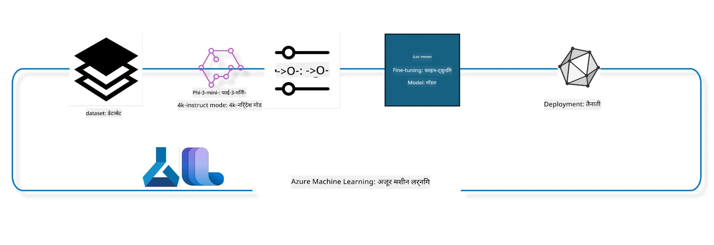

## Azure ML सिस्टम रजिस्ट्र्री से चैट-कंप्लीशन कॉम्पोनेन्ट्स का उपयोग करके मॉडल को फाइन ट्यून कैसे करें

इस उदाहरण में, हम ultrachat_200k डेटासेट का उपयोग करके 2 लोगों के बीच संवाद को पूरा करने के लिए Phi-3-mini-4k-instruct मॉडल का फाइन ट्यून करेंगे।



यह उदाहरण आपको दिखाएगा कि कैसे Azure ML SDK और Python का उपयोग करके फाइन ट्यूनिंग की जाए और फिर फाइन ट्यून किए गए मॉडल को रियल टाइम इनफरेंस के लिए ऑनलाइन एंडपॉइंट पर तैनात किया जाए।

### प्रशिक्षण डेटा

हम ultrachat_200k डेटासेट का उपयोग करेंगे। यह UltraChat डेटासेट का एक कड़ा फ़िल्टर्ड संस्करण है और इसका उपयोग Zephyr-7B-β, एक अत्याधुनिक 7b चैट मॉडल को प्रशिक्षित करने में किया गया था।

### मॉडल

हम Phi-3-mini-4k-instruct मॉडल का उपयोग करेंगे यह दिखाने के लिए कि उपयोगकर्ता कैसे चैट-कंप्लीशन टास्क के लिए मॉडल का फाइनट्यून कर सकता है। यदि आपने यह नोटबुक किसी विशिष्ट मॉडल कार्ड से खोला है, तो विशिष्ट मॉडल नाम को बदलना न भूलें।

### कार्य

- एक मॉडल चुनें जिसे फाइन ट्यून करना है।
- प्रशिक्षण डेटा चुनें और अन्वेषण करें।
- फाइन ट्यूनिंग जॉब को कॉन्फ़िगर करें।
- फाइन ट्यूनिंग जॉब चलाएं।
- प्रशिक्षण और मूल्यांकन मेट्रिक्स की समीक्षा करें।
- फाइन ट्यून किए गए मॉडल को रजिस्टर करें।
- रियल टाइम इनफरेंस के लिए फाइन ट्यून किए गए मॉडल को तैनात करें।
- संसाधनों को साफ़ करें।

## 1. आवश्यकताएं सेटअप करें

- डिपेंडेंसीज़ इंस्टॉल करें
- AzureML वर्कस्पेस से कनेक्ट करें। अधिक जानने के लिए SDK प्रमाणीकरण सेटअप देखें। नीचे <WORKSPACE_NAME>, <RESOURCE_GROUP> और <SUBSCRIPTION_ID> को रिप्लेस करें।
- AzureML सिस्टम रजिस्ट्र्री से कनेक्ट करें
- वैकल्पिक प्रयोग नाम सेट करें
- Compute चेक करें या बनाएं।

> [!NOTE]
> आवश्यकताओं के अनुसार एक GPU नोड में कई GPU कार्ड हो सकते हैं। उदाहरण के लिए, Standard_NC24rs_v3 के एक नोड में 4 NVIDIA V100 GPUs होते हैं जबकि Standard_NC12s_v3 में 2 NVIDIA V100 GPUs होते हैं। इस जानकारी के लिए डॉक्स देखें। हर नोड में GPU कार्ड की संख्या को नीचे दिए गए param gpus_per_node में सेट किया जाता है। इसे सही से सेट करने से नोड के सभी GPU का उपयोग सुनिश्चित होगा। अनुशंसित GPU compute SKUs यहां और यहां मिल सकते हैं।

### Python लाइब्रेरीज

नीचे सेल को चलाकर डिपेंडेंसीज़ इंस्टॉल करें। यदि आप नए वातावरण में चलाते हैं तो यह वैकल्पिक चरण नहीं है।

```bash
pip install azure-ai-ml
pip install azure-identity
pip install datasets==2.9.0
pip install mlflow
pip install azureml-mlflow
```

### Azure ML के साथ इंटरैक्शन

1. यह Python स्क्रिप्ट Azure Machine Learning (Azure ML) सेवा से इंटरैक्ट करने के लिए उपयोग की जाती है। यह क्या करती है, इसका विवरण इस प्रकार है:

    - यह azure.ai.ml, azure.identity, और azure.ai.ml.entities पैकेज से आवश्यक मॉड्यूल इंपोर्ट करता है। साथ ही time मॉड्यूल भी इंपोर्ट करता है।

    - यह DefaultAzureCredential() का उपयोग करके प्रमाणीकरण करने की कोशिश करता है, जो Azure क्लाउड में चलने वाले एप्लिकेशन को जल्दी विकसित करने के लिए सरल प्रमाणीकरण अनुभव प्रदान करता है। यदि यह विफल होता है, तो यह InteractiveBrowserCredential() पर वापस चलता है, जो इंटरैक्टिव लॉगिन प्रॉम्प्ट देता है।

    - फिर यह from_config विधि का उपयोग करके MLClient इंस्टेंस बनाने की कोशिश करता है, जो डिफ़ॉल्ट कॉन्फ़िग फाइल (config.json) से कॉन्फ़िगरेशन पढ़ता है। यदि यह विफल होता है, तो यह subscription_id, resource_group_name, और workspace_name मैन्युअली प्रदान करके MLClient इंस्टेंस बनाता है।

    - यह Azure ML रजिस्ट्री "azureml" के लिए एक और MLClient इंस्टेंस बनाता है। यह रजिस्ट्री उन स्थानों में से है जहाँ मॉडल, फाइन-ट्यूनिंग पाइपलाइन और पर्यावरण संग्रहित होते हैं।

    - यह experiment_name को "chat_completion_Phi-3-mini-4k-instruct" पर सेट करता है।

    - यह एक अद्वितीय टाइमस्टैम्प उत्पन्न करता है, वर्तमान समय (सैकंड में, epoch से) को integer में और फिर string में कनवर्ट करके। इस टाइमस्टैम्प का उपयोग अद्वितीय नाम और संस्करण बनाने के लिए किया जा सकता है।

    ```python
    # Azure ML और Azure Identity से आवश्यक मॉड्यूल आयात करें
    from azure.ai.ml import MLClient
    from azure.identity import (
        DefaultAzureCredential,
        InteractiveBrowserCredential,
    )
    from azure.ai.ml.entities import AmlCompute
    import time  # टाइम मॉड्यूल आयात करें
    
    # DefaultAzureCredential का उपयोग करके प्रमाणीकरण करने का प्रयास करें
    try:
        credential = DefaultAzureCredential()
        credential.get_token("https://management.azure.com/.default")
    except Exception as ex:  # यदि DefaultAzureCredential विफल हो जाता है, तो InteractiveBrowserCredential का उपयोग करें
        credential = InteractiveBrowserCredential()
    
    # डिफ़ॉल्ट कॉन्फ़िगरेशन फ़ाइल का उपयोग करके MLClient इंस्टेंस बनाने का प्रयास करें
    try:
        workspace_ml_client = MLClient.from_config(credential=credential)
    except:  # यदि वह विफल हो जाता है, तो मैन्युअली विवरण प्रदान करके MLClient इंस्टेंस बनाएं
        workspace_ml_client = MLClient(
            credential,
            subscription_id="<SUBSCRIPTION_ID>",
            resource_group_name="<RESOURCE_GROUP>",
            workspace_name="<WORKSPACE_NAME>",
        )
    
    # "azureml" नामक Azure ML रजिस्ट्री के लिए एक अन्य MLClient इंस्टेंस बनाएं
    # यह रजिस्ट्री वह स्थान है जहाँ मॉडल, फाइन-ट्यूनिंग पाइपलाइनों, और वातावरण संग्रहीत किए जाते हैं
    registry_ml_client = MLClient(credential, registry_name="azureml")
    
    # प्रयोग का नाम सेट करें
    experiment_name = "chat_completion_Phi-3-mini-4k-instruct"
    
    # एक अद्वितीय टाइमस्टैम्प उत्पन्न करें जिसका उपयोग अद्वितीय नामों और संस्करणों के लिए किया जा सकता है
    timestamp = str(int(time.time()))
    ```

## 2. फाउंडेशन मॉडल चुनें जिसे फाइन ट्यून करना है

1. Phi-3-mini-4k-instruct एक 3.8B पैरामीटर, हल्का और अत्याधुनिक खुला मॉडल है जो Phi-2 के लिए उपयोग किए गए डेटासेट्स पर आधारित है। यह मॉडल Phi-3 मॉडल परिवार से आता है, और Mini संस्करण दो प्रकार 4K और 128K में आता है जो संदर्भ लंबाई (टोकन में) है जिसे यह सहारा सकता है। हमें इसे अपने विशिष्ट प्रयोजन के लिए फाइनट्यून करना होगा। आप AzureML Studio के Model Catalog में चैट-कंप्लीशन टास्क द्वारा फ़िल्टर करके इन मॉडलों को देख सकते हैं। इस उदाहरण में, हम Phi-3-mini-4k-instruct मॉडल का उपयोग कर रहे हैं। यदि आपने यह नोटबुक किसी अलग मॉडल के लिए खोली है, तो मॉडल का नाम और संस्करण उचित रूप से बदलें।

> [!NOTE]
> मॉडल की id प्रॉपर्टी। इसे फाइन ट्यूनिंग जॉब के इनपुट के रूप में पास किया जाएगा। यह AzureML Studio Model Catalog में मॉडल विवरण पेज के Asset ID फ़ील्ड के रूप में भी उपलब्ध है।

2. यह Python स्क्रिप्ट Azure Machine Learning (Azure ML) सेवा से इंटरैक्ट कर रही है। यह क्या करती है, इसका विवरण इस प्रकार है:

    - यह model_name को "Phi-3-mini-4k-instruct" सेट करता है।

    - यह registry_ml_client ऑब्जेक्ट के models प्रॉपर्टी के get मेथड का उपयोग करके उक्त नाम वाले मॉडल का नवीनतम संस्करण Azure ML रजिस्ट्री से प्राप्त करता है। get मेथड को दो आर्गुमेंट्स के साथ कॉल किया जाता है: मॉडल का नाम और लेबल जो नवीनतम संस्करण पाने के लिए कहता है।

    - यह कंसोल पर एक संदेश प्रिंट करता है, जिसमें वह मॉडल का नाम, संस्करण और id बताता है जिसे फाइन-ट्यूनिंग के लिए उपयोग किया जाएगा। स्ट्रिंग के format मेथड से नाम, संस्करण और id को संदेश में डाला जाता है। ये प्रॉपर्टीज़ foundation_model ऑब्जेक्ट से ली जाती हैं।

    ```python
    # मॉडल का नाम सेट करें
    model_name = "Phi-3-mini-4k-instruct"
    
    # Azure ML रजिस्ट्री से मॉडल का नवीनतम संस्करण प्राप्त करें
    foundation_model = registry_ml_client.models.get(model_name, label="latest")
    
    # मॉडल का नाम, संस्करण, और आईडी प्रिंट करें
    # यह जानकारी ट्रैकिंग और डिबगिंग के लिए उपयोगी है
    print(
        "\n\nUsing model name: {0}, version: {1}, id: {2} for fine tuning".format(
            foundation_model.name, foundation_model.version, foundation_model.id
        )
    )
    ```

## 3. जॉब के लिए उपयोग करने वाला कंप्यूट बनाएँ

फाइनट्यून जॉब केवल GPU कंप्यूट के साथ काम करता है। कंप्यूट का आकार मॉडल के आकार पर निर्भर करता है और अधिकांश मामलों में जॉब के लिए सही कंप्यूट पहचानना मुश्किल हो जाता है। इस सेल में, हम उपयोगकर्ता को जॉब के लिए सही कंप्यूट चुनने का मार्गदर्शन करते हैं।

> [!NOTE]
> नीचे सूचीबद्ध कंप्यूट सबसे अनुकूलन कॉन्फ़िगरेशन के साथ काम करते हैं। कॉन्फ़िगरेशन में कोई भी बदलाव Cuda Out Of Memory त्रुटि का कारण बन सकता है। ऐसी स्थिति में, कंप्यूट को बड़े आकार में अपग्रेड करने का प्रयास करें।

> [!NOTE]
> कंप्यूट क्लस्टर का आकार चुनते समय, सुनिश्चित करें कि कंप्यूट आपके रिसोर्स ग्रुप में उपलब्ध है। यदि कोई विशेष कंप्यूट उपलब्ध नहीं है, तो आप कंप्यूट संसाधनों के लिए एक्सेस का अनुरोध कर सकते हैं।

### फाइन ट्यूनिंग सपोर्ट के लिए मॉडल की जाँच

1. यह Python स्क्रिप्ट Azure Machine Learning (Azure ML) मॉडल के साथ इंटरैक्ट कर रही है। यह क्या करती है, इसका विवरण इस प्रकार है:

    - यह ast मॉड्यूल इंपोर्ट करता है, जो Python के अमूर्त सिंटैक्स ग्रामर के पेड़ों को प्रोसेस करने के लिए फंक्शंस प्रदान करता है।

    - यह जाँचता है कि foundation_model ऑब्जेक्ट (जो Azure ML में एक मॉडल का प्रतिनिधित्व करता है) के टैग्स में finetune_compute_allow_list टैग मौजूद है या नहीं। Azure ML में टैग key-value जोड़ होते हैं जिन्हें आप मॉडल्स को फ़िल्टर करने और सॉर्ट करने के लिए बना और इस्तेमाल कर सकते हैं।

    - यदि finetune_compute_allow_list टैग मौजूद है, तो यह ast.literal_eval फंक्शन का उपयोग करके टैग के मान (जो कि स्ट्रिंग है) को सुरक्षित रूप से Python लिस्ट में परिवर्तित करता है। इस लिस्ट को computes_allow_list में असाइन किया जाता है। फिर यह संदेश देता है कि उपयोगकर्ता को सूची से कंप्यूट बनाना चाहिए।

    - यदि टैग मौजूद नहीं है, तो यह computes_allow_list को None सेट करता है और बताता है कि finetune_compute_allow_list टैग मॉडल के टैग्स में नहीं है।

    - संक्षेप में, यह स्क्रिप्ट मॉडल के मेटाडेटा में एक विशेष टैग की जाँच करता है, यदि टैग मौजूद हो तो उसका मान लिस्ट में बदलता है और उपयोगकर्ता को सूचित करता है।

    ```python
    # ast मॉड्यूल आयात करें, जो Python के सार सिंटैक्स व्याकरण के पेड़ों को संसाधित करने के लिए फ़ंक्शन प्रदान करता है
    import ast
    
    # जांचें कि मॉडल के टैग्स में 'finetune_compute_allow_list' टैग मौजूद है या नहीं
    if "finetune_compute_allow_list" in foundation_model.tags:
        # यदि टैग मौजूद है, तो ast.literal_eval का उपयोग करके टैग के मान (एक स्ट्रिंग) को सुरक्षित रूप से Python सूची में पार्स करें
        computes_allow_list = ast.literal_eval(
            foundation_model.tags["finetune_compute_allow_list"]
        )  # स्ट्रिंग को Python सूची में कनवर्ट करें
        # एक संदेश प्रिंट करें जो सूचित करता है कि सूची से एक कंप्यूट बनाया जाना चाहिए
        print(f"Please create a compute from the above list - {computes_allow_list}")
    else:
        # यदि टैग मौजूद नहीं है, तो computes_allow_list को None पर सेट करें
        computes_allow_list = None
        # एक संदेश प्रिंट करें जो सूचित करता है कि 'finetune_compute_allow_list' टैग मॉडल के टैग्स का हिस्सा नहीं है
        print("`finetune_compute_allow_list` is not part of model tags")
    ```

### कंप्यूट इंस्टेंस की जाँच

1. यह Python स्क्रिप्ट Azure Machine Learning (Azure ML) सेवा के कंप्यूट इंस्टेंस के कई चेक करती है। यह क्या करती है, इसका विवरण इस प्रकार है:

    - यह compute_cluster नामक कंप्यूट इंस्टेंस को Azure ML वर्कस्पेस से प्राप्त करने की कोशिश करता है। यदि कंप्यूट इंस्टेंस की provisioning स्थिति "failed" है, तो यह ValueError उठाता है।

    - यह जाँचता है कि computes_allow_list None नहीं है। यदि नहीं है, तो यह सूची के सभी कंप्यूट साइज को लोअरकेस में बदलकर देखता है कि वर्तमान कंप्यूट इंस्टेंस का साइज इस सूची में है या नहीं। यदि नहीं है, तो यह ValueError उठाता है।

    - यदि computes_allow_list None है, तो यह देखता है कि कंप्यूट इंस्टेंस का साइज GPU VM के उन असमर्थित साइज की सूची में है या नहीं। अगर हाँ, तो यह ValueError उठाता है।

    - यह वर्कस्पेस में सभी उपलब्ध कंप्यूट साइज की सूची प्राप्त करता है। फिर इससे होकर गुजरते हुए, यदि किसी कंप्यूट साइज का नाम वर्तमान कंप्यूट इंस्टेंस के साइज से मेल खाती है, तो वह उस कंप्यूट साइज के GPU की संख्या प्राप्त करता है और gpu_count_found को True सेट करता है।

    - यदि gpu_count_found True है, तो यह कंप्यूट इंस्टेंस में GPU की संख्या प्रिंट करता है। यदि False है, तो यह ValueError उठाता है।

    - संक्षेप में, यह स्क्रिप्ट Azure ML वर्कस्पेस में कंप्यूट इंस्टेंस की provisioning स्थिति, उसके साइज को अनुमति सूची या अस्वीकृति सूची के खिलाफ, और उसके GPU की संख्या की कई जांच करती है।
    
    ```python
    # अपवाद संदेश प्रिंट करें
    print(e)
    # यदि वर्कस्पेस में कंप्यूट आकार उपलब्ध नहीं है तो ValueError उभारें
    raise ValueError(
        f"WARNING! Compute size {compute_cluster_size} not available in workspace"
    )
    
    # Azure ML वर्कस्पेस से कंप्यूट इंस्टेंस प्राप्त करें
    compute = workspace_ml_client.compute.get(compute_cluster)
    # जांचें कि कंप्यूट इंस्टेंस की प्रोविजनिंग स्थिति "विफल" है या नहीं
    if compute.provisioning_state.lower() == "failed":
        # यदि प्रोविजनिंग स्थिति "विफल" है तो ValueError उभारें
        raise ValueError(
            f"Provisioning failed, Compute '{compute_cluster}' is in failed state. "
            f"please try creating a different compute"
        )
    
    # जांचें कि computes_allow_list None नहीं है
    if computes_allow_list is not None:
        # computes_allow_list में सभी कंप्यूट आकारों को लोअरकेस में बदलें
        computes_allow_list_lower_case = [x.lower() for x in computes_allow_list]
        # जांचें कि कंप्यूट इंस्टेंस का आकार computes_allow_list_lower_case में है या नहीं
        if compute.size.lower() not in computes_allow_list_lower_case:
            # यदि कंप्यूट इंस्टेंस का आकार computes_allow_list_lower_case में नहीं है तो ValueError उभारें
            raise ValueError(
                f"VM size {compute.size} is not in the allow-listed computes for finetuning"
            )
    else:
        # अप्रयुक्त GPU VM आकारों की एक सूची परिभाषित करें
        unsupported_gpu_vm_list = [
            "standard_nc6",
            "standard_nc12",
            "standard_nc24",
            "standard_nc24r",
        ]
        # जांचें कि कंप्यूट इंस्टेंस का आकार unsupported_gpu_vm_list में है या नहीं
        if compute.size.lower() in unsupported_gpu_vm_list:
            # यदि कंप्यूट इंस्टेंस का आकार unsupported_gpu_vm_list में है तो ValueError उभारें
            raise ValueError(
                f"VM size {compute.size} is currently not supported for finetuning"
            )
    
    # एक फ्लैग प्रारंभ करें यह जांचने के लिए कि कंप्यूट इंस्टेंस में GPU की संख्या मिली है या नहीं
    gpu_count_found = False
    # वर्कस्पेस में सभी उपलब्ध कंप्यूट आकारों की सूची प्राप्त करें
    workspace_compute_sku_list = workspace_ml_client.compute.list_sizes()
    available_sku_sizes = []
    # उपलब्ध कंप्यूट आकारों की सूची पर पुनरावृत्ति करें
    for compute_sku in workspace_compute_sku_list:
        available_sku_sizes.append(compute_sku.name)
        # जांचें कि कंप्यूट आकार का नाम कंप्यूट इंस्टेंस के आकार से मेल खाता है या नहीं
        if compute_sku.name.lower() == compute.size.lower():
            # यदि मेल खाता है, तो उस कंप्यूट आकार के लिए GPU की संख्या प्राप्त करें और gpu_count_found को True सेट करें
            gpus_per_node = compute_sku.gpus
            gpu_count_found = True
    # यदि gpu_count_found True है, तो कंप्यूट इंस्टेंस में GPU की संख्या प्रिंट करें
    if gpu_count_found:
        print(f"Number of GPU's in compute {compute.size}: {gpus_per_node}")
    else:
        # यदि gpu_count_found False है, तो ValueError उभारें
        raise ValueError(
            f"Number of GPU's in compute {compute.size} not found. Available skus are: {available_sku_sizes}."
            f"This should not happen. Please check the selected compute cluster: {compute_cluster} and try again."
        )
    ```

## 4. मॉडल के फाइन-ट्यूनिंग के लिए डेटासेट चुनें

1. हम ultrachat_200k डेटासेट का उपयोग करते हैं। इस डेटासेट में चार स्प्लिट हैं, जो Supervised फाइन-ट्यूनिंग (sft) के लिए उपयुक्त हैं। Generation ranking (gen)। प्रत्येक स्प्लिट के उदाहरणों की संख्या निम्नानुसार है:

    ```bash
    train_sft test_sft  train_gen  test_gen
    207865  23110  256032  28304
    ```

1. अगले कुछ सेल फाइन ट्यूनिंग के लिए बुनियादी डेटा तैयारी दिखाते हैं:

### कुछ डेटा पंक्तियों का विज़ुअलाइज़ेशन

हम चाहते हैं कि यह सैंपल जल्दी चले, इसलिए train_sft, test_sft फ़ाइलों में 5% पहले से ट्रिम किए हुए पंक्तियाँ सेव करें। इसका मतलब है कि फाइन ट्यून किया गया मॉडल कम सटीक होगा, इसलिए इसका वास्तविक दुनिया में उपयोग नहीं किया जाना चाहिए।  
download-dataset.py का उपयोग ultrachat_200k डेटासेट डाउनलोड करने और डेटासेट को फाइनट्यून पाइपलाइन कंपोनेंट की समाचरणीय स्वरूप में बदलने के लिए किया जाता है। चूँकि डेटासेट बड़ा है, इसीलिए यहाँ हम केवल डेटासेट का हिस्सा ही रखते हैं।

1. नीचे दिया गया स्क्रिप्ट केवल 5% डेटा डाउनलोड करता है। इसे बढ़ाने के लिए dataset_split_pc पैरामीटर को इच्छित प्रतिशत में सेट करें।

> [!NOTE]
> कुछ भाषा मॉडल के अलग-अलग भाषा कोड होते हैं, इसलिए डेटासेट में कॉलम के नाम भी उसी अनुसार होने चाहिए।

1. डेटा इस प्रकार दिखना चाहिए:  
चैट-कंप्लीशन डेटासेट पारकेट फॉर्मेट में संग्रहित है, प्रत्येक प्रविष्टि निम्नलिखित स्कीमा का उपयोग करती है:

    - यह एक JSON (JavaScript Object Notation) दस्तावेज़ है, जो एक लोकप्रिय डेटा आदान-प्रदान प्रारूप है। यह निष्पादित कोड नहीं है, बल्कि डेटा संग्रहीत और स्थानांतरित करने का तरीका है। इसका संरचना इस प्रकार है:

    - "prompt": यह key एक स्ट्रिंग मान रखती है जो AI सहायक के लिए कोई कार्य या प्रश्न प्रस्तुत करती है।

    - "messages": यह key ऑब्जेक्ट्स की एक सूची रखती है। प्रत्येक ऑब्जेक्ट एक संवाद में उपयोगकर्ता और AI सहायक के बीच एक संदेश का प्रतिनिधित्व करता है। प्रत्येक संदेश ऑब्जेक्ट की दो key होती हैं:

    - "content": यह key उस संदेश की सामग्री को दर्शाने वाली स्ट्रिंग रखती है।
    - "role": यह key उस इकाई के रोल (क्या वह "user" है या "assistant") को दर्शाने वाली स्ट्रिंग रखती है जिसने संदेश भेजा।
    - "prompt_id": यह key उस prompt का यूनीक पहचानकर्ता स्ट्रिंग रखती है।

1. इस विशिष्ट JSON दस्तावेज़ में, एक संवाद दर्शाया गया है जहां उपयोगकर्ता AI सहायक से एक डिस्टोपियन कहानी के नायक को बनाने को कहता है। सहायक जवाब देता है, और उपयोगकर्ता फिर अधिक विवरण मांगता है। सहायक अधिक विवरण देने के लिए सहमत होता है। पूरा संवाद एक विशिष्ट prompt id से जुड़ा होता है।

    ```python
    {
        // The task or question posed to an AI assistant
        "prompt": "Create a fully-developed protagonist who is challenged to survive within a dystopian society under the rule of a tyrant. ...",
        
        // An array of objects, each representing a message in a conversation between a user and an AI assistant
        "messages":[
            {
                // The content of the user's message
                "content": "Create a fully-developed protagonist who is challenged to survive within a dystopian society under the rule of a tyrant. ...",
                // The role of the entity that sent the message
                "role": "user"
            },
            {
                // The content of the assistant's message
                "content": "Name: Ava\n\n Ava was just 16 years old when the world as she knew it came crashing down. The government had collapsed, leaving behind a chaotic and lawless society. ...",
                // The role of the entity that sent the message
                "role": "assistant"
            },
            {
                // The content of the user's message
                "content": "Wow, Ava's story is so intense and inspiring! Can you provide me with more details.  ...",
                // The role of the entity that sent the message
                "role": "user"
            }, 
            {
                // The content of the assistant's message
                "content": "Certainly! ....",
                // The role of the entity that sent the message
                "role": "assistant"
            }
        ],
        
        // A unique identifier for the prompt
        "prompt_id": "d938b65dfe31f05f80eb8572964c6673eddbd68eff3db6bd234d7f1e3b86c2af"
    }
    ```

### डेटा डाउनलोड करें

1. यह Python स्क्रिप्ट download-dataset.py नामक सहायक स्क्रिप्ट का उपयोग करके एक डेटासेट डाउनलोड करती है। इसका विवरण इस प्रकार है:

    - यह os मॉड्यूल इंपोर्ट करता है, जो ऑपरेटिंग सिस्टम पर निर्भर कार्यक्षमता के लिए पोर्टेबल तरीका प्रदान करता है।

    - यह os.system फंक्शन का उपयोग करके shell में download-dataset.py स्क्रिप्ट को विशेष कमांड लाइन आर्गुमेंट्स के साथ चलाता है। आर्गुमेंट्स में डाटासेट का नाम (HuggingFaceH4/ultrachat_200k), डाउनलोड डायरेक्टरी (ultrachat_200k_dataset), और डेटासेट स्प्लिट का प्रतिशत (5) होता है। os.system उस कमांड की एग्जिट स्टेटस लौटाता है जिसे वह चलाता है; इसे exit_status में रखा जाता है।

    - यह जांचता है कि exit_status 0 नहीं है। यूनिक्स जैसे OS में 0 का मतलब सफल कमांड होता है, अन्य नंबर त्रुटि को दर्शाते हैं। यदि exit_status 0 नहीं है, तो यह एक Exception उठाता है जो बताता है कि डेटासेट डाउनलोड करने में त्रुटि हुई।

    - सारांश में, यह स्क्रिप्ट एक सहायक स्क्रिप्ट के माध्यम से डेटासेट डाउनलोड करने वाला कमांड चलाती है, और विफलता होने पर Exception उठाती है।

    ```python
    # os मॉड्यूल को इम्पोर्ट करें, जो ऑपरेटिंग सिस्टम पर निर्भर कार्यक्षमता का उपयोग करने का तरीका प्रदान करता है
    import os
    
    # os.system फ़ंक्शन का उपयोग करके विशिष्ट कमांड-लाइन तर्कों के साथ download-dataset.py स्क्रिप्ट को शेल में चलाएं
    # तर्क उस डेटासेट को डाउनलोड करने के लिए निर्दिष्ट करते हैं (HuggingFaceH4/ultrachat_200k), इसे डाउनलोड करने के लिए डायरेक्टरी (ultrachat_200k_dataset), और डेटासेट को विभाजित करने का प्रतिशत (5)
    # os.system फ़ंक्शन उस कमांड का निकास स्थिति लौटाता है जिसे उसने चलाया; यह स्थिति exit_status वेरिएबल में संग्रहीत की जाती है
    exit_status = os.system(
        "python ./download-dataset.py --dataset HuggingFaceH4/ultrachat_200k --download_dir ultrachat_200k_dataset --dataset_split_pc 5"
    )
    
    # जांचें कि exit_status 0 नहीं है
    # यूनिक्स-जैसे ऑपरेटिंग सिस्टम में, निकास स्थिति 0 आमतौर पर दर्शाती है कि कमांड सफल रहा, जबकि कोई अन्य संख्या त्रुटि को दर्शाती है
    # अगर exit_status 0 नहीं है, तो एक Exception उत्पन्न करें जिसमें संदेश हो कि डेटासेट डाउनलोड करते समय त्रुटि हुई है
    if exit_status != 0:
        raise Exception("Error downloading dataset")
    ```

### डेटा को DataFrame में लोड करना

1. यह Python स्क्रिप्ट JSON Lines फ़ाइल को pandas DataFrame में लोड कर रही है और पहले 5 पंक्तियाँ दिखा रही है। इसका विवरण इस प्रकार है:

    - यह pandas लाइब्रेरी इंपोर्ट करती है, जो डेटा हेरफेर और विश्लेषण के लिए एक शक्तिशाली लाइब्रेरी है।

    - यह pandas के डिस्प्ले विकल्पों के लिए अधिकतम कॉलम चौड़ाई 0 पर सेट करता है। इसका मतलब है कि DataFrame प्रिंट किए जाने पर हर कॉलम का पूरा टेक्स्ट बिना ट्रंकेशन के दिखेगा।
- यह pd.read_json फ़ंक्शन का उपयोग करता है ताकि ultrachat_200k_dataset निर्देशिका से train_sft.jsonl फ़ाइल को एक DataFrame में लोड किया जा सके। lines=True आर्गुमेंट इस बात का संकेत देता है कि फ़ाइल JSON Lines फॉर्मेट में है, जहाँ प्रत्येक लाइन एक अलग JSON ऑब्जेक्ट होता है।

- यह head मेथड का उपयोग करता है ताकि DataFrame की पहली 5 पंक्तियाँ प्रदर्शित की जा सकें। यदि DataFrame में 5 से कम पंक्तियाँ हैं, तो यह सभी को प्रदर्शित करेगा।

- संक्षेप में, यह स्क्रिप्ट एक JSON Lines फ़ाइल को DataFrame में लोड कर रही है और पहले 5 पंक्तियों को पूरे कॉलम टेक्स्ट के साथ प्रदर्शित कर रही है।

    ```python
    # पांडा लाइब्रेरी को इम्पोर्ट करें, जो एक शक्तिशाली डेटा मैनिपुलेशन और विश्लेषण लाइब्रेरी है
    import pandas as pd
    
    # पांडा की डिस्प्ले ऑप्शन्स के लिए अधिकतम कॉलम चौड़ाई को 0 पर सेट करें
    # इसका मतलब है कि जब DataFrame प्रिंट किया जाएगा तो प्रत्येक कॉलम का पूरा टेक्स्ट बिना कटाव के दिखेगा
    pd.set_option("display.max_colwidth", 0)
    
    # pd.read_json फ़ंक्शन का उपयोग करके ultrachat_200k_dataset डिरेक्टरी से train_sft.jsonl फाइल को DataFrame में लोड करें
    # lines=True तर्क यह दर्शाता है कि फाइल JSON Lines फॉर्मेट में है, जहां प्रत्येक लाइन एक अलग JSON ऑब्जेक्ट है
    df = pd.read_json("./ultrachat_200k_dataset/train_sft.jsonl", lines=True)
    
    # DataFrame की पहली 5 पंक्तियाँ दिखाने के लिए head मेथड का उपयोग करें
    # यदि DataFrame में 5 से कम पंक्तियाँ हैं, तो यह सभी को दिखाएगा
    df.head()
    ```

## 5. मॉडल और डेटा को इनपुट के रूप में उपयोग करके फाइन ट्यूनिंग जॉब सबमिट करें

जॉब बनाएँ जो chat-completion पाइपलाइन कंपोनेंट का उपयोग करता है। फाइन ट्यूनिंग के लिए समर्थित सभी पैरामीटरों के बारे में अधिक जानें।

### फाइनट्यून पैरामीटर परिभाषित करें

1. फाइनट्यून पैरामीटरों को 2 श्रेणियों में बाँटा जा सकता है - प्रशिक्षण पैरामीटर, अनुकूलन पैरामीटर

1. प्रशिक्षण पैरामीटर प्रशिक्षण पहलुओं को परिभाषित करते हैं जैसे -

    - उपयोग करने वाला ऑप्टिमाइज़र, शेड्यूलर
    - फाइनट्यून को ऑप्टिमाइज़ करने के लिए मीट्रिक
    - प्रशिक्षण चरणों की संख्या और बैच आकार आदि
    - अनुकूलन पैरामीटर GPU मेमोरी को ऑप्टिमाइज़ करने और कम्प्यूट संसाधनों का प्रभावी उपयोग करने में मदद करते हैं।

1. नीचे कुछ पैरामीटर दिए गए हैं जो इस श्रेणी से संबंधित हैं। अनुकूलन पैरामीटर प्रत्येक मॉडल के लिए भिन्न होते हैं और इन भिन्नताओं को संभालने के लिए मॉडल के साथ पैक किए गए होते हैं।

    - deepspeed और LoRA सक्षम करें
    - मिश्रित परिशुद्धता प्रशिक्षण सक्षम करें
    - मल्टी-नोड प्रशिक्षण सक्षम करें

> [!NOTE]
> सुपरवाइज़्ड फाइनट्यूनिंग संरेखण (alignment) खोने या बर्बादी की संभावना पैदा कर सकती है। हम सलाह देते हैं कि इस मुद्दे को जांचें और फाइनट्यून के बाद संरेखण चरण चलाएं।

### फाइन ट्यूनिंग पैरामीटर

1. यह पायथन स्क्रिप्ट मशीन लर्निंग मॉडल के फाइन-ट्यूनिंग के लिए पैरामीटर सेट कर रही है। यहाँ इसका विवरण है:

    - यह डिफ़ॉल्ट प्रशिक्षण पैरामीटर सेट करता है जैसे प्रशिक्षण युगों की संख्या, प्रशिक्षण और मूल्यांकन के लिए बैच आकार, सीखने की दर, और सीखने की दर शेड्यूलर का प्रकार।

    - यह डिफ़ॉल्ट अनुकूलन पैरामीटर सेट करता है जैसे Layer-wise Relevance Propagation (LoRa) और DeepSpeed लागू करना है या नहीं, और DeepSpeed स्टेज।

    - यह प्रशिक्षण और अनुकूलन पैरामीटरों को finetune_parameters नामक एकल डिक्शनरी में संयोजित करता है।

    - यह जांचता है कि foundation_model में कोई मॉडल-विशिष्ट डिफ़ॉल्ट पैरामीटर हैं या नहीं। यदि हैं, तो यह एक चेतावनी संदेश प्रिंट करता है और finetune_parameters डिक्शनरी को मॉडल-विशिष्ट डिफ़ॉल्ट से अपडेट करता है। ast.literal_eval फ़ंक्शन का उपयोग मॉडल-विशिष्ट डिफ़ॉल्ट को स्ट्रिंग से पायथन डिक्शनरी में बदलने के लिए किया जाता है।

    - यह अंतिम फाइन-ट्यूनिंग पैरामीटर सेट को प्रिंट करता है जो रन के लिए उपयोग किए जाएंगे।

    - संक्षेप में, यह स्क्रिप्ट मशीन लर्निंग मॉडल के फाइन-ट्यूनिंग के लिए पैरामीटर सेट कर रही है और दिखा रही है, साथ ही डिफ़ॉल्ट पैरामीटर को मॉडल-विशिष्ट से अधिलेखित करने की क्षमता भी देती है।

    ```python
    # डिफ़ॉल्ट प्रशिक्षण पैरामीटर सेट करें जैसे प्रशिक्षण एपोच की संख्या, प्रशिक्षण और मूल्यांकन के लिए बैच साइज़, लर्निंग रेट, और लर्निंग रेट शेड्यूलर प्रकार
    training_parameters = dict(
        num_train_epochs=3,
        per_device_train_batch_size=1,
        per_device_eval_batch_size=1,
        learning_rate=5e-6,
        lr_scheduler_type="cosine",
    )
    
    # डिफ़ॉल्ट अनुकूलन पैरामीटर सेट करें जैसे Layer-wise Relevance Propagation (LoRa) और DeepSpeed को लागू करना है या नहीं, और DeepSpeed स्टेज
    optimization_parameters = dict(
        apply_lora="true",
        apply_deepspeed="true",
        deepspeed_stage=2,
    )
    
    # प्रशिक्षण और अनुकूलन पैरामीटर को एक एकल शब्दकोश में मिलाएं जिसे finetune_parameters कहा जाता है
    finetune_parameters = {**training_parameters, **optimization_parameters}
    
    # जांचें कि foundation_model के पास कोई मॉडल-विशिष्ट डिफ़ॉल्ट पैरामीटर हैं या नहीं
    # यदि हैं, तो एक चेतावनी संदेश प्रिंट करें और finetune_parameters शब्दकोश को इन मॉडल-विशिष्ट डिफ़ॉल्ट के साथ अपडेट करें
    # ast.literal_eval फ़ंक्शन का उपयोग मॉडल-विशिष्ट डिफ़ॉल्ट को स्ट्रिंग से पायथन शब्दकोश में परिवर्तित करने के लिए किया जाता है
    if "model_specific_defaults" in foundation_model.tags:
        print("Warning! Model specific defaults exist. The defaults could be overridden.")
        finetune_parameters.update(
            ast.literal_eval(  # स्ट्रिंग को पायथन dict में परिवर्तित करें
                foundation_model.tags["model_specific_defaults"]
            )
        )
    
    # उस अंतिम फाइन-ट्यूनिंग पैरामीटर सेट को प्रिंट करें जो रन के लिए उपयोग किया जाएगा
    print(
        f"The following finetune parameters are going to be set for the run: {finetune_parameters}"
    )
    ```

### प्रशिक्षण पाइपलाइन

1. यह पायथन स्क्रिप्ट एक फ़ंक्शन परिभाषित कर रही है जो मशीन लर्निंग प्रशिक्षण पाइपलाइन के लिए एक डिस्प्ले नाम उत्पन्न करता है, और फिर इस फ़ंक्शन को कॉल करके डिस्प्ले नाम उत्पन्न एवं प्रिंट कर रही है। यहाँ इसका विवरण है:

1. get_pipeline_display_name फ़ंक्शन परिभाषित किया गया है। यह फ़ंक्शन प्रशिक्षण पाइपलाइन से संबंधित विभिन्न पैरामीटरों के आधार पर एक डिस्प्ले नाम बनाता है।

1. फ़ंक्शन के अंदर, यह कुल बैच आकार की गणना करता है जो प्रति डिवाइस बैच आकार, ग्रेडिएंट संचय चरणों की संख्या, प्रति नोड GPU की संख्या, और फाइन-ट्यूनिंग के लिए उपयोग किए गए नोड्स की संख्या का गुणनफल होती है।

1. यह अन्य कई पैरामीटर प्राप्त करता है जैसे कि सीखने की दर शेड्यूलर का प्रकार, DeepSpeed लागू हुआ है या नहीं, DeepSpeed स्टेज, Layer-wise Relevance Propagation (LoRa) लागू हुआ है या नहीं, मॉडल चेकप्वाइंट की अधिकतम संख्या, और अनुक्रम की अधिकतम लंबाई।

1. यह एक स्ट्रिंग बनाता है जिसमें ये सभी पैरामीटर शामिल होते हैं, जो हाइफ़न द्वारा अलग किए गए होते हैं। यदि DeepSpeed या LoRa लागू हैं, तो स्ट्रिंग में क्रमशः "ds" के बाद DeepSpeed स्टेज या "lora" शामिल होता है। यदि लागू नहीं हैं, तो इसमें "nods" या "nolora" शामिल है।

1. फ़ंक्शन इस स्ट्रिंग को वापस करता है, जो प्रशिक्षण पाइपलाइन के लिए डिस्प्ले नाम का काम करता है।

1. फ़ंक्शन परिभाषित होने के बाद, इसे डिस्प्ले नाम उत्पन्न करने के लिए कॉल किया जाता है, जिसे फिर प्रिंट किया जाता है।

1. संक्षेप में, यह स्क्रिप्ट विभिन्न पैरामीटरों के आधार पर मशीन लर्निंग प्रशिक्षण पाइपलाइन के लिए डिस्प्ले नाम उत्पन्न कर रही है और फिर उस डिस्प्ले नाम को प्रिंट कर रही है।

    ```python
    # प्रशिक्षण पाइपलाइन के लिए एक डिस्प्ले नाम बनाने के लिए एक फ़ंक्शन परिभाषित करें
    def get_pipeline_display_name():
        # प्रति-डिवाइस बैच साइज़, ग्रेडिएंट संचयन चरणों की संख्या, प्रति नोड GPU की संख्या, और फाइन-ट्यूनिंग के लिए उपयोग किए जाने वाले नोड्स की संख्या को गुणा करके कुल बैच साइज़ गणना करें
        batch_size = (
            int(finetune_parameters.get("per_device_train_batch_size", 1))
            * int(finetune_parameters.get("gradient_accumulation_steps", 1))
            * int(gpus_per_node)
            * int(finetune_parameters.get("num_nodes_finetune", 1))
        )
        # लर्निंग रेट शेड्यूलर प्रकार प्राप्त करें
        scheduler = finetune_parameters.get("lr_scheduler_type", "linear")
        # यह प्राप्त करें कि क्या DeepSpeed लागू किया गया है
        deepspeed = finetune_parameters.get("apply_deepspeed", "false")
        # DeepSpeed चरण प्राप्त करें
        ds_stage = finetune_parameters.get("deepspeed_stage", "2")
        # यदि DeepSpeed लागू है, तो डिस्प्ले नाम में "ds" के बाद DeepSpeed चरण शामिल करें; यदि नहीं, तो "nods" शामिल करें
        if deepspeed == "true":
            ds_string = f"ds{ds_stage}"
        else:
            ds_string = "nods"
        # यह प्राप्त करें कि क्या लेयर-वाईज़ रेलेवेंस प्रोपेगेशन (LoRa) लागू किया गया है
        lora = finetune_parameters.get("apply_lora", "false")
        # यदि LoRa लागू है, तो डिस्प्ले नाम में "lora" शामिल करें; यदि नहीं, तो "nolora" शामिल करें
        if lora == "true":
            lora_string = "lora"
        else:
            lora_string = "nolora"
        # मॉडल चेकपॉइंट्स को रखने की संख्या की सीमा प्राप्त करें
        save_limit = finetune_parameters.get("save_total_limit", -1)
        # अधिकतम अनुक्रम लंबाई प्राप्त करें
        seq_len = finetune_parameters.get("max_seq_length", -1)
        # इन सभी पैरामीटरों को हाइफ़न से अलग करते हुए जोड़कर डिस्प्ले नाम बनाएं
        return (
            model_name
            + "-"
            + "ultrachat"
            + "-"
            + f"bs{batch_size}"
            + "-"
            + f"{scheduler}"
            + "-"
            + ds_string
            + "-"
            + lora_string
            + f"-save_limit{save_limit}"
            + f"-seqlen{seq_len}"
        )
    
    # डिस्प्ले नाम उत्पन्न करने के लिए फ़ंक्शन कॉल करें
    pipeline_display_name = get_pipeline_display_name()
    # डिस्प्ले नाम प्रिंट करें
    print(f"Display name used for the run: {pipeline_display_name}")
    ```

### पाइपलाइन कॉन्फ़िगर करना

यह पायथन स्क्रिप्ट Azure Machine Learning SDK का उपयोग कर एक मशीन लर्निंग पाइपलाइन परिभाषित और कॉन्फ़िगर कर रही है। यहाँ इसका विवरण है:

1. यह Azure AI ML SDK से आवश्यक मॉड्यूल आयात करता है।

1. यह रजिस्ट्री से "chat_completion_pipeline" नामक पाइपलाइन कंपोनेंट को प्राप्त करता है।

1. यह `@pipeline` डेकोरेटर और `create_pipeline` फ़ंक्शन का उपयोग करके एक पाइपलाइन जॉब परिभाषित करता है। पाइपलाइन का नाम `pipeline_display_name` सेट किया गया है।

1. `create_pipeline` फ़ंक्शन के अंदर, यह प्राप्त पाइपलाइन कंपोनेंट को विभिन्न पैरामीटरों के साथ इनिशियलाइज़ करता है, जिनमें मॉडल पथ, विभिन्न चरणों के लिए कंप्यूट क्लस्टर, प्रशिक्षण और परीक्षण के लिए डेटा सेट विभाजन, फाइन-ट्यूनिंग के लिए GPU की संख्या, और अन्य फाइन-ट्यूनिंग पैरामीटर शामिल हैं।

1. यह फाइन-ट्यूनिंग जॉब के आउटपुट को पाइपलाइन जॉब के आउटपुट पर मैप करता है। यह इसलिए किया जाता है ताकि फाइन-ट्यून मॉडल को आसानी से रजिस्टर्ड किया जा सके, जो मॉडल को ऑनलाइन या बैच एंडपॉइंट पर डिप्लॉय करने के लिए आवश्यक है।

1. यह `create_pipeline` फ़ंक्शन को कॉल करके पाइपलाइन का एक उदाहरण बनाता है।

1. यह पाइपलाइन की `force_rerun` सेटिंग को `True` पर सेट करता है, जिसका मतलब है कि पिछले जॉब के कैश्ड परिणाम इस्तेमाल नहीं होंगे।

1. यह पाइपलाइन की `continue_on_step_failure` सेटिंग को `False` पर सेट करता है, जिसका मतलब है कि यदि कोई चरण विफल होता है तो पाइपलाइन रुक जाएगी।

1. संक्षेप में, यह स्क्रिप्ट Azure Machine Learning SDK का उपयोग कर एक चैट कम्प्लीशन कार्य के लिए मशीन लर्निंग पाइपलाइन परिभाषित और कॉन्फ़िगर कर रही है।

    ```python
    # Azure AI ML SDK से आवश्यक मॉड्यूल आयात करें
    from azure.ai.ml.dsl import pipeline
    from azure.ai.ml import Input
    
    # रजिस्ट्री से "chat_completion_pipeline" नामक पाइपलाइन कॉम्पोनेंट प्राप्त करें
    pipeline_component_func = registry_ml_client.components.get(
        name="chat_completion_pipeline", label="latest"
    )
    
    # @pipeline डेकोरेटर और create_pipeline फंक्शन का उपयोग करके पाइपलाइन जॉब को परिभाषित करें
    # पाइपलाइन का नाम pipeline_display_name पर सेट किया गया है
    @pipeline(name=pipeline_display_name)
    def create_pipeline():
        # प्राप्त पाइपलाइन कॉम्पोनेंट को विभिन्न पैरामीटर के साथ प्रारंभ करें
        # इसमें मॉडल पथ, विभिन्न चरणों के लिए कंप्यूट क्लस्टर, प्रशिक्षण और परीक्षण के लिए डेटासेट विभाजन, फाइन-ट्यूनिंग के लिए उपयोग किए जाने वाले GPU की संख्या, और अन्य फाइन-ट्यूनिंग पैरामीटर शामिल हैं
        chat_completion_pipeline = pipeline_component_func(
            mlflow_model_path=foundation_model.id,
            compute_model_import=compute_cluster,
            compute_preprocess=compute_cluster,
            compute_finetune=compute_cluster,
            compute_model_evaluation=compute_cluster,
            # डेटासेट विभाजनों को पैरामीटर से मैप करें
            train_file_path=Input(
                type="uri_file", path="./ultrachat_200k_dataset/train_sft.jsonl"
            ),
            test_file_path=Input(
                type="uri_file", path="./ultrachat_200k_dataset/test_sft.jsonl"
            ),
            # प्रशिक्षण सेटिंग्स
            number_of_gpu_to_use_finetuning=gpus_per_node,  # कंप्यूट में उपलब्ध GPU की संख्या पर सेट करें
            **finetune_parameters
        )
        return {
            # फाइन-ट्यूनिंग जॉब के आउटपुट को पाइपलाइन जॉब के आउटपुट से मैप करें
            # यह इसलिए किया जाता है ताकि हम आसानी से फाइन-ट्यून मॉडल को रजिस्टर कर सकें
            # मॉडल को ऑनलाइन या बैच एंडपॉइंट पर तैनात करने के लिए मॉडल का रजिस्टर करना आवश्यक है
            "trained_model": chat_completion_pipeline.outputs.mlflow_model_folder
        }
    
    # create_pipeline फंक्शन को कॉल करके पाइपलाइन का एक उदाहरण बनाएं
    pipeline_object = create_pipeline()
    
    # पिछले जॉब के कैश्ड परिणामों का उपयोग न करें
    pipeline_object.settings.force_rerun = True
    
    # स्टेप फेल होने पर कंटिन्यू को False पर सेट करें
    # इसका मतलब है कि यदि कोई भी स्टेप फेल होता है तो पाइपलाइन बंद हो जाएगी
    pipeline_object.settings.continue_on_step_failure = False
    ```

### जॉब सबमिट करें

1. यह पायथन स्क्रिप्ट Azure Machine Learning वर्कस्पेस में एक मशीन लर्निंग पाइपलाइन जॉब सबमिट कर रही है और फिर जॉब के पूर्ण होने का इंतजार कर रही है। यहाँ इसका विवरण है:

    - यह वर्कस्पेस_ml_client के jobs ऑब्जेक्ट की create_or_update मेथड कॉल करता है ताकि पाइपलाइन जॉब सबमिट किया जा सके। चलाने के लिए पाइपलाइन का निर्दिष्ट पाइपलाइन_ऑब्जेक्ट है, और प्रयोग का नाम experiment_name है।

    - इसके बाद यह वर्कस्पेस_ml_client के jobs ऑब्जेक्ट की stream मेथड कॉल करता है ताकि पाइपलाइन जॉब के पूर्ण होने तक प्रतीक्षा की जा सके। इंतजार किए जाने वाला जॉब pipeline_job ऑब्जेक्ट के name एट्रिब्यूट द्वारा निर्दिष्ट होता है।

    - संक्षेप में, यह स्क्रिप्ट Azure Machine Learning वर्कस्पेस में एक मशीन लर्निंग पाइपलाइन जॉब सबमिट कर रही है, और फिर जॉब के पूर्ण होने का इंतजार कर रही है।

    ```python
    # Azure मशीन लर्निंग वर्कस्पेस में पाइपलाइन जॉब सबमिट करें
    # चलाने के लिए पाइपलाइन pipeline_object द्वारा निर्दिष्ट है
    # वह एक्सपेरिमेंट जिसके अंतर्गत जॉब चलाया जाता है, experiment_name द्वारा निर्दिष्ट है
    pipeline_job = workspace_ml_client.jobs.create_or_update(
        pipeline_object, experiment_name=experiment_name
    )
    
    # पाइपलाइन जॉब के पूरा होने तक इंतजार करें
    # इंतजार करने के लिए जॉब pipeline_job ऑब्जेक्ट के name एट्रिब्यूट द्वारा निर्दिष्ट है
    workspace_ml_client.jobs.stream(pipeline_job.name)
    ```

## 6. फाइन-ट्यून मॉडल को वर्कस्पेस में रजिस्टर्ड करें

हम फाइन ट्यूनिंग जॉब के आउटपुट से मॉडल को रजिस्टर्ड करेंगे। यह फाइन ट्यून मॉडल और फाइन ट्यूनिंग जॉब के बीच लीनिएज (liangage) को ट्रैक करेगा। फाइन ट्यूनिंग जॉब आगे फाउंडेशन मॉडल, डेटा और प्रशिक्षण कोड के साथ लीनिएज को ट्रैक करता है।

### ML मॉडल रजिस्टर्ड करना

1. यह पायथन स्क्रिप्ट Azure Machine Learning पाइपलाइन में प्रशिक्षित एक मशीन लर्निंग मॉडल को रजिस्टर्ड कर रही है। यहाँ इसका विवरण है:

    - यह Azure AI ML SDK से आवश्यक मॉड्यूल आयात करता है।

    - यह जांच करता है कि पाइपलाइन जॉब से प्रशिक्षित_model आउटपुट उपलब्ध है या नहीं, इसके लिए वर्कस्पेस_ml_client के jobs ऑब्जेक्ट का get मेथड कॉल करके और इसके outputs एट्रिब्यूट तक पहुँचकर।

    - यह प्रशिक्षित मॉडल के लिए एक पथ बनाता है जिसमें पाइपलाइन जॉब का नाम और आउटपुट का नाम ("trained_model") शामिल होता है।

    - यह फाइन-ट्यून मॉडल के लिए एक नाम परिभाषित करता है, जो मूल मॉडल नाम में "-ultrachat-200k" जोड़कर और किसी भी स्लैश को हाइफ़न से बदलकर बनाया जाता है।

    - यह मॉडल रजिस्टर्ड करने के लिए Model ऑब्जेक्ट तैयार करता है, जिसमें मॉडल का पथ, मॉडल का प्रकार (MLflow मॉडल), मॉडल का नाम और संस्करण, और मॉडल का विवरण शामिल है।

    - यह वर्कस्पेस_ml_client के models ऑब्जेक्ट की create_or_update मेथड कॉल करके मॉडल रजिस्टर्ड करता है।

    - यह रजिस्टर्ड मॉडल को प्रिंट करता है।

1. संक्षेप में, यह स्क्रिप्ट Azure Machine Learning पाइपलाइन में प्रशिक्षित मशीन लर्निंग मॉडल को रजिस्टर्ड कर रही है।

    ```python
    # Azure AI ML SDK से आवश्यक मॉड्यूल import करें
    from azure.ai.ml.entities import Model
    from azure.ai.ml.constants import AssetTypes
    
    # जांचें कि पाइपलाइन जॉब से `trained_model` आउटपुट उपलब्ध है या नहीं
    print("pipeline job outputs: ", workspace_ml_client.jobs.get(pipeline_job.name).outputs)
    
    # पाइपलाइन जॉब के नाम और आउटपुट ("trained_model") के नाम के साथ स्ट्रिंग फॉर्मेट करके प्रशिक्षित मॉडल के लिए एक पथ बनाएं
    model_path_from_job = "azureml://jobs/{0}/outputs/{1}".format(
        pipeline_job.name, "trained_model"
    )
    
    # मूल मॉडल नाम में "-ultrachat-200k" जोड़कर और किसी भी स्लैश को हाइफ़न से बदलकर फाइन-ट्यून मॉडल के लिए एक नाम परिभाषित करें
    finetuned_model_name = model_name + "-ultrachat-200k"
    finetuned_model_name = finetuned_model_name.replace("/", "-")
    
    print("path to register model: ", model_path_from_job)
    
    # विभिन्न पैरामीटर के साथ एक Model ऑब्जेक्ट बनाकर मॉडल को पंजीकृत करने के लिए तैयार हो जाएं
    # इनमें मॉडल का पथ, मॉडल का प्रकार (MLflow मॉडल), मॉडल का नाम और संस्करण, और मॉडल का विवरण शामिल हैं
    prepare_to_register_model = Model(
        path=model_path_from_job,
        type=AssetTypes.MLFLOW_MODEL,
        name=finetuned_model_name,
        version=timestamp,  # संस्करण संघर्ष से बचने के लिए संस्करण के रूप में टाइमस्टैम्प का उपयोग करें
        description=model_name + " fine tuned model for ultrachat 200k chat-completion",
    )
    
    print("prepare to register model: \n", prepare_to_register_model)
    
    # Model ऑब्जेक्ट को तर्क के रूप में उपयोग करके workspace_ml_client के models ऑब्जेक्ट की create_or_update मेथड को कॉल करके मॉडल को पंजीकृत करें
    registered_model = workspace_ml_client.models.create_or_update(
        prepare_to_register_model
    )
    
    # पंजीकृत मॉडल को प्रिंट करें
    print("registered model: \n", registered_model)
    ```

## 7. फाइन-ट्यून मॉडल को ऑनलाइन एंडपॉइंट पर डिप्लॉय करें

ऑनलाइन एंडपॉइंट एक टिकाऊ REST API प्रदान करते हैं जिसका उपयोग उन ऐप्लिकेशन के साथ एकीकृत करने के लिए किया जा सकता है जिन्हें मॉडल का उपयोग करना होता है।

### एंडपॉइंट प्रबंधन

1. यह पायथन स्क्रिप्ट Azure Machine Learning में एक रजिस्टर्ड मॉडल के लिए एक प्रबंधित ऑनलाइन एंडपॉइंट बना रही है। यहाँ इसका विवरण है:

    - यह Azure AI ML SDK से आवश्यक मॉड्यूल आयात करता है।

    - यह ऑनलाइन एंडपॉइंट के लिए एक अद्वितीय नाम परिभाषित करता है, जो "ultrachat-completion-" स्ट्रिंग के साथ एक टाइमस्टैम्प जोड़कर बनाया जाता है।

    - यह ऑनलाइन एंडपॉइंट बनाने के लिए ManagedOnlineEndpoint ऑब्जेक्ट तैयार करता है, जिसमें एंडपॉइंट का नाम, वर्णन, और ऑथेंटिकेशन मोड ("key") शामिल हैं।

    - यह begin_create_or_update मेथड कॉल करता है और फिर wait मेथड के माध्यम से निर्माण प्रक्रिया पूरी होने तक प्रतीक्षा करता है।

1. संक्षेप में, यह स्क्रिप्ट Azure Machine Learning में एक रजिस्टर्ड मॉडल के लिए एक प्रबंधित ऑनलाइन एंडपॉइंट बना रही है।

    ```python
    # Azure AI ML SDK से आवश्यक मॉड्यूल आयात करें
    from azure.ai.ml.entities import (
        ManagedOnlineEndpoint,
        ManagedOnlineDeployment,
        ProbeSettings,
        OnlineRequestSettings,
    )
    
    # "ultrachat-completion-" स्ट्रिंग में एक टाइमस्टैम्प जोड़कर ऑनलाइन एंडपॉइंट के लिए एक अद्वितीय नाम परिभाषित करें
    online_endpoint_name = "ultrachat-completion-" + timestamp
    
    # विभिन्न पैरामीटर के साथ ManagedOnlineEndpoint ऑब्जेक्ट बनाकर ऑनलाइन एंडपॉइंट बनाने की तैयारी करें
    # इनमें एंडपॉइंट का नाम, एंडपॉइंट का विवरण, और प्रमाणीकरण मोड ("key") शामिल हैं
    endpoint = ManagedOnlineEndpoint(
        name=online_endpoint_name,
        description="Online endpoint for "
        + registered_model.name
        + ", fine tuned model for ultrachat-200k-chat-completion",
        auth_mode="key",
    )
    
    # ManagedOnlineEndpoint ऑब्जेक्ट को तर्क के रूप में उपयोग करते हुए workspace_ml_client के begin_create_or_update मेथड को कॉल करके ऑनलाइन एंडपॉइंट बनाएं
    # फिर wait मेथड को कॉल करके निर्माण प्रक्रिया पूरी होने तक प्रतीक्षा करें
    workspace_ml_client.begin_create_or_update(endpoint).wait()
    ```

> [!NOTE]
> आप यहाँ डिप्लॉयमेंट के लिए समर्थित SKU की सूची पा सकते हैं - [Managed online endpoints SKU list](https://learn.microsoft.com/azure/machine-learning/reference-managed-online-endpoints-vm-sku-list)

### ML मॉडल डिप्लॉयमेंट

1. यह पायथन स्क्रिप्ट Azure Machine Learning में प्रबंधित ऑनलाइन एंडपॉइंट पर एक रजिस्टर्ड मशीन लर्निंग मॉडल डिप्लॉय कर रही है। यहाँ इसका विवरण है:

    - यह ast मॉड्यूल आयात करता है, जो पायथन के अमूर्त भाषायी व्याकरण के पेड़ों को संसाधित करने के लिए फ़ंक्शन प्रदान करता है।

    - यह डिप्लॉयमेंट के लिए इंस्टेंस टाइप को "Standard_NC6s_v3" सेट करता है।

    - यह जांचता है कि foundation_model में inference_compute_allow_list टैग मौजूद है या नहीं। यदि है, तो यह टैग की मान को स्ट्रिंग से पायथन सूची में बदलकर उसे inference_computes_allow_list में असाइन करता है। यदि नहीं, तो इसे None सेट करता है।

    - यह जांचता है कि निर्दिष्ट इंस्टेंस टाइप अनुमत सूची में है या नहीं। यदि नहीं है, तो यह उपयोगकर्ता को अनुमत सूची से कोई इंस्टेंस टाइप चुनने के लिए कहता है।

    - यह ManagedOnlineDeployment ऑब्जेक्ट तैयार करता है, जिसमें डिप्लॉयमेंट का नाम, एंडपॉइंट का नाम, मॉडल का ID, इंस्टेंस टाइप और काउंट, लिवनेस प्रॉब सेटिंग्स, और रिक्वेस्ट सेटिंग्स शामिल हैं।

    - यह begin_create_or_update मेथड कॉल करता है और फिर wait मेथड के माध्यम से निर्माण प्रक्रिया पूरी होने तक प्रतीक्षा करता है।

    - यह एंडपॉइंट के ट्रैफ़िक को "demo" डिप्लॉयमेंट को 100% निर्देशित करता है।

    - यह एंडपॉइंट को begin_create_or_update मेथड के जरिए अपडेट करता है और result मेथड के माध्यम से अपडेट पूरा होने तक प्रतीक्षा करता है।

1. संक्षेप में, यह स्क्रिप्ट Azure Machine Learning में एक प्रबंधित ऑनलाइन एंडपॉइंट पर रजिस्टर्ड मशीन लर्निंग मॉडल डिप्लॉय कर रही है।

    ```python
    # ast मॉड्यूल आयात करें, जो Python के सार ट्री व्याकरण को संसाधित करने के लिए फ़ंक्शंस प्रदान करता है
    import ast
    
    # परिनियोजन के लिए इंस्टेंस प्रकार सेट करें
    instance_type = "Standard_NC6s_v3"
    
    # जांचें कि `inference_compute_allow_list` टैग फ़ाउंडेशन मॉडल में मौजूद है या नहीं
    if "inference_compute_allow_list" in foundation_model.tags:
        # यदि है, तो टैग मान को स्ट्रिंग से Python सूची में परिवर्तित करें और इसे `inference_computes_allow_list` को सौंपें
        inference_computes_allow_list = ast.literal_eval(
            foundation_model.tags["inference_compute_allow_list"]
        )
        print(f"Please create a compute from the above list - {computes_allow_list}")
    else:
        # यदि नहीं है, तो `inference_computes_allow_list` को `None` पर सेट करें
        inference_computes_allow_list = None
        print("`inference_compute_allow_list` is not part of model tags")
    
    # जांचें कि निर्दिष्ट इंस्टेंस प्रकार अनुमत सूची में है या नहीं
    if (
        inference_computes_allow_list is not None
        and instance_type not in inference_computes_allow_list
    ):
        print(
            f"`instance_type` is not in the allow listed compute. Please select a value from {inference_computes_allow_list}"
        )
    
    # विभिन्न पैरामीटर के साथ `ManagedOnlineDeployment` ऑब्जेक्ट बनाकर परिनियोजन बनाने की तैयारी करें
    demo_deployment = ManagedOnlineDeployment(
        name="demo",
        endpoint_name=online_endpoint_name,
        model=registered_model.id,
        instance_type=instance_type,
        instance_count=1,
        liveness_probe=ProbeSettings(initial_delay=600),
        request_settings=OnlineRequestSettings(request_timeout_ms=90000),
    )
    
    # `workspace_ml_client` के `begin_create_or_update` मेथड को `ManagedOnlineDeployment` ऑब्जेक्ट के साथ कॉल करके परिनियोजन बनाएं
    # फिर `wait` मेथड को कॉल करके निर्माण प्रक्रिया के समाप्त होने का इंतजार करें
    workspace_ml_client.online_deployments.begin_create_or_update(demo_deployment).wait()
    
    # एंडपॉइंट के ट्रैफिक को 100% "डेमो" परिनियोजन की ओर निर्देशित करें
    endpoint.traffic = {"demo": 100}
    
    # `workspace_ml_client` के `begin_create_or_update` मेथड को `endpoint` ऑब्जेक्ट के साथ कॉल करके एंडपॉइंट को अपडेट करें
    # फिर `result` मेथड को कॉल करके अपडेट प्रक्रिया के समाप्त होने का इंतजार करें
    workspace_ml_client.begin_create_or_update(endpoint).result()
    ```

## 8. नमूना डेटा के साथ एंडपॉइंट का परीक्षण करें

हम टेस्ट डेटा सेट से कुछ नमूना डेटा प्राप्त करेंगे और अनुमान के लिए ऑनलाइन एंडपॉइंट पर सबमिट करेंगे। फिर हम स्कोर किए गए लेबल और ग्राउंड ट्रूथ लेबल दोनों प्रदर्शित करेंगे।

### परिणाम पढ़ना

1. यह पायथन स्क्रिप्ट एक JSON Lines फ़ाइल को pandas DataFrame में पढ़ रही है, एक यादृच्छिक नमूना ले रही है, और इंडेक्स रीसेट कर रही है। इसका विवरण इस प्रकार है:

    - यह फ़ाइल ./ultrachat_200k_dataset/test_gen.jsonl को pandas DataFrame में पढ़ती है। read_json फ़ंक्शन lines=True आर्गुमेंट के साथ उपयोग किया गया है क्योंकि फ़ाइल JSON Lines फॉर्मेट में है, जहाँ प्रत्येक लाइन एक अलग JSON ऑब्जेक्ट होता है।

    - यह DataFrame से 1 पंक्ति का एक यादृच्छिक नमूना लेती है। sample फ़ंक्शन n=1 आर्गुमेंट के साथ उपयोग किया गया है ताकि चयनित यादृच्छिक पंक्तियों की संख्या निर्दिष्ट की जा सके।

    - यह DataFrame का इंडेक्स रीसेट करता है। reset_index फ़ंक्शन drop=True आर्गुमेंट के साथ उपयोग किया गया है ताकि मूल इंडेक्स को हटाकर एक नया डिफ़ॉल्ट पूर्णांक इंडेक्स बनाया जा सके।

    - यह DataFrame की पहली 2 पंक्तियाँ head फ़ंक्शन के साथ 2 आर्गुमेंट देकर प्रदर्शित करता है। हालांकि, चूंकि नमूना लेने के बाद DataFrame में केवल एक पंक्ति है, यह केवल उस एक पंक्ति को प्रदर्शित करेगा।

1. संक्षेप में, यह स्क्रिप्ट JSON Lines फ़ाइल को pandas DataFrame में पढ़ रही है, 1 पंक्ति का यादृच्छिक नमूना ले रही है, इंडेक्स रीसेट कर रही है, और पहली पंक्ति को प्रदर्शित कर रही है।

    ```python
    # pandas लाइब्रेरी आयात करें
    import pandas as pd
    
    # JSON Lines फ़ाइल './ultrachat_200k_dataset/test_gen.jsonl' को pandas DataFrame में पढ़ें
    # 'lines=True' तर्क दर्शाता है कि फ़ाइल JSON Lines प्रारूप में है, जहाँ प्रत्येक लाइन एक अलग JSON ऑब्जेक्ट है
    test_df = pd.read_json("./ultrachat_200k_dataset/test_gen.jsonl", lines=True)
    
    # DataFrame से एक यादृच्छिक (random) सैंपल के रूप में 1 पंक्ति लें
    # 'n=1' तर्क चयन करने के लिए यादृच्छिक पंक्तियों की संख्या निर्दिष्ट करता है
    test_df = test_df.sample(n=1)
    
    # DataFrame का सूचकांक पुनः सेट करें
    # 'drop=True' तर्क यह दर्शाता है कि मूल सूचकांक को हटाया जाना चाहिए और डिफ़ॉल्ट पूर्णांक मानों के नए सूचकांक से प्रतिस्थापित किया जाना चाहिए
    # 'inplace=True' तर्क यह दर्शाता है कि DataFrame को उसी स्थान पर संशोधित किया जाना चाहिए (नई वस्तु बनाए बिना)
    test_df.reset_index(drop=True, inplace=True)
    
    # DataFrame की पहली 2 पंक्तियाँ दिखाएँ
    # हालांकि, क्योंकि सैंपलिंग के बाद DataFrame में केवल एक पंक्ति होती है, यह केवल वही एक पंक्ति प्रदर्शित करेगा
    test_df.head(2)
    ```

### JSON ऑब्जेक्ट बनाएं

1. यह पायथन स्क्रिप्ट विशिष्ट पैरामीटरों के साथ एक JSON ऑब्जेक्ट बना रही है और इसे एक फ़ाइल में सहेज रही है। इसका विवरण इस प्रकार है:

    - यह json मॉड्यूल आयात करता है, जो JSON डेटा के साथ काम करने के लिए फ़ंक्शन प्रदान करता है।
    - यह एक डिक्शनरी parameters बनाता है जिसमें कुंजी और मान होते हैं जो मशीन लर्निंग मॉडल के लिए पैरामीटर का प्रतिनिधित्व करते हैं। कुंजी हैं "temperature", "top_p", "do_sample", और "max_new_tokens", और उनके संबंधित मान क्रमशः 0.6, 0.9, True, और 200 हैं।

    - यह एक और डिक्शनरी test_json बनाता है जिसमें दो कुंजी हैं: "input_data" और "params"। "input_data" का मान एक और डिक्शनरी है जिसमें कुंजी "input_string" और "parameters" होती हैं। "input_string" का मान एक सूची है जिसमें test_df DataFrame का पहला संदेश शामिल है। "parameters" का मान पहले बनाई गई parameters डिक्शनरी है। "params" का मान एक खाली डिक्शनरी है।

    - यह एक फाइल खोलता है जिसका नाम sample_score.json है
    
    ```python
    # json मॉड्यूल आयात करें, जो JSON डेटा के साथ काम करने के लिए फंक्शन प्रदान करता है
    import json
    
    # एक डिक्शनरी `parameters` बनाएं जिसमें मशीन लर्निंग मॉडल के लिए पैरामीटर के रूप में कुंजी और मान हों
    # कुंजियाँ "temperature", "top_p", "do_sample", और "max_new_tokens" हैं, और उनके संबंधित मान क्रमशः 0.6, 0.9, True, और 200 हैं
    parameters = {
        "temperature": 0.6,
        "top_p": 0.9,
        "do_sample": True,
        "max_new_tokens": 200,
    }
    
    # एक और डिक्शनरी `test_json` बनाएं जिसमें दो कुंजी हों: "input_data" और "params"
    # "input_data" का मान एक और डिक्शनरी है जिसमें कुंजियाँ "input_string" और "parameters" हैं
    # "input_string" का मान एक सूची है जिसमें `test_df` DataFrame का पहला संदेश होता है
    # "parameters" का मान पहले बनाए गए `parameters` डिक्शनरी के समान है
    # "params" का मान एक खाली डिक्शनरी है
    test_json = {
        "input_data": {
            "input_string": [test_df["messages"][0]],
            "parameters": parameters,
        },
        "params": {},
    }
    
    # `./ultrachat_200k_dataset` डायरेक्टरी में `sample_score.json` नाम की फाइल को लेखन मोड में खोलें
    with open("./ultrachat_200k_dataset/sample_score.json", "w") as f:
        # `json.dump` फ़ंक्शन का उपयोग करके `test_json` डिक्शनरी को JSON प्रारूप में फ़ाइल में लिखें
        json.dump(test_json, f)
    ```

### एंडपॉइंट को कॉल करना

1. यह Python स्क्रिप्ट Azure Machine Learning में एक ऑनलाइन एंडपॉइंट को कॉल कर रही है ताकि JSON फाइल का स्कोर किया जा सके। यहाँ इसका विवरण है:

    - यह workspace_ml_client ऑब्जेक्ट की online_endpoints प्रॉपर्टी के invoke मेथड को कॉल करता है। यह मेथड ऑनलाइन एंडपॉइंट को अनुरोध भेजने और प्रतिक्रिया प्राप्त करने के लिए प्रयोग होता है।

    - यह endpoint_name और deployment_name आर्गुमेंट्स के साथ एंडपॉइंट और डिप्लॉयमेंट का नाम निर्दिष्ट करता है। इस मामले में, एंडपॉइंट नाम online_endpoint_name वैरिएबल में संग्रहीत है और डिप्लॉयमेंट का नाम "demo" है।

    - यह request_file आर्गुमेंट के साथ JSON फाइल का पथ निर्दिष्ट करता है जिसे स्कोर किया जाना है। इस मामले में, फाइल का पथ ./ultrachat_200k_dataset/sample_score.json है।

    - यह एंडपॉइंट से प्राप्त प्रतिक्रिया को response वैरिएबल में संग्रहीत करता है।

    - यह कच्ची प्रतिक्रिया को प्रिंट करता है।

1. सारांश में, यह स्क्रिप्ट Azure Machine Learning में एक ऑनलाइन एंडपॉइंट को कॉल कर रही है ताकि JSON फाइल का स्कोर किया जा सके और प्रतिक्रिया प्रिंट कर रही है।

    ```python
    # Azure मशीन लर्निंग में ऑनलाइन एंडपॉइंट को कॉल करें ताकि `sample_score.json` फ़ाइल का स्कोर किया जा सके
    # `workspace_ml_client` ऑब्जेक्ट की `online_endpoints` प्रॉपर्टी की `invoke` मेथड का उपयोग एक ऑनलाइन एंडपॉइंट को अनुरोध भेजने और प्रतिक्रिया प्राप्त करने के लिए किया जाता है
    # `endpoint_name` तर्क एंडपॉइंट का नाम निर्दिष्ट करता है, जो `online_endpoint_name` वेरिएबल में संग्रहीत है
    # `deployment_name` तर्क तैनाती का नाम निर्दिष्ट करता है, जो "demo" है
    # `request_file` तर्क उस JSON फ़ाइल के पथ को निर्दिष्ट करता है जिसे स्कोर किया जाना है, जो `./ultrachat_200k_dataset/sample_score.json` है
    response = workspace_ml_client.online_endpoints.invoke(
        endpoint_name=online_endpoint_name,
        deployment_name="demo",
        request_file="./ultrachat_200k_dataset/sample_score.json",
    )
    
    # एंडपॉइंट से कच्ची प्रतिक्रिया प्रिंट करें
    print("raw response: \n", response, "\n")
    ```

## 9. ऑनलाइन एंडपॉइंट को हटाएं

1. ऑनलाइन एंडपॉइंट को हटाना न भूलें, अन्यथा आप इस एंडपॉइंट द्वारा उपयोग किए गए कंप्यूट के लिए बिलिंग मीटर चालू छोड़ देंगे। यह Python कोड Azure Machine Learning में एक ऑनलाइन एंडपॉइंट को हटा रहा है। इसका विवरण इस प्रकार है:

    - यह workspace_ml_client ऑब्जेक्ट की online_endpoints प्रॉपर्टी के begin_delete मेथड को कॉल करता है। यह मेथड ऑनलाइन एंडपॉइंट को हटाने की प्रक्रिया शुरू करने के लिए उपयोग होता है।

    - यह हटाए जाने वाले एंडपॉइंट का नाम name आर्गुमेंट के साथ निर्दिष्ट करता है। इस मामले में, एंडपॉइंट नाम online_endpoint_name वैरिएबल में संग्रहीत है।

    - यह wait मेथड को कॉल करता है ताकि हटाने के ऑपरेशन के पूरा होने तक इंतजार किया जा सके। यह एक ब्लॉकिंग ऑपरेशन है, यानी यह स्क्रिप्ट को तब तक रोक देगा जब तक हटाना पूरा न हो जाए।

    - सारांश में, यह कोड Azure Machine Learning में एक ऑनलाइन एंडपॉइंट को हटाने की प्रक्रिया शुरू कर रहा है और ऑपरेशन के पूरा होने तक इंतजार कर रहा है।

    ```python
    # Azure Machine Learning में ऑनलाइन एन्डपॉइंट को हटाएं
    # `workspace_ml_client` ऑब्जेक्ट के `online_endpoints` प्रॉपर्टी की `begin_delete` मेथड का उपयोग एक ऑनलाइन एन्डपॉइंट को हटाने की प्रक्रिया शुरू करने के लिए किया जाता है
    # `name` आर्गुमेंट उस एन्डपॉइंट का नाम निर्दिष्ट करता है जिसे हटाया जाना है, जो `online_endpoint_name` वेरिएबल में संग्रहीत है
    # डिलीशन ऑपरेशन पूरा होने का इंतजार करने के लिए `wait` मेथड कॉल की जाती है। यह एक ब्लॉकिंग ऑपरेशन है, जिसका मतलब है कि यह स्क्रिप्ट को तब तक आगे बढ़ने से रोकेगा जब तक डिलीशन पूरी नहीं हो जाती
    workspace_ml_client.online_endpoints.begin_delete(name=online_endpoint_name).wait()
    ```

---

<!-- CO-OP TRANSLATOR DISCLAIMER START -->
**अस्वीकरण**:
यह दस्तावेज़ AI अनुवाद सेवा [Co-op Translator](https://github.com/Azure/co-op-translator) का उपयोग करके अनुवादित किया गया है। हम सटीकता के लिए प्रयासरत हैं, लेकिन कृपया ध्यान दें कि स्वचालित अनुवाद में त्रुटियाँ या अशुद्धियाँ हो सकती हैं। मूल भाषा में प्रस्तुत दस्तावेज़ को अधिकृत स्रोत माना जाना चाहिए। महत्वपूर्ण जानकारी के लिए पेशेवर मानव अनुवाद की सलाह दी जाती है। इस अनुवाद के उपयोग से उत्पन्न किसी भी गलतफहमी या गलत व्याख्या के लिए हम जिम्मेदार नहीं हैं।
<!-- CO-OP TRANSLATOR DISCLAIMER END -->