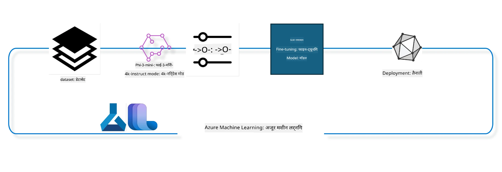

## Azure ML सिस्टम रजिस्ट्री से चैट-कम्पलीशन कम्पोनेंट्स का उपयोग करके मॉडल को फाइन-ट्यून कैसे करें

इस उदाहरण में, हम Phi-3-mini-4k-instruct मॉडल को ultrachat_200k डेटासेट का उपयोग करके दो लोगों के बीच संवाद पूरा करने के लिए फाइन ट्यून करेंगे।



यह उदाहरण आपको दिखाएगा कि Azure ML SDK और Python का उपयोग करके फाइन ट्यूनिंग कैसे की जाती है, और फिर फाइन-ट्यून किए गए मॉडल को रियल टाइम इंफ़ेरेंस के लिए एक ऑनलाइन एंडपॉइंट पर कैसे डिप्लॉय किया जाता है।

### प्रशिक्षण डेटा

हम ultrachat_200k डेटासेट का उपयोग करेंगे। यह UltraChat डेटासेट का एक व्यापक रूप से फिल्टर किया गया संस्करण है और इसका उपयोग Zephyr-7B-β, एक अत्याधुनिक 7b चैट मॉडल, को प्रशिक्षित करने के लिए किया गया था।

### मॉडल

हम Phi-3-mini-4k-instruct मॉडल का उपयोग покажाने के लिए करेंगे कि उपयोगकर्ता चैट-कम्पलीशन टास्क के लिए मॉडल को कैसे फाइनट्यून कर सकता है। यदि आपने यह नोटबुक किसी विशेष मॉडल कार्ड से खोला है, तो विशेष मॉडल नाम को बदलना याद रखें।

### कार्य

- फाइन ट्यून करने के लिए एक मॉडल चुनें।
- प्रशिक्षण डेटा चुनें और उसका अन्वेषण करें।
- फाइन ट्यूनिंग जॉब कॉन्फ़िगर करें।
- फाइन ट्यूनिंग जॉब चलाएं।
- प्रशिक्षण और मूल्यांकन मीट्रिक की समीक्षा करें।
- फाइन ट्यून किया गया मॉडल पंजीकृत करें।
- रियल टाइम इंफ़ेरेंस के लिए फाइन ट्यून किया गया मॉडल डिप्लॉय करें।
- संसाधनों को साफ करें।

## 1. पूर्व-आवश्यकताएं सेटअप करें

- निर्भरताएँ इंस्टॉल करें
- AzureML वर्कस्पेस से कनेक्ट करें। अधिक जानने के लिए SDK प्रमाणीकरण सेटअप देखें। नीचे <WORKSPACE_NAME>, <RESOURCE_GROUP> और <SUBSCRIPTION_ID> को बदलें।
- azureml सिस्टम रजिस्ट्री से कनेक्ट करें
- वैकल्पिक एक्सपेरिमेंट नाम सेट करें
- कंप्यूट जांचें या बनाएं।

> [!NOTE]
> आवश्यकताएँ: एक एकल GPU नोड में कई GPU कार्ड हो सकते हैं। उदाहरण के लिए, Standard_NC24rs_v3 के एक नोड में 4 NVIDIA V100 GPU होते हैं, जबकि Standard_NC12s_v3 में 2 NVIDIA V100 GPU होते हैं। इस जानकारी के लिए दस्तावेज़ देखें। प्रत्येक नोड के GPU कार्ड की संख्या नीचे gpus_per_node पैरामीटर में सेट की गई है। इसे सही से सेट करने से नोड के सभी GPU का उपयोग सुनिश्चित होता है। अनुशंसित GPU कंप्यूट SKUs यहां और यहां पाए जा सकते हैं।

### Python लाइब्रेरीज़

नीचे सेल चलाकर निर्भरताएँ इंस्टॉल करें। यह नया वातावरण चलाते समय वैकल्पिक चरण नहीं है।

```bash
pip install azure-ai-ml
pip install azure-identity
pip install datasets==2.9.0
pip install mlflow
pip install azureml-mlflow
```

### Azure ML के साथ इंटरैक्शन

1. यह Python स्क्रिप्ट Azure Machine Learning (Azure ML) सेवा के साथ इंटरैक्ट करने के लिए है। इसका विखंडन इस प्रकार है:

    - यह azure.ai.ml, azure.identity, और azure.ai.ml.entities पैकेजों से आवश्यक मॉड्यूल आयात करता है। साथ ही time मॉड्यूल भी आयात करता है।

    - यह DefaultAzureCredential() का उपयोग करके प्रमाणीकृत करने की कोशिश करता है, जो Azure क्लाउड में एप्लिकेशन तेजी से विकसित करने के लिए सरल प्रमाणीकरण अनुभव प्रदान करता है। यदि यह विफल होता है, तो यह InteractiveBrowserCredential() का उपयोग करता है, जो इंटरैक्टिव लॉगिन प्रॉम्प्ट प्रदान करता है।

    - फिर यह from_config विधि का उपयोग करके MLClient उदाहरण बनाने की कोशिश करता है, जो डिफ़ॉल्ट कॉन्फ़िग फाइल (config.json) से कॉन्फ़िगरेशन पढ़ता है। यदि यह विफल होता है, तो यह subscription_id, resource_group_name, और workspace_name मैन्युअली प्रदान करके MLClient बनाता है।

    - यह एक और MLClient उदाहरण बनाता है, इस बार Azure ML रजिस्ट्री "azureml" के लिए। यह रजिस्ट्री वह स्थान है जहां मॉडल, फाइन-ट्यूनिंग पाइपलाइंस, और एनवायरनमेंट संग्रहीत होते हैं।

    - यह experiment_name को "chat_completion_Phi-3-mini-4k-instruct" पर सेट करता है।

    - यह एक अद्वितीय टाइमस्टैम्प उत्पन्न करता है जो वर्तमान समय (एपोक के बाद सेकंड में, फ्लोटिंग पॉइंट संख्या के रूप में) को पूरे अंक में परिवर्तित करके और फिर स्ट्रिंग में बदलकर बनाया गया है। इसे विशिष्ट नामों और संस्करणों के निर्माण के लिए उपयोग किया जा सकता है।

    ```python
    # आवश्यक माड्यूल Azure ML और Azure Identity से इम्पोर्ट करें
    from azure.ai.ml import MLClient
    from azure.identity import (
        DefaultAzureCredential,
        InteractiveBrowserCredential,
    )
    from azure.ai.ml.entities import AmlCompute
    import time  # टाइम माड्यूल इम्पोर्ट करें
    
    # DefaultAzureCredential का उपयोग करके प्रमाणीकृत करने की कोशिश करें
    try:
        credential = DefaultAzureCredential()
        credential.get_token("https://management.azure.com/.default")
    except Exception as ex:  # अगर DefaultAzureCredential विफल हो जाए, तो InteractiveBrowserCredential का उपयोग करें
        credential = InteractiveBrowserCredential()
    
    # डिफ़ॉल्ट कॉन्फ़िग फ़ाइल का उपयोग करके MLClient उदाहरण बनाने की कोशिश करें
    try:
        workspace_ml_client = MLClient.from_config(credential=credential)
    except:  # यदि वह विफल हो जाए, तो विवरण मैन्युअल रूप से प्रदान करके MLClient उदाहरण बनाएं
        workspace_ml_client = MLClient(
            credential,
            subscription_id="<SUBSCRIPTION_ID>",
            resource_group_name="<RESOURCE_GROUP>",
            workspace_name="<WORKSPACE_NAME>",
        )
    
    # Azure ML रजिस्ट्री "azureml" के लिए एक और MLClient उदाहरण बनाएं
    # यह रजिस्ट्री वह जगह है जहाँ मॉडल, फाइन-ट्यूनिंग पाइपलाइंस, और वातावरण संग्रहित होते हैं
    registry_ml_client = MLClient(credential, registry_name="azureml")
    
    # प्रयोग का नाम सेट करें
    experiment_name = "chat_completion_Phi-3-mini-4k-instruct"
    
    # एक अद्वितीय टाइमस्टैम्प जनरेट करें जिसे नामों और संस्करणों के लिए उपयोग किया जा सके जो अद्वितीय होने चाहिए
    timestamp = str(int(time.time()))
    ```

## 2. फाउंडेशन मॉडल चुनकर फाइन ट्यून करें

1. Phi-3-mini-4k-instruct एक 3.8B पैरामीटर, हल्का, अत्याधुनिक खुला मॉडल है जो Phi-2 के लिए उपयोग किए गए डेटासेटों पर आधारित है। यह मॉडल Phi-3 मॉडल परिवार से है, और मिनी संस्करण दो प्रकारों में आता है: 4K और 128K, जो संदर्भ लंबाई (टोकनों में) का समर्थन करता है; हमें इसे अपने विशेष उद्देश्य के लिए फाइन ट्यून करना होगा। आप AzureML Studio के मॉडल कैटलॉग में चैट-कम्पलीशन टास्क द्वारा फ़िल्टर करके इन मॉडलों को ब्राउज़ कर सकते हैं। इस उदाहरण में, हम Phi-3-mini-4k-instruct मॉडल का उपयोग करते हैं। यदि आपने यह नोटबुक किसी अन्य मॉडल के लिए खोला है, तो मॉडल नाम और संस्करण के अनुसार बदलें।

> [!NOTE]
> मॉडल की id प्रॉपर्टी। इसे फाइन ट्यूनिंग जॉब को इनपुट के रूप में दिया जाएगा। यह AzureML Studio मॉडल कैटलॉग में मॉडल विवरण पृष्ठ पर 'Asset ID' फ़ील्ड के रूप में भी उपलब्ध है।

2. यह Python स्क्रिप्ट Azure Machine Learning (Azure ML) सेवा के साथ इंटरैक्ट कर रही है। इसका विखंडन इस प्रकार है:

    - यह model_name को "Phi-3-mini-4k-instruct" पर सेट करता है।

    - यह registry_ml_client ऑब्जेक्ट के models प्रॉपर्टी की get विधि का उपयोग करता है ताकि Azure ML रजिस्ट्री से निर्दिष्ट नाम के साथ मॉडल का नवीनतम संस्करण प्राप्त किया जा सके। get विधि को दो आर्गुमेंट्स के साथ बुलाया जाता है: मॉडल का नाम और एक लेबल जो बताता है कि नवीनतम संस्करण प्राप्त किया जाना चाहिए।

    - यह कंसोल पर एक संदेश प्रिंट करता है जो फाइन-ट्यूनिंग के लिए उपयोग किए जाने वाले मॉडल के नाम, संस्करण, और id को दिखाता है। स्ट्रिंग के format मेथड का उपयोग करके ये मान संदेश में डाले जाते हैं। नाम, संस्करण, और id को foundation_model ऑब्जेक्ट की प्रॉपर्टीज़ के रूप में एक्सेस किया जाता है।

    ```python
    # मॉडल नाम सेट करें
    model_name = "Phi-3-mini-4k-instruct"
    
    # Azure ML रजिस्ट्री से मॉडल का नवीनतम संस्करण प्राप्त करें
    foundation_model = registry_ml_client.models.get(model_name, label="latest")
    
    # मॉडल नाम, संस्करण, और आईडी प्रिंट करें
    # यह जानकारी ट्रैकिंग और डिबगिंग के लिए उपयोगी है
    print(
        "\n\nUsing model name: {0}, version: {1}, id: {2} for fine tuning".format(
            foundation_model.name, foundation_model.version, foundation_model.id
        )
    )
    ```

## 3. जॉब के लिए कंप्यूट बनाएँ

फाइनट्यून जॉब केवल GPU कंप्यूट के साथ काम करता है। कंप्यूट का आकार मॉडल के आकार पर निर्भर करता है और अधिकांश मामलों में सही कंप्यूट चुनना चुनौतीपूर्ण हो सकता है। इस सेल में, हम उपयोगकर्ता को सही कंप्यूट चुनने के लिए मार्गदर्शन करते हैं।

> [!NOTE]
> नीचे सूचीबद्ध कंप्यूट सबसे अनुकूलित कॉन्फ़िगरेशन के साथ काम करते हैं। कॉन्फ़िगरेशन में कोई बदलाव CUDA Out Of Memory त्रुटि का कारण बन सकता है। ऐसे मामलों में, कंप्यूट को बड़े आकार में अपग्रेड करने का प्रयास करें।

> [!NOTE]
> नीचे compute_cluster_size चुनते समय, सुनिश्चित करें कि कंप्यूट आपके संसाधन समूह में उपलब्ध है। यदि कोई विशिष्ट कंप्यूट उपलब्ध नहीं है, तो कंप्यूट संसाधन तक पहुँच प्राप्त करने का अनुरोध कर सकते हैं।

### फाइन ट्यूनिंग समर्थन के लिए मॉडल जांचना

1. यह Python स्क्रिप्ट Azure Machine Learning (Azure ML) मॉडल के साथ इंटरैक्ट कर रही है। इसका विखंडन इस प्रकार है:

    - यह ast मॉड्यूल आयात करता है, जो Python के अमूर्त सिंटैक्स ग्रामर के पेड़ को प्रोसेस करने के लिए फ़ंक्शंस प्रदान करता है।

    - यह जांचता है कि foundation_model ऑब्जेक्ट (जो Azure ML में एक मॉडल का प्रतिनिधित्व करता है) में finetune_compute_allow_list नामक टैग है या नहीं। Azure ML में टैग्स की-वैल्यू जोड़ियां होती हैं जिन्हें आप मॉडल्स को फ़िल्टर और सॉर्ट करने के लिए बना और उपयोग कर सकते हैं।

    - यदि finetune_compute_allow_list टैग मौजूद है, तो यह ast.literal_eval फ़ंक्शन का उपयोग करके उस टैग के मूल्य (एक स्ट्रिंग) को सुरक्षित रूप से Python सूची में पार्स करता है। इस सूची को computes_allow_list चर में असाइन किया जाता है। फिर यह एक संदेश प्रिंट करता है कि सूची से कंप्यूट बनाया जाना चाहिए।

    - यदि finetune_compute_allow_list टैग मौजूद नहीं है, तो यह computes_allow_list को None पर सेट करता है और एक संदेश प्रिंट करता है कि finetune_compute_allow_list टैग मॉडल के टैग्स का हिस्सा नहीं है।

    - सारांश में, यह स्क्रिप्ट मॉडल के मेटाडेटा में एक विशिष्ट टैग की जांच कर रही है, यदि मौजूद हो तो उसके मान को सूची में कन्वर्ट कर रही है, और उपयोगकर्ता को उचित प्रतिक्रिया प्रदान करती है।

    ```python
    # ast मॉड्यूल को आयात करें, जो पायथन अमूर्त वाक्य व्याकरण के वृक्षों को संसाधित करने के लिए कार्य प्रदान करता है
    import ast
    
    # जांचें कि मॉडल के टैग्स में 'finetune_compute_allow_list' टैग मौजूद है या नहीं
    if "finetune_compute_allow_list" in foundation_model.tags:
        # यदि टैग मौजूद है, तो ast.literal_eval का उपयोग करके टैग के मान (एक स्ट्रिंग) को सुरक्षित रूप से पायथन सूची में पार्स करें
        computes_allow_list = ast.literal_eval(
            foundation_model.tags["finetune_compute_allow_list"]
        )  # स्ट्रिंग को पायथन सूची में परिवर्तित करें
        # एक संदेश प्रिंट करें जो सूचित करता है कि सूची से एक कंप्यूट बनाया जाना चाहिए
        print(f"Please create a compute from the above list - {computes_allow_list}")
    else:
        # यदि टैग मौजूद नहीं है, तो computes_allow_list को None पर सेट करें
        computes_allow_list = None
        # एक संदेश प्रिंट करें जो यह बताता है कि 'finetune_compute_allow_list' टैग मॉडल के टैग्स का हिस्सा नहीं है
        print("`finetune_compute_allow_list` is not part of model tags")
    ```

### कंप्यूट इंसटेंस जांचना

1. यह Python स्क्रिप्ट Azure Machine Learning (Azure ML) सेवा के साथ इंटरैक्ट कर रहे कंप्यूट इंसटेंस पर कई जांचें कर रही है। इसका विखंडन इस प्रकार है:

    - यह Azure ML वर्कस्पेस से compute_cluster में संग्रहित नाम वाले कंप्यूट इंसटेंस को पुनः प्राप्त करने की कोशिश करता है। यदि कंप्यूट इंसटेंस का provisioning state "failed" है, तो यह ValueError उठाता है।

    - यह जांचता है कि यदि computes_allow_list None नहीं है। यदि ऐसा है, तो यह सूची में सभी कंप्यूट आकार को लोअर केस में कन्वर्ट करता है और जांचता है कि वर्तमान कंप्यूट इंसटेंस का आकार सूची में है या नहीं। अगर नहीं, तो यह ValueError उठाता है।

    - यदि computes_allow_list None है, तो यह जांचता है कि कंप्यूट इंसटेंस का आकार GPU VM साइज की एक असमर्थित सूची में है या नहीं। यदि हाँ, तो ValueError उठाता है।

    - यह वर्कस्पेस में सभी उपलब्ध कंप्यूटस के साइज की सूची प्राप्त करता है। फिर यह सूची पर इटरेट करता है, और प्रत्येक कंप्यूट साइज के लिए चेक करता है कि क्या उसका नाम वर्तमान कंप्यूट इंसटेंस के आकार से मेल खाता है। यदि हाँ, तो वह कंप्यूट साइज के GPU की संख्या प्राप्त करता है और gpu_count_found को True सेट करता है।

    - यदि gpu_count_found True है, तो यह कंप्यूट इंसटेंस में GPU की संख्या प्रिंट करता है। यदि नहीं, तो ValueError उठाता है।

    - सारांश में, यह स्क्रिप्ट Azure ML वर्कस्पेस के एक कंप्यूट इंसटेंस पर कई जांचें करती है, जिसमें provisioning state, allow list या deny list के खिलाफ उसका आकार, और उसमें उपलब्ध GPU की संख्या शामिल हैं।

    ```python
    # अपवाद संदेश प्रिंट करें
    print(e)
    # यदि कंप्यूट साइज़ कार्यक्षेत्र में उपलब्ध नहीं है तो ValueError उठाएं
    raise ValueError(
        f"WARNING! Compute size {compute_cluster_size} not available in workspace"
    )
    
    # Azure ML कार्यक्षेत्र से कंप्यूट इंस्टेंस प्राप्त करें
    compute = workspace_ml_client.compute.get(compute_cluster)
    # जांचें कि कंप्यूट इंस्टेंस की प्रावधान स्थिति "failed" है या नहीं
    if compute.provisioning_state.lower() == "failed":
        # यदि प्रावधान स्थिति "failed" है तो ValueError उठाएं
        raise ValueError(
            f"Provisioning failed, Compute '{compute_cluster}' is in failed state. "
            f"please try creating a different compute"
        )
    
    # जांचें कि computes_allow_list None नहीं है
    if computes_allow_list is not None:
        # computes_allow_list में सभी कंप्यूट साइज़ को लोअरकेस में कन्वर्ट करें
        computes_allow_list_lower_case = [x.lower() for x in computes_allow_list]
        # जांचें कि कंप्यूट इंस्टेंस का साइज़ computes_allow_list_lower_case में है या नहीं
        if compute.size.lower() not in computes_allow_list_lower_case:
            # यदि कंप्यूट इंस्टेंस का साइज़ computes_allow_list_lower_case में नहीं है तो ValueError उठाएं
            raise ValueError(
                f"VM size {compute.size} is not in the allow-listed computes for finetuning"
            )
    else:
        # असमर्थित GPU VM साइज़ की एक सूची परिभाषित करें
        unsupported_gpu_vm_list = [
            "standard_nc6",
            "standard_nc12",
            "standard_nc24",
            "standard_nc24r",
        ]
        # जांचें कि कंप्यूट इंस्टेंस का साइज़ unsupported_gpu_vm_list में है या नहीं
        if compute.size.lower() in unsupported_gpu_vm_list:
            # यदि कंप्यूट इंस्टेंस का साइज़ unsupported_gpu_vm_list में है तो ValueError उठाएं
            raise ValueError(
                f"VM size {compute.size} is currently not supported for finetuning"
            )
    
    # एक फ्लैग प्रारंभ करें ताकि पता चले कि कंप्यूट इंस्टेंस में GPU की संख्या मिली है या नहीं
    gpu_count_found = False
    # कार्यक्षेत्र में सभी उपलब्ध कंप्यूट साइज़ की एक सूची प्राप्त करें
    workspace_compute_sku_list = workspace_ml_client.compute.list_sizes()
    available_sku_sizes = []
    # उपलब्ध कंप्यूट साइज़ की सूची पर इटरेट करें
    for compute_sku in workspace_compute_sku_list:
        available_sku_sizes.append(compute_sku.name)
        # जांचें कि कंप्यूट साइज़ का नाम कंप्यूट इंस्टेंस के साइज़ से मेल खाता है या नहीं
        if compute_sku.name.lower() == compute.size.lower():
            # यदि मेल खाता है, तो उस कंप्यूट साइज़ के लिए GPU की संख्या प्राप्त करें और gpu_count_found को True सेट करें
            gpus_per_node = compute_sku.gpus
            gpu_count_found = True
    # यदि gpu_count_found True है, तो कंप्यूट इंस्टेंस में GPU की संख्या प्रिंट करें
    if gpu_count_found:
        print(f"Number of GPU's in compute {compute.size}: {gpus_per_node}")
    else:
        # यदि gpu_count_found False है, तो ValueError उठाएं
        raise ValueError(
            f"Number of GPU's in compute {compute.size} not found. Available skus are: {available_sku_sizes}."
            f"This should not happen. Please check the selected compute cluster: {compute_cluster} and try again."
        )
    ```

## 4. फाइन-ट्यूनिंग के लिए डेटासेट चुनें

1. हम ultrachat_200k डेटासेट का उपयोग करते हैं। इस डेटासेट के चार भाग हैं, जो सुपरवाइज्ड फाइन-ट्यूनिंग (sft) के लिए उपयुक्त हैं।
जनरेशन रैंकिन्ग (gen)। प्रत्येक स्प्लिट के उदाहरणों की संख्या नीचे दिखायी गई है:

    ```bash
    train_sft test_sft  train_gen  test_gen
    207865  23110  256032  28304
    ```

1. अगले कुछ सेलों में फाइन ट्यूनिंग के लिए मूलभूत डेटा तैयारी दिखाई गई है:

### कुछ डेटा पंक्तियों को विज़ुअलाइज़ करें

हम चाहते हैं कि यह सैम्पल तेजी से चले, इसलिए train_sft और test_sft फाइलों में 5% पहले से ही ट्रिम की गई पंक्तियाँ सेव करें। इसका मतलब है कि फाइन ट्यून किए गए मॉडल की सटीकता कम होगी, इसलिए इसे वास्तविक दुनिया में उपयोग नहीं करना चाहिए।
download-dataset.py का उपयोग ultrachat_200k डेटासेट को डाउनलोड करने और डेटासेट को फाइनट्यून पाइपलाइन कम्पोनेंट के उपभोग योग्य फ़ॉर्मेट में बदलने के लिए किया जाता है। चूंकि डेटासेट बड़ा है, इसलिए यहां केवल डेटासेट का एक हिस्सा है।

1. नीचे दिया गया स्क्रिप्ट केवल 5% डेटा डाउनलोड करता है। इसे dataset_split_pc पैरामीटर को इच्छित प्रतिशत में बदलकर बढ़ाया जा सकता है।

> [!NOTE]
> कुछ भाषा मॉडल में अलग-अलग भाषा कोड होते हैं, इसलिए डेटासेट में कॉलम नाम भी उसी के अनुसार होने चाहिए।

1. यहां बताया गया है कि डेटा कैसा दिखना चाहिए
चैट-कम्पलीशन डेटासेट पार्केट फॉर्मेट में संग्रहित है, जिसमें प्रत्येक एंट्री निम्नलिखित स्कीमा का उपयोग करती है:

    - यह एक JSON (JavaScript ऑब्जेक्ट नोटेशन) दस्तावेज़ है, जो डेटा के आदान-प्रदान के लिए लोकप्रिय फॉर्मेट है। यह निष्पादन योग्य कोड नहीं है, बल्कि डेटा संग्रहण और परिवहन का एक तरीका है। इसका विखंडन इस प्रकार है:

    - "prompt": यह कुंजी एक स्ट्रिंग मान रखती है जो एक टास्क या प्रश्न को AI सहायक के समक्ष प्रस्तुत करती है।

    - "messages": यह कुंजी ऑब्जेक्ट्स की एक सूची रखती है। प्रत्येक ऑब्जेक्ट एक बातचीत में एक संदेश का प्रतिनिधित्व करता है जो उपयोगकर्ता और AI सहायक के बीच होता है। प्रत्येक संदेश ऑब्जेक्ट के दो कुंजी होते हैं:

    - "content": यह कुंजी संदेश की सामग्री का स्ट्रिंग मान रखती है।
    - "role": यह कुंजी उस इकाई की भूमिका का स्ट्रिंग मान रखती है जिसने संदेश भेजा है। यह "user" या "assistant" हो सकता है।
    - "prompt_id": यह कुंजी उस प्रॉम्प्ट के लिए एक अद्वितीय पहचानकर्ता का स्ट्रिंग मान रखती है।

1. इस विशिष्ट JSON दस्तावेज़ में, एक संवाद दर्शाया गया है जिसमें एक उपयोगकर्ता AI सहायक से एक डिस्टोपियन कहानी के नायक को बनाने के लिए कहता है। सहायक जवाब देता है, और फिर उपयोगकर्ता और अधिक विवरण पूछता है। सहायक अधिक विवरण प्रदान करने को सहमत होता है। पूरी बातचीत एक विशिष्ट प्रॉम्प्ट आईडी से जुड़ी होती है।

    ```python
    {
        // The task or question posed to an AI assistant
        "prompt": "Create a fully-developed protagonist who is challenged to survive within a dystopian society under the rule of a tyrant. ...",
        
        // An array of objects, each representing a message in a conversation between a user and an AI assistant
        "messages":[
            {
                // The content of the user's message
                "content": "Create a fully-developed protagonist who is challenged to survive within a dystopian society under the rule of a tyrant. ...",
                // The role of the entity that sent the message
                "role": "user"
            },
            {
                // The content of the assistant's message
                "content": "Name: Ava\n\n Ava was just 16 years old when the world as she knew it came crashing down. The government had collapsed, leaving behind a chaotic and lawless society. ...",
                // The role of the entity that sent the message
                "role": "assistant"
            },
            {
                // The content of the user's message
                "content": "Wow, Ava's story is so intense and inspiring! Can you provide me with more details.  ...",
                // The role of the entity that sent the message
                "role": "user"
            }, 
            {
                // The content of the assistant's message
                "content": "Certainly! ....",
                // The role of the entity that sent the message
                "role": "assistant"
            }
        ],
        
        // A unique identifier for the prompt
        "prompt_id": "d938b65dfe31f05f80eb8572964c6673eddbd68eff3db6bd234d7f1e3b86c2af"
    }
    ```

### डेटा डाउनलोड करें

1. यह Python स्क्रिप्ट एक सहायक स्क्रिप्ट download-dataset.py का उपयोग करके डेटासेट डाउनलोड करने के लिए है। इसका विखंडन इस प्रकार है:

    - यह os मॉड्यूल आयात करता है, जो ऑपरेटिंग सिस्टम पर निर्भर कार्यप्रणाली का पोर्टेबल उपयोग प्रदान करता है।

    - यह os.system फ़ंक्शन का उपयोग करके download-dataset.py स्क्रिप्ट को शेल में कुछ कमांड-लाइन आर्गुमेंट्स के साथ चलाता है। आर्गुमेंट्स डेटासेट निर्दिष्ट करते हैं जिसे डाउनलोड करना है (HuggingFaceH4/ultrachat_200k), जहाँ इसे डाउनलोड करना है (ultrachat_200k_dataset), और डेटासेट को विभाजित करने का प्रतिशत (5)। os.system उस कमांड का एग्जिट स्टेटस रिटर्न करता है; इसे exit_status में संग्रहित किया जाता है।

    - यह जांच करता है कि exit_status 0 नहीं है। Unix जैसे ऑपरेटिंग सिस्टम में, 0 का अर्थ कमांड सफल होना है और किसी अन्य नंबर का अर्थ त्रुटि होता है। यदि exit_status 0 नहीं है, तो यह एक Exception उठाता है जिसमें कहा गया है कि डेटासेट डाउनलोड करने में त्रुटि हुई है।

    - सारांश में, यह स्क्रिप्ट सहायक स्क्रिप्ट का उपयोग करके डेटासेट डाउनलोड करने के लिए कमांड चलाता है, और यदि कमांड विफल होता है तो अपवाद उठाता है।

    ```python
    # os मॉड्यूल आयात करें, जो ऑपरेटिंग सिस्टम पर निर्भर कार्यक्षमता का उपयोग करने का तरीका प्रदान करता है
    import os
    
    # os.system फ़ंक्शन का उपयोग करके download-dataset.py स्क्रिप्ट को शेल में विशेष कमांड-लाइन तर्कों के साथ चलाएँ
    # तर्क निर्दिष्ट करते हैं कि कौन सा डेटासेट डाउनलोड करना है (HuggingFaceH4/ultrachat_200k), इसे कहाँ डाउनलोड करना है (ultrachat_200k_dataset), और डेटासेट का कितना प्रतिशत विभाजित करना है (5)
    # os.system फ़ंक्शन उस कमांड की निकासी स्थिति लौटाता है जो उसने निष्पादित की; यह स्थिति exit_status चर में संग्रहित की जाती है
    exit_status = os.system(
        "python ./download-dataset.py --dataset HuggingFaceH4/ultrachat_200k --download_dir ultrachat_200k_dataset --dataset_split_pc 5"
    )
    
    # जांचें कि exit_status 0 नहीं है
    # यूनिक्स जैसे ऑपरेटिंग सिस्टम में, 0 की निकासी स्थिति आमतौर पर संकेत करती है कि कमांड सफल रहा, जबकि कोई भी अन्य संख्या त्रुटि दर्शाती है
    # यदि exit_status 0 नहीं है, तो एक Exception उठाएँ जिसमें संदेश हो कि डेटासेट डाउनलोड करते समय त्रुटि हुई है
    if exit_status != 0:
        raise Exception("Error downloading dataset")
    ```

### डेटा को DataFrame में लोड करना
1. यह Python स्क्रिप्ट एक JSON Lines फ़ाइल को pandas DataFrame में लोड कर रही है और पहले 5 पंक्तियाँ दिखा रही है। यह इस प्रकार काम करती है:

    - यह pandas लाइब्रेरी आयात करती है, जो एक शक्तिशाली डेटा मैनिपुलेशन और विश्लेषण लाइब्रेरी है।

    - यह pandas के डिस्प्ले विकल्पों के लिए अधिकतम कॉलम चौड़ाई 0 पर सेट करता है। इसका मतलब है कि DataFrame प्रिंट करते समय प्रत्येक कॉलम का पूरा टेक्स्ट बिना कटाव के प्रदर्शित होगा।

    - यह pd.read_json फ़ंक्शन का उपयोग करके ultrachat_200k_dataset निर्देशिका से train_sft.jsonl फ़ाइल को DataFrame में लोड करता है। lines=True तर्क से पता चलता है कि फ़ाइल JSON Lines फॉर्मेट में है, जहां प्रत्येक पंक्ति एक अलग JSON ऑब्जेक्ट होती है।

    - यह head मेथड का उपयोग करके DataFrame की पहली 5 पंक्तियाँ दिखाता है। यदि DataFrame में 5 से कम पंक्तियाँ हैं, तो यह सभी पंक्तियाँ दिखाएगा।

    - संक्षेप में, यह स्क्रिप्ट JSON Lines फ़ाइल को DataFrame में लोड कर रही है और पहले 5 रॉज़ को पूरे कॉलम टेक्स्ट के साथ दिखा रही है।
    
    ```python
    # पांडा लाइब्रेरी को इम्पोर्ट करें, जो कि एक शक्तिशाली डेटा मैनिपुलेशन और विश्लेषण पुस्तकालय है
    import pandas as pd
    
    # पांडा की डिस्प्ले विकल्पों के लिए अधिकतम कॉलम चौड़ाई 0 सेट करें
    # इसका मतलब है कि जब डाटा फ्रेम प्रिंट किया जाएगा तो प्रत्येक कॉलम का पूरा टेक्स्ट बिना कटाव के प्रदर्शित होगा
    pd.set_option("display.max_colwidth", 0)
    
    # pd.read_json फ़ंक्शन का उपयोग करके ultrachat_200k_dataset डायरेक्टरी से train_sft.jsonl फ़ाइल को डाटा फ्रेम में लोड करें
    # lines=True तर्क यह दर्शाता है कि फ़ाइल JSON Lines फॉर्मेट में है, जहाँ प्रत्येक लाइन एक अलग JSON ऑब्जेक्ट होती है
    df = pd.read_json("./ultrachat_200k_dataset/train_sft.jsonl", lines=True)
    
    # head मेथड का उपयोग करके डाटा फ्रेम की पहली 5 पंक्तियाँ प्रदर्शित करें
    # यदि डाटा फ्रेम में 5 से कम पंक्तियाँ हैं, तो यह सभी को प्रदर्शित करेगा
    df.head()
    ```

## 5. मॉडल और डेटा को इनपुट के रूप में उपयोग करके फाइन ट्यूनिंग जॉब सबमिट करें

उस जॉब को बनाएं जो chat-completion पाइपलाइन कंपोनेंट का उपयोग करता है। फाइन ट्यूनिंग के लिए समर्थित सभी पैरामीटरों के बारे में और जानें।

### फाइनट्यून पैरामीटर परिभाषित करें

1. फाइनट्यून पैरामीटर दो श्रेणियों में विभाजित किये जा सकते हैं - प्रशिक्षण पैरामीटर, अनुकूलन पैरामीटर

1. प्रशिक्षण पैरामीटर प्रशिक्षण पहलुओं को परिभाषित करते हैं जैसे -

    - उपयोग करने वाला optimizer, scheduler
    - फाइनट्यून को ऑप्टिमाइज़ करने के लिए मेट्रिक
    - प्रशिक्षण चरणों की संख्या और बैच साइज आदि
    - अनुकूलन पैरामीटर GPU मेमोरी को ऑप्टिमाइज़ करने और कंप्यूट संसाधनों का प्रभावी उपयोग करने में मदद करते हैं। 

1. नीचे इस श्रेणी के कुछ पैरामीटर दिए गए हैं। अनुकूलन पैरामीटर प्रत्येक मॉडल के लिए अलग होते हैं और इन्हें मॉडल के साथ पैकेज किया गया है ताकि इन विविधताओं को संभाला जा सके।

    - deepspeed और LoRA सक्रिय करें
    - मिश्रित प्रिसीजन प्रशिक्षण सक्रिय करें
    - मल्टी-नोड प्रशिक्षण सक्रिय करें

> [!NOTE]
> सुपरवाइज्ड फाइनट्यूनिंग से alignment खोने या गंभीर भूलने (catastrophic forgetting) की समस्या हो सकती है। हम सुझाव देते हैं कि आप इस मुद्दे की जांच करें और फाइनट्यूनिंग के बाद एक alignment चरण चलाएं।

### फाइन ट्यूनिंग पैरामीटर

1. यह Python स्क्रिप्ट मशीन लर्निंग मॉडल के फाइन-ट्यूनिंग के लिए पैरामीटर सेट कर रही है। इसका काम है:

    - यह डिफ़ॉल्ट प्रशिक्षण पैरामीटर सेट करता है जैसे प्रशिक्षण epochs की संख्या, प्रशिक्षण और मूल्यांकन के लिए बैच साइज, लर्निंग रेट, और लर्निंग रेट scheduler का प्रकार।

    - यह डिफ़ॉल्ट अनुकूलन पैरामीटर सेट करता है जैसे कि Layer-wise Relevance Propagation (LoRa) और DeepSpeed लागू करना है या नहीं, और DeepSpeed स्टेज।

    - यह प्रशिक्षण और अनुकूलन पैरामीटरों को एक साथ finetune_parameters नामक एक डिक्शनरी में जोड़ता है।

    - यह जाँचता है कि foundation_model के पास कोई मॉडल-विशिष्ट डिफ़ॉल्ट पैरामीटर हैं या नहीं। यदि हैं, तो यह चेतावनी संदेश प्रिंट करता है और finetune_parameters डिक्शनरी को इन मॉडल-विशिष्ट डिफ़ॉल्ट के साथ अपडेट करता है। ast.literal_eval फ़ंक्शन इन स्ट्रिंग को Python डिक्शनरी में परिवर्तित करने के लिए उपयोग किया जाता है।

    - यह फाइन-ट्यूनिंग के लिए उपयोग किए जाने वाले अंतिम पैरामीटर सेट को प्रिंट करता है।

    - संक्षेप में, यह स्क्रिप्ट मशीन लर्निंग मॉडल के फाइन-ट्यूनिंग के लिए पैरामीटर सेट कर रही है और दिखा रही है, साथ ही डिफ़ॉल्ट पैरामीटरों को मॉडल-विशिष्ट पैरामीटरों से अधिलेखित करने की सुविधा देती है।

    ```python
    # डिफ़ॉल्ट प्रशिक्षण पैरामीटर सेट करें जैसे कि प्रशिक्षण युगों की संख्या, प्रशिक्षण और मूल्यांकन के लिए बैच आकार, सीखने की दर, और सीखने की दर नियामक प्रकार
    training_parameters = dict(
        num_train_epochs=3,
        per_device_train_batch_size=1,
        per_device_eval_batch_size=1,
        learning_rate=5e-6,
        lr_scheduler_type="cosine",
    )
    
    # डिफ़ॉल्ट अनुकूलन पैरामीटर सेट करें जैसे कि Layer-wise Relevance Propagation (LoRa) और DeepSpeed लागू करना है या नहीं, और DeepSpeed स्टेज
    optimization_parameters = dict(
        apply_lora="true",
        apply_deepspeed="true",
        deepspeed_stage=2,
    )
    
    # प्रशिक्षण और अनुकूलन पैरामीटर को finetune_parameters नामक एक ही शब्दकोश में संयोजित करें
    finetune_parameters = {**training_parameters, **optimization_parameters}
    
    # जांचें कि foundation_model के पास कोई मॉडल-विशिष्ट डिफ़ॉल्ट पैरामीटर हैं या नहीं
    # यदि हैं, तो एक चेतावनी संदेश प्रिंट करें और finetune_parameters शब्दकोश को इन मॉडल-विशिष्ट डिफ़ॉल्ट्स के साथ अपडेट करें
    # मॉडल-विशिष्ट डिफ़ॉल्ट्स को स्ट्रिंग से पायथन शब्दकोश में बदलने के लिए ast.literal_eval फ़ंक्शन का उपयोग किया जाता है
    if "model_specific_defaults" in foundation_model.tags:
        print("Warning! Model specific defaults exist. The defaults could be overridden.")
        finetune_parameters.update(
            ast.literal_eval(  # स्ट्रिंग को पायथन डिक्ट में बदलें
                foundation_model.tags["model_specific_defaults"]
            )
        )
    
    # उस अंतिम सेट के फाइन-ट्यूनिंग पैरामीटर को प्रिंट करें जो रन के लिए उपयोग किए जाएंगे
    print(
        f"The following finetune parameters are going to be set for the run: {finetune_parameters}"
    )
    ```

### प्रशिक्षण पाइपलाइन

1. यह Python स्क्रिप्ट एक फंक्शन परिभाषित कर रही है जो मशीन लर्निंग प्रशिक्षण पाइपलाइन के लिए डिस्प्ले नाम उत्पन्न करता है, और फिर इस फंक्शन को कॉल करके डिस्प्ले नाम उत्पन्न करता है और प्रिंट करता है। इसका काम है:

1. get_pipeline_display_name फ़ंक्शन परिभाषित किया गया है। यह फंक्शन प्रशिक्षण पाइपलाइन से संबंधित विभिन्न पैरामीटरों के आधार पर एक डिस्प्ले नाम बनाता है।

1. फंक्शन के अंदर, यह कुल बैच साइज की गणना करता है: प्रति डिवाइस बैच साइज, ग्रेडिएंट एक्यूमुलेशन स्टेप्स की संख्या, प्रति नोड GPU की संख्या, और फाइन-ट्यूनिंग के लिए उपयोग किए गए नोड्स की संख्या को गुणा करके।

1. यह अन्य पैरामीटर प्राप्त करता है जैसे लर्निंग रेट scheduler का प्रकार, क्या DeepSpeed लागू है, DeepSpeed स्टेज, क्या LoRa लागू है, मॉडल चेकपॉइंट्स की संख्या की सीमा, और अधिकतम अनुक्रम लंबाई।

1. यह एक स्ट्रिंग बनाता है जिसमें ये सभी पैरामीटर हाइफ़न से अलग किए होते हैं। यदि DeepSpeed या LoRa लागू है, तो स्ट्रिंग में क्रमशः "ds" और DeepSpeed स्टेज, या "lora" शामिल होती है। यदि नहीं, तो इसमें "nods" या "nolora" शामिल है।

1. यह फंक्शन इस स्ट्रिंग को लौटाता है, जो प्रशिक्षण पाइपलाइन के डिस्प्ले नाम के रूप में कार्य करता है।

1. फंक्शन को परिभाषित करने के बाद, इसे कॉल किया जाता है और उत्पन्न डिस्प्ले नाम को प्रिंट किया जाता है।

1. संक्षेप में, यह स्क्रिप्ट विभिन्न पैरामीटरों के आधार पर मशीन लर्निंग प्रशिक्षण पाइपलाइन के लिए डिस्प्ले नाम बनाती है और उसे प्रिंट करती है।

    ```python
    # प्रशिक्षण पाइपलाइन के लिए एक डिस्प्ले नाम जनरेट करने के लिए एक फ़ंक्शन परिभाषित करें
    def get_pipeline_display_name():
        # प्रति डिवाइस बैच साइज, ग्रेडिएंट एक्यूम्यूलेशन स्टेप्स की संख्या, प्रति नोड GPU की संख्या, और फाइन-ट्यूनिंग के लिए उपयोग किए गए नोड्स की संख्या को गुणा करके कुल बैच साइज की गणना करें
        batch_size = (
            int(finetune_parameters.get("per_device_train_batch_size", 1))
            * int(finetune_parameters.get("gradient_accumulation_steps", 1))
            * int(gpus_per_node)
            * int(finetune_parameters.get("num_nodes_finetune", 1))
        )
        # लर्निंग रेट शेड्यूलर प्रकार प्राप्त करें
        scheduler = finetune_parameters.get("lr_scheduler_type", "linear")
        # यह पता करें कि क्या DeepSpeed लागू किया गया है
        deepspeed = finetune_parameters.get("apply_deepspeed", "false")
        # DeepSpeed स्टेज प्राप्त करें
        ds_stage = finetune_parameters.get("deepspeed_stage", "2")
        # यदि DeepSpeed लागू है, तो डिस्प्ले नाम में "ds" के बाद DeepSpeed स्टेज शामिल करें; यदि नहीं, तो "nods" शामिल करें
        if deepspeed == "true":
            ds_string = f"ds{ds_stage}"
        else:
            ds_string = "nods"
        # यह पता करें कि Layer-wise Relevance Propagation (LoRa) लागू किया गया है या नहीं
        lora = finetune_parameters.get("apply_lora", "false")
        # यदि LoRa लागू है, तो डिस्प्ले नाम में "lora" शामिल करें; यदि नहीं, तो "nolora" शामिल करें
        if lora == "true":
            lora_string = "lora"
        else:
            lora_string = "nolora"
        # मॉडल चेकपॉइंट्स को रखने की संख्या की सीमा प्राप्त करें
        save_limit = finetune_parameters.get("save_total_limit", -1)
        # अधिकतम अनुक्रम लंबाई प्राप्त करें
        seq_len = finetune_parameters.get("max_seq_length", -1)
        # इन सभी पैरामीटरों को हाइफ़न से अलग करके जोड़कर डिस्प्ले नाम बनाएं
        return (
            model_name
            + "-"
            + "ultrachat"
            + "-"
            + f"bs{batch_size}"
            + "-"
            + f"{scheduler}"
            + "-"
            + ds_string
            + "-"
            + lora_string
            + f"-save_limit{save_limit}"
            + f"-seqlen{seq_len}"
        )
    
    # डिस्प्ले नाम जनरेट करने के लिए फ़ंक्शन कॉल करें
    pipeline_display_name = get_pipeline_display_name()
    # डिस्प्ले नाम प्रिंट करें
    print(f"Display name used for the run: {pipeline_display_name}")
    ```

### पाइपलाइन कॉन्फ़िगर करना

यह Python स्क्रिप्ट Azure Machine Learning SDK का उपयोग करके एक मशीन लर्निंग पाइपलाइन को परिभाषित और कॉन्फ़िगर कर रही है। इसका काम है:

1. यह Azure AI ML SDK से आवश्यक मॉड्यूल आयात करता है।

1. यह रजिस्ट्री से "chat_completion_pipeline" नामक पाइपलाइन कंपोनेंट प्राप्त करता है।

1. यह `@pipeline` डेकोरेटर और `create_pipeline` फ़ंक्शन का उपयोग करके एक पाइपलाइन जॉब परिभाषित करता है। पाइपलाइन का नाम `pipeline_display_name` सेट किया गया है।

1. `create_pipeline` फ़ंक्शन के अंदर, यह प्राप्त कंपोनेंट को विभिन्न पैरामीटरों के साथ इनिशियलाइज़ करता है, जिसमें मॉडल पथ, विभिन्न चरणों के लिए कंप्यूट क्लस्टर, प्रशिक्षण और परीक्षण के लिए डेटासेट स्प्लिट, फाइन-ट्यूनिंग के लिए GPU की संख्या, और अन्य फाइन-ट्यूनिंग पैरामीटर शामिल हैं।

1. यह फाइन-ट्यूनिंग जॉब के आउटपुट को पाइपलाइन जॉब के आउटपुट से मैप करता है ताकि फाइन-ट्यून किए गए मॉडल को आसानी से पंजीकृत किया जा सके, जो ऑनलाइन या बैच एंडपॉइंट पर मॉडल डिप्लॉयमेंट के लिए आवश्यक है।

1. यह `create_pipeline` फ़ंक्शन को कॉल करके पाइपलाइन का एक इंस्टेंस बनाता है।

1. यह पाइपलाइन की `force_rerun` सेटिंग को `True` पर सेट करता है, अर्थात् पिछली जॉब से कैश्ड परिणामों का उपयोग नहीं किया जाएगा।

1. यह पाइपलाइन की `continue_on_step_failure` सेटिंग को `False` पर सेट करता है, अर्थात् यदि कोई चरण विफल होता है तो पाइपलाइन बंद हो जाएगा।

1. संक्षेप में, यह स्क्रिप्ट Azure Machine Learning SDK का उपयोग करके चैट कम्प्लीशन टास्क के लिए एक मशीन लर्निंग पाइपलाइन को परिभाषित और कॉन्फ़िगर कर रही है।

    ```python
    # आवश्यक मॉड्यूल Azure AI ML SDK से आयात करें
    from azure.ai.ml.dsl import pipeline
    from azure.ai.ml import Input
    
    # रजिस्ट्री से "chat_completion_pipeline" नामक पाइपलाइन कंपोनेंट प्राप्त करें
    pipeline_component_func = registry_ml_client.components.get(
        name="chat_completion_pipeline", label="latest"
    )
    
    # @pipeline डेकोरेटर और create_pipeline फ़ंक्शन का उपयोग करके पाइपलाइन जॉब को परिभाषित करें
    # पाइपलाइन का नाम pipeline_display_name पर सेट किया गया है
    @pipeline(name=pipeline_display_name)
    def create_pipeline():
        # विभिन्न पैरामीटरों के साथ प्राप्त पाइपलाइन कंपोनेंट को प्रारंभ करें
        # इनमें मॉडल पथ, विभिन्न चरणों के लिए कंप्यूट क्लस्टर, प्रशिक्षण और परीक्षण के लिए डेटासेट विभाजन, फाइन-ट्यूनिंग के लिए GPU की संख्या, और अन्य फाइन-ट्यूनिंग पैरामीटर शामिल हैं
        chat_completion_pipeline = pipeline_component_func(
            mlflow_model_path=foundation_model.id,
            compute_model_import=compute_cluster,
            compute_preprocess=compute_cluster,
            compute_finetune=compute_cluster,
            compute_model_evaluation=compute_cluster,
            # डेटासेट विभाजन को पैरामीटरों से मानचित्रित करें
            train_file_path=Input(
                type="uri_file", path="./ultrachat_200k_dataset/train_sft.jsonl"
            ),
            test_file_path=Input(
                type="uri_file", path="./ultrachat_200k_dataset/test_sft.jsonl"
            ),
            # प्रशिक्षण सेटिंग्स
            number_of_gpu_to_use_finetuning=gpus_per_node,  # कंप्यूट में उपलब्ध GPU की संख्या पर सेट करें
            **finetune_parameters
        )
        return {
            # फाइन ट्यूनिंग जॉब के आउटपुट को पाइपलाइन जॉब के आउटपुट से मानचित्रित करें
            # इसे इसलिए किया गया ताकि हम फाइन ट्यून मॉडल को आसानी से पंजीकृत कर सकें
            # मॉडल को ऑनलाइन या बैच एंडपॉइंट पर तैनात करने के लिए मॉडल को पंजीकृत करना आवश्यक है
            "trained_model": chat_completion_pipeline.outputs.mlflow_model_folder
        }
    
    # create_pipeline फ़ंक्शन को कॉल करके पाइपलाइन का एक इंस्टेंस बनाएं
    pipeline_object = create_pipeline()
    
    # पिछले जॉब्स के कैश किए गए परिणामों का उपयोग न करें
    pipeline_object.settings.force_rerun = True
    
    # चरण विफलता पर जारी रखने को False पर सेट करें
    # इसका मतलब है कि यदि कोई भी चरण विफल होता है तो पाइपलाइन रुक जाएगी
    pipeline_object.settings.continue_on_step_failure = False
    ```

### जॉब सबमिट करें

1. यह Python स्क्रिप्ट Azure Machine Learning वर्कस्पेस को एक मशीन लर्निंग पाइपलाइन जॉब सबमिट कर रही है और फिर जॉब के पूरा होने का इंतजार कर रही है। इसका काम है:

    - यह workspace_ml_client के jobs ऑब्जेक्ट की create_or_update मेथड को कॉल करके पाइपलाइन जॉब सबमिट करता है। चलाने के लिए पाइपलाइन pipeline_object द्वारा निर्दिष्ट है, और जॉब के लिए प्रयोग experiment_name द्वारा।

    - फिर यह workspace_ml_client के jobs ऑब्जेक्ट की stream मेथड को कॉल करके पाइपलाइन जॉब के पूरा होने तक प्रतीक्षा करता है। प्रतीक्षा करने वाला जॉब pipeline_job के name एट्रिब्यूट द्वारा निर्दिष्ट है।

    - संक्षेप में, यह स्क्रिप्ट Azure Machine Learning वर्कस्पेस को एक मशीन लर्निंग पाइपलाइन जॉब सबमिट कर रही है और फिर जॉब के पूरा होने तक प्रतीक्षा कर रही है।

    ```python
    # पाइपलाइन जॉब को Azure मशीन लर्निंग वर्कस्पेस में सबमिट करें
    # चलाने के लिए पाइपलाइन pipeline_object द्वारा निर्दिष्ट है
    # जिस प्रयोग के अंतर्गत जॉब चलाया जाता है उसे experiment_name द्वारा निर्दिष्ट किया गया है
    pipeline_job = workspace_ml_client.jobs.create_or_update(
        pipeline_object, experiment_name=experiment_name
    )
    
    # पाइपलाइन जॉब के पूरा होने तक प्रतीक्षा करें
    # प्रतीक्षा करने वाला जॉब pipeline_job ऑब्जेक्ट के नाम attribute द्वारा निर्दिष्ट है
    workspace_ml_client.jobs.stream(pipeline_job.name)
    ```

## 6. फाइन-ट्यून किए गए मॉडल को वर्कस्पेस के साथ रजिस्टर करें

हम फाइन ट्यूनिंग जॉब के आउटपुट से मॉडल को रजिस्टर करेंगे। इससे फाइन ट्यून किए गए मॉडल और फाइन ट्यूनिंग जॉब के बीच lineage ट्रैक होगा। फाइन ट्यूनिंग जॉब, इसके अलावा, फाउंडेशन मॉडल, डेटा और प्रशिक्षण कोड के साथ lineage ट्रैक करता है।

### ML मॉडल रजिस्टर करना

1. यह Python स्क्रिप्ट मशीन लर्निंग मॉडल को रजिस्टर कर रही है जो Azure Machine Learning पाइपलाइन में प्रशिक्षित किया गया था। इसका काम है:

    - यह Azure AI ML SDK से आवश्यक मॉड्यूल आयात करता है।

    - यह जांचता है कि pipeline जॉब से trained_model आउटपुट उपलब्ध है या नहीं, workspace_ml_client के jobs ऑब्जेक्ट की get मेथड को कॉल करके और उसके outputs एट्रिब्यूट को एक्सेस करके।

    - यह pipeline जॉब के नाम और आउटपुट ("trained_model") के नाम के साथ एक पथ बनाता है।

    - यह फाइन-ट्यून किए गए मॉडल के लिए एक नाम परिभाषित करता है, जिसमें मूल मॉडल नाम के बाद "-ultrachat-200k" जुड़ा होता है और किसी भी स्लैश को हाइफ़न से बदल दिया जाता है।

    - यह मॉडल को रजिस्टर करने के लिए तैयार होता है, Model ऑब्जेक्ट बनाकर जिसमें मॉडल का पथ, मॉडल का प्रकार (MLflow मॉडल), मॉडल का नाम और संस्करण, और मॉडल का विवरण शामिल होता है।

    - यह workspace_ml_client के models ऑब्जेक्ट की create_or_update मेथड को कॉल करके मॉडल को रजिस्टर करता है।

    - यह रजिस्टर किए गए मॉडल को प्रिंट करता है।

1. संक्षेप में, यह स्क्रिप्ट Azure Machine Learning पाइपलाइन में प्रशिक्षित मशीन लर्निंग मॉडल को रजिस्टर कर रही है।
    
    ```python
    # Azure AI ML SDK से आवश्यक मॉड्यूल आयात करें
    from azure.ai.ml.entities import Model
    from azure.ai.ml.constants import AssetTypes
    
    # जांचें कि पाइपलाइन जॉब से `trained_model` आउटपुट उपलब्ध है या नहीं
    print("pipeline job outputs: ", workspace_ml_client.jobs.get(pipeline_job.name).outputs)
    
    # पाइपलाइन जॉब के नाम और आउटपुट ("trained_model") के नाम के साथ एक स्ट्रिंग फॉर्मेट करके प्रशिक्षित मॉडल के लिए पाथ बनाएं
    model_path_from_job = "azureml://jobs/{0}/outputs/{1}".format(
        pipeline_job.name, "trained_model"
    )
    
    # मूल मॉडल नाम में "-ultrachat-200k" जोड़कर और स्लैश को हाइफ़न से बदलकर फाइन-ट्यून किए गए मॉडल के लिए एक नाम परिभाषित करें
    finetuned_model_name = model_name + "-ultrachat-200k"
    finetuned_model_name = finetuned_model_name.replace("/", "-")
    
    print("path to register model: ", model_path_from_job)
    
    # विभिन्न पैरामीटर के साथ एक Model ऑब्जेक्ट बनाकर मॉडल को रजिस्टर करने के लिए तैयार करें
    # इनमें मॉडल का पाथ, मॉडल का प्रकार (MLflow मॉडल), मॉडल का नाम और संस्करण, और मॉडल का विवरण शामिल हैं
    prepare_to_register_model = Model(
        path=model_path_from_job,
        type=AssetTypes.MLFLOW_MODEL,
        name=finetuned_model_name,
        version=timestamp,  # संस्करण टकराव से बचने के लिए संस्करण के रूप में टाइमस्टैम्प का उपयोग करें
        description=model_name + " fine tuned model for ultrachat 200k chat-completion",
    )
    
    print("prepare to register model: \n", prepare_to_register_model)
    
    # Model ऑब्जेक्ट को आर्गुमेंट के रूप में देकर workspace_ml_client में models ऑब्जेक्ट के create_or_update मेथड को कॉल करके मॉडल रजिस्टर करें
    registered_model = workspace_ml_client.models.create_or_update(
        prepare_to_register_model
    )
    
    # रजिस्टर्ड मॉडल को प्रिंट करें
    print("registered model: \n", registered_model)
    ```

## 7. फाइन ट्यून किए गए मॉडल को ऑनलाइन एंडपॉइंट पर डिप्लॉय करें

ऑनलाइन एंडपॉइंट एक स्थायी REST API प्रदान करते हैं जिसका उपयोग उन एप्लिकेशन के साथ इंटीग्रेट करने के लिए किया जा सकता है जिन्हें मॉडल की आवश्यकता होती है।

### एंडपॉइंट प्रबंधित करें

1. यह Python स्क्रिप्ट Azure Machine Learning में एक रजिस्टर किए गए मॉडल के लिए एक प्रबंधित ऑनलाइन एंडपॉइंट बना रही है। इसका काम है:

    - यह Azure AI ML SDK से आवश्यक मॉड्यूल आयात करता है।

    - यह "ultrachat-completion-" स्ट्रिंग के बाद एक टाइमस्टैम्प जोड़कर ऑनलाइन एंडपॉइंट के लिए एक अद्वितीय नाम परिभाषित करता है।

    - यह ऑनलाइन एंडपॉइंट बनाने के लिए ManagedOnlineEndpoint ऑब्जेक्ट बनाता है, जिसमें एंडपॉइंट का नाम, विवरण, और प्रमाणन मोड ("key") शामिल हैं।

    - यह workspace_ml_client की begin_create_or_update मेथड को कॉल करके एंडपॉइंट बनाता है और फिर wait मेथड से निर्माण प्रक्रिया समाप्त होने तक इंतजार करता है।

1. संक्षेप में, यह स्क्रिप्ट Azure Machine Learning में एक रजिस्टर किए गए मॉडल के लिए प्रबंधित ऑनलाइन एंडपॉइंट बना रही है।

    ```python
    # Azure AI ML SDK से आवश्यक मॉड्यूल आयात करें
    from azure.ai.ml.entities import (
        ManagedOnlineEndpoint,
        ManagedOnlineDeployment,
        ProbeSettings,
        OnlineRequestSettings,
    )
    
    # "ultrachat-completion-" स्ट्रिंग के साथ टाइमस्टाम्प जोड़कर ऑनलाइन एंडपॉइंट के लिए एक अद्वितीय नाम परिभाषित करें
    online_endpoint_name = "ultrachat-completion-" + timestamp
    
    # विभिन्न पैरामीटर के साथ ManagedOnlineEndpoint ऑब्जेक्ट बनाकर ऑनलाइन एंडपॉइंट बनाने की तैयारी करें
    # इनमें एंडपॉइंट का नाम, एंडपॉइंट का विवरण, और प्रमाणीकरण मोड ("key") शामिल हैं
    endpoint = ManagedOnlineEndpoint(
        name=online_endpoint_name,
        description="Online endpoint for "
        + registered_model.name
        + ", fine tuned model for ultrachat-200k-chat-completion",
        auth_mode="key",
    )
    
    # ManagedOnlineEndpoint ऑब्जेक्ट को तर्क के रूप में workspace_ml_client के begin_create_or_update मेथड को कॉल करके ऑनलाइन एंडपॉइंट बनाएं
    # फिर wait मेथड को कॉल करके निर्माण प्रक्रिया पूरी होने तक प्रतीक्षा करें
    workspace_ml_client.begin_create_or_update(endpoint).wait()
    ```

> [!NOTE]
> आप यहाँ डिप्लॉयमेंट के लिए समर्थित SKU की सूची देख सकते हैं - [Managed online endpoints SKU list](https://learn.microsoft.com/azure/machine-learning/reference-managed-online-endpoints-vm-sku-list)

### ML मॉडल डिप्लॉय करना

1. यह Python स्क्रिप्ट Azure Machine Learning में एक प्रबंधित ऑनलाइन एंडपॉइंट पर एक रजिस्टर किए गए मशीन लर्निंग मॉडल को डिप्लॉय कर रही है। इसका काम है:

    - यह ast मॉड्यूल आयात करता है, जो Python के अमूर्त व्याकरण के पेड़ को संसाधित करने के लिए कार्य प्रदान करता है।

    - यह डिप्लॉयमेंट के लिए instance type को "Standard_NC6s_v3" पर सेट करता है।

    - यह जांचता है कि foundation मॉडल में inference_compute_allow_list टैग मौजूद है या नहीं। यदि मौजूद है, तो यह टैग के मान को स्ट्रिंग से Python सूची में परिवर्तित करता है और उसे inference_computes_allow_list में असाइन करता है। यदि नहीं, तो इसे None सेट करता है।

    - यह जांचता है कि निर्दिष्ट instance type अनुमति सूची में है या नहीं। यदि नहीं है, तो यह उपयोगकर्ता को अनुमति सूची से कोई instance type चुनने का संदेश प्रिंट करता है।

    - यह डिप्लॉयमेंट बनाने के लिए ManagedOnlineDeployment ऑब्जेक्ट बनाता है, जिसमें डिप्लॉयमेंट का नाम, एंडपॉइंट नाम, मॉडल ID, instance type और गिनती, लिवनेस प्रूब सेटिंग्स, और रिक्वेस्ट सेटिंग्स शामिल हैं।

    - यह workspace_ml_client की begin_create_or_update मेथड को कॉल करके डिप्लॉयमेंट बनाता है और फिर wait मेथड से निर्माण पूरी होने तक इंतजार करता है।

    - यह एंडपॉइंट के ट्रैफिक को इस प्रकार सेट करता है कि 100% ट्रैफिक "demo" डिप्लॉयमेंट को जाता है।

    - यह workspace_ml_client की begin_create_or_update मेथड को कॉल करके एंडपॉइंट अपडेट करता है और फिर result मेथड से अपडेट पूरी होने तक इंतजार करता है।

1. संक्षेप में, यह स्क्रिप्ट Azure Machine Learning में एक रजिस्टर किए गए मशीन लर्निंग मॉडल को प्रबंधित ऑनलाइन एंडपॉइंट पर डिप्लॉय कर रही है।

    ```python
    # ast मॉड्यूल आयात करें, जो Python के अमूर्त वाक्य रचना व्याकरण के पेड़ों को संसाधित करने के लिए फ़ंक्शन प्रदान करता है
    import ast
    
    # तैनाती के लिए उदाहरण प्रकार सेट करें
    instance_type = "Standard_NC6s_v3"
    
    # जांचें कि फाउंडेशन मॉडल में `inference_compute_allow_list` टैग मौजूद है या नहीं
    if "inference_compute_allow_list" in foundation_model.tags:
        # यदि है, तो टैग मान को स्ट्रिंग से Python सूची में परिवर्तित करें और उसे `inference_computes_allow_list` को असाइन करें
        inference_computes_allow_list = ast.literal_eval(
            foundation_model.tags["inference_compute_allow_list"]
        )
        print(f"Please create a compute from the above list - {computes_allow_list}")
    else:
        # यदि नहीं है, तो `inference_computes_allow_list` को `None` पर सेट करें
        inference_computes_allow_list = None
        print("`inference_compute_allow_list` is not part of model tags")
    
    # जांचें कि निर्दिष्ट उदाहरण प्रकार अनुमति सूची में है या नहीं
    if (
        inference_computes_allow_list is not None
        and instance_type not in inference_computes_allow_list
    ):
        print(
            f"`instance_type` is not in the allow listed compute. Please select a value from {inference_computes_allow_list}"
        )
    
    # विभिन्न पैरामीटरों के साथ `ManagedOnlineDeployment` वस्तु बनाकर तैनाती बनाने के लिए तैयारी करें
    demo_deployment = ManagedOnlineDeployment(
        name="demo",
        endpoint_name=online_endpoint_name,
        model=registered_model.id,
        instance_type=instance_type,
        instance_count=1,
        liveness_probe=ProbeSettings(initial_delay=600),
        request_settings=OnlineRequestSettings(request_timeout_ms=90000),
    )
    
    # `ManagedOnlineDeployment` वस्तु को तर्क के रूप में देते हुए `workspace_ml_client` के `begin_create_or_update` मेथड को कॉल करके तैनाती बनाएं
    # फिर `wait` मेथड को कॉल करके निर्माण संचालन के पूरा होने का इंतजार करें
    workspace_ml_client.online_deployments.begin_create_or_update(demo_deployment).wait()
    
    # एंडपॉइंट का ट्रैफिक सेट करें ताकि 100% ट्रैफिक "demo" तैनाती को जाए
    endpoint.traffic = {"demo": 100}
    
    # `endpoint` वस्तु को तर्क के रूप में देते हुए `workspace_ml_client` के `begin_create_or_update` मेथड को कॉल करके एंडपॉइंट अपडेट करें
    # फिर `result` मेथड को कॉल करके अपडेट संचालन के पूरा होने का इंतजार करें
    workspace_ml_client.begin_create_or_update(endpoint).result()
    ```

## 8. नमूना डेटा के साथ एंडपॉइंट का परीक्षण करें

हम परीक्षण डेटासेट से कुछ नमूना डेटा प्राप्त करेंगे और इंफरेंस के लिए ऑनलाइन एंडपॉइंट को सबमिट करेंगे। फिर हम स्कोर किए गए लेबल को वास्तविक लेबल के साथ प्रदर्शित करेंगे।

### परिणाम पढ़ना

1. यह Python स्क्रिप्ट JSON Lines फ़ाइल को pandas DataFrame में पढ़ रही है, एक यादृच्छिक नमूना ले रही है, और इंडेक्स रीसेट कर रही है। इसका काम है:

    - यह ./ultrachat_200k_dataset/test_gen.jsonl फ़ाइल को pandas DataFrame में पढ़ती है। read_json फ़ंक्शन lines=True तर्क के साथ उपयोग किया गया है क्योंकि फ़ाइल JSON Lines फॉर्मेट में है, जहाँ हर पंक्ति अलग JSON ऑब्जेक्ट है।

    - यह DataFrame में से 1 पंक्ति का यादृच्छिक नमूना लेती है। sample फ़ंक्शन n=1 तर्क के साथ उपयोग किया गया है।

    - यह DataFrame का इंडेक्स रीसेट करती है। reset_index फ़ंक्शन drop=True के साथ उपयोग किया गया है ताकि मूल इंडेक्स हटाया जा सके और नया डिफ़ॉल्ट पूर्णांक इंडेक्स लगाया जा सके।

    - यह head फ़ंक्शन का उपयोग करके पहले 2 पंक्तियाँ देखाती है। लेकिन चूंकि सैंपलिंग के बाद केवल एक पंक्ति है, इसलिए यह केवल एक पंक्ति दिखाएगा।

1. संक्षेप में, यह स्क्रिप्ट JSON Lines फ़ाइल को pandas DataFrame में पढ़ रही है, 1 पंक्ति का यादृच्छिक नमूना ले रही है, इंडेक्स रीसेट कर रही है, और पहली पंक्ति दिखा रही है।
    
    ```python
    # pandas लाइब्रेरी आयात करें
    import pandas as pd
    
    # JSON Lines फ़ाइल './ultrachat_200k_dataset/test_gen.jsonl' को pandas DataFrame में पढ़ें
    # 'lines=True' तर्क यह संकेत देता है कि फ़ाइल JSON Lines प्रारूप में है, जहां प्रत्येक पंक्ति एक अलग JSON ऑब्जेक्ट है
    test_df = pd.read_json("./ultrachat_200k_dataset/test_gen.jsonl", lines=True)
    
    # DataFrame से एक यादृच्छिक नमूना 1 पंक्ति लें
    # 'n=1' तर्क चयन करने के लिए यादृच्छिक पंक्तियों की संख्या निर्दिष्ट करता है
    test_df = test_df.sample(n=1)
    
    # DataFrame का इंडेक्स रीसेट करें
    # 'drop=True' तर्क यह सूचित करता है कि मूल इंडेक्स को हटा दिया जाना चाहिए और डिफ़ॉल्ट पूर्णांक मानों के नए इंडेक्स के साथ बदल दिया जाना चाहिए
    # 'inplace=True' तर्क यह सूचित करता है कि DataFrame को उसी जगह संशोधित किया जाना चाहिए (नई वस्तु बनाए बिना)
    test_df.reset_index(drop=True, inplace=True)
    
    # DataFrame की पहली 2 पंक्तियों को दिखाएं
    # हालांकि, चूंकि नमूना लेने के बाद DataFrame में केवल एक पंक्ति होती है, यह केवल वही एक पंक्ति दिखाएगा
    test_df.head(2)
    ```

### JSON ऑब्जेक्ट बनाएं
1. यह Python स्क्रिप्ट एक JSON ऑब्जेक्ट बना रही है जिसमें विशिष्ट पैरामीटर हैं और इसे एक फ़ाइल में सहेज रही है। यह कुछ इस प्रकार काम करता है:

    - यह json मॉड्यूल को आयात करता है, जो JSON डेटा के साथ काम करने के लिए फ़ंक्शन प्रदान करता है।

    - यह एक डिक्शनरी parameters बनाता है जिसमें कुंजी और मान होते हैं जो मशीन लर्निंग मॉडल के पैरामीटर का प्रतिनिधित्व करते हैं। कुंजी "temperature", "top_p", "do_sample", और "max_new_tokens" हैं, और इनके संबंधित मान क्रमशः 0.6, 0.9, True, और 200 हैं।

    - यह एक और डिक्शनरी test_json बनाता है जिसमें दो कुंजी हैं: "input_data" और "params"। "input_data" का मान एक और डिक्शनरी है जिसमें कुंजी "input_string" और "parameters" हैं। "input_string" का मान एक सूची है जिसमें test_df डेटा फ्रेम का पहला संदेश शामिल है। "parameters" का मान पहले बनाई गई parameters डिक्शनरी है। "params" का मान एक खाली डिक्शनरी है।

    - यह sample_score.json नामक फाइल खोलता है

    ```python
    # json मॉड्यूल को आयात करें, जो JSON डेटा के साथ काम करने के लिए फ़ंक्शन प्रदान करता है
    import json
    
    # एक शब्दकोश `parameters` बनाएँ जिसमें मशीन लर्निंग मॉडल के पैरामीटर के लिए कुंजी और मान होते हैं
    # कुंजी "temperature", "top_p", "do_sample", और "max_new_tokens" हैं, और उनके संबंधित मान क्रमशः 0.6, 0.9, True, और 200 हैं
    parameters = {
        "temperature": 0.6,
        "top_p": 0.9,
        "do_sample": True,
        "max_new_tokens": 200,
    }
    
    # एक अन्य शब्दकोश `test_json` बनाएँ जिसमें दो कुंजी हों: "input_data" और "params"
    # "input_data" का मान एक अन्य शब्दकोश है जिसमें कुंजी "input_string" और "parameters" हैं
    # "input_string" का मान एक सूची है जिसमें `test_df` DataFrame का पहला संदेश शामिल है
    # "parameters" का मान उस पहले बनाए गए `parameters` शब्दकोश का है
    # "params" का मान एक खाली शब्दकोश है
    test_json = {
        "input_data": {
            "input_string": [test_df["messages"][0]],
            "parameters": parameters,
        },
        "params": {},
    }
    
    # `./ultrachat_200k_dataset` निर्देशिका में `sample_score.json` नामक फ़ाइल को लिखने के मोड में खोला जाए
    with open("./ultrachat_200k_dataset/sample_score.json", "w") as f:
        # `json.dump` फ़ंक्शन का उपयोग करके `test_json` शब्दकोश को JSON प्रारूप में फ़ाइल में लिखा जाए
        json.dump(test_json, f)
    ```

### एंडपॉइंट कॉल करना

1. यह Python स्क्रिप्ट Azure मशीन लर्निंग में एक ऑनलाइन एंडपॉइंट को JSON फ़ाइल स्कोर करने के लिए कॉल कर रही है। यह कुछ इस तरह काम करता है:

    - यह workspace_ml_client ऑब्जेक्ट की online_endpoints प्रॉपर्टी की invoke मेथड को कॉल करता है। यह मेथड ऑनलाइन एंडपॉइंट को अनुरोध भेजने और प्रतिक्रिया प्राप्त करने के लिए इस्तेमाल होता है।

    - यह endpoint_name और deployment_name तर्कों के साथ एंडपॉइंट और तैनाती के नाम निर्दिष्ट करता है। इस मामले में, एंडपॉइंट का नाम online_endpoint_name वेरिएबल में संग्रहित है और तैनाती का नाम "demo" है।

    - यह request_file तर्क के साथ स्कोर की जाने वाली JSON फ़ाइल का पथ निर्दिष्ट करता है। इस मामले में, फ़ाइल ./ultrachat_200k_dataset/sample_score.json है।

    - यह उत्तर को response वेरिएबल में संग्रहित करता है।

    - यह raw response को प्रिंट करता है।

1. संक्षेप में, यह स्क्रिप्ट Azure मशीन लर्निंग में एक ऑनलाइन एंडपॉइंट को JSON फ़ाइल स्कोर करने के लिए कॉल कर रही है और प्रतिक्रिया प्रिंट कर रही है।

    ```python
    # Azure Machine Learning में ऑनलाइन एंडपॉइंट को कॉल करके `sample_score.json` फाइल को स्कोर करें
    # `workspace_ml_client` ऑब्जेक्ट के `online_endpoints` प्रॉपर्टी की `invoke` मेथड का उपयोग ऑनलाइन एंडपॉइंट को रिक्वेस्ट भेजने और प्रतिक्रिया प्राप्त करने के लिए किया जाता है
    # `endpoint_name` तर्क एंडपॉइंट के नाम को निर्दिष्ट करता है, जो `online_endpoint_name` वेरिएबल में संग्रहीत है
    # `deployment_name` तर्क डिप्लॉयमेंट का नाम निर्दिष्ट करता है, जो "demo" है
    # `request_file` तर्क JSON फाइल के पाथ को निर्दिष्ट करता है जिसे स्कोर करना है, जो `./ultrachat_200k_dataset/sample_score.json` है
    response = workspace_ml_client.online_endpoints.invoke(
        endpoint_name=online_endpoint_name,
        deployment_name="demo",
        request_file="./ultrachat_200k_dataset/sample_score.json",
    )
    
    # एंडपॉइंट से प्राप्त कच्ची प्रतिक्रिया को प्रिंट करें
    print("raw response: \n", response, "\n")
    ```

## 9. ऑनलाइन एंडपॉइंट हटाएँ

1. ऑनलाइन एंडपॉइंट को हटाना न भूलें, वरना आप एंडपॉइंट द्वारा उपयोग किए गए कंप्यूट के लिए बिलिंग मीटर को चालू छोड़ देंगे। यह Python कोड Azure मशीन लर्निंग में एक ऑनलाइन एंडपॉइंट को हटा रहा है। यह कुछ इस प्रकार करता है:

    - यह workspace_ml_client ऑब्जेक्ट की online_endpoints प्रॉपर्टी की begin_delete मेथड को कॉल करता है। यह मेथड ऑनलाइन एंडपॉइंट को हटाने की प्रक्रिया शुरू करने के लिए उपयोग होती है।

    - यह name तर्क के साथ हटाए जाने वाले एंडपॉइंट का नाम निर्दिष्ट करता है। इस मामले में, एंडपॉइंट का नाम online_endpoint_name वेरिएबल में संग्रहित है।

    - यह wait मेथड को कॉल करता है ताकि हटाने की प्रक्रिया पूरी होने तक प्रतीक्षा की जा सके। यह एक ब्लॉकिंग ऑपरेशन है, जिसका अर्थ है कि यह स्क्रिप्ट को तब तक आगे बढ़ने से रोकेगा जब तक हटाना पूरा न हो जाए।

    - संक्षेप में, यह कोड Azure मशीन लर्निंग में एक ऑनलाइन एंडपॉइंट को हटाने की प्रक्रिया शुरू कर रहा है और प्रक्रिया पूरी होने तक प्रतीक्षा कर रहा है।

    ```python
    # Azure मशीन लर्निंग में ऑनलाइन एंडपॉइंट को हटाएं
    # `workspace_ml_client` ऑब्जेक्ट की `online_endpoints` प्रॉपर्टी का `begin_delete` मेथड ऑनलाइन एंडपॉइंट को हटाने की प्रक्रिया शुरू करने के लिए उपयोग किया जाता है
    # `name` आर्गुमेंट उस एंडपॉइंट के नाम को निर्दिष्ट करता है जिसे हटाया जाना है, जो `online_endpoint_name` वेरिएबल में संग्रहीत है
    # हटाने के ऑपरेशन के पूरा होने तक प्रतीक्षा करने के लिए `wait` मेथड को कॉल किया जाता है। यह एक ब्लॉकिंग ऑपरेशन है, जिसका मतलब है कि हटाने के समाप्त होने तक स्क्रिप्ट आगे नहीं बढ़ेगी
    workspace_ml_client.online_endpoints.begin_delete(name=online_endpoint_name).wait()
    ```

---

<!-- CO-OP TRANSLATOR DISCLAIMER START -->
**अस्वीकरण**:  
इस दस्तावेज़ का अनुवाद AI अनुवाद सेवा [Co-op Translator](https://github.com/Azure/co-op-translator) का उपयोग करके किया गया है। यद्यपि हम सटीकता के लिए प्रयास करते हैं, कृपया ध्यान दें कि स्वचालित अनुवाद में त्रुटियाँ या असंगतियाँ हो सकती हैं। मूल दस्तावेज़ अपनी मातृभाषा में ही अधिकारिक स्रोत माना जाना चाहिए। महत्वपूर्ण सूचनाओं के लिए, पेशेवर मानव अनुवाद की सिफारिश की जाती है। इस अनुवाद के उपयोग से उत्पन्न किसी भी गलतफहमी या गलत व्याख्या के लिए हम जिम्मेदार नहीं हैं।
<!-- CO-OP TRANSLATOR DISCLAIMER END -->