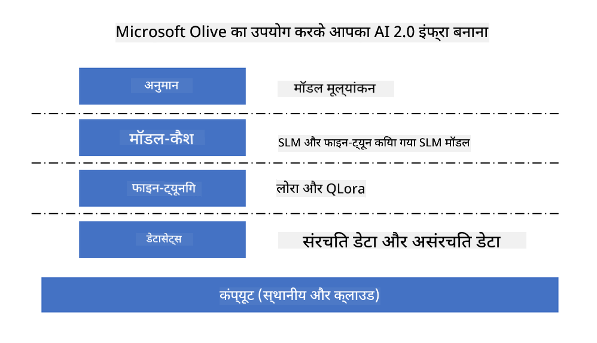
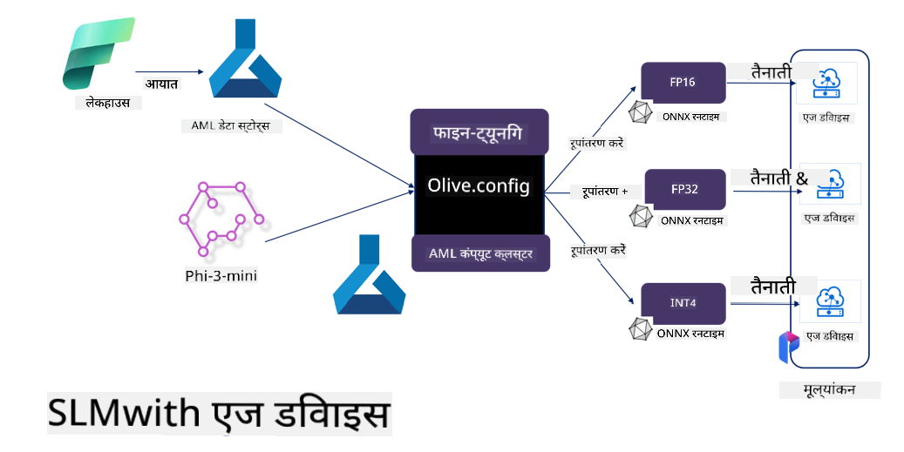

<!--
CO_OP_TRANSLATOR_METADATA:
{
  "original_hash": "5764be88ad2eb4f341e742eb8f14fab1",
  "translation_date": "2025-05-08T05:05:09+00:00",
  "source_file": "md/03.FineTuning/FineTuning_MicrosoftOlive.md",
  "language_code": "hi"
}
-->
# **Microsoft Olive के साथ Phi-3 का फाइन-ट्यूनिंग**

[Olive](https://github.com/microsoft/OLive?WT.mc_id=aiml-138114-kinfeylo) एक उपयोग में आसान हार्डवेयर-अवेयर मॉडल ऑप्टिमाइजेशन टूल है जो मॉडल कंप्रेशन, ऑप्टिमाइजेशन, और कंपाइलेशन के क्षेत्र में उद्योग के अग्रणी तकनीकों को एक साथ लाता है।

यह मशीन लर्निंग मॉडल को ऑप्टिमाइज़ करने की प्रक्रिया को सरल बनाने के लिए डिज़ाइन किया गया है, ताकि वे विशिष्ट हार्डवेयर आर्किटेक्चर का अधिकतम कुशल उपयोग कर सकें।

चाहे आप क्लाउड-आधारित एप्लिकेशन पर काम कर रहे हों या एज डिवाइसेस पर, Olive आपको अपने मॉडल को बिना किसी परेशानी के प्रभावी रूप से ऑप्टिमाइज़ करने में मदद करता है।

## मुख्य विशेषताएं:
- Olive इच्छित हार्डवेयर लक्ष्यों के लिए ऑप्टिमाइजेशन तकनीकों को एकत्रित और स्वचालित करता है।
- कोई एकल ऑप्टिमाइजेशन तकनीक सभी परिस्थितियों के लिए उपयुक्त नहीं होती, इसलिए Olive उद्योग विशेषज्ञों को अपनी ऑप्टिमाइजेशन इनोवेशन जोड़ने की अनुमति देकर विस्तारशीलता प्रदान करता है।

## इंजीनियरिंग प्रयास कम करें:
- डेवलपर्स को अक्सर प्रशिक्षित मॉडलों को तैनात करने के लिए विभिन्न हार्डवेयर विक्रेता-विशिष्ट टूलचेन सीखने और उपयोग करने की आवश्यकता होती है।
- Olive इस अनुभव को सरल बनाता है और इच्छित हार्डवेयर के लिए ऑप्टिमाइजेशन तकनीकों को स्वचालित करता है।

## रेडी-टू-यूज एंड-टू-एंड ऑप्टिमाइजेशन समाधान:

एकीकृत तकनीकों को संयोजित और ट्यून करके, Olive एंड-टू-एंड ऑप्टिमाइजेशन के लिए एक एकीकृत समाधान प्रदान करता है।
यह सटीकता और विलंबता जैसी सीमाओं को ध्यान में रखते हुए मॉडल का ऑप्टिमाइजेशन करता है।

## Microsoft Olive का उपयोग करके फाइन-ट्यूनिंग

Microsoft Olive एक बहुत ही आसान उपयोग वाला ओपन सोर्स मॉडल ऑप्टिमाइजेशन टूल है जो जनरेटिव आर्टिफिशियल इंटेलिजेंस के क्षेत्र में फाइन-ट्यूनिंग और संदर्भ दोनों को कवर कर सकता है। इसे केवल सरल कॉन्फ़िगरेशन की आवश्यकता होती है, और ओपन सोर्स छोटे भाषा मॉडल और संबंधित रनटाइम वातावरण (AzureML / स्थानीय GPU, CPU, DirectML) के साथ मिलकर, आप स्वचालित ऑप्टिमाइजेशन के माध्यम से मॉडल का फाइन-ट्यूनिंग या संदर्भ पूरा कर सकते हैं, और सर्वश्रेष्ठ मॉडल को क्लाउड या एज डिवाइसेस पर तैनात कर सकते हैं। यह उद्यमों को ऑन-प्रिमाइसेस और क्लाउड दोनों में अपने उद्योग विशिष्ट मॉडल बनाने की अनुमति देता है।



## Microsoft Olive के साथ Phi-3 फाइन ट्यूनिंग



## Phi-3 Olive सैंपल कोड और उदाहरण
इस उदाहरण में आप Olive का उपयोग करेंगे:

- LoRA एडाप्टर को फाइन-ट्यून करके वाक्यांशों को Sad, Joy, Fear, Surprise में वर्गीकृत करना।
- एडाप्टर वेट्स को बेस मॉडल में मर्ज करना।
- मॉडल को int4 में ऑप्टिमाइज़ और क्वांटाइज़ करना।

[Sample Code](../../code/03.Finetuning/olive-ort-example/README.md)

### Microsoft Olive सेटअप करें

Microsoft Olive इंस्टॉलेशन बहुत सरल है, और इसे CPU, GPU, DirectML, और Azure ML के लिए इंस्टॉल किया जा सकता है।

```bash
pip install olive-ai
```

यदि आप CPU के साथ ONNX मॉडल चलाना चाहते हैं, तो आप उपयोग कर सकते हैं

```bash
pip install olive-ai[cpu]
```

यदि आप GPU के साथ ONNX मॉडल चलाना चाहते हैं, तो आप उपयोग कर सकते हैं

```python
pip install olive-ai[gpu]
```

यदि आप Azure ML का उपयोग करना चाहते हैं, तो उपयोग करें

```python
pip install git+https://github.com/microsoft/Olive#egg=olive-ai[azureml]
```

**सूचना**
OS आवश्यकताएँ: Ubuntu 20.04 / 22.04

### **Microsoft Olive का Config.json**

इंस्टॉलेशन के बाद, आप Config फाइल के माध्यम से विभिन्न मॉडल-विशिष्ट सेटिंग्स कॉन्फ़िगर कर सकते हैं, जिनमें डेटा, कंप्यूटिंग, प्रशिक्षण, तैनाती, और मॉडल जनरेशन शामिल हैं।

**1. डेटा**

Microsoft Olive पर, स्थानीय डेटा और क्लाउड डेटा दोनों पर प्रशिक्षण समर्थित है, और इसे सेटिंग्स में कॉन्फ़िगर किया जा सकता है।

*स्थानीय डेटा सेटिंग्स*

आप सरलता से उस डेटा सेट को सेट कर सकते हैं जिसे फाइन-ट्यूनिंग के लिए प्रशिक्षित करना है, आमतौर पर json फॉर्मेट में, और इसे डेटा टेम्पलेट के अनुसार अनुकूलित करें। यह मॉडल की आवश्यकताओं के अनुसार समायोजित किया जाना चाहिए (जैसे Microsoft Phi-3-mini के लिए आवश्यक फॉर्मेट के अनुसार)। यदि आपके पास अन्य मॉडल हैं, तो कृपया अन्य मॉडलों के फाइन-ट्यूनिंग आवश्यक फॉर्मेट देखें।

```json

    "data_configs": [
        {
            "name": "dataset_default_train",
            "type": "HuggingfaceContainer",
            "load_dataset_config": {
                "params": {
                    "data_name": "json", 
                    "data_files":"dataset/dataset-classification.json",
                    "split": "train"
                }
            },
            "pre_process_data_config": {
                "params": {
                    "dataset_type": "corpus",
                    "text_cols": [
                            "phrase",
                            "tone"
                    ],
                    "text_template": "### Text: {phrase}\n### The tone is:\n{tone}",
                    "corpus_strategy": "join",
                    "source_max_len": 2048,
                    "pad_to_max_len": false,
                    "use_attention_mask": false
                }
            }
        }
    ],
```

**क्लाउड डेटा स्रोत सेटिंग्स**

Azure AI Studio/Azure Machine Learning Service के डेटास्टोर को लिंक करके क्लाउड में डेटा कनेक्ट किया जा सकता है, आप Microsoft Fabric और Azure Data के माध्यम से विभिन्न डेटा स्रोतों को Azure AI Studio/Azure Machine Learning Service में इम्पोर्ट कर सकते हैं, जो फाइन-ट्यूनिंग डेटा के लिए सहायक हैं।

```json

    "data_configs": [
        {
            "name": "dataset_default_train",
            "type": "HuggingfaceContainer",
            "load_dataset_config": {
                "params": {
                    "data_name": "json", 
                    "data_files": {
                        "type": "azureml_datastore",
                        "config": {
                            "azureml_client": {
                                "subscription_id": "Your Azure Subscrition ID",
                                "resource_group": "Your Azure Resource Group",
                                "workspace_name": "Your Azure ML Workspaces name"
                            },
                            "datastore_name": "workspaceblobstore",
                            "relative_path": "Your train_data.json Azure ML Location"
                        }
                    },
                    "split": "train"
                }
            },
            "pre_process_data_config": {
                "params": {
                    "dataset_type": "corpus",
                    "text_cols": [
                            "Question",
                            "Best Answer"
                    ],
                    "text_template": "<|user|>\n{Question}<|end|>\n<|assistant|>\n{Best Answer}\n<|end|>",
                    "corpus_strategy": "join",
                    "source_max_len": 2048,
                    "pad_to_max_len": false,
                    "use_attention_mask": false
                }
            }
        }
    ],
    
```

**2. कंप्यूटिंग कॉन्फ़िगरेशन**

यदि आप स्थानीय हैं, तो सीधे स्थानीय डेटा संसाधनों का उपयोग कर सकते हैं। यदि Azure AI Studio / Azure Machine Learning Service के संसाधनों का उपयोग करना है, तो संबंधित Azure पैरामीटर, कंप्यूटिंग पावर नाम आदि कॉन्फ़िगर करें।

```json

    "systems": {
        "aml": {
            "type": "AzureML",
            "config": {
                "accelerators": ["gpu"],
                "hf_token": true,
                "aml_compute": "Your Azure AI Studio / Azure Machine Learning Service Compute Name",
                "aml_docker_config": {
                    "base_image": "Your Azure AI Studio / Azure Machine Learning Service docker",
                    "conda_file_path": "conda.yaml"
                }
            }
        },
        "azure_arc": {
            "type": "AzureML",
            "config": {
                "accelerators": ["gpu"],
                "aml_compute": "Your Azure AI Studio / Azure Machine Learning Service Compute Name",
                "aml_docker_config": {
                    "base_image": "Your Azure AI Studio / Azure Machine Learning Service docker",
                    "conda_file_path": "conda.yaml"
                }
            }
        }
    },
```

***सूचना***

चूंकि यह Azure AI Studio/Azure Machine Learning Service पर कंटेनर के माध्यम से चलता है, आवश्यक वातावरण को कॉन्फ़िगर करना होता है। यह conda.yaml वातावरण में कॉन्फ़िगर किया जाता है।

```yaml

name: project_environment
channels:
  - defaults
dependencies:
  - python=3.8.13
  - pip=22.3.1
  - pip:
      - einops
      - accelerate
      - azure-keyvault-secrets
      - azure-identity
      - bitsandbytes
      - datasets
      - huggingface_hub
      - peft
      - scipy
      - sentencepiece
      - torch>=2.2.0
      - transformers
      - git+https://github.com/microsoft/Olive@jiapli/mlflow_loading_fix#egg=olive-ai[gpu]
      - --extra-index-url https://aiinfra.pkgs.visualstudio.com/PublicPackages/_packaging/ORT-Nightly/pypi/simple/ 
      - ort-nightly-gpu==1.18.0.dev20240307004
      - --extra-index-url https://aiinfra.pkgs.visualstudio.com/PublicPackages/_packaging/onnxruntime-genai/pypi/simple/
      - onnxruntime-genai-cuda

    

```

**3. अपना SLM चुनें**

आप सीधे Hugging Face से मॉडल का उपयोग कर सकते हैं, या Azure AI Studio / Azure Machine Learning के मॉडल कैटलॉग के साथ संयोजन करके उपयोग के लिए मॉडल चुन सकते हैं। नीचे कोड उदाहरण में हम Microsoft Phi-3-mini का उपयोग करेंगे।

यदि आपके पास मॉडल स्थानीय रूप से है, तो आप इस विधि का उपयोग कर सकते हैं

```json

    "input_model":{
        "type": "PyTorchModel",
        "config": {
            "hf_config": {
                "model_name": "model-cache/microsoft/phi-3-mini",
                "task": "text-generation",
                "model_loading_args": {
                    "trust_remote_code": true
                }
            }
        }
    },
```

यदि आप Azure AI Studio / Azure Machine Learning Service से मॉडल उपयोग करना चाहते हैं, तो आप इस विधि का उपयोग कर सकते हैं

```json

    "input_model":{
        "type": "PyTorchModel",
        "config": {
            "model_path": {
                "type": "azureml_registry_model",
                "config": {
                    "name": "microsoft/Phi-3-mini-4k-instruct",
                    "registry_name": "azureml-msr",
                    "version": "11"
                }
            },
             "model_file_format": "PyTorch.MLflow",
             "hf_config": {
                "model_name": "microsoft/Phi-3-mini-4k-instruct",
                "task": "text-generation",
                "from_pretrained_args": {
                    "trust_remote_code": true
                }
            }
        }
    },
```

**सूचना:**
हमें Azure AI Studio / Azure Machine Learning Service के साथ इंटीग्रेट करना होगा, इसलिए मॉडल सेटअप करते समय संस्करण संख्या और संबंधित नामकरण देखें।

Azure पर सभी मॉडलों को PyTorch.MLflow पर सेट करना आवश्यक है।

आपके पास Hugging Face अकाउंट होना चाहिए और Azure AI Studio / Azure Machine Learning की Key वैल्यू के साथ इसे बाइंड करना होगा।

**4. एल्गोरिदम**

Microsoft Olive Lora और QLora फाइन-ट्यूनिंग एल्गोरिदम को बहुत अच्छी तरह से कैप्सुलेट करता है। आपको केवल कुछ संबंधित पैरामीटर कॉन्फ़िगर करने होते हैं। यहाँ मैं QLora का उदाहरण लेता हूँ।

```json
        "lora": {
            "type": "LoRA",
            "config": {
                "target_modules": [
                    "o_proj",
                    "qkv_proj"
                ],
                "double_quant": true,
                "lora_r": 64,
                "lora_alpha": 64,
                "lora_dropout": 0.1,
                "train_data_config": "dataset_default_train",
                "eval_dataset_size": 0.3,
                "training_args": {
                    "seed": 0,
                    "data_seed": 42,
                    "per_device_train_batch_size": 1,
                    "per_device_eval_batch_size": 1,
                    "gradient_accumulation_steps": 4,
                    "gradient_checkpointing": false,
                    "learning_rate": 0.0001,
                    "num_train_epochs": 3,
                    "max_steps": 10,
                    "logging_steps": 10,
                    "evaluation_strategy": "steps",
                    "eval_steps": 187,
                    "group_by_length": true,
                    "adam_beta2": 0.999,
                    "max_grad_norm": 0.3
                }
            }
        },
```

यदि आप क्वांटाइजेशन कन्वर्ज़न करना चाहते हैं, तो Microsoft Olive के मुख्य ब्रांच में onnxruntime-genai मेथड पहले से समर्थित है। आप अपनी जरूरत के अनुसार इसे सेट कर सकते हैं:

1. एडाप्टर वेट्स को बेस मॉडल में मर्ज करें
2. ModelBuilder द्वारा आवश्यक प्रिसिजन के साथ मॉडल को onnx मॉडल में कन्वर्ट करें

जैसे कि क्वांटाइज़्ड INT4 में कन्वर्ट करना

```json

        "merge_adapter_weights": {
            "type": "MergeAdapterWeights"
        },
        "builder": {
            "type": "ModelBuilder",
            "config": {
                "precision": "int4"
            }
        }
```

**सूचना**  
- यदि आप QLoRA का उपयोग करते हैं, तो ONNXRuntime-genai की क्वांटाइजेशन कन्वर्ज़न फिलहाल समर्थित नहीं है।  
- यहाँ यह बताना जरूरी है कि आप ऊपर बताए गए चरणों को अपनी जरूरत के अनुसार सेट कर सकते हैं। इन सभी चरणों को पूरी तरह से कॉन्फ़िगर करना आवश्यक नहीं है। अपनी जरूरत के अनुसार आप सीधे एल्गोरिदम के चरणों का उपयोग कर सकते हैं बिना फाइन-ट्यूनिंग के। अंत में आपको संबंधित इंजन कॉन्फ़िगर करना होगा।

```json

    "engine": {
        "log_severity_level": 0,
        "host": "aml",
        "target": "aml",
        "search_strategy": false,
        "execution_providers": ["CUDAExecutionProvider"],
        "cache_dir": "../model-cache/models/phi3-finetuned/cache",
        "output_dir" : "../model-cache/models/phi3-finetuned"
    }
```

**5. फाइन-ट्यूनिंग समाप्त**

कमांड लाइन पर, olive-config.json की डायरेक्टरी में यह कमांड चलाएं

```bash
olive run --config olive-config.json  
```

**अस्वीकरण**:  
यह दस्तावेज़ AI अनुवाद सेवा [Co-op Translator](https://github.com/Azure/co-op-translator) का उपयोग करके अनूदित किया गया है। जबकि हम सटीकता के लिए प्रयासरत हैं, कृपया ध्यान रखें कि स्वचालित अनुवाद में त्रुटियाँ या असंगतियाँ हो सकती हैं। मूल दस्तावेज़ अपनी मूल भाषा में अधिकारिक स्रोत माना जाना चाहिए। महत्वपूर्ण जानकारी के लिए पेशेवर मानव अनुवाद की सिफारिश की जाती है। इस अनुवाद के उपयोग से उत्पन्न किसी भी गलतफहमी या गलत व्याख्या के लिए हम उत्तरदायी नहीं हैं।