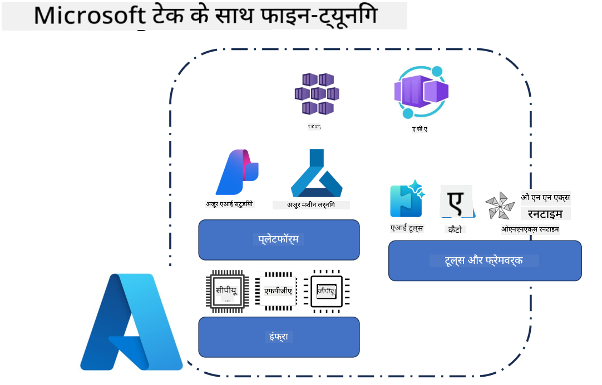
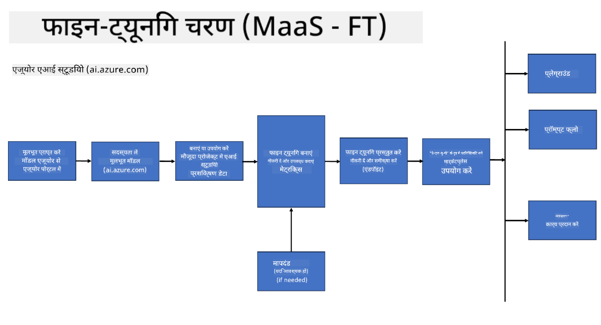
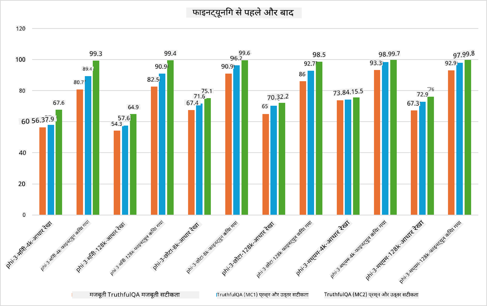

<!--
CO_OP_TRANSLATOR_METADATA:
{
  "original_hash": "cd52a3c9a424a77d2ec0470770c93846",
  "translation_date": "2025-04-04T19:03:54+00:00",
  "source_file": "md\\03.FineTuning\\FineTuning_Scenarios.md",
  "language_code": "hi"
}
-->
## फाइन ट्यूनिंग परिदृश्य

**प्लैटफ़ॉर्म** इसमें Azure AI Foundry, Azure Machine Learning, AI Tools, Kaito, और ONNX Runtime जैसी विभिन्न तकनीकों को शामिल किया गया है।

**इन्फ्रास्ट्रक्चर** इसमें CPU और FPGA शामिल हैं, जो फाइन-ट्यूनिंग प्रक्रिया के लिए आवश्यक हैं। मैं आपको इन तकनीकों के आइकन दिखाता हूं।

**टूल्स और फ्रेमवर्क** इसमें ONNX Runtime और ONNX Runtime शामिल हैं। मैं आपको इन तकनीकों के आइकन दिखाता हूं।
[Insert icons for ONNX Runtime and ONNX Runtime]

Microsoft तकनीकों के साथ फाइन-ट्यूनिंग प्रक्रिया में विभिन्न घटक और टूल्स शामिल होते हैं। इन तकनीकों को समझकर और उपयोग करके, हम अपने एप्लिकेशन को प्रभावी ढंग से फाइन-ट्यून कर सकते हैं और बेहतर समाधान बना सकते हैं।

## मॉडल एज़ सर्विस

मॉडल को होस्टेड फाइन-ट्यूनिंग के माध्यम से फाइन-ट्यून करें, बिना कंप्यूट को बनाने और प्रबंधित करने की आवश्यकता के।

Phi-3-mini और Phi-3-medium मॉडल के लिए सर्वरलेस फाइन-ट्यूनिंग उपलब्ध है, जिससे डेवलपर्स क्लाउड और एज परिदृश्यों के लिए मॉडल को जल्दी और आसानी से अनुकूलित कर सकते हैं, बिना कंप्यूट का प्रबंधन किए। हमने यह भी घोषणा की है कि Phi-3-small अब हमारे Models-as-a-Service ऑफरिंग के माध्यम से उपलब्ध है, जिससे डेवलपर्स बिना आधारभूत संरचना को प्रबंधित किए AI विकास शुरू कर सकते हैं।

## मॉडल एज़ प्लेटफ़ॉर्म

उपयोगकर्ता अपने कंप्यूट को प्रबंधित करते हैं ताकि अपने मॉडल को फाइन-ट्यून कर सकें।

[Fine Tuning Sample](https://github.com/Azure/azureml-examples/blob/main/sdk/python/foundation-models/system/finetune/chat-completion/chat-completion.ipynb)

## फाइन ट्यूनिंग परिदृश्य 

| | | | | | | |
|-|-|-|-|-|-|-|
|परिदृश्य|LoRA|QLoRA|PEFT|DeepSpeed|ZeRO|DORA|
|प्री-ट्रेंड LLMs को विशिष्ट कार्यों या डोमेन के लिए अनुकूलित करना|Yes|Yes|Yes|Yes|Yes|Yes|
|NLP कार्यों जैसे टेक्स्ट वर्गीकरण, नामित इकाई पहचान, और मशीन अनुवाद के लिए फाइन-ट्यूनिंग|Yes|Yes|Yes|Yes|Yes|Yes|
|QA कार्यों के लिए फाइन-ट्यूनिंग|Yes|Yes|Yes|Yes|Yes|Yes|
|चैटबॉट्स में मानव जैसी प्रतिक्रियाएं उत्पन्न करने के लिए फाइन-ट्यूनिंग|Yes|Yes|Yes|Yes|Yes|Yes|
|संगीत, कला, या अन्य रचनात्मकता के रूप में सामग्री उत्पन्न करने के लिए फाइन-ट्यूनिंग|Yes|Yes|Yes|Yes|Yes|Yes|
|गणना और वित्तीय लागत को कम करना|Yes|Yes|No|Yes|Yes|No|
|मेमोरी उपयोग को कम करना|No|Yes|No|Yes|Yes|Yes|
|कुशल फाइन-ट्यूनिंग के लिए कम पैरामीटर का उपयोग करना|No|Yes|Yes|No|No|Yes|
|डेटा पैरेललिज्म का मेमोरी-इफिशिएंट रूप जो सभी उपलब्ध GPU डिवाइस की समग्र GPU मेमोरी तक पहुंच प्रदान करता है|No|No|No|Yes|Yes|Yes|

## फाइन ट्यूनिंग प्रदर्शन उदाहरण

**अस्वीकरण**:  
यह दस्तावेज़ AI अनुवाद सेवा [Co-op Translator](https://github.com/Azure/co-op-translator) का उपयोग करके अनुवादित किया गया है। जबकि हम सटीकता सुनिश्चित करने का प्रयास करते हैं, कृपया ध्यान दें कि स्वचालित अनुवाद में त्रुटियाँ या गलतियाँ हो सकती हैं। मूल भाषा में उपलब्ध दस्तावेज़ को प्रामाणिक स्रोत माना जाना चाहिए। महत्वपूर्ण जानकारी के लिए, पेशेवर मानव अनुवाद की सिफारिश की जाती है। इस अनुवाद के उपयोग से उत्पन्न किसी भी गलतफहमी या गलत व्याख्या के लिए हम उत्तरदायी नहीं हैं।