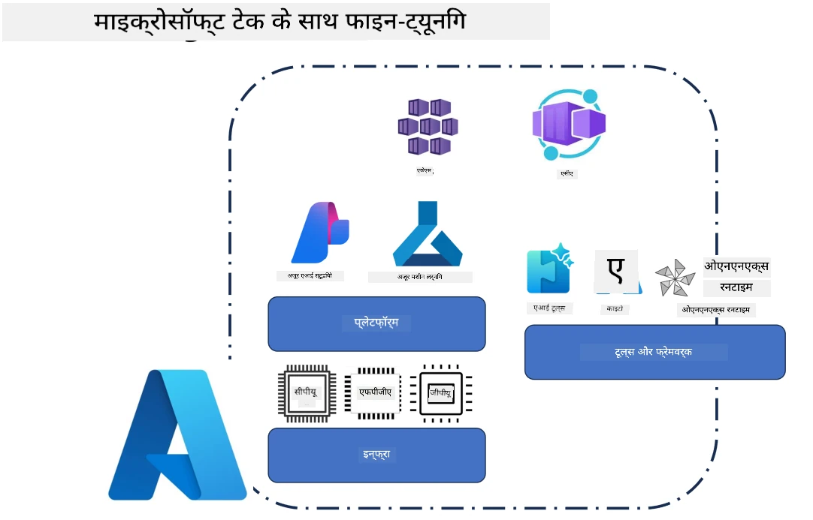
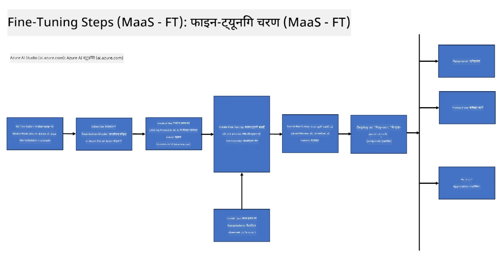
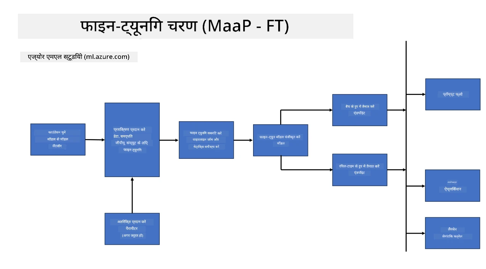
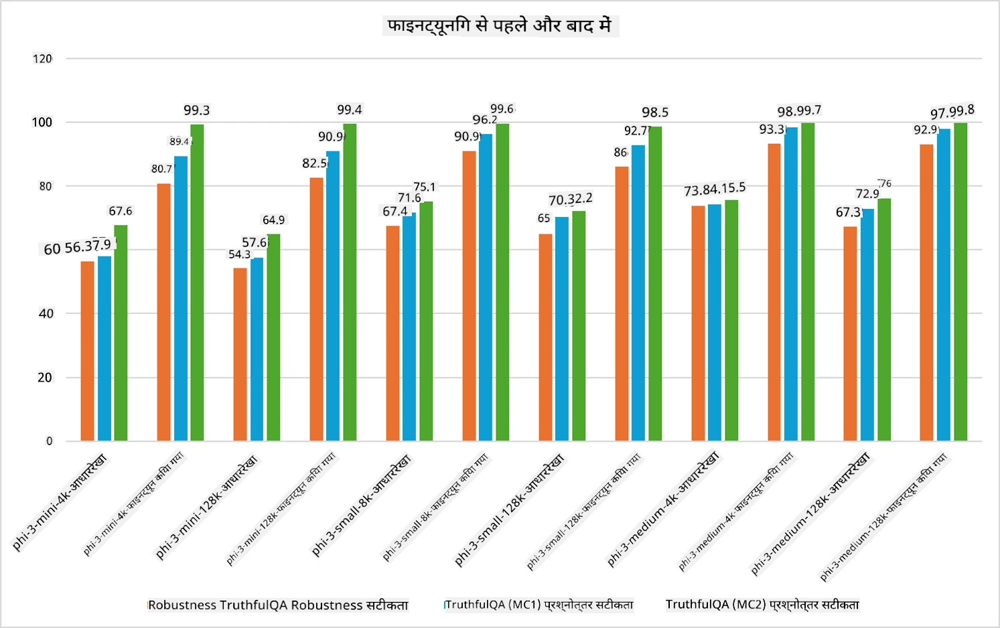

## फाइन ट्यूनिंग परिदृश्य

यह अनुभाग Microsoft Foundry और Azure वातावरण में फाइन-ट्यूनिंग परिदृश्यों का अवलोकन प्रदान करता है, जिसमें परिनियोजन मॉडल, अवसंरचना परतें, और सामान्यतः उपयोग की जाने वाली अनुकूलन तकनीकें शामिल हैं।

**प्लेटफार्म**  
इसमें प्रबंधित सेवाएं शामिल हैं जैसे Microsoft Foundry (पूर्व में Azure AI Foundry) और Azure Machine Learning, जो मॉडल प्रबंधन, ऑर्केस्ट्रेशन, प्रयोग ट्रैकिंग, और परिनियोजन कार्यप्रवाह प्रदान करते हैं।

**अवसंरचना**  
फाइन-ट्यूनिंग के लिए स्केलेबल कंप्यूट संसाधनों की आवश्यकता होती है। Azure वातावरण में, यह आमतौर पर GPU-आधारित वर्चुअल मशीनों और हल्के भार के लिए CPU संसाधनों के साथ-साथ डेटासेट और चेकपॉइंट्स के लिए स्केलेबल स्टोरेज शामिल करता है।

**उपकरण और फ्रेमवर्क**  
फाइन-ट्यूनिंग कार्यप्रवाह आमतौर पर Hugging Face Transformers, DeepSpeed, और PEFT (पैरामीटर-इफिसिएंट फाइन-ट्यूनिंग) जैसे फ्रेमवर्क और अनुकूलन पुस्तकालयों पर निर्भर करते हैं।

Microsoft तकनीकों के साथ फाइन-ट्यूनिंग प्रक्रिया प्लेटफॉर्म सेवाओं, कंप्यूट अवसंरचना, और प्रशिक्षण फ्रेमवर्क को कवर करती है। इन घटकों के परस्पर कार्य करने के तरीके को समझकर, डेवलपर्स फाउंडेशन मॉडल्स को विशिष्ट कार्यों और उत्पादन परिदृश्यों के लिए कुशलतापूर्वक अनुकूलित कर सकते हैं।

## मॉडल को सेवा के रूप में

होस्टेड फाइन-ट्यूनिंग का उपयोग करके मॉडल को फाइन-ट्यून करें, कंप्यूट बनाने और प्रबंधित करने की आवश्यकता के बिना।

Phi-3, Phi-3.5, और Phi-4 मॉडल परिवारों के लिए अब सर्वरलेस फाइन-ट्यूनिंग उपलब्ध है, जो डेवलपर्स को क्लाउड और एज परिदृश्यों के लिए मॉडल को जल्दी और आसानी से अनुकूलित करने में सक्षम बनाता है बिना कंप्यूट की व्यवस्था किए।

## मॉडल को प्लेटफार्म के रूप में

उपयोगकर्ता अपने स्वयं के कंप्यूट का प्रबंधन करते हैं ताकि वे अपने मॉडल को फाइन-ट्यून कर सकें।

[Fine Tuning Sample](https://github.com/Azure/azureml-examples/blob/main/sdk/python/foundation-models/system/finetune/chat-completion/chat-completion.ipynb)

## फाइन-ट्यूनिंग तकनीकों की तुलना

|परिदृश्य|LoRA|QLoRA|PEFT|DeepSpeed|ZeRO|DoRA|
|---|---|---|---|---|---|---|
|पूर्व-प्रशिक्षित LLMs को विशिष्ट कार्यों या डोमेन के लिए अनुकूलित करना|हाँ|हाँ|हाँ|हाँ|हाँ|हाँ|
|पाठ वर्गीकरण, नामांकित इकाई मान्यता, और मशीन अनुवाद जैसे NLP कार्यों के लिए फाइन-ट्यूनिंग|हाँ|हाँ|हाँ|हाँ|हाँ|हाँ|
|QA कार्यों के लिए फाइन-ट्यूनिंग|हाँ|हाँ|हाँ|हाँ|हाँ|हाँ|
|चैटबॉट्स में मानव-समान प्रतिक्रियाएँ उत्पन्न करने के लिए फाइन-ट्यूनिंग|हाँ|हाँ|हाँ|हाँ|हाँ|हाँ|
|संगीत, कला, या अन्य रचनात्मक रूपों को उत्पन्न करने के लिए फाइन-ट्यूनिंग|हाँ|हाँ|हाँ|हाँ|हाँ|हाँ|
|सांख्यिकीय और वित्तीय लागतों को कम करना|हाँ|हाँ|हाँ|हाँ|हाँ|हाँ|
|मेमोरी उपयोग कम करना|हाँ|हाँ|हाँ|हाँ|हाँ|हाँ|
|प्रभावी फाइन-ट्यूनिंग के लिए कम पैरामीटर का उपयोग|हाँ|हाँ|हाँ|नहीं|नहीं|हाँ|
|डेटा समानांतरता का मेमोरी-कुशल रूप जो उपलब्ध सभी GPU उपकरणों की समग्र GPU मेमोरी तक पहुंच प्रदान करता है|नहीं|नहीं|नहीं|हाँ|हाँ|नहीं|

> [!NOTE]
> LoRA, QLoRA, PEFT, और DoRA पैरामीटर-इफिसिएंट फाइन-ट्यूनिंग विधियाँ हैं, जबकि DeepSpeed और ZeRO वितरण प्रशिक्षण और मेमोरी अनुकूलन पर केंद्रित हैं।

## फाइन ट्यूनिंग प्रदर्शन उदाहरण

---

<!-- CO-OP TRANSLATOR DISCLAIMER START -->
**अस्वीकरण**:
यह दस्तावेज़ [Co-op Translator](https://github.com/Azure/co-op-translator) एआई अनुवाद सेवा का उपयोग करके अनुवादित किया गया है। जबकि हम सटीकता के लिए प्रयासरत हैं, कृपया ध्यान रखें कि स्वचालित अनुवादों में त्रुटियाँ या अशुद्धियाँ हो सकती हैं। मूल दस्तावेज़ अपनी मूल भाषा में अधिकारिक स्रोत माना जाना चाहिए। महत्वपूर्ण जानकारी के लिए पेशेवर मानव अनुवाद की अनुशंसा की जाती है। इस अनुवाद के उपयोग से उत्पन्न किसी भी गलतफहमी या गलत व्याख्या के लिए हम उत्तरदायी नहीं हैं।
<!-- CO-OP TRANSLATOR DISCLAIMER END -->