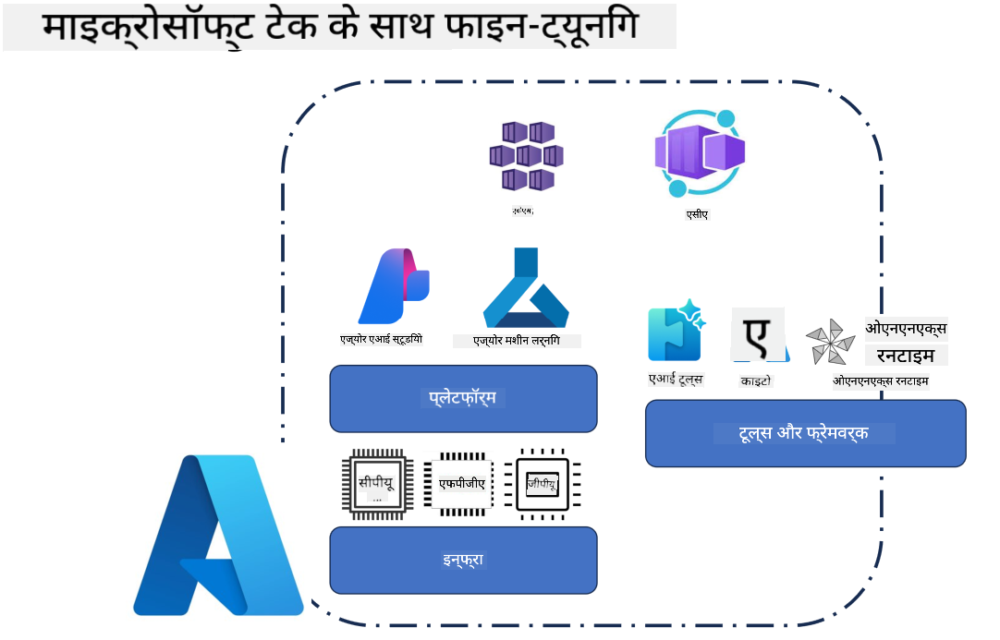
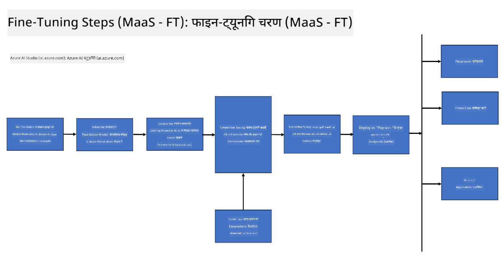
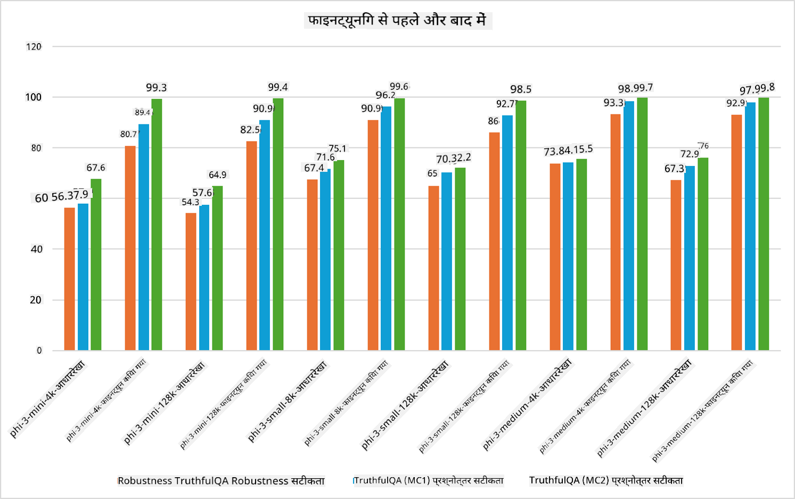

<!--
CO_OP_TRANSLATOR_METADATA:
{
  "original_hash": "cb5648935f63edc17e95ce38f23adc32",
  "translation_date": "2025-05-08T05:22:35+00:00",
  "source_file": "md/03.FineTuning/FineTuning_Scenarios.md",
  "language_code": "hi"
}
-->
## फाइन ट्यूनिंग परिदृश्य

**प्लेटफ़ॉर्म** इसमें Azure AI Foundry, Azure Machine Learning, AI Tools, Kaito, और ONNX Runtime जैसी विभिन्न तकनीकें शामिल हैं।

**इन्फ्रास्ट्रक्चर** इसमें CPU और FPGA शामिल हैं, जो फाइन-ट्यूनिंग प्रक्रिया के लिए आवश्यक हैं। मैं आपको इन तकनीकों के आइकन दिखाता हूँ।

**टूल्स और फ्रेमवर्क** इसमें ONNX Runtime शामिल है। मैं आपको इन तकनीकों के आइकन दिखाता हूँ।  
[Insert icons for ONNX Runtime and ONNX Runtime]

Microsoft तकनीकों के साथ फाइन-ट्यूनिंग प्रक्रिया में कई घटक और टूल्स शामिल होते हैं। इन तकनीकों को समझकर और उपयोग करके, हम अपने एप्लिकेशन को प्रभावी ढंग से फाइन-ट्यून कर बेहतर समाधान बना सकते हैं।

## मॉडल ऐज़ सर्विस

होस्टेड फाइन-ट्यूनिंग का उपयोग करके मॉडल को फाइन-ट्यून करें, बिना कंप्यूट बनाने और प्रबंधित करने की आवश्यकता के।

Phi-3-mini और Phi-3-medium मॉडल के लिए सर्वरलेस फाइन-ट्यूनिंग उपलब्ध है, जिससे डेवलपर्स जल्दी और आसानी से क्लाउड और एज परिदृश्यों के लिए मॉडल को अनुकूलित कर सकते हैं बिना कंप्यूट की व्यवस्था किए। हमने यह भी घोषणा की है कि Phi-3-small अब हमारे Models-as-a-Service ऑफरिंग के माध्यम से उपलब्ध है, जिससे डेवलपर्स बिना इन्फ्रास्ट्रक्चर प्रबंधन के AI विकास जल्दी शुरू कर सकते हैं।

## मॉडल ऐज़ प्लेटफ़ॉर्म

यूज़र्स अपने कंप्यूट का प्रबंधन करते हैं ताकि वे अपने मॉडल को फाइन-ट्यून कर सकें।

[Fine Tuning Sample](https://github.com/Azure/azureml-examples/blob/main/sdk/python/foundation-models/system/finetune/chat-completion/chat-completion.ipynb)

## फाइन ट्यूनिंग परिदृश्य

| | | | | | | |
|-|-|-|-|-|-|-|
|परिदृश्य|LoRA|QLoRA|PEFT|DeepSpeed|ZeRO|DORA|
|पूर्व-प्रशिक्षित LLMs को विशिष्ट कार्यों या डोमेन के लिए अनुकूलित करना|हाँ|हाँ|हाँ|हाँ|हाँ|हाँ|
|टेक्स्ट क्लासिफिकेशन, नामित इकाई पहचान, और मशीन अनुवाद जैसे NLP कार्यों के लिए फाइन-ट्यूनिंग|हाँ|हाँ|हाँ|हाँ|हाँ|हाँ|
|QA कार्यों के लिए फाइन-ट्यूनिंग|हाँ|हाँ|हाँ|हाँ|हाँ|हाँ|
|चैटबॉट्स में मानव-समान प्रतिक्रियाएं उत्पन्न करने के लिए फाइन-ट्यूनिंग|हाँ|हाँ|हाँ|हाँ|हाँ|हाँ|
|संगीत, कला, या अन्य रचनात्मक रूपों को उत्पन्न करने के लिए फाइन-ट्यूनिंग|हाँ|हाँ|हाँ|हाँ|हाँ|हाँ|
|गणना और वित्तीय लागत को कम करना|हाँ|हाँ|नहीं|हाँ|हाँ|नहीं|
|मेमोरी उपयोग को कम करना|नहीं|हाँ|नहीं|हाँ|हाँ|हाँ|
|कुशल फाइन-ट्यूनिंग के लिए कम पैरामीटर का उपयोग|नहीं|हाँ|हाँ|नहीं|नहीं|हाँ|
|डेटा पैरेललिज्म का मेमोरी-प्रभावी रूप जो सभी GPU डिवाइसेस की कुल GPU मेमोरी तक पहुँच प्रदान करता है|नहीं|नहीं|नहीं|हाँ|हाँ|हाँ|

## फाइन ट्यूनिंग प्रदर्शन उदाहरण

**अस्वीकरण**:  
यह दस्तावेज़ AI अनुवाद सेवा [Co-op Translator](https://github.com/Azure/co-op-translator) का उपयोग करके अनुवादित किया गया है। जबकि हम सटीकता के लिए प्रयासरत हैं, कृपया ध्यान दें कि स्वचालित अनुवादों में त्रुटियाँ या गलतियाँ हो सकती हैं। मूल दस्तावेज़ अपनी मूल भाषा में ही आधिकारिक स्रोत माना जाना चाहिए। महत्वपूर्ण जानकारी के लिए पेशेवर मानव अनुवाद की सलाह दी जाती है। इस अनुवाद के उपयोग से उत्पन्न किसी भी गलतफहमी या गलत व्याख्या के लिए हम उत्तरदायी नहीं हैं।