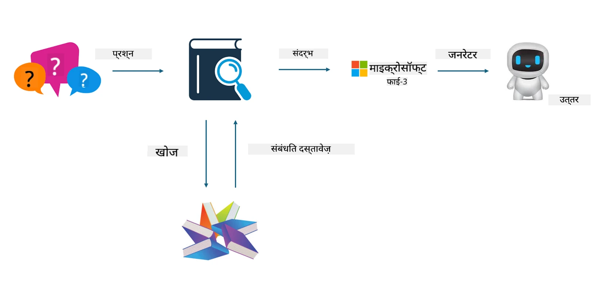

## फाइनट्यूनिंग बनाम RAG

## Retrieval Augmented Generation

RAG डेटा पुनःप्राप्ति + टेक्स्ट जनरेशन है। एंटरप्राइज के संरचित और असंरचित डेटा को वेक्टर डेटाबेस में संग्रहित किया जाता है। जब प्रासंगिक सामग्री खोजी जाती है, तो संबंधित सारांश और सामग्री को संदर्भ बनाने के लिए पाया जाता है, और LLM/SLM की टेक्स्ट पूर्णता क्षमता के साथ मिलाकर सामग्री उत्पन्न की जाती है।

## RAG प्रक्रिया

## फाइनट्यूनिंग
फाइनट्यूनिंग किसी विशेष मॉडल के सुधार पर आधारित होती है। इसे मॉडल एल्गोरिदम से शुरू करने की जरूरत नहीं होती, लेकिन डेटा को लगातार इकट्ठा करना पड़ता है। यदि आप उद्योग अनुप्रयोगों में अधिक सटीक शब्दावली और भाषा अभिव्यक्ति चाहते हैं, तो फाइनट्यूनिंग आपके लिए बेहतर विकल्प है। लेकिन यदि आपका डेटा बार-बार बदलता रहता है, तो फाइनट्यूनिंग जटिल हो सकती है।

## कैसे चुनें
यदि हमारे उत्तर के लिए बाहरी डेटा की आवश्यकता होती है, तो RAG सबसे अच्छा विकल्प है।

यदि आपको स्थिर और सटीक उद्योग ज्ञान आउटपुट करना है, तो फाइनट्यूनिंग एक अच्छा विकल्प होगा। RAG प्रासंगिक सामग्री को प्राथमिकता देता है लेकिन हमेशा विशेषज्ञता की सूक्ष्मताओं को पूरी तरह पकड़ नहीं पाता।

फाइनट्यूनिंग के लिए उच्च गुणवत्ता वाला डेटा सेट आवश्यक होता है, और यदि डेटा केवल एक छोटे क्षेत्र का है, तो इसका ज्यादा फर्क नहीं पड़ेगा। RAG अधिक लचीला है।  
फाइनट्यूनिंग एक ब्लैक बॉक्स है, एक रहस्यवाद, और इसके आंतरिक तंत्र को समझना मुश्किल होता है। लेकिन RAG डेटा के स्रोत को खोजने में आसान बनाता है, जिससे हल्यूसिनेशन या सामग्री त्रुटियों को प्रभावी ढंग से समायोजित किया जा सकता है और बेहतर पारदर्शिता प्रदान की जा सकती है।

**अस्वीकरण**:  
यह दस्तावेज़ AI अनुवाद सेवा [Co-op Translator](https://github.com/Azure/co-op-translator) का उपयोग करके अनुवादित किया गया है। जबकि हम सटीकता के लिए प्रयासरत हैं, कृपया ध्यान दें कि स्वचालित अनुवादों में त्रुटियाँ या अशुद्धियाँ हो सकती हैं। मूल दस्तावेज़ अपनी मूल भाषा में ही प्रामाणिक स्रोत माना जाना चाहिए। महत्वपूर्ण जानकारी के लिए, पेशेवर मानव अनुवाद की सलाह दी जाती है। इस अनुवाद के उपयोग से उत्पन्न किसी भी गलतफहमी या गलत व्याख्या के लिए हम जिम्मेदार नहीं हैं।