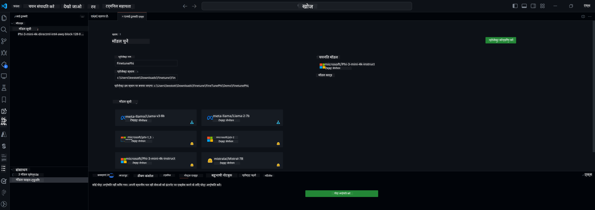

<!--
CO_OP_TRANSLATOR_METADATA:
{
  "original_hash": "82289836c6113c9df7544eec1fc54802",
  "translation_date": "2025-04-04T19:06:39+00:00",
  "source_file": "md\\03.FineTuning\\Finetuning_VSCodeaitoolkit.md",
  "language_code": "hi"
}
-->
## AI टूलकिट के लिए VS Code में आपका स्वागत है

[AI टूलकिट के लिए VS Code](https://github.com/microsoft/vscode-ai-toolkit/tree/main) Azure AI Studio Catalog और Hugging Face जैसे अन्य कैटलॉग्स के विभिन्न मॉडलों को एक साथ लाता है। यह टूलकिट जनरेटिव AI टूल्स और मॉडलों के साथ AI ऐप्स बनाने के लिए सामान्य डेवलपमेंट कार्यों को सरल बनाता है:
- मॉडल डिस्कवरी और प्लेग्राउंड के साथ शुरुआत करें।
- स्थानीय कंप्यूटिंग संसाधनों का उपयोग करके मॉडल फाइन-ट्यूनिंग और इनफेरेंस।
- Azure संसाधनों का उपयोग करके रिमोट फाइन-ट्यूनिंग और इनफेरेंस।

[AI टूलकिट के लिए VSCode इंस्टॉल करें](https://marketplace.visualstudio.com/items?itemName=ms-windows-ai-studio.windows-ai-studio)



**[Private Preview]** Azure Container Apps के लिए एक-क्लिक प्रोविज़निंग, जो क्लाउड में मॉडल फाइन-ट्यूनिंग और इनफेरेंस को चलाने में सक्षम बनाता है।

अब चलिए आपके AI ऐप डेवलपमेंट में आगे बढ़ते हैं:

- [AI टूलकिट के लिए VS Code में आपका स्वागत है](../../../../md/03.FineTuning)
- [स्थानीय विकास](../../../../md/03.FineTuning)
  - [तैयारियां](../../../../md/03.FineTuning)
  - [Conda को सक्रिय करें](../../../../md/03.FineTuning)
  - [केवल बेस मॉडल फाइन-ट्यूनिंग](../../../../md/03.FineTuning)
  - [मॉडल फाइन-ट्यूनिंग और इनफेरेंसिंग](../../../../md/03.FineTuning)
  - [मॉडल फाइन-ट्यूनिंग](../../../../md/03.FineTuning)
  - [Microsoft Olive](../../../../md/03.FineTuning)
  - [फाइन-ट्यूनिंग के नमूने और संसाधन](../../../../md/03.FineTuning)
- [**\[Private Preview\]** रिमोट डेवलपमेंट](../../../../md/03.FineTuning)
  - [पूर्व आवश्यकताएं](../../../../md/03.FineTuning)
  - [रिमोट डेवलपमेंट प्रोजेक्ट सेट करना](../../../../md/03.FineTuning)
  - [Azure संसाधनों का प्रोविज़न करें](../../../../md/03.FineTuning)
  - [\[वैकल्पिक\] Huggingface Token को Azure Container App Secret में जोड़ें](../../../../md/03.FineTuning)
  - [फाइन-ट्यूनिंग चलाएं](../../../../md/03.FineTuning)
  - [इनफेरेंस एंडपॉइंट का प्रोविज़न करें](../../../../md/03.FineTuning)
  - [इनफेरेंस एंडपॉइंट को डिप्लॉय करें](../../../../md/03.FineTuning)
  - [उन्नत उपयोग](../../../../md/03.FineTuning)

## स्थानीय विकास
### तैयारियां

1. सुनिश्चित करें कि NVIDIA ड्राइवर होस्ट में इंस्टॉल है।  
2. `huggingface-cli login` चलाएं, यदि आप डेटा सेट उपयोग के लिए HF का उपयोग कर रहे हैं।  
3. `Olive` मेमोरी उपयोग को संशोधित करने वाली किसी भी चीज़ के लिए कुंजी सेटिंग्स की व्याख्या।  

### Conda को सक्रिय करें
चूंकि हम WSL वातावरण का उपयोग कर रहे हैं और यह साझा है, आपको मैन्युअल रूप से Conda वातावरण को सक्रिय करना होगा। इस चरण के बाद आप फाइन-ट्यूनिंग या इनफेरेंस चला सकते हैं।

```bash
conda activate [conda-env-name] 
```

### केवल बेस मॉडल फाइन-ट्यूनिंग
यदि आप केवल बेस मॉडल को बिना फाइन-ट्यूनिंग के आजमाना चाहते हैं, तो Conda को सक्रिय करने के बाद आप यह कमांड चला सकते हैं।

```bash
cd inference

# Web browser interface allows to adjust a few parameters like max new token length, temperature and so on.
# User has to manually open the link (e.g. http://0.0.0.0:7860) in a browser after gradio initiates the connections.
python gradio_chat.py --baseonly
```

### मॉडल फाइन-ट्यूनिंग और इनफेरेंसिंग

जब वर्कस्पेस एक डेवलपमेंट कंटेनर में खुलता है, तो एक टर्मिनल खोलें (डिफ़ॉल्ट पथ प्रोजेक्ट रूट है), फिर चयनित डेटा सेट पर LLM को फाइन-ट्यून करने के लिए नीचे दिए गए कमांड को चलाएं।

```bash
python finetuning/invoke_olive.py 
```

चेकपॉइंट्स और अंतिम मॉडल `models` folder.

Next run inferencing with the fune-tuned model through chats in a `console`, `web browser` or `prompt flow` में सेव किया जाएगा।

```bash
cd inference

# Console interface.
python console_chat.py

# Web browser interface allows to adjust a few parameters like max new token length, temperature and so on.
# User has to manually open the link (e.g. http://127.0.0.1:7860) in a browser after gradio initiates the connections.
python gradio_chat.py
```

`prompt flow` in VS Code, please refer to this [Quick Start](https://microsoft.github.io/promptflow/how-to-guides/quick-start.html).

### Model Fine-tuning

Next, download the following model depending on the availability of a GPU on your device.

To initiate the local fine-tuning session using QLoRA, select a model you want to fine-tune from our catalog.
| Platform(s) | GPU available | Model name | Size (GB) |
|---------|---------|--------|--------|
| Windows | Yes | Phi-3-mini-4k-**directml**-int4-awq-block-128-onnx | 2.13GB |
| Linux | Yes | Phi-3-mini-4k-**cuda**-int4-onnx | 2.30GB |
| Windows<br>Linux | No | Phi-3-mini-4k-**cpu**-int4-rtn-block-32-acc-level-4-onnx | 2.72GB |

**_Note_** You do not need an Azure Account to download the models

The Phi3-mini (int4) model is approximately 2GB-3GB in size. Depending on your network speed, it could take a few minutes to download.

Start by selecting a project name and location.
Next, select a model from the model catalog. You will be prompted to download the project template. You can then click "Configure Project" to adjust various settings.

### Microsoft Olive 

We use [Olive](https://microsoft.github.io/Olive/why-olive.html) to run QLoRA fine-tuning on a PyTorch model from our catalog. All of the settings are preset with the default values to optimize to run the fine-tuning process locally with optimized use of memory, but it can be adjusted for your scenario.

### Fine Tuning Samples and Resoures

- [Fine tuning Getting Started Guide](https://learn.microsoft.com/windows/ai/toolkit/toolkit-fine-tune)
- [Fine tuning with a HuggingFace Dataset](https://github.com/microsoft/vscode-ai-toolkit/blob/main/archive/walkthrough-hf-dataset.md)
- [Fine tuning with Simple DataSet](https://github.com/microsoft/vscode-ai-toolkit/blob/main/archive/walkthrough-simple-dataset.md)

## **[Private Preview]** Remote Development

### Prerequisites

1. To run the model fine-tuning in your remote Azure Container App Environment, make sure your subscription has enough GPU capacity. Submit a [support ticket](https://azure.microsoft.com/support/create-ticket/) to request the required capacity for your application. [Get More Info about GPU capacity](https://learn.microsoft.com/azure/container-apps/workload-profiles-overview)
2. If you are using private dataset on HuggingFace, make sure you have a [HuggingFace account](https://huggingface.co/?WT.mc_id=aiml-137032-kinfeylo) and [generate an access token](https://huggingface.co/docs/hub/security-tokens?WT.mc_id=aiml-137032-kinfeylo)
3. Enable Remote Fine-tuning and Inference feature flag in the AI Toolkit for VS Code
   1. Open the VS Code Settings by selecting *File -> Preferences -> Settings*.
   2. Navigate to *Extensions* and select *AI Toolkit*.
   3. Select the *"Enable Remote Fine-tuning And Inference"* option.
   4. Reload VS Code to take effect.

- [Remote Fine tuning](https://github.com/microsoft/vscode-ai-toolkit/blob/main/archive/remote-finetuning.md)

### Setting Up a Remote Development Project
1. Execute the command palette `AI Toolkit: Focus on Resource View`.
2. Navigate to *Model Fine-tuning* to access the model catalog. Assign a name to your project and select its location on your machine. Then, hit the *"Configure Project"* button.
3. Project Configuration
    1. Avoid enabling the *"Fine-tune locally"* option.
    2. The Olive configuration settings will appear with pre-set default values. Please adjust and fill in these configurations as required.
    3. Move on to *Generate Project*. This stage leverages WSL and involves setting up a new Conda environment, preparing for future updates that include Dev Containers.
4. Click on *"Relaunch Window In Workspace"* to open your remote development project.

> **Note:** The project currently works either locally or remotely within the AI Toolkit for VS Code. If you choose *"Fine-tune locally"* during project creation, it will operate exclusively in WSL without remote development capabilities. On the other hand, if you forego enabling *"Fine-tune locally"*, the project will be restricted to the remote Azure Container App environment.

### Provision Azure Resources
To get started, you need to provision the Azure Resource for remote fine-tuning. Do this by running the `AI Toolkit: Provision Azure Container Apps job for fine-tuning` from the command palette.

Monitor the progress of the provision through the link displayed in the output channel.

### [Optional] Add Huggingface Token to the Azure Container App Secret
If you're using private HuggingFace dataset, set your HuggingFace token as an environment variable to avoid the need for manual login on the Hugging Face Hub.
You can do this using the `AI Toolkit: Add Azure Container Apps Job secret for fine-tuning command`. With this command, you can set the secret name as [`HF_TOKEN`](https://huggingface.co/docs/huggingface_hub/package_reference/environment_variables#hftoken) and use your Hugging Face token as the secret value.

### Run Fine-tuning
To start the remote fine-tuning job, execute the `AI Toolkit: Run fine-tuning` command.

To view the system and console logs, you can visit the Azure portal using the link in the output panel (more steps at [View and Query Logs on Azure](https://aka.ms/ai-toolkit/remote-provision#view-and-query-logs-on-azure)). Or, you can view the console logs directly in the VSCode output panel by running the command `AI Toolkit: Show the running fine-tuning job streaming logs`. 
> **Note:** The job might be queued due to insufficient resources. If the log is not displayed, execute the `AI Toolkit: Show the running fine-tuning job streaming logs` command, wait for a while and then execute the command again to re-connect to the streaming log.

During this process, QLoRA will be used for fine-tuning, and will create LoRA adapters for the model to use during inference.
The results of the fine-tuning will be stored in the Azure Files.

### Provision Inference Endpoint
After the adapters are trained in the remote environment, use a simple Gradio application to interact with the model.
Similar to the fine-tuning process, you need to set up the Azure Resources for remote inference by executing the `AI Toolkit: Provision Azure Container Apps for inference` from the command palette.

By default, the subscription and the resource group for inference should match those used for fine-tuning. The inference will use the same Azure Container App Environment and access the model and model adapter stored in Azure Files, which were generated during the fine-tuning step. 


### Deploy the Inference Endpoint
If you wish to revise the inference code or reload the inference model, please execute the `AI Toolkit: Deploy for inference` command. This will synchronize your latest code with Azure Container App and restart the replica.  

Once deployment is successfully completed, you can access the inference API by clicking on the "*Go to Inference Endpoint*" button displayed in the VSCode notification. Or, the web API endpoint can be found under `ACA_APP_ENDPOINT` in `./infra/inference.config.json` और आउटपुट पैनल में उपयोग करें। अब आप इस एंडपॉइंट का उपयोग करके मॉडल का मूल्यांकन करने के लिए तैयार हैं।

### उन्नत उपयोग
AI टूलकिट के साथ रिमोट डेवलपमेंट पर अधिक जानकारी के लिए, [मॉडलों को रिमोट तरीके से फाइन-ट्यून करना](https://aka.ms/ai-toolkit/remote-provision) और [फाइन-ट्यून किए गए मॉडल के साथ इनफेरेंस](https://aka.ms/ai-toolkit/remote-inference) दस्तावेज़ देखें।

**अस्वीकरण**:  
यह दस्तावेज़ AI अनुवाद सेवा [Co-op Translator](https://github.com/Azure/co-op-translator) का उपयोग करके अनुवादित किया गया है। जबकि हम सटीकता सुनिश्चित करने का प्रयास करते हैं, कृपया ध्यान दें कि स्वचालित अनुवाद में त्रुटियां या अशुद्धियाँ हो सकती हैं। मूल भाषा में उपलब्ध मूल दस्तावेज़ को प्रामाणिक स्रोत माना जाना चाहिए। महत्वपूर्ण जानकारी के लिए, पेशेवर मानव अनुवाद की सिफारिश की जाती है। इस अनुवाद के उपयोग से उत्पन्न किसी भी गलतफहमी या गलत व्याख्या के लिए हम जिम्मेदार नहीं हैं।