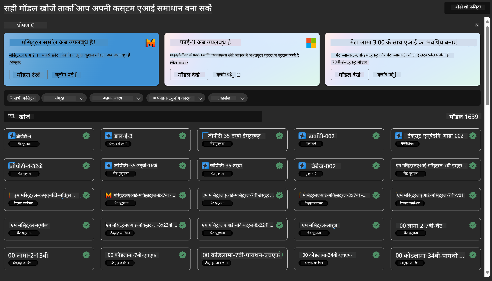
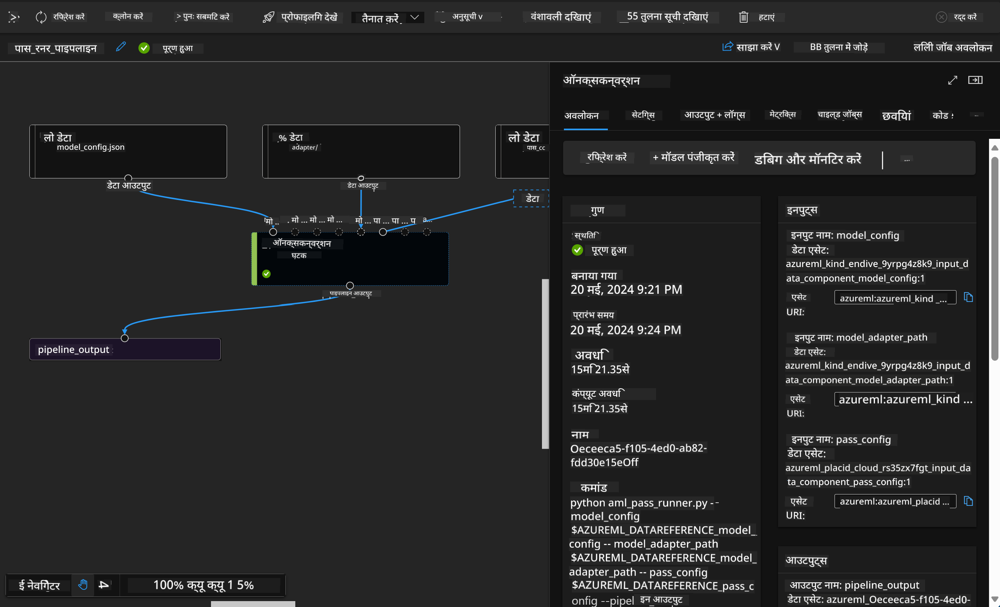

<!--
CO_OP_TRANSLATOR_METADATA:
{
  "original_hash": "7fe541373802e33568e94e13226d463c",
  "translation_date": "2025-07-17T09:37:40+00:00",
  "source_file": "md/03.FineTuning/Introduce_AzureML.md",
  "language_code": "hi"
}
-->
# **Azure Machine Learning सेवा का परिचय**

[Azure Machine Learning](https://ml.azure.com?WT.mc_id=aiml-138114-kinfeylo) एक क्लाउड सेवा है जो मशीन लर्निंग (ML) प्रोजेक्ट के जीवनचक्र को तेज़ करने और प्रबंधित करने के लिए बनाई गई है।

ML पेशेवर, डेटा वैज्ञानिक, और इंजीनियर इसे अपने दैनिक कार्यप्रवाह में उपयोग कर सकते हैं ताकि:

- मॉडल को प्रशिक्षित और तैनात किया जा सके।
- मशीन लर्निंग संचालन (MLOps) का प्रबंधन किया जा सके।
- आप Azure Machine Learning में मॉडल बना सकते हैं या PyTorch, TensorFlow, या scikit-learn जैसे ओपन-सोर्स प्लेटफॉर्म से बने मॉडल का उपयोग कर सकते हैं।
- MLOps टूल्स आपकी मदद करते हैं मॉडलों की निगरानी, पुनः प्रशिक्षण, और पुनः तैनाती में।

## Azure Machine Learning किसके लिए है?

**डेटा वैज्ञानिक और ML इंजीनियर**

वे अपने दैनिक कार्यों को तेज़ और स्वचालित करने के लिए टूल्स का उपयोग कर सकते हैं।  
Azure ML निष्पक्षता, व्याख्यात्मकता, ट्रैकिंग, और ऑडिटेबिलिटी के लिए फीचर्स प्रदान करता है।

**एप्लिकेशन डेवलपर्स:**  
वे मॉडल्स को एप्लिकेशन या सेवाओं में सहजता से एकीकृत कर सकते हैं।

**प्लेटफ़ॉर्म डेवलपर्स**

उन्हें Azure Resource Manager APIs द्वारा समर्थित मजबूत टूल्स का उपयोग करने का अवसर मिलता है।  
ये टूल्स उन्नत ML टूलिंग बनाने की अनुमति देते हैं।

**एंटरप्राइजेज**

Microsoft Azure क्लाउड में काम करते हुए, एंटरप्राइजेज परिचित सुरक्षा और भूमिका-आधारित एक्सेस नियंत्रण का लाभ उठाते हैं।  
वे प्रोजेक्ट सेटअप कर सकते हैं ताकि संरक्षित डेटा और विशिष्ट ऑपरेशनों तक पहुंच नियंत्रित की जा सके।

## टीम के हर सदस्य के लिए उत्पादकता  
ML प्रोजेक्ट्स अक्सर विभिन्न कौशल वाले टीम की जरूरत होती है जो निर्माण और रखरखाव कर सके।

Azure ML ऐसे टूल्स प्रदान करता है जो आपको सक्षम बनाते हैं:  
- साझा नोटबुक, कंप्यूट संसाधन, सर्वरलेस कंप्यूट, डेटा, और एनवायरनमेंट के माध्यम से अपनी टीम के साथ सहयोग करने के लिए।  
- निष्पक्षता, व्याख्यात्मकता, ट्रैकिंग, और ऑडिटेबिलिटी के साथ मॉडल विकसित करने के लिए ताकि लाइनिएज और ऑडिट अनुपालन आवश्यकताओं को पूरा किया जा सके।  
- ML मॉडल्स को तेज़ी से और आसानी से बड़े पैमाने पर तैनात करने, और MLOps के साथ उन्हें कुशलतापूर्वक प्रबंधित और नियंत्रित करने के लिए।  
- अंतर्निर्मित गवर्नेंस, सुरक्षा, और अनुपालन के साथ कहीं भी मशीन लर्निंग वर्कलोड चलाने के लिए।

## क्रॉस-कंपैटिबल प्लेटफ़ॉर्म टूल्स

ML टीम का कोई भी सदस्य अपनी पसंदीदा टूल्स का उपयोग कर सकता है।  
चाहे आप तेज़ प्रयोग कर रहे हों, हाइपरपैरामीटर ट्यूनिंग कर रहे हों, पाइपलाइंस बना रहे हों, या इनफेरेंस प्रबंधित कर रहे हों, आप परिचित इंटरफेस का उपयोग कर सकते हैं जैसे:  
- Azure Machine Learning Studio  
- Python SDK (v2)  
- Azure CLI (v2)  
- Azure Resource Manager REST APIs  

जैसे-जैसे आप मॉडल्स को परिष्कृत करते हैं और विकास चक्र के दौरान सहयोग करते हैं, आप Azure Machine Learning स्टूडियो UI के भीतर एसेट्स, संसाधन, और मेट्रिक्स साझा और खोज सकते हैं।

## **Azure ML में LLM/SLM**

Azure ML ने कई LLM/SLM-संबंधित कार्यक्षमताएँ जोड़ी हैं, जो LLMOps और SLMOps को मिलाकर एक एंटरप्राइज-व्यापी जनरेटिव आर्टिफिशियल इंटेलिजेंस तकनीकी प्लेटफ़ॉर्म बनाती हैं।

### **मॉडल कैटलॉग**

एंटरप्राइज उपयोगकर्ता मॉडल कैटलॉग के माध्यम से विभिन्न व्यावसायिक परिदृश्यों के अनुसार विभिन्न मॉडल तैनात कर सकते हैं, और मॉडल को सेवा के रूप में प्रदान कर सकते हैं ताकि एंटरप्राइज डेवलपर्स या उपयोगकर्ता उन्हें एक्सेस कर सकें।

Azure Machine Learning स्टूडियो में मॉडल कैटलॉग एक ऐसा केंद्र है जहाँ आप जनरेटिव AI एप्लिकेशन बनाने के लिए विभिन्न मॉडल खोज और उपयोग कर सकते हैं। मॉडल कैटलॉग में Azure OpenAI सेवा, Mistral, Meta, Cohere, Nvidia, Hugging Face जैसे मॉडल प्रदाताओं के सैकड़ों मॉडल शामिल हैं, जिनमें Microsoft द्वारा प्रशिक्षित मॉडल भी शामिल हैं। Microsoft के अलावा अन्य प्रदाताओं के मॉडल Microsoft के प्रोडक्ट टर्म्स के अनुसार गैर-Microsoft उत्पाद होते हैं और मॉडल के साथ प्रदान किए गए नियमों के अधीन होते हैं।

### **जॉब पाइपलाइन**

मशीन लर्निंग पाइपलाइन का मूल उद्देश्य एक पूर्ण मशीन लर्निंग कार्य को कई चरणों वाले वर्कफ़्लो में विभाजित करना है। प्रत्येक चरण एक प्रबंधनीय घटक होता है जिसे व्यक्तिगत रूप से विकसित, अनुकूलित, कॉन्फ़िगर, और स्वचालित किया जा सकता है। चरणों को अच्छी तरह परिभाषित इंटरफेस के माध्यम से जोड़ा जाता है। Azure Machine Learning पाइपलाइन सेवा स्वचालित रूप से पाइपलाइन चरणों के बीच सभी निर्भरताओं का समन्वय करती है।

SLM / LLM के फाइन-ट्यूनिंग में, हम पाइपलाइन के माध्यम से अपने डेटा, प्रशिक्षण, और जनरेशन प्रक्रियाओं का प्रबंधन कर सकते हैं।

### **प्रॉम्प्ट फ्लो**

Azure Machine Learning प्रॉम्प्ट फ्लो के उपयोग के लाभ  
Azure Machine Learning प्रॉम्प्ट फ्लो कई लाभ प्रदान करता है जो उपयोगकर्ताओं को विचार से लेकर प्रयोग और अंततः उत्पादन-तैयार LLM-आधारित एप्लिकेशन तक पहुंचने में मदद करते हैं:

**प्रॉम्प्ट इंजीनियरिंग में लचीलापन**

इंटरैक्टिव ऑथरिंग अनुभव: Azure Machine Learning प्रॉम्प्ट फ्लो फ्लो की संरचना का दृश्य प्रतिनिधित्व प्रदान करता है, जिससे उपयोगकर्ता अपने प्रोजेक्ट्स को आसानी से समझ और नेविगेट कर सकते हैं। यह कुशल फ्लो विकास और डिबगिंग के लिए नोटबुक जैसा कोडिंग अनुभव भी प्रदान करता है।  
प्रॉम्प्ट ट्यूनिंग के लिए वैरिएंट्स: उपयोगकर्ता कई प्रॉम्प्ट वैरिएंट्स बना और तुलना कर सकते हैं, जिससे पुनरावृत्त सुधार प्रक्रिया संभव होती है।

मूल्यांकन: अंतर्निर्मित मूल्यांकन फ्लो उपयोगकर्ताओं को उनके प्रॉम्प्ट्स और फ्लो की गुणवत्ता और प्रभावशीलता का आकलन करने में सक्षम बनाते हैं।

व्यापक संसाधन: Azure Machine Learning प्रॉम्प्ट फ्लो में अंतर्निर्मित टूल्स, नमूने, और टेम्पलेट्स की लाइब्रेरी शामिल है जो विकास के लिए शुरुआती बिंदु के रूप में काम करती है, रचनात्मकता को प्रेरित करती है और प्रक्रिया को तेज़ करती है।

**LLM-आधारित एप्लिकेशन के लिए एंटरप्राइज रेडीनेस**

सहयोग: Azure Machine Learning प्रॉम्प्ट फ्लो टीम सहयोग का समर्थन करता है, जिससे कई उपयोगकर्ता प्रॉम्प्ट इंजीनियरिंग प्रोजेक्ट्स पर साथ काम कर सकते हैं, ज्ञान साझा कर सकते हैं, और संस्करण नियंत्रण बनाए रख सकते हैं।

सभी-इन-वन प्लेटफ़ॉर्म: Azure Machine Learning प्रॉम्प्ट फ्लो पूरे प्रॉम्प्ट इंजीनियरिंग प्रक्रिया को सरल बनाता है, विकास और मूल्यांकन से लेकर तैनाती और निगरानी तक। उपयोगकर्ता अपने फ्लो को Azure Machine Learning एंडपॉइंट्स के रूप में आसानी से तैनात कर सकते हैं और वास्तविक समय में उनके प्रदर्शन की निगरानी कर सकते हैं, जिससे बेहतर संचालन और निरंतर सुधार सुनिश्चित होता है।

Azure Machine Learning एंटरप्राइज रेडीनेस सॉल्यूशंस: प्रॉम्प्ट फ्लो Azure Machine Learning के मजबूत एंटरप्राइज रेडीनेस सॉल्यूशंस का लाभ उठाता है, जो फ्लो के विकास, प्रयोग, और तैनाती के लिए एक सुरक्षित, स्केलेबल, और विश्वसनीय आधार प्रदान करता है।

Azure Machine Learning प्रॉम्प्ट फ्लो के साथ, उपयोगकर्ता अपनी प्रॉम्प्ट इंजीनियरिंग क्षमता को मुक्त कर सकते हैं, प्रभावी रूप से सहयोग कर सकते हैं, और सफल LLM-आधारित एप्लिकेशन विकास और तैनाती के लिए एंटरप्राइज-ग्रेड सॉल्यूशंस का उपयोग कर सकते हैं।

Azure ML की कंप्यूटिंग शक्ति, डेटा, और विभिन्न घटकों को मिलाकर, एंटरप्राइज डेवलपर्स आसानी से अपनी खुद की आर्टिफिशियल इंटेलिजेंस एप्लिकेशन बना सकते हैं।

**अस्वीकरण**:  
यह दस्तावेज़ AI अनुवाद सेवा [Co-op Translator](https://github.com/Azure/co-op-translator) का उपयोग करके अनुवादित किया गया है। जबकि हम सटीकता के लिए प्रयासरत हैं, कृपया ध्यान दें कि स्वचालित अनुवादों में त्रुटियाँ या अशुद्धियाँ हो सकती हैं। मूल दस्तावेज़ अपनी मूल भाषा में ही अधिकारिक स्रोत माना जाना चाहिए। महत्वपूर्ण जानकारी के लिए, पेशेवर मानव अनुवाद की सलाह दी जाती है। इस अनुवाद के उपयोग से उत्पन्न किसी भी गलतफहमी या गलत व्याख्या के लिए हम जिम्मेदार नहीं हैं।