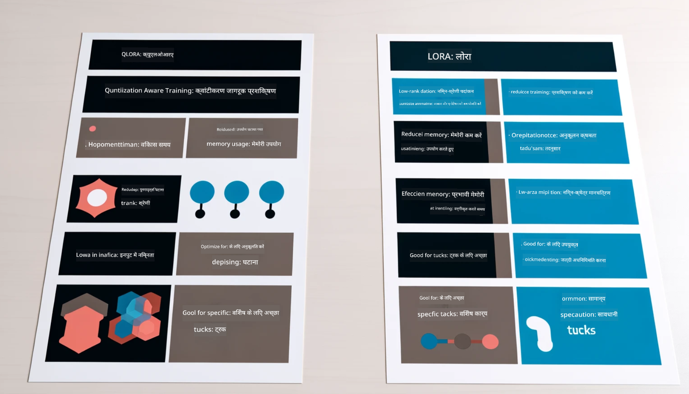

<!--
CO_OP_TRANSLATOR_METADATA:
{
  "original_hash": "ef0e3b9f4e65cc05e80efb30723aed40",
  "translation_date": "2025-04-04T19:10:47+00:00",
  "source_file": "md\\03.FineTuning\\LetPhi3gotoIndustriy.md",
  "language_code": "hi"
}
-->
# **Phi-3 को एक उद्योग विशेषज्ञ बनने दें**

Phi-3 मॉडल को किसी उद्योग में लाने के लिए, आपको Phi-3 मॉडल में उद्योग के व्यवसाय डेटा को जोड़ना होगा। हमारे पास दो विकल्प हैं: पहला RAG (Retrieval Augmented Generation) और दूसरा Fine Tuning।

## **RAG बनाम Fine-Tuning**

### **Retrieval Augmented Generation**

RAG डेटा पुनः प्राप्ति + टेक्स्ट जनरेशन है। उद्यम के संरचित और असंरचित डेटा को वेक्टर डेटाबेस में संग्रहीत किया जाता है। जब प्रासंगिक सामग्री की खोज की जाती है, तो प्रासंगिक सारांश और सामग्री को ढूंढकर एक संदर्भ बनाया जाता है, और LLM/SLM की टेक्स्ट पूर्णता क्षमता के साथ मिलकर सामग्री उत्पन्न की जाती है।

### **Fine-tuning**

Fine-tuning किसी मॉडल को सुधारने की प्रक्रिया है। इसमें मॉडल एल्गोरिथ्म से शुरुआत करने की आवश्यकता नहीं होती, लेकिन डेटा को लगातार एकत्रित करना पड़ता है। यदि आपको उद्योग अनुप्रयोगों में अधिक सटीक शब्दावली और भाषा अभिव्यक्ति की आवश्यकता है, तो Fine-tuning बेहतर विकल्प है। लेकिन यदि आपका डेटा अक्सर बदलता है, तो Fine-tuning जटिल हो सकता है।

### **कैसे चुनें**

1. यदि हमारे उत्तर में बाहरी डेटा को शामिल करने की आवश्यकता है, तो RAG सबसे अच्छा विकल्प है।

2. यदि आपको स्थिर और सटीक उद्योग ज्ञान आउटपुट करना है, तो Fine-tuning एक अच्छा विकल्प होगा। RAG प्रासंगिक सामग्री खींचने को प्राथमिकता देता है लेकिन यह हमेशा विशेष उद्योग की बारीकियों को सही तरीके से पकड़ नहीं सकता।

3. Fine-tuning के लिए उच्च गुणवत्ता वाले डेटा सेट की आवश्यकता होती है, और यदि यह केवल छोटे दायरे का डेटा है, तो इससे अधिक अंतर नहीं पड़ेगा। RAG अधिक लचीला है।

4. Fine-tuning एक ब्लैक बॉक्स है, एक प्रकार का रहस्य है, और इसके आंतरिक तंत्र को समझना कठिन है। लेकिन RAG डेटा के स्रोत को ढूंढने को आसान बना सकता है, जिससे भ्रम या सामग्री त्रुटियों को प्रभावी रूप से समायोजित किया जा सके और बेहतर पारदर्शिता प्रदान की जा सके।

### **परिदृश्य**

1. वर्टिकल उद्योगों को विशिष्ट पेशेवर शब्दावली और अभिव्यक्ति की आवश्यकता होती है, ***Fine-tuning*** सबसे अच्छा विकल्प होगा।

2. QA सिस्टम, जिसमें विभिन्न ज्ञान बिंदुओं का संश्लेषण शामिल है, ***RAG*** सबसे अच्छा विकल्प होगा।

3. स्वचालित व्यवसाय प्रवाह का संयोजन ***RAG + Fine-tuning*** सबसे अच्छा विकल्प होगा।

## **RAG का उपयोग कैसे करें**

एक वेक्टर डेटाबेस गणितीय रूप में संग्रहीत डेटा का संग्रह है। वेक्टर डेटाबेस मशीन लर्निंग मॉडल को पिछले इनपुट याद रखने में आसान बनाता है, जिससे खोज, अनुशंसा, और टेक्स्ट जनरेशन जैसे उपयोग मामलों का समर्थन करने के लिए मशीन लर्निंग का उपयोग सक्षम होता है। डेटा को समानता मीट्रिक्स के आधार पर पहचाना जा सकता है, न कि केवल सटीक मेल के आधार पर, जिससे कंप्यूटर मॉडल डेटा के संदर्भ को समझ सके।

वेक्टर डेटाबेस RAG को साकार करने की कुंजी है। हम टेक्स्ट-embedding-3, jina-ai-embedding जैसे वेक्टर मॉडलों के माध्यम से डेटा को वेक्टर स्टोरेज में परिवर्तित कर सकते हैं।

RAG एप्लिकेशन बनाने के बारे में अधिक जानें [https://github.com/microsoft/Phi-3CookBook](https://github.com/microsoft/Phi-3CookBook?WT.mc_id=aiml-138114-kinfeylo)

## **Fine-tuning का उपयोग कैसे करें**

Fine-tuning में आमतौर पर उपयोग किए जाने वाले एल्गोरिदम Lora और QLora हैं। कैसे चुनें?
- [इस सैंपल नोटबुक के साथ अधिक जानें](../../../../code/04.Finetuning/Phi_3_Inference_Finetuning.ipynb)
- [Python FineTuning सैंपल का उदाहरण](../../../../code/04.Finetuning/FineTrainingScript.py)

### **Lora और QLora**

LoRA (Low-Rank Adaptation) और QLoRA (Quantized Low-Rank Adaptation) दोनों तकनीकें हैं जो बड़े भाषा मॉडलों (LLMs) को Parameter Efficient Fine Tuning (PEFT) का उपयोग करके फाइन-ट्यून करती हैं। PEFT तकनीकें पारंपरिक तरीकों की तुलना में मॉडल को अधिक कुशलता से प्रशिक्षित करने के लिए डिज़ाइन की गई हैं।  
LoRA एक स्वतंत्र फाइन-ट्यूनिंग तकनीक है जो वेट अपडेट मैट्रिक्स पर लो-रैंक एप्रॉक्सिमेशन लागू करके मेमोरी फुटप्रिंट को कम करती है। यह तेज प्रशिक्षण समय प्रदान करती है और पारंपरिक फाइन-ट्यूनिंग विधियों के करीब प्रदर्शन बनाए रखती है।

QLoRA LoRA का विस्तारित संस्करण है जो क्वांटाइजेशन तकनीकों को शामिल करता है ताकि मेमोरी उपयोग को और कम किया जा सके। QLoRA प्री-ट्रेंड LLM में वेट पैरामीटर की प्रिसिजन को 4-बिट प्रिसिजन में क्वांटाइज करता है, जो LoRA की तुलना में अधिक मेमोरी कुशल है। हालांकि, QLoRA प्रशिक्षण LoRA प्रशिक्षण की तुलना में लगभग 30% धीमा है क्योंकि इसमें अतिरिक्त क्वांटाइजेशन और डी-क्वांटाइजेशन चरण शामिल होते हैं।

QLoRA क्वांटाइजेशन के दौरान उत्पन्न त्रुटियों को ठीक करने के लिए LoRA को सहायक के रूप में उपयोग करता है। QLoRA बड़े मॉडलों को फाइन-ट्यून करने में सक्षम बनाता है जिनमें अरबों पैरामीटर होते हैं, और इन्हें अपेक्षाकृत छोटे, आसानी से उपलब्ध GPUs पर चलाया जा सकता है। उदाहरण के लिए, QLoRA एक 70B पैरामीटर मॉडल को फाइन-ट्यून कर सकता है जो 36 GPUs की आवश्यकता होती है केवल 2 GPUs पर।

**अस्वीकरण**:  
यह दस्तावेज़ AI अनुवाद सेवा [Co-op Translator](https://github.com/Azure/co-op-translator) का उपयोग करके अनुवादित किया गया है। जबकि हम सटीकता सुनिश्चित करने का प्रयास करते हैं, कृपया ध्यान दें कि स्वचालित अनुवाद में त्रुटियां या अशुद्धियां हो सकती हैं। मूल दस्तावेज़, जो इसकी मूल भाषा में है, को प्रामाणिक स्रोत माना जाना चाहिए। महत्वपूर्ण जानकारी के लिए, पेशेवर मानव अनुवाद की सिफारिश की जाती है। इस अनुवाद के उपयोग से उत्पन्न किसी भी गलतफहमी या गलत व्याख्या के लिए हम उत्तरदायी नहीं हैं।