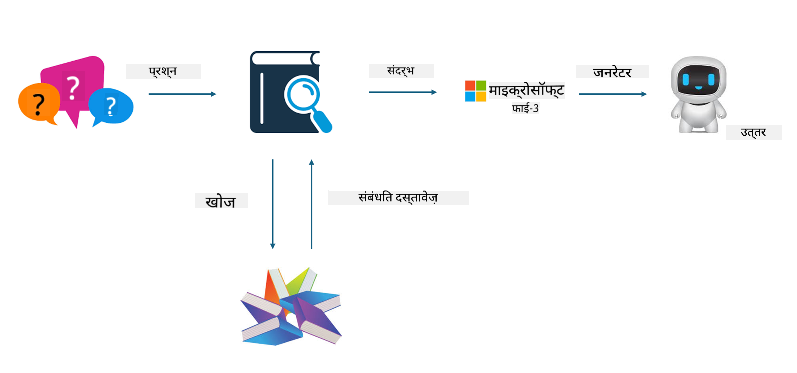

<!--
CO_OP_TRANSLATOR_METADATA:
{
  "original_hash": "743d7e9cb9c4e8ea642d77bee657a7fa",
  "translation_date": "2025-05-08T05:20:10+00:00",
  "source_file": "md/03.FineTuning/LetPhi3gotoIndustriy.md",
  "language_code": "hi"
}
-->
# **Phi-3 को एक उद्योग विशेषज्ञ बनाएं**

Phi-3 मॉडल को किसी उद्योग में लागू करने के लिए, आपको उद्योग के व्यवसाय डेटा को Phi-3 मॉडल में जोड़ना होगा। हमारे पास दो विकल्प हैं, पहला है RAG (Retrieval Augmented Generation) और दूसरा Fine Tuning।

## **RAG बनाम Fine-Tuning**

### **Retrieval Augmented Generation**

RAG डेटा पुनः प्राप्ति + टेक्स्ट जनरेशन है। एंटरप्राइज के संरचित और असंरचित डेटा को वेक्टर डेटाबेस में संग्रहित किया जाता है। जब प्रासंगिक सामग्री खोजी जाती है, तो संबंधित सारांश और सामग्री को संदर्भ बनाने के लिए पाया जाता है, और LLM/SLM की टेक्स्ट पूरा करने की क्षमता के साथ मिलाकर कंटेंट जनरेट किया जाता है।

### **Fine-tuning**

Fine-tuning किसी मॉडल में सुधार पर आधारित होता है। इसे मॉडल एल्गोरिदम से शुरू करने की जरूरत नहीं होती, लेकिन डेटा को लगातार इकट्ठा करना पड़ता है। यदि आप उद्योग अनुप्रयोगों में अधिक सटीक शब्दावली और भाषा अभिव्यक्ति चाहते हैं, तो fine-tuning बेहतर विकल्प है। लेकिन यदि आपका डेटा बार-बार बदलता रहता है, तो fine-tuning जटिल हो सकता है।

### **कैसे चुनें**

1. यदि हमारे उत्तर में बाहरी डेटा का उपयोग करना आवश्यक है, तो RAG सबसे अच्छा विकल्प है

2. यदि आपको स्थिर और सटीक उद्योग ज्ञान आउटपुट करना है, तो fine-tuning अच्छा विकल्प होगा। RAG प्रासंगिक सामग्री खींचने को प्राथमिकता देता है, लेकिन हमेशा विशेषज्ञता के सूक्ष्म पहलुओं को सही नहीं पकड़ पाता।

3. Fine-tuning के लिए उच्च गुणवत्ता वाला डेटा सेट चाहिए, और यदि डेटा सीमित है तो इसका ज्यादा फर्क नहीं पड़ेगा। RAG ज्यादा लचीला है।

4. Fine-tuning एक ब्लैक बॉक्स है, एक रहस्य है, और इसके आंतरिक तंत्र को समझना मुश्किल होता है। लेकिन RAG डेटा के स्रोत को आसानी से खोजने में मदद करता है, जिससे भ्रम या सामग्री त्रुटियों को प्रभावी ढंग से समायोजित किया जा सकता है और बेहतर पारदर्शिता मिलती है।

### **परिदृश्य**

1. विशिष्ट पेशेवर शब्दावली और अभिव्यक्तियों की आवश्यकता वाले वर्टिकल उद्योगों के लिए, ***Fine-tuning*** सबसे अच्छा विकल्प होगा

2. QA सिस्टम, जिसमें विभिन्न ज्ञान बिंदुओं का संयोजन शामिल हो, के लिए ***RAG*** सबसे उपयुक्त होगा

3. स्वचालित व्यवसाय प्रवाह के संयोजन के लिए ***RAG + Fine-tuning*** सबसे अच्छा विकल्प है

## **RAG का उपयोग कैसे करें**

वेक्टर डेटाबेस डेटा का एक संग्रह होता है जो गणितीय रूप में संग्रहित होता है। वेक्टर डेटाबेस मशीन लर्निंग मॉडल्स को पिछले इनपुट याद रखने में मदद करता है, जिससे खोज, सिफारिश और टेक्स्ट जनरेशन जैसे उपयोग मामलों के लिए मशीन लर्निंग का उपयोग संभव होता है। डेटा की पहचान समानता मेट्रिक्स के आधार पर की जा सकती है, न कि केवल सटीक मिलान पर, जिससे कंप्यूटर मॉडल डेटा के संदर्भ को समझ पाते हैं।

वेक्टर डेटाबेस RAG को साकार करने की कुंजी है। हम टेक्स्ट-एम्बेडिंग-3, jina-ai-embedding जैसे वेक्टर मॉडल के माध्यम से डेटा को वेक्टर संग्रह में परिवर्तित कर सकते हैं।

RAG एप्लिकेशन बनाने के बारे में अधिक जानने के लिए [https://github.com/microsoft/Phi-3CookBook](https://github.com/microsoft/Phi-3CookBook?WT.mc_id=aiml-138114-kinfeylo) देखें

## **Fine-tuning का उपयोग कैसे करें**

Fine-tuning में सामान्यतः उपयोग किए जाने वाले एल्गोरिदम Lora और QLora हैं। कैसे चुनें?
- [इस सैंपल नोटबुक के साथ अधिक जानें](../../../../code/04.Finetuning/Phi_3_Inference_Finetuning.ipynb)
- [Python FineTuning सैंपल का उदाहरण](../../../../code/04.Finetuning/FineTrainingScript.py)

### **Lora और QLora**

LoRA (Low-Rank Adaptation) और QLoRA (Quantized Low-Rank Adaptation) दोनों Parameter Efficient Fine Tuning (PEFT) तकनीकों का उपयोग करके बड़े भाषा मॉडल (LLMs) को फाइन-ट्यून करने के तरीके हैं। PEFT तकनीकें पारंपरिक तरीकों की तुलना में अधिक कुशलता से मॉडल प्रशिक्षण के लिए डिज़ाइन की गई हैं।  
LoRA एक स्वतंत्र फाइन-ट्यूनिंग तकनीक है जो वेट अपडेट मैट्रिक्स पर लो-रैंक अप्रोक्षिमेशन लागू करके मेमोरी उपयोग कम करती है। यह तेज प्रशिक्षण समय प्रदान करती है और पारंपरिक फाइन-ट्यूनिंग के करीब प्रदर्शन बनाए रखती है।

QLoRA, LoRA का एक विस्तारित संस्करण है जो मेमोरी उपयोग को और कम करने के लिए क्वांटाइज़ेशन तकनीकों को शामिल करता है। QLoRA प्री-ट्रेंड LLM में वेट पैरामीटर की सटीकता को 4-बिट तक क्वांटाइज़ करता है, जो LoRA की तुलना में अधिक मेमोरी कुशल है। हालांकि, QLoRA का प्रशिक्षण LoRA की तुलना में लगभग 30% धीमा होता है क्योंकि इसमें अतिरिक्त क्वांटाइज़ेशन और डी-क्वांटाइज़ेशन चरण होते हैं।

QLoRA, क्वांटाइज़ेशन के दौरान उत्पन्न त्रुटियों को ठीक करने के लिए LoRA का सहायक उपयोग करता है। QLoRA बड़े मॉडल्स को, जिनमें अरबों पैरामीटर होते हैं, अपेक्षाकृत छोटे और उपलब्ध GPUs पर फाइन-ट्यून करने में सक्षम बनाता है। उदाहरण के लिए, QLoRA 70B पैरामीटर मॉडल को 36 GPUs की जरूरत के बजाय केवल 2 GPUs पर फाइन-ट्यून कर सकता है।

**अस्वीकरण**:  
इस दस्तावेज़ का अनुवाद AI अनुवाद सेवा [Co-op Translator](https://github.com/Azure/co-op-translator) का उपयोग करके किया गया है। जबकि हम सटीकता के लिए प्रयासरत हैं, कृपया ध्यान दें कि स्वचालित अनुवादों में त्रुटियाँ या गलतियाँ हो सकती हैं। मूल दस्तावेज़ अपनी मूल भाषा में ही आधिकारिक स्रोत माना जाना चाहिए। महत्वपूर्ण जानकारी के लिए, पेशेवर मानव अनुवाद की सलाह दी जाती है। इस अनुवाद के उपयोग से उत्पन्न किसी भी गलतफहमी या गलत व्याख्या के लिए हम उत्तरदायी नहीं हैं।