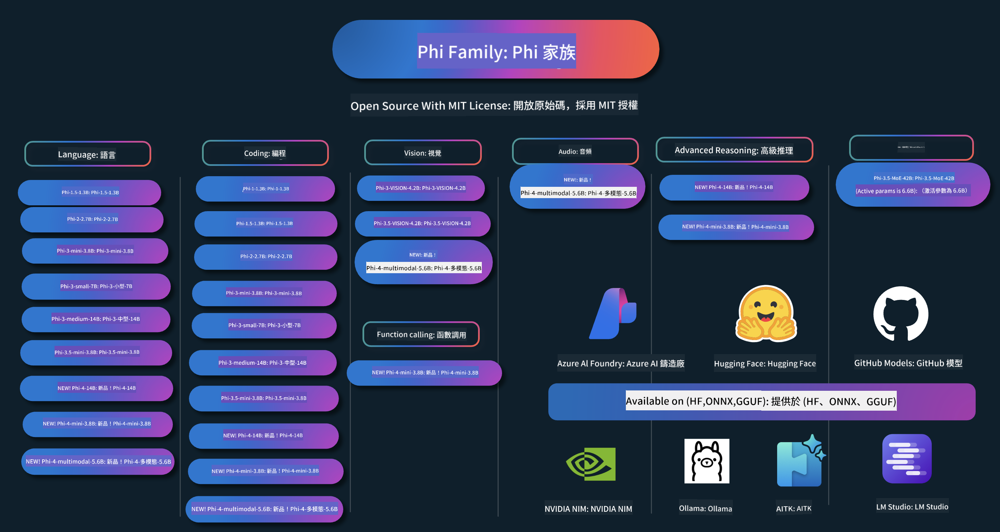

<!--
CO_OP_TRANSLATOR_METADATA:
{
  "original_hash": "10139744c0f1757a5ade1c66749e803f",
  "translation_date": "2025-05-04T13:36:18+00:00",
  "source_file": "README.md",
  "language_code": "hk"
}
-->
# Phi Cookbook: Microsoft Phi 模型實戰示例

Phi 係 Microsoft 開發嘅一系列開源 AI 模型。

Phi 目前係最強大同性價比最高嘅小型語言模型（SLM），喺多語言、推理、文字/聊天生成、編碼、圖像、音頻同其他場景都有好好嘅基準表現。

你可以將 Phi 部署喺雲端或者邊緣設備上，亦可以輕鬆用有限嘅計算資源建立生成式 AI 應用。

跟住以下步驟開始使用呢啲資源：
1. **Fork 個儲存庫**：Click 
2. **Clone 個儲存庫**：   `git clone https://github.com/microsoft/PhiCookBook.git`
3. [**加入 Microsoft AI Discord 社群，同專家同開發者交流**](https://discord.com/invite/ByRwuEEgH4?WT.mc_id=aiml-137032-kinfeylo)

## 🌐 多語言支援
[法文](../fr/README.md) | [西班牙文](../es/README.md) | [德文](../de/README.md) | [俄文](../ru/README.md) | [阿拉伯文](../ar/README.md) | [波斯文 (法爾西)](../fa/README.md) | [烏爾都文](../ur/README.md) | [中文 (簡體)](../zh/README.md) | [中文 (繁體，澳門)](../mo/README.md) | [中文 (繁體，香港)](./README.md) | [中文 (繁體，台灣)](../tw/README.md) | [日文](../ja/README.md) | [韓文](../ko/README.md) | [印地文](../hi/README.md) [孟加拉文](../bn/README.md) | [馬拉地文](../mr/README.md) | [尼泊爾文](../ne/README.md) | [旁遮普文 (古魯穆奇)](../pa/README.md) | [葡萄牙文 (葡萄牙)](../pt/README.md) | [葡萄牙文 (巴西)](../br/README.md) | [意大利文](../it/README.md) | [波蘭文](../pl/README.md) | [土耳其文](../tr/README.md) | [希臘文](../el/README.md) | [泰文](../th/README.md) | [瑞典文](../sv/README.md) | [丹麥文](../da/README.md) | [挪威文](../no/README.md) | [芬蘭文](../fi/README.md) | [荷蘭文](../nl/README.md) | [希伯來文](../he/README.md) | [越南文](../vi/README.md) | [印尼文](../id/README.md) | [馬來文](../ms/README.md) | [他加祿文 (菲律賓語)](../tl/README.md) | [斯瓦希里文](../sw/README.md) | [匈牙利文](../hu/README.md) | [捷克文](../cs/README.md) | [斯洛伐克文](../sk/README.md) | [羅馬尼亞文](../ro/README.md) | [保加利亞文](../bg/README.md) | [塞爾維亞文 (西里爾字母)](../sr/README.md) | [克羅地亞文](../hr/README.md) | [斯洛維尼亞文](../sl/README.md)Please write the output from left to right.

[法文](../fr/README.md) | [西班牙文](../es/README.md) | [德文](../de/README.md) | [俄文](../ru/README.md) | [阿拉伯文](../ar/README.md) | [波斯文 (法爾西)](../fa/README.md) | [烏爾都文](../ur/README.md) | [中文 (簡體)](../zh/README.md) | [中文 (繁體，澳門)](../mo/README.md) | [中文 (繁體，香港)](./README.md) | [中文 (繁體，台灣)](../tw/README.md) | [日文](../ja/README.md) | [韓文](../ko/README.md) | [印地文](../hi/README.md) [孟加拉文](../bn/README.md) | [馬拉地文](../mr/README.md) | [尼泊爾文](../ne/README.md) | [旁遮普文 (古魯穆奇)](../pa/README.md) | [葡萄牙文 (葡萄牙)](../pt/README.md) | [葡萄牙文 (巴西)](../br/README.md) | [意大利文](../it/README.md) | [波蘭文](../pl/README.md) | [土耳其文](../tr/README.md) | [希臘文](../el/README.md) | [泰文](../th/README.md) | [瑞典文](../sv/README.md) | [丹麥文](../da/README.md) | [挪威文](../no/README.md) | [芬蘭文](../fi/README.md) | [荷蘭文](../nl/README.md) | [希伯來文](../he/README.md) | [越南文](../vi/README.md) | [印尼文](../id/README.md) | [馬來文](../ms/README.md) | [他加祿文 (菲律賓語)](../tl/README.md) | [斯瓦希里文](../sw/README.md) | [匈牙利文](../hu/README.md) | [捷克文](../cs/README.md) | [斯洛伐克文](../sk/README.md) | [羅馬尼亞文](../ro/README.md) | [保加利亞文](../bg/README.md) | [塞爾維亞文 (西里爾字母)](../sr/README.md) | [克羅地亞文](../hr/README.md) | [斯洛維尼亞文](../sl/README.md)
## 目錄

- 介紹
  - [歡迎加入 Phi 家族](./md/01.Introduction/01/01.PhiFamily.md)
  - [設定你的環境](./md/01.Introduction/01/01.EnvironmentSetup.md)
  - [認識主要技術](./md/01.Introduction/01/01.Understandingtech.md)
  - [Phi 模型的 AI 安全](./md/01.Introduction/01/01.AISafety.md)
  - [Phi 硬件支援](./md/01.Introduction/01/01.Hardwaresupport.md)
  - [Phi 模型及跨平台可用性](./md/01.Introduction/01/01.Edgeandcloud.md)
  - [使用 Guidance-ai 與 Phi](./md/01.Introduction/01/01.Guidance.md)
  - [GitHub Marketplace 模型](https://github.com/marketplace/models)
  - [Azure AI 模型目錄](https://ai.azure.com)

- 不同環境下的 Phi 推論
    -  [Hugging face](./md/01.Introduction/02/01.HF.md)
    -  [GitHub 模型](./md/01.Introduction/02/02.GitHubModel.md)
    -  [Azure AI Foundry 模型目錄](./md/01.Introduction/02/03.AzureAIFoundry.md)
    -  [Ollama](./md/01.Introduction/02/04.Ollama.md)
    -  [AI Toolkit VSCode (AITK)](./md/01.Introduction/02/05.AITK.md)
    -  [NVIDIA NIM](./md/01.Introduction/02/06.NVIDIA.md)

- Phi 家族的推論
    - [iOS 上的 Phi 推論](./md/01.Introduction/03/iOS_Inference.md)
    - [Android 上的 Phi 推論](./md/01.Introduction/03/Android_Inference.md)
    - [Jetson 上的 Phi 推論](./md/01.Introduction/03/Jetson_Inference.md)
    - [AI PC 上的 Phi 推論](./md/01.Introduction/03/AIPC_Inference.md)
    - [使用 Apple MLX Framework 的 Phi 推論](./md/01.Introduction/03/MLX_Inference.md)
    - [本地伺服器上的 Phi 推論](./md/01.Introduction/03/Local_Server_Inference.md)
    - [使用 AI Toolkit 的遠端伺服器 Phi 推論](./md/01.Introduction/03/Remote_Interence.md)
    - [用 Rust 進行 Phi 推論](./md/01.Introduction/03/Rust_Inference.md)
    - [本地 Phi--Vision 推論](./md/01.Introduction/03/Vision_Inference.md)
    - [使用 Kaito AKS、Azure Containers（官方支援）的 Phi 推論](./md/01.Introduction/03/Kaito_Inference.md)
-  [Phi 家族量化](./md/01.Introduction/04/QuantifyingPhi.md)
    - [用 llama.cpp 量化 Phi-3.5 / 4](./md/01.Introduction/04/UsingLlamacppQuantifyingPhi.md)
    - [用 onnxruntime 的生成式 AI 擴展量化 Phi-3.5 / 4](./md/01.Introduction/04/UsingORTGenAIQuantifyingPhi.md)
    - [用 Intel OpenVINO 量化 Phi-3.5 / 4](./md/01.Introduction/04/UsingIntelOpenVINOQuantifyingPhi.md)
    - [用 Apple MLX Framework 量化 Phi-3.5 / 4](./md/01.Introduction/04/UsingAppleMLXQuantifyingPhi.md)

- Phi 評估
- [Response AI](./md/01.Introduction/05/ResponsibleAI.md)
    - [Azure AI Foundry for Evaluation](./md/01.Introduction/05/AIFoundry.md)
    - [Using Promptflow for Evaluation](./md/01.Introduction/05/Promptflow.md)
 
- RAG 同 Azure AI Search
    - [點用 Phi-4-mini 同 Phi-4-multimodal(RAG) 配合 Azure AI Search](https://github.com/microsoft/PhiCookBook/blob/main/code/06.E2E/E2E_Phi-4-RAG-Azure-AI-Search.ipynb)

- Phi 應用開發範例
  - 文字同聊天應用
    - Phi-4 範例 🆕
      - [📓] [用 Phi-4-mini ONNX 模型聊天](./md/02.Application/01.TextAndChat/Phi4/ChatWithPhi4ONNX/README.md)
      - [用 Phi-4 本地 ONNX 模型聊天 .NET](../../md/04.HOL/dotnet/src/LabsPhi4-Chat-01OnnxRuntime)
      - [用 Semantic Kernel 同 Phi-4 ONNX 做 .NET Console App 聊天](../../md/04.HOL/dotnet/src/LabsPhi4-Chat-02SK)
    - Phi-3 / 3.5 範例
      - [用 Phi3、ONNX Runtime Web 同 WebGPU 喺瀏覽器做本地聊天機械人](https://github.com/microsoft/onnxruntime-inference-examples/tree/main/js/chat)
      - [OpenVino 聊天](./md/02.Application/01.TextAndChat/Phi3/E2E_OpenVino_Chat.md)
      - [多模型互動 - Phi-3-mini 同 OpenAI Whisper](./md/02.Application/01.TextAndChat/Phi3/E2E_Phi-3-mini_with_whisper.md)
      - [MLFlow - 建立包裝器同用 Phi-3 配合 MLFlow](./md//02.Application/01.TextAndChat/Phi3/E2E_Phi-3-MLflow.md)
      - [模型優化 - 點樣用 Olive 優化 Phi-3-mini 模型配 ONNX Runtime Web](https://github.com/microsoft/Olive/tree/main/examples/phi3)
      - [WinUI3 App 配合 Phi-3 mini-4k-instruct-onnx](https://github.com/microsoft/Phi3-Chat-WinUI3-Sample/)
      -[WinUI3 多模型 AI 助力筆記 App 範例](https://github.com/microsoft/ai-powered-notes-winui3-sample)
      - [微調同整合自訂 Phi-3 模型配 Prompt flow](./md/02.Application/01.TextAndChat/Phi3/E2E_Phi-3-FineTuning_PromptFlow_Integration.md)
      - [喺 Azure AI Foundry 用 Prompt flow 微調同整合自訂 Phi-3 模型](./md/02.Application/01.TextAndChat/Phi3/E2E_Phi-3-FineTuning_PromptFlow_Integration_AIFoundry.md)
      - [評估微調咗嘅 Phi-3 / Phi-3.5 模型喺 Azure AI Foundry，專注 Microsoft 嘅 Responsible AI 原則](./md/02.Application/01.TextAndChat/Phi3/E2E_Phi-3-Evaluation_AIFoundry.md)
      - [📓] [Phi-3.5-mini-instruct 語言預測範例（中文/英文）](../../md/02.Application/01.TextAndChat/Phi3/phi3-instruct-demo.ipynb)
      - [Phi-3.5-Instruct WebGPU RAG 聊天機械人](./md/02.Application/01.TextAndChat/Phi3/WebGPUWithPhi35Readme.md)
      - [用 Windows GPU 配合 Phi-3.5-Instruct ONNX 做 Prompt flow 解決方案](./md/02.Application/01.TextAndChat/Phi3/UsingPromptFlowWithONNX.md)
      - [用 Microsoft Phi-3.5 tflite 做 Android app](./md/02.Application/01.TextAndChat/Phi3/UsingPhi35TFLiteCreateAndroidApp.md)
      - [Q&A .NET 範例，用本地 ONNX Phi-3 模型同 Microsoft.ML.OnnxRuntime](../../md/04.HOL/dotnet/src/LabsPhi301)
      - [用 Semantic Kernel 同 Phi-3 做 Console chat .NET app](../../md/04.HOL/dotnet/src/LabsPhi302)

  - Azure AI Inference SDK 代碼範例
    - Phi-4 範例 🆕
      - [📓] [用 Phi-4-multimodal 生成項目代碼](./md/02.Application/02.Code/Phi4/GenProjectCode/README.md)
    - Phi-3 / 3.5 範例
      - [用 Microsoft Phi-3 家族喺 Visual Studio Code 搭建 GitHub Copilot Chat](./md/02.Application/02.Code/Phi3/VSCodeExt/README.md)
      - [用 Phi-3.5 同 GitHub 模型喺 Visual Studio Code 搭建 Chat Copilot Agent](/md/02.Application/02.Code/Phi3/CreateVSCodeChatAgentWithGitHubModels.md)

  - 進階推理範例
    - Phi-4 範例 🆕
      - [📓] [Phi-4-mini-reasoning 或 Phi-4-reasoning 範例](./md/02.Application/03.AdvancedReasoning/Phi4/AdvancedResoningPhi4mini/README.md)
      - [📓] [用 Microsoft Olive 微調 Phi-4-mini-reasoning](../../md/02.Application/03.AdvancedReasoning/Phi4/AdvancedResoningPhi4mini/olive_ft_phi_4_reasoning_with_medicaldata.ipynb)
      - [📓] [用 Apple MLX 微調 Phi-4-mini-reasoning](../../md/02.Application/03.AdvancedReasoning/Phi4/AdvancedResoningPhi4mini/mlx_ft_phi_4_reasoning_with_medicaldata.ipynb)
      - [📓] [Phi-4-mini-reasoning 同 GitHub 模型](../../md/02.Application/02.Code/Phi4r/github_models_inference.ipynb)
- [📓] [Phi-4-mini 用 Azure AI Foundry Models 推理](../../md/02.Application/02.Code/Phi4r/azure_models_inference.ipynb)
  - 示範
      - [Phi-4-mini 示範喺 Hugging Face Spaces 上](https://huggingface.co/spaces/microsoft/phi-4-mini?WT.mc_id=aiml-137032-kinfeylo)
      - [Phi-4-multimodal 示範喺 Hugging Face Spaces 上](https://huggingface.co/spaces/microsoft/phi-4-multimodal?WT.mc_id=aiml-137032-kinfeylo)
  - 視覺範例
    - Phi-4 範例 🆕
      - [📓] [用 Phi-4-multimodal 讀圖同產生代碼](./md/02.Application/04.Vision/Phi4/CreateFrontend/README.md) 
    - Phi-3 / 3.5 範例
      -  [📓][Phi-3-vision 圖像文字轉文字](../../md/02.Application/04.Vision/Phi3/E2E_Phi-3-vision-image-text-to-text-online-endpoint.ipynb)
      - [Phi-3-vision-ONNX](https://onnxruntime.ai/docs/genai/tutorials/phi3-v.html)
      - [📓][Phi-3-vision CLIP 嵌入](../../md/02.Application/04.Vision/Phi3/E2E_Phi-3-vision-image-text-to-text-online-endpoint.ipynb)
      - [示範: Phi-3 Recycling](https://github.com/jennifermarsman/PhiRecycling/)
      - [Phi-3-vision - 視覺語言助理 - 用 Phi3-Vision 同 OpenVINO](https://docs.openvino.ai/nightly/notebooks/phi-3-vision-with-output.html)
      - [Phi-3 Vision Nvidia NIM](./md/02.Application/04.Vision/Phi3/E2E_Nvidia_NIM_Vision.md)
      - [Phi-3 Vision OpenVino](./md/02.Application/04.Vision/Phi3/E2E_OpenVino_Phi3Vision.md)
      - [📓][Phi-3.5 Vision 多幀或多圖像範例](../../md/02.Application/04.Vision/Phi3/phi3-vision-demo.ipynb)
      - [Phi-3 Vision 本地 ONNX 模型 用 Microsoft.ML.OnnxRuntime .NET](../../md/04.HOL/dotnet/src/LabsPhi303)
      - [菜單式 Phi-3 Vision 本地 ONNX 模型 用 Microsoft.ML.OnnxRuntime .NET](../../md/04.HOL/dotnet/src/LabsPhi304)

  - 音頻範例
    - Phi-4 範例 🆕
      - [📓] [用 Phi-4-multimodal 摘錄音頻文字稿](./md/02.Application/05.Audio/Phi4/Transciption/README.md)
      - [📓] [Phi-4-multimodal 音頻範例](../../md/02.Application/05.Audio/Phi4/Siri/demo.ipynb)
      - [📓] [Phi-4-multimodal 語音翻譯範例](../../md/02.Application/05.Audio/Phi4/Translate/demo.ipynb)
      - [.NET 控制台應用程式 用 Phi-4-multimodal 音頻分析音頻文件同產生文字稿](../../md/04.HOL/dotnet/src/LabsPhi4-MultiModal-02Audio)

  - MOE 範例
    - Phi-3 / 3.5 範例
      - [📓] [Phi-3.5 混合專家模型 (MoEs) 社交媒體範例](../../md/02.Application/06.MoE/Phi3/phi3_moe_demo.ipynb)
      - [📓] [用 NVIDIA NIM Phi-3 MOE、Azure AI Search 同 LlamaIndex 建 Retrieval-Augmented Generation (RAG) 流程](../../md/02.Application/06.MoE/Phi3/azure-ai-search-nvidia-rag.ipynb)
  - 函數調用範例
    - Phi-4 範例 🆕
      -  [📓] [用 Function Calling 同 Phi-4-mini](./md/02.Application/07.FunctionCalling/Phi4/FunctionCallingBasic/README.md)
      -  [📓] [用 Function Calling 建立多代理同 Phi-4-mini](../../md/02.Application/07.FunctionCalling/Phi4/Multiagents/Phi_4_mini_multiagent.ipynb)
      -  [📓] [用 Function Calling 同 Ollama](../../md/02.Application/07.FunctionCalling/Phi4/Ollama/ollama_functioncalling.ipynb)
  - 多模態混合範例
    - Phi-4 範例 🆕
      -  [📓] [用 Phi-4-multimodal 做科技記者](../../md/02.Application/08.Multimodel/Phi4/TechJournalist/phi_4_mm_audio_text_publish_news.ipynb)
      - [.NET 控制台應用程式 用 Phi-4-multimodal 分析圖像](../../md/04.HOL/dotnet/src/LabsPhi4-MultiModal-01Images)

- Phi 微調範例
  - [微調場景](./md/03.FineTuning/FineTuning_Scenarios.md)
  - [微調 vs RAG](./md/03.FineTuning/FineTuning_vs_RAG.md)
  - [微調令 Phi-3 成為行業專家](./md/03.FineTuning/LetPhi3gotoIndustriy.md)
  - [用 AI Toolkit for VS Code 微調 Phi-3](./md/03.FineTuning/Finetuning_VSCodeaitoolkit.md)
  - [用 Azure Machine Learning Service 微調 Phi-3](./md/03.FineTuning/Introduce_AzureML.md)
- [用 Lora 微調 Phi-3](./md/03.FineTuning/FineTuning_Lora.md)
  - [用 QLora 微調 Phi-3](./md/03.FineTuning/FineTuning_Qlora.md)
  - [用 Azure AI Foundry 微調 Phi-3](./md/03.FineTuning/FineTuning_AIFoundry.md)
  - [用 Azure ML CLI/SDK 微調 Phi-3](./md/03.FineTuning/FineTuning_MLSDK.md)
  - [用 Microsoft Olive 微調](./md/03.FineTuning/FineTuning_MicrosoftOlive.md)
  - [Microsoft Olive 實作工作坊微調](./md/03.FineTuning/olive-lab/readme.md)
  - [用 Weights and Bias 微調 Phi-3-vision](./md/03.FineTuning/FineTuning_Phi-3-visionWandB.md)
  - [用 Apple MLX Framework 微調 Phi-3](./md/03.FineTuning/FineTuning_MLX.md)
  - [Phi-3-vision 微調（官方支援）](./md/03.FineTuning/FineTuning_Vision.md)
  - [用 Kaito AKS、Azure Containers 微調 Phi-3（官方支援）](./md/03.FineTuning/FineTuning_Kaito.md)
  - [Phi-3 及 3.5 Vision 微調](https://github.com/2U1/Phi3-Vision-Finetune)

- 實作工作坊
  - [探索前沿模型：LLMs、SLMs、本地開發等](https://github.com/microsoft/aitour-exploring-cutting-edge-models)
  - [發掘 NLP 潛力：用 Microsoft Olive 微調](https://github.com/azure/Ignite_FineTuning_workshop)

- 學術研究論文及出版物
  - [Textbooks Are All You Need II：phi-1.5 技術報告](https://arxiv.org/abs/2309.05463)
  - [Phi-3 技術報告：一個能在手機本地運行的高效能語言模型](https://arxiv.org/abs/2404.14219)
  - [Phi-4 技術報告](https://arxiv.org/abs/2412.08905)
  - [Phi-4-Mini 技術報告：透過 Mixture-of-LoRAs 打造緊湊但強大的多模態語言模型](https://arxiv.org/abs/2503.01743)
  - [優化車載功能調用用的小型語言模型](https://arxiv.org/abs/2501.02342)
  - [(WhyPHI) 微調 PHI-3 用於多項選擇題答題：方法、結果及挑戰](https://arxiv.org/abs/2501.01588)
  - [Phi-4 推理技術報告](https://www.microsoft.com/en-us/research/wp-content/uploads/2025/04/phi_4_reasoning.pdf)
  - [Phi-4-mini 推理技術報告](https://huggingface.co/microsoft/Phi-4-mini-reasoning/blob/main/Phi-4-Mini-Reasoning.pdf)

## 使用 Phi 模型

### Phi 在 Azure AI Foundry

你可以學習如何使用 Microsoft Phi，並在不同硬件裝置上打造端對端解決方案。想親身體驗 Phi，可以先從試玩模型開始，並透過 [Azure AI Foundry Azure AI Model Catalog](https://aka.ms/phi3-azure-ai) 為你的場景定制 Phi。更多詳情請參考[Azure AI Foundry 入門指南](/md/02.QuickStart/AzureAIFoundry_QuickStart.md)

**遊樂場**
每個模型都有專屬的遊樂場讓你測試模型，[Azure AI Playground](https://aka.ms/try-phi3)。

### Phi 在 GitHub 模型

你可以學習如何使用 Microsoft Phi，並在不同硬件裝置上打造端對端解決方案。想親身體驗 Phi，可以先從試玩模型開始，並透過 [GitHub Model Catalog](https://github.com/marketplace/models?WT.mc_id=aiml-137032-kinfeylo) 為你的場景定制 Phi。更多詳情請參考[GitHub Model Catalog 入門指南](/md/02.QuickStart/GitHubModel_QuickStart.md)

**遊樂場**
每個模型都有專屬的[遊樂場讓你測試模型](/md/02.QuickStart/GitHubModel_QuickStart.md)。

### Phi 在 Hugging Face

你也可以在 [Hugging Face](https://huggingface.co/microsoft) 找到這些模型。

**遊樂場**
[Hugging Chat 遊樂場](https://huggingface.co/chat/models/microsoft/Phi-3-mini-4k-instruct)

## 負責任的 AI

Microsoft 致力協助客戶負責任地使用我們的 AI 產品，分享我們的經驗，並透過 Transparency Notes 及 Impact Assessments 等工具建立基於信任的合作關係。這些資源大多可以在 [https://aka.ms/RAI](https://aka.ms/RAI) 找到。  
Microsoft 的負責任 AI 方針根植於我們的 AI 原則：公平性、可靠性與安全性、私隱與安全、包容性、透明度及問責制。
大型自然語言、圖像及語音模型——例如本範例中使用的模型——可能會出現不公平、不可靠或冒犯性的行為，從而造成傷害。請參閱 [Azure OpenAI service Transparency note](https://learn.microsoft.com/legal/cognitive-services/openai/transparency-note?tabs=text) 了解相關風險及限制。

建議採用的方法是於系統架構中加入安全機制，以偵測及防止有害行為。[Azure AI Content Safety](https://learn.microsoft.com/azure/ai-services/content-safety/overview) 提供獨立的保護層，能夠偵測應用程式及服務中使用者產生及 AI 產生的有害內容。Azure AI Content Safety 包含文字及圖像 API，方便你偵測有害資料。在 Azure AI Foundry 中，Content Safety 服務讓你檢視、探索及試用偵測不同模態有害內容的範例程式碼。以下的 [quickstart documentation](https://learn.microsoft.com/azure/ai-services/content-safety/quickstart-text?tabs=visual-studio%2Clinux&pivots=programming-language-rest) 將指引你如何向服務發出請求。

另一個需要考慮的方面是整體應用程式的效能。對於多模態及多模型應用，我們認為效能是指系統能如你及用戶所期望般運作，包括不產生有害輸出。評估整體應用程式效能時，建議使用 [Performance and Quality and Risk and Safety evaluators](https://learn.microsoft.com/azure/ai-studio/concepts/evaluation-metrics-built-in)。你亦可以使用 [custom evaluators](https://learn.microsoft.com/azure/ai-studio/how-to/develop/evaluate-sdk#custom-evaluators) 自行建立及評估。

你可以在開發環境中使用 [Azure AI Evaluation SDK](https://microsoft.github.io/promptflow/index.html) 評估你的 AI 應用程式。無論是測試資料集或目標，你的生成式 AI 產出都會透過內建或自訂評估器進行量化測量。要開始使用 azure ai evaluation sdk 評估系統，可以參考 [quickstart guide](https://learn.microsoft.com/azure/ai-studio/how-to/develop/flow-evaluate-sdk)。執行評估後，你可以在 [Azure AI Foundry](https://learn.microsoft.com/azure/ai-studio/how-to/evaluate-flow-results) 觀看結果視覺化。

## 商標

本專案可能包含專案、產品或服務的商標或標誌。授權使用 Microsoft 商標或標誌須遵守並符合 [Microsoft's Trademark & Brand Guidelines](https://www.microsoft.com/legal/intellectualproperty/trademarks/usage/general)。  
在本專案修改版本中使用 Microsoft 商標或標誌，不得引起混淆或暗示 Microsoft 贊助。第三方商標或標誌的使用須遵守該第三方的政策。

**免責聲明**：  
本文件係用 AI 翻譯服務 [Co-op Translator](https://github.com/Azure/co-op-translator) 翻譯而成。雖然我哋致力確保準確性，但請注意，自動翻譯可能包含錯誤或不準確之處。原始文件嘅母語版本應被視為權威來源。對於重要資料，建議採用專業人工翻譯。因使用本翻譯而引致嘅任何誤解或誤譯，我哋概不負責。