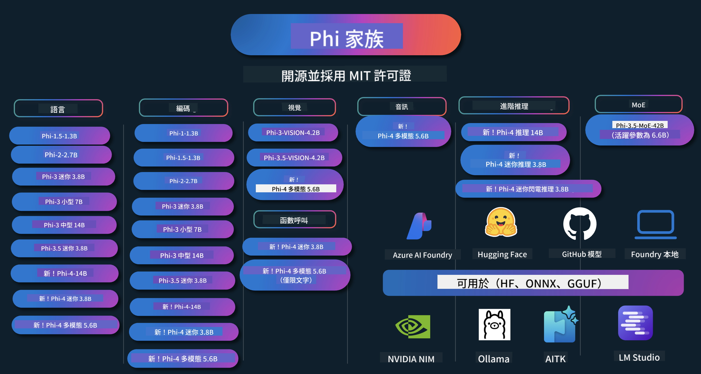

<!--
CO_OP_TRANSLATOR_METADATA:
{
  "original_hash": "ef3a50368712b1a7483d0def1f70c490",
  "translation_date": "2025-12-21T10:26:37+00:00",
  "source_file": "README.md",
  "language_code": "hk"
}
-->
# Phi Cookbook: 與 Microsoft 的 Phi 模型的實作範例

Phi 是微軟開發的一系列開源人工智慧模型。

Phi 目前是最強大且具成本效益的小型語言模型（SLM），在多語言、推理、文字/聊天生成、程式碼、影像、音訊等多個場景上有相當優異的基準表現。

你可以將 Phi 部署到雲端或邊緣裝置，並能在有限計算資源下輕鬆構建生成式 AI 應用程式。

按照以下步驟開始使用這些資源：
1. **Fork 倉庫**：點擊 
2. **複製倉庫**：   `git clone https://github.com/microsoft/PhiCookBook.git`
3. [**加入 Microsoft AI Discord 社群，與專家及其他開發者交流**](https://discord.com/invite/ByRwuEEgH4?WT.mc_id=aiml-137032-kinfeylo)

### 🌐 多語言支援

#### 透過 GitHub Action 支援（自動化且保持最新）

<!-- CO-OP TRANSLATOR LANGUAGES TABLE START -->
[阿拉伯語](../ar/README.md) | [孟加拉語](../bn/README.md) | [保加利亞語](../bg/README.md) | [緬甸語（緬甸）](../my/README.md) | [中文（簡體）](../zh/README.md) | [中文（繁體，香港）](./README.md) | [中文（繁體，澳門）](../mo/README.md) | [中文（繁體，台灣）](../tw/README.md) | [克羅地亞語](../hr/README.md) | [捷克語](../cs/README.md) | [丹麥語](../da/README.md) | [荷蘭語](../nl/README.md) | [愛沙尼亞語](../et/README.md) | [芬蘭語](../fi/README.md) | [法語](../fr/README.md) | [德語](../de/README.md) | [希臘語](../el/README.md) | [希伯來語](../he/README.md) | [印地語](../hi/README.md) | [匈牙利語](../hu/README.md) | [印尼語](../id/README.md) | [意大利語](../it/README.md) | [日語](../ja/README.md) | [坎納達語](../kn/README.md) | [韓語](../ko/README.md) | [立陶宛語](../lt/README.md) | [馬來語](../ms/README.md) | [馬拉雅拉姆語](../ml/README.md) | [馬拉地語](../mr/README.md) | [尼泊爾語](../ne/README.md) | [奈及利亞皮欽語](../pcm/README.md) | [挪威語](../no/README.md) | [波斯語（法爾西）](../fa/README.md) | [波蘭語](../pl/README.md) | [葡萄牙語（巴西）](../br/README.md) | [葡萄牙語（葡萄牙）](../pt/README.md) | [旁遮普語（Gurmukhi）](../pa/README.md) | [羅馬尼亞語](../ro/README.md) | [俄語](../ru/README.md) | [塞爾維亞語（西里爾字母）](../sr/README.md) | [斯洛伐克語](../sk/README.md) | [斯洛維尼亞語](../sl/README.md) | [西班牙語](../es/README.md) | [斯瓦希里語](../sw/README.md) | [瑞典語](../sv/README.md) | [他加祿語（菲律賓語）](../tl/README.md) | [泰米爾語](../ta/README.md) | [泰盧固語](../te/README.md) | [泰語](../th/README.md) | [土耳其語](../tr/README.md) | [烏克蘭語](../uk/README.md) | [烏爾都語](../ur/README.md) | [越南語](../vi/README.md)
<!-- CO-OP TRANSLATOR LANGUAGES TABLE END -->

## 目錄

- 介紹
  - [歡迎加入 Phi 家族](./md/01.Introduction/01/01.PhiFamily.md)
  - [設定你的環境](./md/01.Introduction/01/01.EnvironmentSetup.md)
  - [理解關鍵技術](./md/01.Introduction/01/01.Understandingtech.md)
  - [Phi 模型的 AI 安全](./md/01.Introduction/01/01.AISafety.md)
  - [Phi 硬體支援](./md/01.Introduction/01/01.Hardwaresupport.md)
  - [Phi 模型與各平台上的可用性](./md/01.Introduction/01/01.Edgeandcloud.md)
  - [使用 Guidance-ai 與 Phi](./md/01.Introduction/01/01.Guidance.md)
  - [GitHub Marketplace 模型](https://github.com/marketplace/models)
  - [Azure AI 模型目錄](https://ai.azure.com)

- 在不同環境中推論 Phi
    -  [Hugging face](./md/01.Introduction/02/01.HF.md)
    -  [GitHub 模型](./md/01.Introduction/02/02.GitHubModel.md)
    -  [Azure AI Foundry 模型目錄](./md/01.Introduction/02/03.AzureAIFoundry.md)
    -  [Ollama](./md/01.Introduction/02/04.Ollama.md)
    -  [AI Toolkit VSCode (AITK)](./md/01.Introduction/02/05.AITK.md)
    -  [NVIDIA NIM](./md/01.Introduction/02/06.NVIDIA.md)
    -  [Foundry 本地](./md/01.Introduction/02/07.FoundryLocal.md)

- Phi 家族推論
    - [在 iOS 上推論 Phi](./md/01.Introduction/03/iOS_Inference.md)
    - [在 Android 上推論 Phi](./md/01.Introduction/03/Android_Inference.md)
    - [在 Jetson 上推論 Phi](./md/01.Introduction/03/Jetson_Inference.md)
    - [在 AI PC 上推論 Phi](./md/01.Introduction/03/AIPC_Inference.md)
    - [使用 Apple MLX 框架推論 Phi](./md/01.Introduction/03/MLX_Inference.md)
    - [在本地伺服器推論 Phi](./md/01.Introduction/03/Local_Server_Inference.md)
    - [使用 AI Toolkit 在遠端伺服器推論 Phi](./md/01.Introduction/03/Remote_Interence.md)
    - [使用 Rust 推論 Phi](./md/01.Introduction/03/Rust_Inference.md)
    - [本地視覺推論 Phi](./md/01.Introduction/03/Vision_Inference.md)
    - [使用 Kaito AKS、Azure Containers（官方支援）推論 Phi](./md/01.Introduction/03/Kaito_Inference.md)
-  [Phi 家族量化](./md/01.Introduction/04/QuantifyingPhi.md)
    - [使用 llama.cpp 對 Phi-3.5 / 4 進行量化](./md/01.Introduction/04/UsingLlamacppQuantifyingPhi.md)
    - [使用 onnxruntime 的 Generative AI 擴充對 Phi-3.5 / 4 進行量化](./md/01.Introduction/04/UsingORTGenAIQuantifyingPhi.md)
    - [使用 Intel OpenVINO 對 Phi-3.5 / 4 進行量化](./md/01.Introduction/04/UsingIntelOpenVINOQuantifyingPhi.md)
    - [使用 Apple MLX 框架對 Phi-3.5 / 4 進行量化](./md/01.Introduction/04/UsingAppleMLXQuantifyingPhi.md)

-  Phi 評估
    - [負責任的 AI](./md/01.Introduction/05/ResponsibleAI.md)
    - [用於評估的 Azure AI Foundry](./md/01.Introduction/05/AIFoundry.md)
    - [使用 Promptflow 進行評估](./md/01.Introduction/05/Promptflow.md)
 
- 使用 Azure AI Search 的 RAG
    - [如何將 Phi-4-mini 與 Phi-4-multimodal(RAG) 與 Azure AI Search 一起使用](https://github.com/microsoft/PhiCookBook/blob/main/code/06.E2E/E2E_Phi-4-RAG-Azure-AI-Search.ipynb)

- Phi 應用程式開發範例
  - 文字與聊天應用
    - Phi-4 範例 🆕
      - [📓] [與 Phi-4-mini ONNX 模型 聊天](./md/02.Application/01.TextAndChat/Phi4/ChatWithPhi4ONNX/README.md)
      - [在 .NET 上使用本地 Phi-4 ONNX 模型 聊天](../../md/04.HOL/dotnet/src/LabsPhi4-Chat-01OnnxRuntime)
      - [使用 Sementic Kernel 的 .NET 主控台應用程式與 Phi-4 ONNX 聊天](../../md/04.HOL/dotnet/src/LabsPhi4-Chat-02SK)
    - Phi-3 / 3.5 範例
      - [在瀏覽器中使用 Phi3、ONNX Runtime Web 及 WebGPU 的本地聊天機器人](https://github.com/microsoft/onnxruntime-inference-examples/tree/main/js/chat)
      - [OpenVino 聊天](./md/02.Application/01.TextAndChat/Phi3/E2E_OpenVino_Chat.md)
      - [多模型 - 互動式 Phi-3-mini 與 OpenAI Whisper](./md/02.Application/01.TextAndChat/Phi3/E2E_Phi-3-mini_with_whisper.md)
      - [MLFlow - 建立封裝並使用 Phi-3 與 MLFlow](./md//02.Application/01.TextAndChat/Phi3/E2E_Phi-3-MLflow.md)
      - [Model Optimization - How to optimize Phi-3-min model for ONNX Runtime Web with Olive](https://github.com/microsoft/Olive/tree/main/examples/phi3)
      - [WinUI3 App with Phi-3 mini-4k-instruct-onnx](https://github.com/microsoft/Phi3-Chat-WinUI3-Sample/)
      -[WinUI3 Multi Model AI Powered Notes App Sample](https://github.com/microsoft/ai-powered-notes-winui3-sample)
      - [Fine-tune and Integrate custom Phi-3 models with Prompt flow](./md/02.Application/01.TextAndChat/Phi3/E2E_Phi-3-FineTuning_PromptFlow_Integration.md)
      - [Fine-tune and Integrate custom Phi-3 models with Prompt flow in Azure AI Foundry](./md/02.Application/01.TextAndChat/Phi3/E2E_Phi-3-FineTuning_PromptFlow_Integration_AIFoundry.md)
      - [Evaluate the Fine-tuned Phi-3 / Phi-3.5 Model in Azure AI Foundry Focusing on Microsoft's Responsible AI Principles](./md/02.Application/01.TextAndChat/Phi3/E2E_Phi-3-Evaluation_AIFoundry.md)
      - [📓] [Phi-3.5-mini-instruct language prediction sample (Chinese/English)](./md/02.Application/01.TextAndChat/Phi3/phi3-instruct-demo.ipynb)
      - [Phi-3.5-Instruct WebGPU RAG Chatbot](./md/02.Application/01.TextAndChat/Phi3/WebGPUWithPhi35Readme.md)
      - [Using Windows GPU to create Prompt flow solution with Phi-3.5-Instruct ONNX](./md/02.Application/01.TextAndChat/Phi3/UsingPromptFlowWithONNX.md)
      - [Using Microsoft Phi-3.5 tflite to create Android app](./md/02.Application/01.TextAndChat/Phi3/UsingPhi35TFLiteCreateAndroidApp.md)
      - [Q&A .NET Example using local ONNX Phi-3 model using the Microsoft.ML.OnnxRuntime](../../md/04.HOL/dotnet/src/LabsPhi301)
      - [Console chat .NET app with Semantic Kernel and Phi-3](../../md/04.HOL/dotnet/src/LabsPhi302)

  - Azure AI Inference SDK Code Based Samples 
    - Phi-4 Samples 🆕
      - [📓] [Generate project code using Phi-4-multimodal](./md/02.Application/02.Code/Phi4/GenProjectCode/README.md)
    - Phi-3 / 3.5 Samples
      - [Build your own Visual Studio Code GitHub Copilot Chat with Microsoft Phi-3 Family](./md/02.Application/02.Code/Phi3/VSCodeExt/README.md)
      - [Create your own Visual Studio Code Chat Copilot Agent with Phi-3.5 by GitHub Models](/md/02.Application/02.Code/Phi3/CreateVSCodeChatAgentWithGitHubModels.md)

  - Advanced Reasoning Samples
    - Phi-4 Samples 🆕
      - [📓] [Phi-4-mini-reasoning or Phi-4-reasoning Samples](./md/02.Application/03.AdvancedReasoning/Phi4/AdvancedResoningPhi4mini/README.md)
      - [📓] [Fine-tuning Phi-4-mini-reasoning with Microsoft Olive](./md/02.Application/03.AdvancedReasoning/Phi4/AdvancedResoningPhi4mini/olive_ft_phi_4_reasoning_with_medicaldata.ipynb)
      - [📓] [Fine-tuning Phi-4-mini-reasoning with Apple MLX](./md/02.Application/03.AdvancedReasoning/Phi4/AdvancedResoningPhi4mini/mlx_ft_phi_4_reasoning_with_medicaldata.ipynb)
      - [📓] [Phi-4-mini-reasoning with GitHub Models](./md/02.Application/02.Code/Phi4r/github_models_inference.ipynb)
      - [📓] [Phi-4-mini-reasoning with Azure AI Foundry Models](./md/02.Application/02.Code/Phi4r/azure_models_inference.ipynb)
  - Demos
      - [Phi-4-mini demos hosted on Hugging Face Spaces](https://huggingface.co/spaces/microsoft/phi-4-mini?WT.mc_id=aiml-137032-kinfeylo)
      - [Phi-4-multimodal demos hosted on Hugginge Face Spaces](https://huggingface.co/spaces/microsoft/phi-4-multimodal?WT.mc_id=aiml-137032-kinfeylo)
  - Vision Samples
    - Phi-4 Samples 🆕
      - [📓] [Use Phi-4-multimodal to read images and generate code](./md/02.Application/04.Vision/Phi4/CreateFrontend/README.md) 
    - Phi-3 / 3.5 Samples
      -  [📓][Phi-3-vision-Image text to text](./md/02.Application/04.Vision/Phi3/E2E_Phi-3-vision-image-text-to-text-online-endpoint.ipynb)
      - [Phi-3-vision-ONNX](https://onnxruntime.ai/docs/genai/tutorials/phi3-v.html)
      - [📓][Phi-3-vision CLIP Embedding](./md/02.Application/04.Vision/Phi3/E2E_Phi-3-vision-image-text-to-text-online-endpoint.ipynb)
      - [DEMO: Phi-3 Recycling](https://github.com/jennifermarsman/PhiRecycling/)
      - [Phi-3-vision - Visual language assistant - with Phi3-Vision and OpenVINO](https://docs.openvino.ai/nightly/notebooks/phi-3-vision-with-output.html)
      - [Phi-3 Vision Nvidia NIM](./md/02.Application/04.Vision/Phi3/E2E_Nvidia_NIM_Vision.md)
      - [Phi-3 Vision OpenVino](./md/02.Application/04.Vision/Phi3/E2E_OpenVino_Phi3Vision.md)
      - [📓][Phi-3.5 Vision multi-frame or multi-image sample](./md/02.Application/04.Vision/Phi3/phi3-vision-demo.ipynb)
      - [Phi-3 Vision Local ONNX Model using the Microsoft.ML.OnnxRuntime .NET](../../md/04.HOL/dotnet/src/LabsPhi303)
      - [Menu based Phi-3 Vision Local ONNX Model using the Microsoft.ML.OnnxRuntime .NET](../../md/04.HOL/dotnet/src/LabsPhi304)

  - Math Samples
    -  Phi-4-Mini-Flash-Reasoning-Instruct Samples 🆕 [Math Demo with Phi-4-Mini-Flash-Reasoning-Instruct](./md/02.Application/09.Math/MathDemo.ipynb)

  - Audio Samples
    - Phi-4 Samples 🆕
      - [📓] [Extracting audio transcripts using Phi-4-multimodal](./md/02.Application/05.Audio/Phi4/Transciption/README.md)
      - [📓] [Phi-4-multimodal Audio Sample](./md/02.Application/05.Audio/Phi4/Siri/demo.ipynb)
      - [📓] [Phi-4-multimodal Speech Translation Sample](./md/02.Application/05.Audio/Phi4/Translate/demo.ipynb)
      - [.NET console application using Phi-4-multimodal Audio to analyze an audio file and generate transcript](../../md/04.HOL/dotnet/src/LabsPhi4-MultiModal-02Audio)

  - MOE Samples
    - Phi-3 / 3.5 Samples
      - [📓] [Phi-3.5 Mixture of Experts Models (MoEs) Social Media Sample](./md/02.Application/06.MoE/Phi3/phi3_moe_demo.ipynb)
      - [📓] [Building a Retrieval-Augmented Generation (RAG) Pipeline with NVIDIA NIM Phi-3 MOE, Azure AI Search, and LlamaIndex](./md/02.Application/06.MoE/Phi3/azure-ai-search-nvidia-rag.ipynb)
      - 
  - Function Calling Samples
    - Phi-4 Samples 🆕
      -  [📓] [Using Function Calling With Phi-4-mini](./md/02.Application/07.FunctionCalling/Phi4/FunctionCallingBasic/README.md)
      -  [📓] [Using Function Calling to create multi-agents With Phi-4-mini](./md/02.Application/07.FunctionCalling/Phi4/Multiagents/Phi_4_mini_multiagent.ipynb)
      -  [📓] [Using Function Calling with Ollama](./md/02.Application/07.FunctionCalling/Phi4/Ollama/ollama_functioncalling.ipynb)
      -  [📓] [Using Function Calling with ONNX](../../md/02.Application/07.FunctionCalling/Phi4/ONNX/onnx_parallel_functioncalling_ipynb)
  - Multimodal Mixing Samples
    - Phi-4 Samples 🆕
      -  [📓] [Using Phi-4-multimodal as a Technology journalist](./md/02.Application/08.Multimodel/Phi4/TechJournalist/phi_4_mm_audio_text_publish_news.ipynb)
      - [.NET console application using Phi-4-multimodal to analyze images](../../md/04.HOL/dotnet/src/LabsPhi4-MultiModal-01Images)

- Fine-tuning Phi Samples
  - [Fine-tuning Scenarios](./md/03.FineTuning/FineTuning_Scenarios.md)
  - [Fine-tuning vs RAG](./md/03.FineTuning/FineTuning_vs_RAG.md)
  - [Fine-tuning Let Phi-3 become an industry expert](./md/03.FineTuning/LetPhi3gotoIndustriy.md)
  - [Fine-tuning Phi-3 with AI Toolkit for VS Code](./md/03.FineTuning/Finetuning_VSCodeaitoolkit.md)
  - [Fine-tuning Phi-3 with Azure Machine Learning Service](./md/03.FineTuning/Introduce_AzureML.md)
  - [Fine-tuning Phi-3 with Lora](./md/03.FineTuning/FineTuning_Lora.md)
  - [Fine-tuning Phi-3 with QLora](./md/03.FineTuning/FineTuning_Qlora.md)
  - [Fine-tuning Phi-3 with Azure AI Foundry](./md/03.FineTuning/FineTuning_AIFoundry.md)
  - [Fine-tuning Phi-3 with Azure ML CLI/SDK](./md/03.FineTuning/FineTuning_MLSDK.md)
  - [Fine-tuning with Microsoft Olive](./md/03.FineTuning/FineTuning_MicrosoftOlive.md)
  - [Fine-tuning with Microsoft Olive Hands-On Lab](./md/03.FineTuning/olive-lab/readme.md)
  - [Fine-tuning Phi-3-vision with Weights and Bias](./md/03.FineTuning/FineTuning_Phi-3-visionWandB.md)
  - [Fine-tuning Phi-3 with Apple MLX Framework](./md/03.FineTuning/FineTuning_MLX.md)
  - [Fine-tuning Phi-3-vision (official support)](./md/03.FineTuning/FineTuning_Vision.md)
  - [Fine-Tuning Phi-3 with Kaito AKS , Azure Containers(official Support)](./md/03.FineTuning/FineTuning_Kaito.md)
  - [Fine-Tuning Phi-3 and 3.5 Vision](https://github.com/2U1/Phi3-Vision-Finetune)

- Hands on Lab
  - [Exploring cutting-edge models: LLMs, SLMs, local development and more](https://github.com/microsoft/aitour-exploring-cutting-edge-models)
  - [Unlocking NLP Potential: Fine-Tuning with Microsoft Olive](https://github.com/azure/Ignite_FineTuning_workshop)

- Academic Research Papers and Publications
  - [Textbooks Are All You Need II: phi-1.5 technical report](https://arxiv.org/abs/2309.05463)
  - [Phi-3 Technical Report: A Highly Capable Language Model Locally on Your Phone](https://arxiv.org/abs/2404.14219)
  - [Phi-4 Technical Report](https://arxiv.org/abs/2412.08905)
  - [Phi-4-Mini 技術報告：透過 Mixture-of-LoRAs 實現緊湊但強大的多模態語言模型](https://arxiv.org/abs/2503.01743)
  - [為車載函數調用優化小型語言模型](https://arxiv.org/abs/2501.02342)
  - [(WhyPHI) 將 PHI-3 微調用於多選題問答：方法、結果與挑戰](https://arxiv.org/abs/2501.01588)
  - [Phi-4-reasoning 技術報告](https://www.microsoft.com/en-us/research/wp-content/uploads/2025/04/phi_4_reasoning.pdf)
  - [Phi-4-mini-reasoning 技術報告](https://huggingface.co/microsoft/Phi-4-mini-reasoning/blob/main/Phi-4-Mini-Reasoning.pdf)

## 使用 Phi 模型

### Phi 在 Azure AI Foundry

你可以學習如何使用 Microsoft Phi 以及如何在不同硬體設備上構建端到端解決方案。若想親自體驗 Phi，可先透過模型進行試用，並使用 [Azure AI Foundry Azure AI Model Catalog](https://aka.ms/phi3-azure-ai) 為你的場景自訂 Phi。你可以在 Getting Started with [Azure AI Foundry](/md/02.QuickStart/AzureAIFoundry_QuickStart.md) 了解更多。

**Playground**
每個模型都有專屬的試玩平台可供測試 [Azure AI Playground](https://aka.ms/try-phi3)。

### Phi 在 GitHub 模型

你可以學習如何使用 Microsoft Phi 以及如何在不同硬體設備上構建端到端解決方案。若想親自體驗 Phi，可先透過模型進行試用，並使用 [GitHub Model Catalog](https://github.com/marketplace/models?WT.mc_id=aiml-137032-kinfeylo) 為你的場景自訂 Phi。你可以在 Getting Started with [GitHub Model Catalog](/md/02.QuickStart/GitHubModel_QuickStart.md) 了解更多。

**Playground**
每個模型都有專屬的 [playground to test the model](/md/02.QuickStart/GitHubModel_QuickStart.md)。

### Phi 在 Hugging Face

你也可以在 [Hugging Face](https://huggingface.co/microsoft) 找到該模型。

**Playground**
 [Hugging Chat playground](https://huggingface.co/chat/models/microsoft/Phi-3-mini-4k-instruct)

 ## 🎒 其他課程

我們團隊還製作了其他課程！看看以下內容：

<!-- CO-OP TRANSLATOR OTHER COURSES START -->
### LangChain

---

### Azure / Edge / MCP / Agents

---
 
### 生成式 AI 系列

[-9333EA?style=for-the-badge&labelColor=E5E7EB&color=9333EA)](https://github.com/microsoft/Generative-AI-for-beginners-dotnet?WT.mc_id=academic-105485-koreyst)
[-C084FC?style=for-the-badge&labelColor=E5E7EB&color=C084FC)](https://github.com/microsoft/generative-ai-for-beginners-java?WT.mc_id=academic-105485-koreyst)
[-E879F9?style=for-the-badge&labelColor=E5E7EB&color=E879F9)](https://github.com/microsoft/generative-ai-with-javascript?WT.mc_id=academic-105485-koreyst)

---
 
### 核心學習

---
 
### Copilot 系列

<!-- CO-OP TRANSLATOR OTHER COURSES END -->

## 負責任的 AI 

Microsoft 致力於協助客戶負責任地使用我們的 AI 產品、分享我們的學習，並透過像 Transparency Notes 和 Impact Assessments 這類工具建立以信任為基礎的合作關係。許多這些資源可在 [https://aka.ms/RAI](https://aka.ms/RAI) 找到。
Microsoft 對負責任 AI 的方法建立在我們的 AI 原則之上：公平性、可靠與安全、隱私與安全、包容性、透明度與問責制。

大型的自然語言、影像與語音模型——就像此範例中使用的模型——可能會以不公平、不可靠或具冒犯性的方式表現，從而導致傷害。請參閱 [Azure OpenAI service Transparency note](https://learn.microsoft.com/legal/cognitive-services/openai/transparency-note?tabs=text) 以了解風險與限制。

建議的風險緩解做法是在你的架構中加入一個安全系統，能夠偵測並防止有害行為。[Azure AI Content Safety](https://learn.microsoft.com/azure/ai-services/content-safety/overview) 提供一層獨立的保護，能夠在應用程式與服務中偵測使用者產生與 AI 產生的有害內容。Azure AI Content Safety 包含可檢測有害內容的文字與影像 API。在 Azure AI Foundry 中，Content Safety 服務讓你可以檢視、探索並試用不同模態偵測有害內容的示例程式碼。以下的 [quickstart documentation](https://learn.microsoft.com/azure/ai-services/content-safety/quickstart-text?tabs=visual-studio%2Clinux&pivots=programming-language-rest) 指引會帶你完成向該服務發送請求的流程。

另一個需要考量的面向是整體應用程式效能。對於多模態與多模型的應用，我們認為效能代表系統能以你與你的使用者所期望的方式運作，包括不產生有害輸出。評估整體應用效能時，建議使用 [Performance and Quality and Risk and Safety evaluators](https://learn.microsoft.com/azure/ai-studio/concepts/evaluation-metrics-built-in)。你也可以使用並建立 [custom evaluators](https://learn.microsoft.com/azure/ai-studio/how-to/develop/evaluate-sdk#custom-evaluators) 來進行評估。

你可以在開發環境中使用 [Azure AI Evaluation SDK](https://microsoft.github.io/promptflow/index.html) 評估你的 AI 應用程式。給定測試資料集或目標後，你的生成式 AI 輸出可使用內建或自訂評估器進行量化衡量。若要開始使用 Azure AI 評估 SDK 評估你的系統，可以參考 [quickstart guide](https://learn.microsoft.com/azure/ai-studio/how-to/develop/flow-evaluate-sdk)。執行評估後，你可以在 [Azure AI Foundry 中視覺化結果](https://learn.microsoft.com/azure/ai-studio/how-to/evaluate-flow-results)。 

## 商標
此專案可能包含項目、產品或服務的商標或標誌。授權使用 Microsoft 商標或標誌需遵守並必須遵循 [Microsoft 的商標與品牌指南](https://www.microsoft.com/legal/intellectualproperty/trademarks/usage/general)。
在本專案的修改版本中使用 Microsoft 的商標或標誌，不得導致混淆或暗示 Microsoft 的贊助。任何第三方商標或標誌的使用皆受該第三方政策約束。

## 尋求協助

如果你在建立 AI 應用程式時遇到困難或有任何問題，請加入：

如果你在開發期間有產品意見反饋或遇到錯誤，請造訪：

---

<!-- CO-OP TRANSLATOR DISCLAIMER START -->
免責聲明：
本文件由 AI 翻譯服務 Co‑op Translator（https://github.com/Azure/co-op-translator）翻譯。雖然我們力求準確，但請注意，自動翻譯可能包含錯誤或不準確之處。原始文件的原文應被視為具權威性的版本。如涉及重要資訊，建議採用專業人工翻譯。我們不對因使用本翻譯而導致的任何誤解或誤釋承擔責任。
<!-- CO-OP TRANSLATOR DISCLAIMER END -->