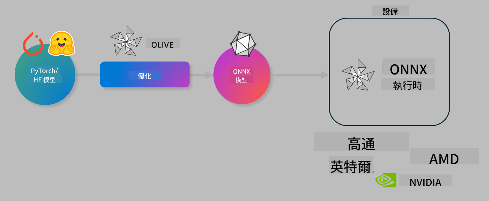

<!--
CO_OP_TRANSLATOR_METADATA:
{
  "original_hash": "76956c0c22e5686908a6d85ec72126af",
  "translation_date": "2025-04-04T17:11:33+00:00",
  "source_file": "code\\03.Finetuning\\olive-lab\\readme.md",
  "language_code": "hk"
}
-->
# 實驗室：優化 AI 模型以進行裝置端推理

## 簡介

> [!IMPORTANT]
> 此實驗需要 **Nvidia A10 或 A100 GPU**，並安裝相關驅動程式和 CUDA 工具包（版本 12+）。

> [!NOTE]
> 這是一個 **35 分鐘** 的實驗，將帶您實際操作 OLIVE，學習如何優化模型以進行裝置端推理。

## 學習目標

完成此實驗後，您將能夠使用 OLIVE 來：

- 使用 AWQ 量化方法對 AI 模型進行量化。
- 為特定任務微調 AI 模型。
- 為 ONNX Runtime 生成 LoRA 適配器（微調後的模型），以實現高效的裝置端推理。

### 什麼是 Olive

Olive (*O*NNX *live*) 是一個模型優化工具包，附帶的 CLI 可幫助您為 ONNX runtime +++https://onnxruntime.ai+++ 提供高質量和高效能的模型。



Olive 的輸入通常是一個 PyTorch 或 Hugging Face 模型，輸出是一個經過優化的 ONNX 模型，可在運行 ONNX runtime 的裝置（部署目標）上執行。Olive 將針對由硬體供應商（如 Qualcomm、AMD、Nvidia 或 Intel）提供的部署目標的 AI 加速器（NPU、GPU、CPU）進行模型優化。

Olive 執行一個 *工作流程*，即一系列有序的模型優化任務，稱為 *passes*。例如：模型壓縮、圖捕獲、量化、圖優化等。每個 pass 都有一組參數，可進行調整以實現最佳指標（如準確性和延遲），這些指標由相應的評估器進行評估。Olive 使用搜尋策略，通過搜尋算法自動調整每個 pass 或多個 pass 的參數。

#### Olive 的優勢

- **減少挫敗感和時間**，無需反覆嘗試不同的圖優化、壓縮和量化技術。您只需定義質量和效能約束，Olive 會自動為您找到最佳模型。
- **超過 40 個內建模型優化組件**，涵蓋量化、壓縮、圖優化和微調的尖端技術。
- **簡單易用的 CLI**，適用於常見的模型優化任務。例如：`olive quantize`、`olive auto-opt`、`olive finetune`。
- 內建的模型打包和部署功能。
- 支援生成 **多 LoRA 服務** 模型。
- 使用 YAML/JSON 構建工作流程，以編排模型優化和部署任務。
- 與 **Hugging Face** 和 **Azure AI** 集成。
- 內建 **快取** 機制，**節省成本**。

## 實驗步驟
> [!NOTE]
> 請確保您已根據實驗 1 配置 Azure AI Hub 和專案，並設置好 A100 計算資源。

### 步驟 0：連接到 Azure AI 計算資源

您將使用 **VS Code** 的遠端功能連接到 Azure AI 計算資源。

1. 打開 **VS Code** 桌面應用程式：
2. 使用 **Shift+Ctrl+P** 打開 **命令面板**。
3. 在命令面板中搜尋 **AzureML - remote: Connect to compute instance in New Window**。
4. 按照屏幕上的指示連接到計算資源，這包括選擇您在實驗 1 中設置的 Azure 訂閱、資源群組、專案和計算名稱。
5. 成功連接後，您將在 **VS Code 左下角** 看到連接狀態 `><Azure ML: Compute Name`。

### 步驟 1：克隆此存儲庫

在 VS Code 中，使用 **Ctrl+J** 打開新終端，並克隆此存儲庫：

在終端中，您應該看到提示：

```
azureuser@computername:~/cloudfiles/code$ 
```
克隆解決方案：

```bash
cd ~/localfiles
git clone https://github.com/microsoft/phi-3cookbook.git
```

### 步驟 2：在 VS Code 中打開資料夾

在終端中執行以下命令，以在相關資料夾中打開 VS Code，這將開啟一個新窗口：

```bash
code phi-3cookbook/code/04.Finetuning/Olive-lab
```

或者，您可以通過選擇 **檔案** > **打開資料夾** 打開資料夾。

### 步驟 3：安裝依賴項

在 VS Code 的 Azure AI 計算實例中打開終端窗口（提示：**Ctrl+J**），並執行以下命令來安裝依賴項：

```bash
conda create -n olive-ai python=3.11 -y
conda activate olive-ai
pip install -r requirements.txt
az extension remove -n azure-cli-ml
az extension add -n ml
```

> [!NOTE]
> 安裝所有依賴項大約需要 5 分鐘。

在此實驗中，您將下載並上傳模型到 Azure AI 模型目錄。為了訪問模型目錄，您需要使用以下命令登錄 Azure：

```bash
az login
```

> [!NOTE]
> 登錄時，系統會要求您選擇訂閱。請確保選擇實驗提供的訂閱。

### 步驟 4：執行 Olive 命令

在 VS Code 的 Azure AI 計算實例中打開終端窗口（提示：**Ctrl+J**），並確保已激活 `olive-ai` conda 環境：

```bash
conda activate olive-ai
```

接下來，在命令行中執行以下 Olive 命令：

1. **檢查數據：** 在此示例中，您將微調 Phi-3.5-Mini 模型，使其專注於回答與旅行相關的問題。以下代碼顯示數據集的前幾條記錄，這些記錄以 JSON 行格式存儲：

    ```bash
    head data/data_sample_travel.jsonl
    ```
    
2. **量化模型：** 在訓練模型之前，先使用以下命令進行量化，該命令使用一種名為 Active Aware Quantization (AWQ) 的技術 +++https://arxiv.org/abs/2306.00978+++。AWQ 根據推理期間生成的激活值來量化模型的權重。這意味著量化過程考慮了激活值的實際數據分佈，與傳統的權重量化方法相比，能更好地保留模型準確性。

    ```bash
    olive quantize \
       --model_name_or_path microsoft/Phi-3.5-mini-instruct \
       --trust_remote_code \
       --algorithm awq \
       --output_path models/phi/awq \
       --log_level 1
    ```
    
    該過程需要 **約 8 分鐘**，完成後模型大小將從 **~7.5GB 減少到 ~2.5GB**。

    在此實驗中，我們向您展示如何從 Hugging Face 載入模型（例如：`microsoft/Phi-3.5-mini-instruct`). However, Olive also allows you to input models from the Azure AI catalog by updating the `model_name_or_path` argument to an Azure AI asset ID (for example:  `azureml://registries/azureml/models/Phi-3.5-mini-instruct/versions/4`). 

1. **Train the model:** Next, the `olive finetune` 命令微調量化後的模型。在量化後再進行微調能獲得更好的準確性，因為微調過程能恢復一些因量化造成的損失。

    ```bash
    olive finetune \
        --method lora \
        --model_name_or_path models/phi/awq \
        --data_files "data/data_sample_travel.jsonl" \
        --data_name "json" \
        --text_template "<|user|>\n{prompt}<|end|>\n<|assistant|>\n{response}<|end|>" \
        --max_steps 100 \
        --output_path ./models/phi/ft \
        --log_level 1
    ```
    
    微調過程需要 **約 6 分鐘**（進行 100 步）。

3. **優化：** 模型訓練完成後，您可以使用 Olive 的 `auto-opt` command, which will capture the ONNX graph and automatically perform a number of optimizations to improve the model performance for CPU by compressing the model and doing fusions. It should be noted, that you can also optimize for other devices such as NPU or GPU by just updating the `--device` and `--provider` 參數來優化模型。但在本實驗中，我們將使用 CPU。

    ```bash
    olive auto-opt \
       --model_name_or_path models/phi/ft/model \
       --adapter_path models/phi/ft/adapter \
       --device cpu \
       --provider CPUExecutionProvider \
       --use_ort_genai \
       --output_path models/phi/onnx-ao \
       --log_level 1
    ```
    
    該過程需要 **約 5 分鐘** 完成優化。

### 步驟 5：模型推理快速測試

為了測試模型的推理功能，在您的資料夾中創建一個名為 **app.py** 的 Python 文件，並複製以下代碼：

```python
import onnxruntime_genai as og
import numpy as np

print("loading model and adapters...", end="", flush=True)
model = og.Model("models/phi/onnx-ao/model")
adapters = og.Adapters(model)
adapters.load("models/phi/onnx-ao/model/adapter_weights.onnx_adapter", "travel")
print("DONE!")

tokenizer = og.Tokenizer(model)
tokenizer_stream = tokenizer.create_stream()

params = og.GeneratorParams(model)
params.set_search_options(max_length=100, past_present_share_buffer=False)
user_input = "what is the best thing to see in chicago"
params.input_ids = tokenizer.encode(f"<|user|>\n{user_input}<|end|>\n<|assistant|>\n")

generator = og.Generator(model, params)

generator.set_active_adapter(adapters, "travel")

print(f"{user_input}")

while not generator.is_done():
    generator.compute_logits()
    generator.generate_next_token()

    new_token = generator.get_next_tokens()[0]
    print(tokenizer_stream.decode(new_token), end='', flush=True)

print("\n")
```

使用以下命令執行代碼：

```bash
python app.py
```

### 步驟 6：將模型上傳到 Azure AI

將模型上傳到 Azure AI 模型存儲庫，可以讓開發團隊的其他成員共享該模型，並管理模型的版本控制。使用以下命令上傳模型：

> [!NOTE]
> 更新 `{}` placeholders with the name of your resource group and Azure AI Project Name. 

To find your resource group `"resourceGroup"` 和 Azure AI 專案名稱，然後執行以下命令：

```
az ml workspace show
```

或者，您可以前往 +++ai.azure.com+++，選擇 **管理中心** > **專案** > **概覽**。

更新 `{}` 占位符為您的資源群組和 Azure AI 專案名稱。

```bash
az ml model create \
    --name ft-for-travel \
    --version 1 \
    --path ./models/phi/onnx-ao \
    --resource-group {RESOURCE_GROUP_NAME} \
    --workspace-name {PROJECT_NAME}
```
您可以在 https://ml.azure.com/model/list 查看您上傳的模型並進行部署。

**免責聲明**:  
此文件已使用AI翻譯服務 [Co-op Translator](https://github.com/Azure/co-op-translator) 翻譯。我們致力於提供準確的翻譯，但請注意，自動翻譯可能包含錯誤或不準確之處。應以原文作為權威來源。對於重要信息，建議尋求專業人工翻譯。我們對因使用此翻譯而引起的任何誤解或錯誤解釋概不負責。