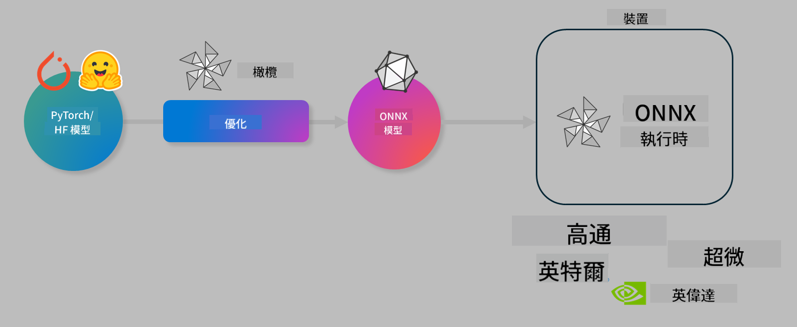

<!--
CO_OP_TRANSLATOR_METADATA:
{
  "original_hash": "6bbe47de3b974df7eea29dfeccf6032b",
  "translation_date": "2025-05-08T06:31:25+00:00",
  "source_file": "code/04.Finetuning/olive-lab/readme.md",
  "language_code": "hk"
}
-->
# Lab. 優化 AI 模型以進行裝置端推理

## 介紹

> [!IMPORTANT]
> 此實驗室需要配備 **Nvidia A10 或 A100 GPU** 及相應的驅動程式和 CUDA 工具包（版本 12+）已安裝。

> [!NOTE]
> 這是一個 **35 分鐘** 的實驗室，將帶你實際體驗使用 OLIVE 進行裝置端推理模型優化的核心概念。

## 學習目標

完成本實驗室後，你將能夠使用 OLIVE 來：

- 使用 AWQ 量化方法對 AI 模型進行量化。
- 對 AI 模型進行特定任務的微調。
- 生成 LoRA 適配器（微調模型），以便在 ONNX Runtime 上高效地進行裝置端推理。

### 什麼是 Olive

Olive（*O*NNX *live*）是一套模型優化工具包，配有命令行介面，能讓你為 ONNX runtime +++https://onnxruntime.ai+++ 發佈具備品質和效能的模型。



Olive 的輸入通常是 PyTorch 或 Hugging Face 模型，輸出則是優化後的 ONNX 模型，該模型會在運行 ONNX runtime 的裝置（部署目標）上執行。Olive 會根據部署目標的 AI 加速器（NPU、GPU、CPU）進行優化，這些硬體由 Qualcomm、AMD、Nvidia 或 Intel 等廠商提供。

Olive 執行一個 *workflow*，即一系列有序的個別模型優化任務，稱為 *passes*。範例 pass 包括：模型壓縮、圖捕捉、量化、圖優化。每個 pass 都有一組可調參數，以達成最佳指標，如準確度和延遲，這些指標由相應的評估器進行評估。Olive 採用搜尋策略，利用搜尋演算法逐個或同時調整多個 pass。

#### Olive 的優點

- **減少因不同圖優化、壓縮和量化技術的反覆試驗而產生的挫折和時間。** 設定你的品質與效能限制，讓 Olive 自動為你尋找最佳模型。
- **內建 40 多種模型優化元件，** 涵蓋量化、壓縮、圖優化及微調等先進技術。
- **易用的 CLI**，適用於常見模型優化任務，例如 olive quantize、olive auto-opt、olive finetune。
- 內建模型封裝與部署功能。
- 支援生成用於 **多 LoRA 服務** 的模型。
- 可使用 YAML/JSON 建構工作流程，協調模型優化與部署任務。
- 整合 **Hugging Face** 與 **Azure AI**。
- 內建 **快取** 機制，**節省成本**。

## 實驗室指引

> [!NOTE]
> 請確保你已依照實驗室 1 的步驟，配置好 Azure AI Hub、專案及 A100 計算資源。

### 步驟 0：連接至 Azure AI Compute

你將使用 **VS Code** 的遠端功能連接 Azure AI 計算資源。

1. 打開你的 **VS Code** 桌面應用程式：
2. 使用 **Shift+Ctrl+P** 打開 **命令面板**。
3. 在命令面板搜尋 **AzureML - remote: Connect to compute instance in New Window**。
4. 按照螢幕指示連接 Compute，過程中會選擇你的 Azure 訂閱、資源群組、專案及你在實驗室 1 中設定的 Compute 名稱。
5. 成功連接後，Azure ML Compute 節點會顯示在 Visual Code 左下角 `><Azure ML: Compute Name`。

### 步驟 1：Clone 這個 repo

在 VS Code 中，你可以用 **Ctrl+J** 開啟新終端機，並 clone 此 repo：

終端機會顯示提示：

```
azureuser@computername:~/cloudfiles/code$ 
```  
Clone the solution

```bash
cd ~/localfiles
git clone https://github.com/microsoft/phi-3cookbook.git
```

### 步驟 2：在 VS Code 開啟資料夾

在終端機執行以下指令，會在新視窗開啟 VS Code 的相關資料夾：

```bash
code phi-3cookbook/code/04.Finetuning/Olive-lab
```

或者，你也可以透過選擇 **File** > **Open Folder** 開啟資料夾。

### 步驟 3：安裝相依套件

在 VS Code 的 Azure AI Compute 實例中開啟終端機（提示：**Ctrl+J**），執行以下指令安裝相依套件：

```bash
conda create -n olive-ai python=3.11 -y
conda activate olive-ai
pip install -r requirements.txt
az extension remove -n azure-cli-ml
az extension add -n ml
```

> [!NOTE]
> 安裝所有相依套件約需 5 分鐘。

此實驗室中，你會下載並上傳模型至 Azure AI 模型目錄。要存取模型目錄，你需要登入 Azure：

```bash
az login
```

> [!NOTE]
> 登入時會要求選擇訂閱，請選擇本實驗室提供的訂閱。

### 步驟 4：執行 Olive 指令

在 VS Code 的 Azure AI Compute 實例中開啟終端機（提示：**Ctrl+J**），並確保已啟動 `olive-ai` conda 環境：

```bash
conda activate olive-ai
```

接著，在命令列執行以下 Olive 指令。

1. **檢視資料：** 此範例中，你將微調 Phi-3.5-Mini 模型，使其專門回答旅遊相關問題。以下程式碼會顯示資料集的前幾筆紀錄，資料格式為 JSON lines：

    ```bash
    head data/data_sample_travel.jsonl
    ```

1. **量化模型：** 訓練模型前，先用以下指令進行量化，使用稱為 Active Aware Quantization (AWQ) +++https://arxiv.org/abs/2306.00978+++ 的技術。AWQ 透過考慮推理期間產生的激活值來量化模型權重，這代表量化過程會考慮激活值的實際資料分佈，與傳統的權重量化方法相比，能更好地保留模型準確度。

    ```bash
    olive quantize \
       --model_name_or_path microsoft/Phi-3.5-mini-instruct \
       --trust_remote_code \
       --algorithm awq \
       --output_path models/phi/awq \
       --log_level 1
    ```

    AWQ 量化約需 **8 分鐘**，可將模型大小從約 7.5GB 減少至約 2.5GB。

    在本實驗室中，我們示範如何從 Hugging Face 輸入模型（例如：`microsoft/Phi-3.5-mini-instruct`). However, Olive also allows you to input models from the Azure AI catalog by updating the `model_name_or_path` argument to an Azure AI asset ID (for example:  `azureml://registries/azureml/models/Phi-3.5-mini-instruct/versions/4`). 

1. **Train the model:** Next, the `olive finetune` 指令會微調量化後的模型）。先量化再微調能比先微調後量化達到更佳的準確度，因為微調過程能恢復部分量化造成的損失。

    ```bash
    olive finetune \
        --method lora \
        --model_name_or_path models/phi/awq \
        --data_files "data/data_sample_travel.jsonl" \
        --data_name "json" \
        --text_template "<|user|>\n{prompt}<|end|>\n<|assistant|>\n{response}<|end|>" \
        --max_steps 100 \
        --output_path ./models/phi/ft \
        --log_level 1
    ```

    微調（100 步）約需 **6 分鐘**。

1. **優化：** 模型訓練完成後，使用 Olive 的 `auto-opt` command, which will capture the ONNX graph and automatically perform a number of optimizations to improve the model performance for CPU by compressing the model and doing fusions. It should be noted, that you can also optimize for other devices such as NPU or GPU by just updating the `--device` and `--provider` 參數優化模型，但本實驗室中我們使用 CPU。

    ```bash
    olive auto-opt \
       --model_name_or_path models/phi/ft/model \
       --adapter_path models/phi/ft/adapter \
       --device cpu \
       --provider CPUExecutionProvider \
       --use_ort_genai \
       --output_path models/phi/onnx-ao \
       --log_level 1
    ```

    優化約需 **5 分鐘**。

### 步驟 5：模型推理快速測試

要測試模型推理，在資料夾中建立名為 **app.py** 的 Python 檔案，並貼上以下程式碼：

```python
import onnxruntime_genai as og
import numpy as np

print("loading model and adapters...", end="", flush=True)
model = og.Model("models/phi/onnx-ao/model")
adapters = og.Adapters(model)
adapters.load("models/phi/onnx-ao/model/adapter_weights.onnx_adapter", "travel")
print("DONE!")

tokenizer = og.Tokenizer(model)
tokenizer_stream = tokenizer.create_stream()

params = og.GeneratorParams(model)
params.set_search_options(max_length=100, past_present_share_buffer=False)
user_input = "what is the best thing to see in chicago"
params.input_ids = tokenizer.encode(f"<|user|>\n{user_input}<|end|>\n<|assistant|>\n")

generator = og.Generator(model, params)

generator.set_active_adapter(adapters, "travel")

print(f"{user_input}")

while not generator.is_done():
    generator.compute_logits()
    generator.generate_next_token()

    new_token = generator.get_next_tokens()[0]
    print(tokenizer_stream.decode(new_token), end='', flush=True)

print("\n")
```

使用以下指令執行程式：

```bash
python app.py
```

### 步驟 6：上傳模型至 Azure AI

將模型上傳至 Azure AI 模型庫，可讓團隊其他成員共享模型，並管理模型版本。執行以下指令上傳模型：

> [!NOTE]
> 更新 `{}` ` placeholders with the name of your resource group and Azure AI Project Name. 

To find your resource group ` 中的 resourceGroup 與 Azure AI 專案名稱後，執行以下指令：

```
az ml workspace show
```

或是前往 +++ai.azure.com+++，選擇 **管理中心** > **專案** > **總覽**

將 `{}` 佔位符替換成你的資源群組名稱和 Azure AI 專案名稱。

```bash
az ml model create \
    --name ft-for-travel \
    --version 1 \
    --path ./models/phi/onnx-ao \
    --resource-group {RESOURCE_GROUP_NAME} \
    --workspace-name {PROJECT_NAME}
```

你可以在 https://ml.azure.com/model/list 查看已上傳的模型並部署。

**免責聲明**：  
本文件由 AI 翻譯服務 [Co-op Translator](https://github.com/Azure/co-op-translator) 翻譯而成。雖然我們致力於確保準確性，但請注意自動翻譯可能包含錯誤或不準確之處。原始文件的母語版本應被視為權威來源。對於重要資訊，建議採用專業人工翻譯。我們不對因使用本翻譯而引起的任何誤解或誤釋負責。