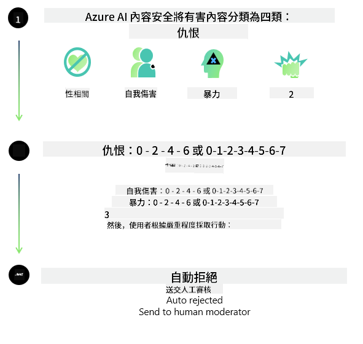

<!--
CO_OP_TRANSLATOR_METADATA:
{
  "original_hash": "839ccc4b3886ef10cfd4e64977f5792d",
  "translation_date": "2026-01-05T17:27:23+00:00",
  "source_file": "md/01.Introduction/01/01.AISafety.md",
  "language_code": "hk"
}
-->
# Phi 模型的 AI 安全性
Phi 系列模型的開發遵循了[Microsoft 負責任 AI 標準](https://www.microsoft.com/ai/principles-and-approach#responsible-ai-standard)，這是一套基於以下六大原則的公司範圍要求：問責制、透明度、公平性、可靠性與安全性、隱私與安全性，以及包容性，這些組成了[Microsoft 的負責任 AI 原則](https://www.microsoft.com/ai/responsible-ai)。

與以前的 Phi 模型一樣，我們採用了多方面的安全評估和後訓練安全措施，並對此版本的多語言能力採取了額外措施。我們關於安全訓練和評估的方法，包括跨多種語言和風險類別的測試，詳述於[Phi 安全後訓練論文](https://arxiv.org/abs/2407.13833)。儘管 Phi 模型受益於此方法，開發者仍應應用負責任 AI 的最佳實踐，包括對其特定使用案例和文化、語言背景所涉及的風險進行映射、衡量和緩解。

## 最佳實踐

像其他模型一樣，Phi 系列模型可能會表現出不公平、不可靠或冒犯性的行為。

您應該注意的一些 SLM 和 LLM 限制行為包括：

- **服務質量：** Phi 模型主要以英文文本為訓練對象。除英文外的語言表現會較差，在訓練數據中代表性較低的英文語種的表現也可能不如標準美式英語。
- **傷害表現與刻板印象延續：** 這些模型可能會過度或不足地表現某些群體，抹掉某些群體的代表性，或強化貶義或負面刻板印象。儘管進行過安全後訓練，這些限制仍可能存在，原因是不同群體的代表性程度不同或訓練數據中負面刻板印象的例子普遍存在，反映了現實世界的模式與社會偏見。
- **不當或冒犯性內容：** 這些模型可能產生其他類型的不當或冒犯性內容，若未針對使用案例採取額外緩解措施，可能不適合在敏感環境中部署。
資訊可靠性：語言模型可能生成無意義內容或捏造看似合理但不正確或過時的內容。
- **程式碼範圍有限：** 大部分 Phi-3 訓練資料基於 Python，使用的常用套件包括 "typing, math, random, collections, datetime, itertools"。若模型產生使用其他套件或其他語言腳本的 Python 代碼，強烈建議用戶手動驗證所有 API 的使用。

開發者應該應用負責任 AI 的最佳實踐，並負責確保特定使用案例遵守相關法律與法規（例如隱私、貿易等）。

## 負責任 AI 考量

如同其他語言模型，Phi 系列模型可能會表現出不公平、不可靠或冒犯性的行為。需注意的一些限制行為包括：

**服務質量：** Phi 模型主要以英文文本為訓練對象。除英文外的語言表現會較差。在訓練數據中代表性較低的英文語種可能表現不如標準美式英語。

**傷害表現與刻板印象延續：** 這些模型可能會過度或不足地表現某些群體，抹掉某些群體的代表性，或強化貶義或負面刻板印象。儘管進行過安全後訓練，這些限制仍可能存在，原因是不同群體的代表性程度不同或訓練數據中負面刻板印象的例子普遍存在，反映了現實世界的模式與社會偏見。

**不當或冒犯性內容：** 這些模型可能產生其他類型的不當或冒犯性內容，若未針對使用案例採取額外緩解措施，可能不適合在敏感環境中部署。
資訊可靠性：語言模型可能生成無意義內容或捏造看似合理但不正確或過時的內容。

**程式碼範圍有限：** 大部分 Phi-3 訓練資料基於 Python，使用的常用套件包括 "typing, math, random, collections, datetime, itertools"。若模型產生使用其他套件或其他語言腳本的 Python 代碼，強烈建議用戶手動驗證所有 API 的使用。

開發者應該應用負責任 AI 的最佳實踐，並負責確保特定使用案例遵守相關法律與法規（例如隱私、貿易等）。重要考量領域包括：

**分配：** 若可能對法律狀態或資源及生活機會（例：住房、就業、信用等）分配產生重大影響，模型可能不適合使用，除非進行進一步評估及額外的去偏技術。

**高風險場景：** 開發者應評估在高風險場景使用模型的適用性，此類場景中不公平、不可靠或冒犯性的輸出可能代價巨大或導致傷害。這包含在精確度及可靠性關鍵的敏感或專業領域提供建議（例：法律或健康建議）。應根據部署環境在應用層面實施額外防護措施。

**錯誤資訊：** 模型可能產生不準確的資訊。開發者應遵循透明度最佳實踐，並告知終端用戶他們正在與 AI 系統互動。在應用層面，開發者可建立反饋機制及管線，將回答依據用例特定的上下文資訊進行確認，此技術稱為檢索增強生成（Retrieval Augmented Generation, RAG）。

**有害內容生成：** 開發者應根據上下文評估輸出，並使用可用的安全分類器或適合其使用案例的客製化方案。

**誤用：** 可能存在其他形式的誤用問題，如詐騙、垃圾郵件或惡意軟體製作，開發者須確保其應用不違反適用法律與法規。

### 微調與 AI 內容安全

在微調模型後，我們強烈建議利用[Azure AI 內容安全](https://learn.microsoft.com/azure/ai-services/content-safety/overview)措施監控模型產生的內容，識別並阻擋潛在風險、威脅及質量問題。

[Azure AI 內容安全](https://learn.microsoft.com/azure/ai-services/content-safety/overview) 支援文字與影像內容。它可部署於雲端、離線容器和邊緣/嵌入式設備。

## Azure AI 內容安全概述

Azure AI 內容安全並非一體適用的解決方案；它可依據企業特定政策進行自訂。此外，其多語言模型能同時理解多種語言。

- **Azure AI 內容安全**
- **Microsoft Developer**
- **5 支影片**

Azure AI 內容安全服務能在應用程式和服務中檢測有害的用戶生成和 AI 生成內容。它包含文字和圖片 API，可協助你檢測有害或不當的素材。

[AI 內容安全播放列表](https://www.youtube.com/playlist?list=PLlrxD0HtieHjaQ9bJjyp1T7FeCbmVcPkQ)

---

<!-- CO-OP TRANSLATOR DISCLAIMER START -->
**免責聲明**：
本文件由 AI 翻譯服務 [Co-op Translator](https://github.com/Azure/co-op-translator) 進行翻譯。雖然我們力求準確，但請注意，自動翻譯可能包含錯誤或不準確之處。原始文件的原文版本應被視為權威來源。對於關鍵資訊，建議採用專業人工翻譯。我們不對因使用本翻譯而產生的任何誤解或錯誤詮釋承擔責任。
<!-- CO-OP TRANSLATOR DISCLAIMER END -->