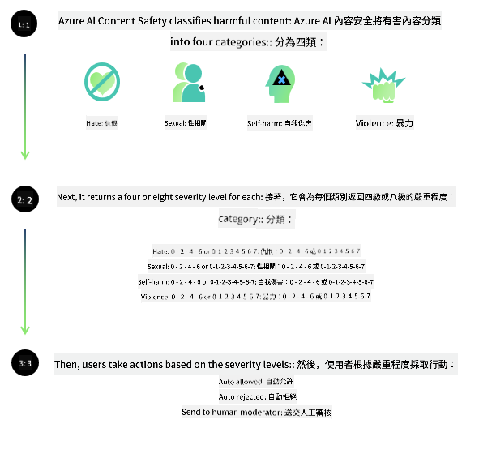
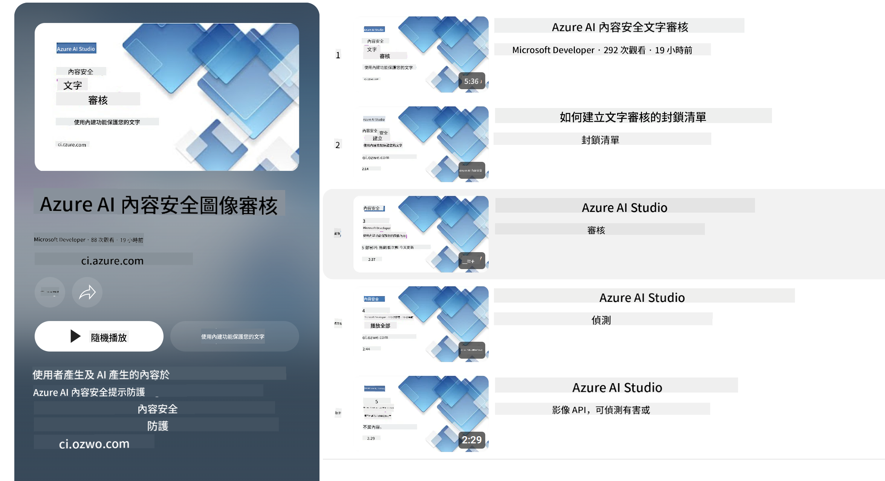

<!--
CO_OP_TRANSLATOR_METADATA:
{
  "original_hash": "c8273672cc57df2be675407a1383aaf0",
  "translation_date": "2025-05-08T06:13:08+00:00",
  "source_file": "md/01.Introduction/01/01.AISafety.md",
  "language_code": "hk"
}
-->
# AI 安全性對 Phi 模型

Phi 系列模型係根據 [Microsoft Responsible AI Standard](https://query.prod.cms.rt.microsoft.com/cms/api/am/binary/RE5cmFl) 開發，呢個標準係公司層面嘅一套要求，基於六大原則：問責制、透明度、公平性、可靠性同安全性、私隱同安全，以及包容性，呢啲組成咗 [Microsoft 嘅 Responsible AI 原則](https://www.microsoft.com/ai/responsible-ai)。

同之前嘅 Phi 模型一樣，我哋採用多方面嘅安全評估同訓練後安全措施，並且因應今次版本嘅多語言能力加入額外措施。我哋嘅安全訓練同評估方法，包括跨多種語言同風險類別嘅測試，已經喺 [Phi Safety Post-Training Paper](https://arxiv.org/abs/2407.13833) 詳細說明。雖然 Phi 模型受惠於呢個方法，開發者仍然要實踐負責任嘅 AI 最佳做法，包括針對佢哋嘅具體用例同文化語言背景去繪製、衡量同減輕風險。

## 最佳做法

同其他模型一樣，Phi 系列模型有機會表現出不公平、不可靠或冒犯性嘅行為。

你需要留意嘅 SLM 同 LLM 嘅部分限制行為包括：

- **服務質素：** Phi 模型主要係用英文文本訓練。除咗英文之外嘅語言表現會較差。喺訓練數據中代表性較少嘅英文變體，表現可能比標準美式英語差。
- **傷害表現同刻板印象持續：** 呢啲模型可能會過度或不足地呈現某啲群體，抹去部分群體嘅代表，或者加強貶低或負面嘅刻板印象。即使有訓練後安全措施，呢啲限制仍可能存在，因為不同群體嘅代表性唔同，或者訓練數據中有反映現實社會偏見嘅負面刻板印象例子。
- **不適當或冒犯性內容：** 呢啲模型可能產生其他類型嘅不適當或冒犯性內容，喺敏感場景下使用可能唔適合，除非針對具體用例有額外嘅緩解措施。
- **資訊可靠性：** 語言模型可能會生成無意義嘅內容，或者編造聽落合理但實際上唔準確或過時嘅資訊。
- **代碼範圍有限：** Phi-3 大部分訓練數據基於 Python，使用常用套件例如 "typing, math, random, collections, datetime, itertools"。如果模型產生使用其他套件或其他語言嘅 Python 腳本，強烈建議用戶手動核實所有 API 使用。

開發者應該實踐負責任嘅 AI 最佳做法，並且負責確保具體用例符合相關法律法規（例如私隱、貿易等）。

## 負責任 AI 考慮事項

同其他語言模型一樣，Phi 系列模型有機會表現出不公平、不可靠或冒犯性嘅行為。需要注意嘅限制行為包括：

**服務質素：** Phi 模型主要係用英文文本訓練。除英文外嘅語言表現會較差。喺訓練數據中代表性較少嘅英文變體，表現可能比標準美式英語差。

**傷害表現同刻板印象持續：** 呢啲模型可能會過度或不足地呈現某啲群體，抹去部分群體嘅代表，或者加強貶低或負面嘅刻板印象。即使有訓練後安全措施，呢啲限制仍可能存在，因為不同群體嘅代表性唔同，或者訓練數據中有反映現實社會偏見嘅負面刻板印象例子。

**不適當或冒犯性內容：** 呢啲模型可能產生其他類型嘅不適當或冒犯性內容，喺敏感場景下使用可能唔適合，除非針對具體用例有額外嘅緩解措施。
資訊可靠性：語言模型可能會生成無意義嘅內容，或者編造聽落合理但實際上唔準確或過時嘅資訊。

**代碼範圍有限：** Phi-3 大部分訓練數據基於 Python，使用常用套件例如 "typing, math, random, collections, datetime, itertools"。如果模型產生使用其他套件或其他語言嘅 Python 腳本，強烈建議用戶手動核實所有 API 使用。

開發者應該實踐負責任嘅 AI 最佳做法，並且負責確保具體用例符合相關法律法規（例如私隱、貿易等）。重要考慮範圍包括：

**分配：** 模型可能唔適合用喺會對法律地位、資源分配或人生機會（例如：住屋、就業、信貸等）有重大影響嘅場景，除非進行進一步評估同額外嘅去偏見技術。

**高風險場景：** 開發者應評估模型喺高風險場景下嘅適用性，因為不公平、不可靠或冒犯性嘅輸出可能造成重大代價或傷害。包括喺敏感或專業領域提供建議，呢啲地方準確性同可靠性尤其重要（例如：法律或健康建議）。應根據部署情況喺應用層面實施額外保障措施。

**錯誤資訊：** 模型可能產生錯誤資訊。開發者應遵循透明度最佳做法，告知最終用戶佢哋正與 AI 系統互動。喺應用層面，開發者可以建立反饋機制同管道，將回應基於用例特定嘅上下文資訊，呢個技術稱為 Retrieval Augmented Generation (RAG)。

**有害內容產生：** 開發者應評估輸出嘅上下文，並使用可用嘅安全分類器或根據用例訂製嘅解決方案。

**濫用：** 其他濫用形式例如詐騙、垃圾郵件或惡意軟件製作都有可能，開發者應確保應用唔會違反適用嘅法律法規。

### 微調同 AI 內容安全

微調模型後，我哋強烈建議利用 [Azure AI Content Safety](https://learn.microsoft.com/azure/ai-services/content-safety/overview) 措施去監察模型產生嘅內容，識別同阻止潛在風險、威脅同質量問題。

[Azure AI Content Safety](https://learn.microsoft.com/azure/ai-services/content-safety/overview) 支援文字同圖片內容。佢可以喺雲端、離線容器同邊緣／嵌入式裝置部署。

## Azure AI Content Safety 概覽

Azure AI Content Safety 唔係一個一體適用嘅方案；佢可以根據企業嘅具體政策度身訂造。此外，佢嘅多語言模型令佢可以同時理解多種語言。

- **Azure AI Content Safety**
- **Microsoft Developer**
- **5 條影片**

Azure AI Content Safety 服務可以喺應用程式同服務中偵測有害嘅用戶生成同 AI 生成內容。佢包括文字同圖片 API，讓你偵測有害或不適當嘅資料。

[AI Content Safety Playlist](https://www.youtube.com/playlist?list=PLlrxD0HtieHjaQ9bJjyp1T7FeCbmVcPkQ)

**免責聲明**：  
本文件係用 AI 翻譯服務 [Co-op Translator](https://github.com/Azure/co-op-translator) 翻譯。雖然我哋努力確保準確性，但請注意自動翻譯可能包含錯誤或不準確之處。原文以其母語版本為權威來源。如涉及重要資料，建議採用專業人工翻譯。因使用本翻譯而引致嘅任何誤解或誤會，我哋概不負責。