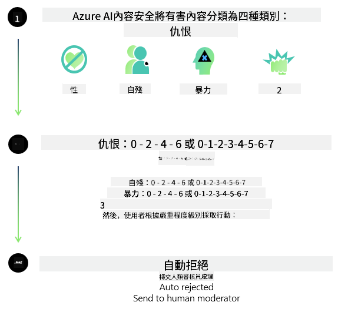

<!--
CO_OP_TRANSLATOR_METADATA:
{
  "original_hash": "1f6b561a224336bd4f413176ec40d994",
  "translation_date": "2025-04-04T17:27:45+00:00",
  "source_file": "md\\01.Introduction\\01\\01.AISafety.md",
  "language_code": "hk"
}
-->
# AI安全性：Phi模型

Phi系列模型依據[Microsoft負責任AI標準](https://query.prod.cms.rt.microsoft.com/cms/api/am/binary/RE5cmFl)開發，該標準是基於以下六大原則的公司級要求：問責、透明、公平、可靠與安全、隱私與安全性，以及包容性，這些構成了[Microsoft的負責任AI原則](https://www.microsoft.com/ai/responsible-ai)。

與之前的Phi模型一樣，此版本採用了多方面的安全評估和安全後訓練方法，並額外考慮了多語言能力的因素。我們的安全訓練和評估方法，包括跨多種語言和風險類別的測試，詳述於[Phi安全後訓練文件](https://arxiv.org/abs/2407.13833)。雖然Phi模型受益於這些方法，開發者仍需應用負責任AI的最佳實踐，包括針對特定使用案例及其文化和語言背景進行風險映射、測量和緩解。

## 最佳實踐

與其他模型一樣，Phi系列模型可能表現出不公平、不可靠或冒犯的行為。

以下是SLM和LLM的一些限制行為，開發者需要注意：

- **服務質量：** Phi模型主要基於英文文本進行訓練。非英文語言的性能會較差；而訓練數據中代表性較低的英語方言，性能可能會低於標準美式英語。
- **偏見表現與刻板印象延續：** 這些模型可能過度或不足地代表某些群體，抹除某些群體的存在，或加強貶低或負面的刻板印象。儘管進行了安全後訓練，由於不同群體的代表性差異或訓練數據中反映現實世界模式和社會偏見的負面刻板印象示例的普遍性，這些限制仍可能存在。
- **不適當或冒犯性內容：** 模型可能生成其他類型的不適當或冒犯性內容，若在敏感情境下使用，可能需要額外的緩解措施以符合使用案例的需求。
- **信息可靠性：** 語言模型可能生成無意義或捏造的內容，這些內容可能聽起來合理，但實際上是不準確或過時的。
- **程式碼範圍有限：** Phi-3的大部分訓練數據基於Python，使用常見的套件，例如"typing, math, random, collections, datetime, itertools"。若模型生成使用其他套件的Python腳本或其他語言的腳本，我們強烈建議用戶手動驗證所有API使用。

開發者應應用負責任AI的最佳實踐，並負責確保特定使用案例遵守相關法律和法規（例如隱私、貿易等）。

## 負責任AI考量

與其他語言模型一樣，Phi系列模型可能表現出不公平、不可靠或冒犯的行為。以下是需要注意的一些限制行為：

**服務質量：** Phi模型主要基於英文文本進行訓練。非英文語言的性能會較差；而訓練數據中代表性較低的英語方言，性能可能會低於標準美式英語。

**偏見表現與刻板印象延續：** 這些模型可能過度或不足地代表某些群體，抹除某些群體的存在，或加強貶低或負面的刻板印象。儘管進行了安全後訓練，由於不同群體的代表性差異或訓練數據中反映現實世界模式和社會偏見的負面刻板印象示例的普遍性，這些限制仍可能存在。

**不適當或冒犯性內容：** 模型可能生成其他類型的不適當或冒犯性內容，若在敏感情境下使用，可能需要額外的緩解措施以符合使用案例的需求。

**信息可靠性：** 語言模型可能生成無意義或捏造的內容，這些內容可能聽起來合理，但實際上是不準確或過時的。

**程式碼範圍有限：** Phi-3的大部分訓練數據基於Python，使用常見的套件，例如"typing, math, random, collections, datetime, itertools"。若模型生成使用其他套件的Python腳本或其他語言的腳本，我們強烈建議用戶手動驗證所有API使用。

開發者應應用負責任AI的最佳實踐，並負責確保特定使用案例遵守相關法律和法規（例如隱私、貿易等）。以下是一些重要考量：

**分配：** 若模型的使用情境可能對法律地位或資源分配或生活機會（例如住房、就業、信貸等）產生重大影響，則需要進一步評估和額外的去偏技術。

**高風險情境：** 開發者應評估模型在高風險情境中的適用性，這些情境中不公平、不可靠或冒犯的輸出可能代價高昂或導致傷害。這包括在敏感或專業領域提供建議，該領域中準確性和可靠性至關重要（例如法律或健康建議）。應根據部署背景在應用層面實施額外的保障措施。

**錯誤信息：** 模型可能生成不準確的信息。開發者應遵循透明度的最佳實踐，並告知終端用戶他們正在與AI系統互動。在應用層面，開發者可以構建反饋機制和管道，以根據特定使用案例的上下文信息對回應進行校準，這種技術稱為檢索增強生成（RAG）。

**生成有害內容：** 開發者應根據上下文評估輸出，並使用適合其使用案例的可用安全分類器或自定義解決方案。

**濫用：** 其他形式的濫用（例如欺詐、垃圾信息或惡意軟件生成）可能發生，開發者應確保其應用不違反相關法律和法規。

### 微調與AI內容安全

在對模型進行微調後，我們強烈建議利用[Azure AI內容安全](https://learn.microsoft.com/azure/ai-services/content-safety/overview)措施來監控模型生成的內容，識別並阻止潛在的風險、威脅和質量問題。

[Azure AI內容安全](https://learn.microsoft.com/azure/ai-services/content-safety/overview)支持文本和圖片內容。它可以在雲端、離線容器以及邊緣/嵌入式設備上部署。

## Azure AI內容安全概述

Azure AI內容安全並非一刀切的解決方案；它可以根據企業的具體政策進行定制。此外，其多語言模型使其能夠同時理解多種語言。

- **Azure AI內容安全**
- **Microsoft開發者**
- **5個視頻**

Azure AI內容安全服務檢測應用和服務中的用戶生成內容和AI生成內容的有害性。它包括文本和圖片API，允許檢測有害或不適當的材料。

[AI內容安全播放列表](https://www.youtube.com/playlist?list=PLlrxD0HtieHjaQ9bJjyp1T7FeCbmVcPkQ)

**免責聲明**：  
本文件使用AI翻譯服務 [Co-op Translator](https://github.com/Azure/co-op-translator) 進行翻譯。雖然我們致力於提供準確的翻譯，但請注意，自動翻譯可能包含錯誤或不準確之處。應以原文檔案作為權威來源。對於關鍵資訊，建議尋求專業人工翻譯。我們對因使用本翻譯而引起的任何誤解或錯誤解釋概不負責。