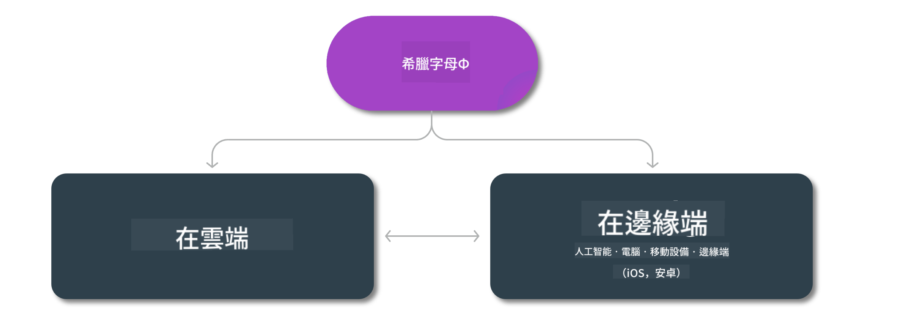

<!--
CO_OP_TRANSLATOR_METADATA:
{
  "original_hash": "1f15470a0551a0b11880b949b6ab022a",
  "translation_date": "2025-04-04T17:29:10+00:00",
  "source_file": "md\\01.Introduction\\01\\01.Edgeandcloud.md",
  "language_code": "hk"
}
-->
# Phi 模型及各平台可用性

## Edge 與 Cloud 場景

## 模型可用性及資源

| | | | | | | | | |
|-|-|-|-|-|-|-|-|-|
|模型|輸入|內容長度|Azure AI (MaaS)|Azure ML (MaaP)|ONNX|Hugging Face|Ollama|Nvidia NIM|
|Phi-3-vision-128k-instruct|文字+圖片|128k|[Playground & 部署](https://ai.azure.com/explore/models/Phi-3-vision-128k-instruct/version/2/registry/azureml)|[Playground, 部署 & 微調](https://ml.azure.com/registries/azureml/models/Phi-3-vision-128k-instruct/version/2)|[CUDA](https://huggingface.co/microsoft/Phi-3-vision-128k-instruct-onnx-cuda/tree/main),[CPU](https://huggingface.co/microsoft/Phi-3-vision-128k-instruct-onnx-cpu/tree/main), [DirectML](https://huggingface.co/microsoft/Phi-3-vision-128k-instruct-onnx-directml/tree/main)|[下載](https://huggingface.co/microsoft/Phi-3-vision-128k-instruct)|-NA-|[NIM APIs](https://build.nvidia.com/microsoft/phi-3-vision-128k-instruct)|
|Phi-3-mini-4k-instruct|文字|4k|[Playground & 部署](https://aka.ms/phi3-mini-4k-azure-ml)|[Playground, 部署](https://aka.ms/phi3-mini-4k-azure-ml) & 微調|[CUDA](https://huggingface.co/microsoft/Phi-3-mini-4k-instruct-onnx), [Web](https://huggingface.co/microsoft/Phi-3-mini-4k-instruct-onnx)|[Playground & 下載](https://huggingface.co/chat/models/microsoft/Phi-3-mini-4k-instruct)|[GGUF](https://huggingface.co/microsoft/Phi-3-mini-4k-instruct-gguf)|[NIM APIs](https://build.nvidia.com/microsoft/phi-3-mini-4k)|
|Phi-3-mini-128k-instruct|文字|128k|[Playground & 部署](https://ai.azure.com/explore/models/Phi-3-mini-128k-instruct/version/9/registry/azureml)|[Playground, 部署](https://ai.azure.com/explore/models/Phi-3-mini-128k-instruct/version/9/registry/azureml) & 微調|[CUDA](https://huggingface.co/microsoft/Phi-3-mini-128k-instruct-onnx)|[下載](https://huggingface.co/microsoft/Phi-3-mini-128k-instruct-onnx)|-NA-|[NIM APIs](https://build.nvidia.com/microsoft/phi-3-mini)|
|Phi-3-small-8k-instruct|文字|8k|[Playground & 部署](https://ml.azure.com/registries/azureml/models/Phi-3-small-8k-instruct/version/2)|[Playground, 部署](https://ai.azure.com/explore/models/Phi-3-small-8k-instruct/version/2/registry/azureml) & 微調|[CUDA](https://huggingface.co/microsoft/Phi-3-small-8k-instruct-onnx-cuda)|[下載](https://huggingface.co/microsoft/Phi-3-small-8k-instruct-onnx-cuda)|-NA-|[NIM APIs](https://build.nvidia.com/microsoft/phi-3-small-8k-instruct?docker=false)|
|Phi-3-small-128k-instruct|文字|128k|[Playground & 部署](https://ai.azure.com/explore/models/Phi-3-small-128k-instruct/version/2/registry/azureml)|[Playground, 部署](https://ml.azure.com/registries/azureml/models/Phi-3-small-128k-instruct/version/2) & 微調|[CUDA](https://huggingface.co/microsoft/Phi-3-medium-128k-instruct-onnx-cuda)|[下載](https://huggingface.co/microsoft/Phi-3-small-128k-instruct)|-NA-|[NIM APIs](https://build.nvidia.com/microsoft/phi-3-small-128k-instruct?docker=false)|
|Phi-3-medium-4k-instruct|文字|4k|[遊樂場及部署](https://huggingface.co/microsoft/Phi-3-medium-4k-instruct)|[遊樂場，部署](https://ml.azure.com/registries/azureml/models/Phi-3-medium-4k-instruct/version/2)及微調|[CUDA](https://huggingface.co/microsoft/Phi-3-medium-4k-instruct-onnx-cuda/tree/main)，[CPU](https://huggingface.co/microsoft/Phi-3-medium-4k-instruct-onnx-cpu/tree/main)，[DirectML](https://huggingface.co/microsoft/Phi-3-medium-4k-instruct-onnx-directml/tree/main)|[下載](https://huggingface.co/microsoft/Phi-3-medium-4k-instruct)|-NA-|[NIM APIs](https://build.nvidia.com/microsoft/phi-3-medium-4k-instruct?docker=false)|
|Phi-3-medium-128k-instruct|文字|128k|[遊樂場及部署](https://ai.azure.com/explore/models/Phi-3-medium-128k-instruct/version/2)|[遊樂場，部署](https://ml.azure.com/registries/azureml/models/Phi-3-medium-128k-instruct/version/2)及微調|[CUDA](https://huggingface.co/microsoft/Phi-3-medium-128k-instruct-onnx-cuda/tree/main)，[CPU](https://huggingface.co/microsoft/Phi-3-medium-128k-instruct-onnx-cpu/tree/main)，[DirectML](https://huggingface.co/microsoft/Phi-3-medium-128k-instruct-onnx-directml/tree/main)|[下載](https://huggingface.co/microsoft/Phi-3-medium-128k-instruct)|-NA-|-NA-|

**免責聲明**:  
本文檔使用人工智能翻譯服務 [Co-op Translator](https://github.com/Azure/co-op-translator) 進行翻譯。儘管我們努力確保翻譯準確性，但請注意，自動翻譯可能包含錯誤或不準確之處。應以原始語言的文件作為權威來源。對於關鍵信息，建議使用專業人工翻譯。我們對因使用此翻譯而引起的任何誤解或錯誤解讀不承擔責任。