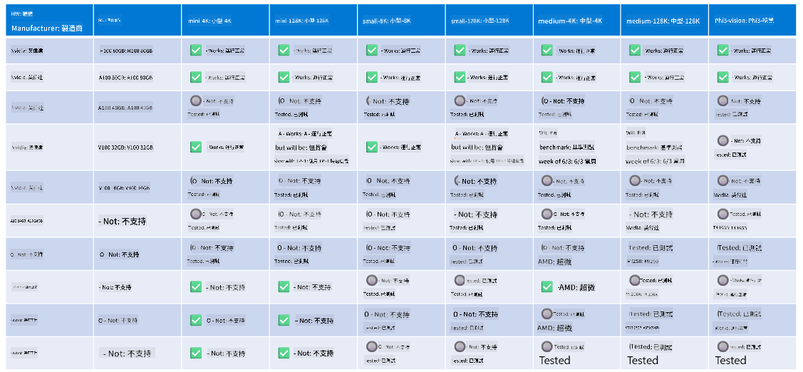

<!--
CO_OP_TRANSLATOR_METADATA:
{
  "original_hash": "c4afa6ffd13f29eb34e5f204b94310ff",
  "translation_date": "2025-04-04T17:32:49+00:00",
  "source_file": "md\\01.Introduction\\01\\01.Hardwaresupport.md",
  "language_code": "hk"
}
-->
# Phi 硬件支援

Microsoft Phi 已經為 ONNX Runtime 優化，並支援 Windows DirectML。它能夠在多種硬件類型上良好運行，包括 GPU、CPU，甚至是移動設備。

## 設備硬件
具體支援的硬件包括：

- GPU 型號：RTX 4090 (DirectML)
- GPU 型號：1 A100 80GB (CUDA)
- CPU 型號：Standard F64s v2 (64 vCPUs, 128 GiB 記憶體)

## 移動型號

- Android - Samsung Galaxy S21
- Apple iPhone 14 或更高版本 A16/A17 處理器

## Phi 硬件規格

- 最低配置要求：
- Windows：支援 DirectX 12 的 GPU，至少 4GB 的綜合記憶體

CUDA：NVIDIA GPU，計算能力 >= 7.02



## 在多個 GPU 上運行 onnxruntime

目前可用的 Phi ONNX 模型僅支援 1 個 GPU。Phi 模型有可能支援多 GPU，但 ORT 使用 2 個 GPU 並不能保證比使用 2 個 ORT 實例能提供更高的吞吐量。請參考 [ONNX Runtime](https://onnxruntime.ai/) 了解最新更新。

在 [Build 2024 的 GenAI ONNX 團隊](https://youtu.be/WLW4SE8M9i8?si=EtG04UwDvcjunyfC) 宣布，他們已經為 Phi 模型啟用了多實例，而不是多 GPU。

目前，這允許您使用 CUDA_VISIBLE_DEVICES 環境變量運行一個 onnxruntime 或 onnxruntime-genai 實例，像這樣：

```Python
CUDA_VISIBLE_DEVICES=0 python infer.py
CUDA_VISIBLE_DEVICES=1 python infer.py
```

可以到 [Azure AI Foundry](https://ai.azure.com) 進一步探索 Phi。

**免責聲明**:  
本文件已使用AI翻譯服務[Co-op Translator](https://github.com/Azure/co-op-translator)進行翻譯。雖然我們努力確保翻譯準確，但請注意，自動翻譯可能會包含錯誤或不準確之處。原始文件的母語版本應被視為具有權威性的來源。對於關鍵信息，建議尋求專業的人類翻譯。我們對因使用此翻譯而引起的任何誤解或錯誤解釋概不負責。