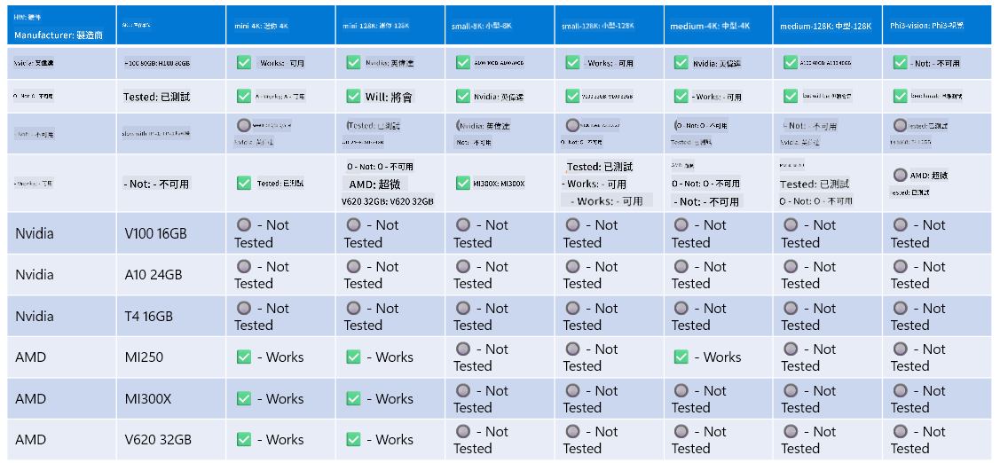

<!--
CO_OP_TRANSLATOR_METADATA:
{
  "original_hash": "8cdc17ce0f10535da30b53d23fe1a795",
  "translation_date": "2025-05-08T06:14:22+00:00",
  "source_file": "md/01.Introduction/01/01.Hardwaresupport.md",
  "language_code": "hk"
}
-->
# Phi 硬件支援

Microsoft Phi 已針對 ONNX Runtime 優化，並支援 Windows DirectML。佢喺唔同硬件類型上表現良好，包括 GPU、CPU 甚至手機裝置。

## 裝置硬件  
支援嘅硬件具體包括：

- GPU SKU: RTX 4090 (DirectML)
- GPU SKU: 1 A100 80GB (CUDA)
- CPU SKU: Standard F64s v2 (64 vCPUs, 128 GiB 記憶體)

## 手機 SKU

- Android - Samsung Galaxy S21
- Apple iPhone 14 或以上 A16/A17 處理器

## Phi 硬件規格

- 最低配置要求。
- Windows：需要支援 DirectX 12 嘅 GPU 同埋最少 4GB 嘅總記憶體

CUDA：NVIDIA GPU，計算能力 >= 7.02



## 喺多 GPU 上運行 onnxruntime

目前可用嘅 Phi ONNX 模型只支援單 GPU。理論上可以支援多 GPU 嘅 Phi 模型，但 ORT 用兩個 GPU 並唔保證效能會比跑兩個獨立 ORT 實例高。最新消息請參考 [ONNX Runtime](https://onnxruntime.ai/)。

喺 [Build 2024 the GenAI ONNX Team](https://youtu.be/WLW4SE8M9i8?si=EtG04UwDvcjunyfC) 公佈佢哋已經啟用多實例（multi-instance）而唔係多 GPU，專門用喺 Phi 模型上。

而家你可以用 CUDA_VISIBLE_DEVICES 環境變數，運行一個 onnxruntime 或 onnxruntime-genai 實例，方法如下。

```Python
CUDA_VISIBLE_DEVICES=0 python infer.py
CUDA_VISIBLE_DEVICES=1 python infer.py
```

歡迎喺 [Azure AI Foundry](https://ai.azure.com) 深入探索 Phi。

**免責聲明**：  
本文件係使用 AI 翻譯服務 [Co-op Translator](https://github.com/Azure/co-op-translator) 翻譯而成。雖然我哋致力確保準確性，但請注意自動翻譯可能包含錯誤或不準確之處。原始文件嘅母語版本應視為權威來源。對於重要資訊，建議使用專業人工翻譯。本公司對因使用此翻譯而引致嘅任何誤解或誤釋概不負責。