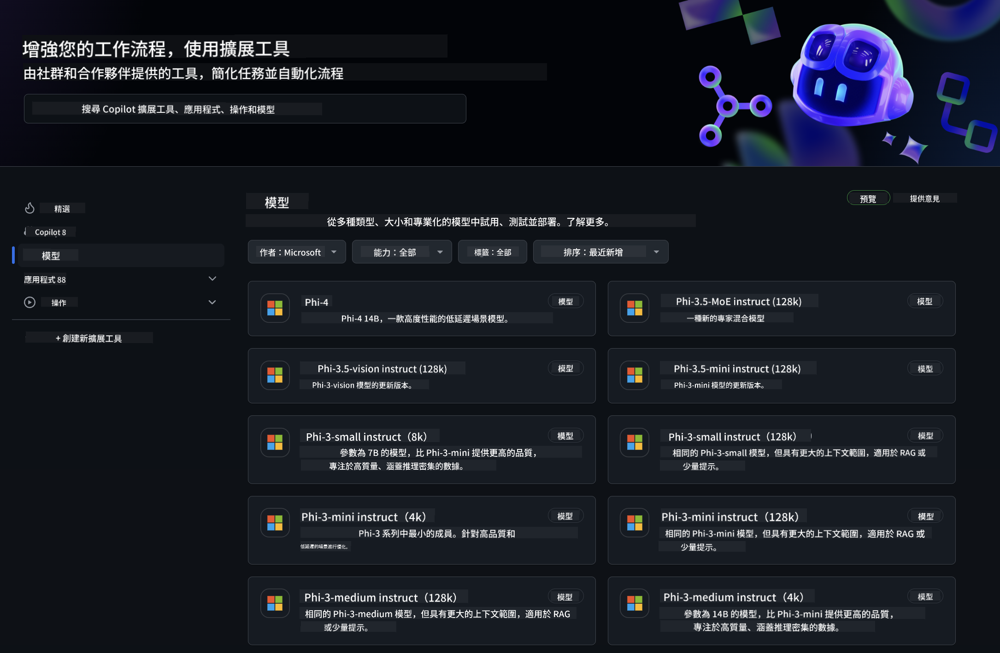
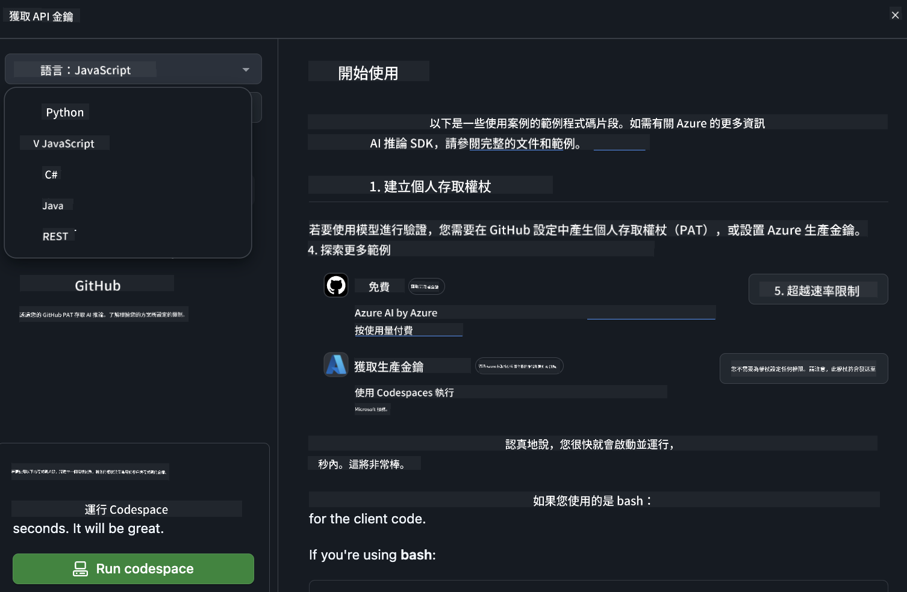
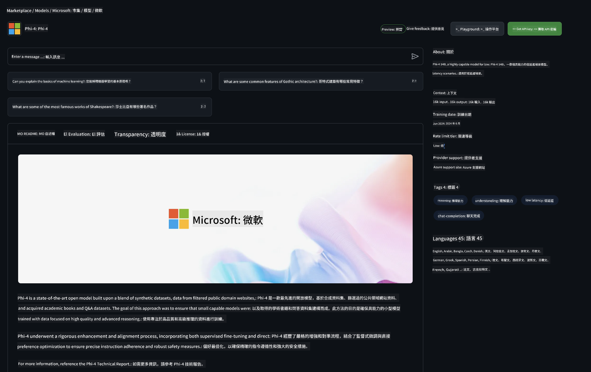

<!--
CO_OP_TRANSLATOR_METADATA:
{
  "original_hash": "fa5cdbc832e5bcffebb25ce25ec1a3c3",
  "translation_date": "2025-04-04T17:37:08+00:00",
  "source_file": "md\\01.Introduction\\02\\02.GitHubModel.md",
  "language_code": "hk"
}
-->
## GitHub 模型中的 Phi 家族

歡迎來到 [GitHub 模型](https://github.com/marketplace/models)！我們已經準備好讓你探索託管於 Azure AI 上的 AI 模型。



想了解更多關於 GitHub 模型中可用的模型資訊，請查看 [GitHub 模型市場](https://github.com/marketplace/models)。

## 可用模型

每個模型都有專屬的測試平台和範例程式碼。


### GitHub 模型目錄中的 Phi 家族

- [Phi-4](https://github.com/marketplace/models/azureml/Phi-4)

- [Phi-3.5-MoE instruct (128k)](https://github.com/marketplace/models/azureml/Phi-3-5-MoE-instruct)

- [Phi-3.5-vision instruct (128k)](https://github.com/marketplace/models/azureml/Phi-3-5-vision-instruct)

- [Phi-3.5-mini instruct (128k)](https://github.com/marketplace/models/azureml/Phi-3-5-mini-instruct)

- [Phi-3-Medium-128k-Instruct](https://github.com/marketplace/models/azureml/Phi-3-medium-128k-instruct)

- [Phi-3-medium-4k-instruct](https://github.com/marketplace/models/azureml/Phi-3-medium-4k-instruct)

- [Phi-3-mini-128k-instruct](https://github.com/marketplace/models/azureml/Phi-3-mini-128k-instruct)

- [Phi-3-mini-4k-instruct](https://github.com/marketplace/models/azureml/Phi-3-mini-4k-instruct)

- [Phi-3-small-128k-instruct](https://github.com/marketplace/models/azureml/Phi-3-small-128k-instruct)

- [Phi-3-small-8k-instruct](https://github.com/marketplace/models/azureml/Phi-3-small-8k-instruct)

## 入門指南

我們已經準備了一些簡單的範例程式碼，供你直接執行。你可以在 samples 資料夾中找到這些範例。如果你想直接跳到你最熟悉的程式語言，以下是各語言的範例：

- Python
- JavaScript
- C#
- Java
- cURL

此外，我們還提供了一個專屬的 Codespaces 環境，用於運行範例和模型。



## 範例程式碼

以下是一些用例的範例程式碼片段。如需更多關於 Azure AI Inference SDK 的資訊，請查看完整的文件和範例。

## 設置

1. 建立個人存取權杖  
你不需要為權杖賦予任何權限。請注意，權杖將被傳送到 Microsoft 服務。

要使用以下程式碼片段，請建立一個環境變數，將你的權杖設為客戶端程式碼的金鑰。

如果你使用 bash:
```
export GITHUB_TOKEN="<your-github-token-goes-here>"
```  
如果你使用 powershell:

```
$Env:GITHUB_TOKEN="<your-github-token-goes-here>"
```  

如果你使用 Windows 命令提示字元:

```
set GITHUB_TOKEN=<your-github-token-goes-here>
```  

## Python 範例

### 安裝依賴項
使用 pip 安裝 Azure AI Inference SDK（需要：Python >=3.8）：

```
pip install azure-ai-inference
```  

### 執行基本範例程式碼

這個範例展示了如何基本呼叫 chat completion API。它使用 GitHub AI 模型推理端點和你的 GitHub 權杖。這是一個同步呼叫。

```python
import os
from azure.ai.inference import ChatCompletionsClient
from azure.ai.inference.models import SystemMessage, UserMessage
from azure.core.credentials import AzureKeyCredential

endpoint = "https://models.inference.ai.azure.com"
model_name = "Phi-4"
token = os.environ["GITHUB_TOKEN"]

client = ChatCompletionsClient(
    endpoint=endpoint,
    credential=AzureKeyCredential(token),
)

response = client.complete(
    messages=[
        UserMessage(content="I have $20,000 in my savings account, where I receive a 4% profit per year and payments twice a year. Can you please tell me how long it will take for me to become a millionaire? Also, can you please explain the math step by step as if you were explaining it to an uneducated person?"),
    ],
    temperature=0.4,
    top_p=1.0,
    max_tokens=2048,
    model=model_name
)

print(response.choices[0].message.content)
```  

### 執行多輪對話

這個範例展示了如何使用 chat completion API 進行多輪對話。在用模型構建聊天應用程式時，你需要管理對話的歷史記錄，並將最新的訊息發送給模型。

```
import os
from azure.ai.inference import ChatCompletionsClient
from azure.ai.inference.models import AssistantMessage, SystemMessage, UserMessage
from azure.core.credentials import AzureKeyCredential

token = os.environ["GITHUB_TOKEN"]
endpoint = "https://models.inference.ai.azure.com"
# Replace Model_Name
model_name = "Phi-4"

client = ChatCompletionsClient(
    endpoint=endpoint,
    credential=AzureKeyCredential(token),
)

messages = [
    SystemMessage(content="You are a helpful assistant."),
    UserMessage(content="What is the capital of France?"),
    AssistantMessage(content="The capital of France is Paris."),
    UserMessage(content="What about Spain?"),
]

response = client.complete(messages=messages, model=model_name)

print(response.choices[0].message.content)
```  

### 串流輸出

為了提供更好的用戶體驗，你可以串流模型的回應，這樣第一個 token 可以更早出現，避免等待過長的回應。

```
import os
from azure.ai.inference import ChatCompletionsClient
from azure.ai.inference.models import SystemMessage, UserMessage
from azure.core.credentials import AzureKeyCredential

token = os.environ["GITHUB_TOKEN"]
endpoint = "https://models.inference.ai.azure.com"
# Replace Model_Name
model_name = "Phi-4"

client = ChatCompletionsClient(
    endpoint=endpoint,
    credential=AzureKeyCredential(token),
)

response = client.complete(
    stream=True,
    messages=[
        SystemMessage(content="You are a helpful assistant."),
        UserMessage(content="Give me 5 good reasons why I should exercise every day."),
    ],
    model=model_name,
)

for update in response:
    if update.choices:
        print(update.choices[0].delta.content or "", end="")

client.close()
```  

## GitHub 模型的免費使用和速率限制



[測試平台和免費 API 使用的速率限制](https://docs.github.com/en/github-models/prototyping-with-ai-models#rate-limits) 旨在幫助你試驗模型並原型化你的 AI 應用程式。若需超出這些限制的使用，並將你的應用程式擴展至規模化運行，你需要從 Azure 帳戶中配置資源，並從那裡進行身份驗證，而不是使用你的 GitHub 個人存取權杖。你的程式碼中不需要進行其他更改。使用此連結了解如何超越 Azure AI 的免費層限制。

### 注意事項

記住，在與模型互動時，你是在試驗 AI，因此可能會出現內容錯誤。

此功能受到多種限制（包括每分鐘請求數、每日請求數、每次請求的 token 數量以及同時請求數），不適用於生產環境。

GitHub 模型使用 Azure AI 內容安全功能。這些過濾器無法在 GitHub 模型體驗中關閉。如果你決定透過付費服務使用模型，請根據你的需求配置內容過濾器。

此服務受 GitHub 的預發佈條款約束。

**免責聲明**：  
本文檔已使用人工智能翻譯服務 [Co-op Translator](https://github.com/Azure/co-op-translator) 進行翻譯。我們致力於提供準確的翻譯，但請注意，自動翻譯可能包含錯誤或不準確之處。原文檔的母語版本應被視為權威來源。對於關鍵信息，建議使用專業的人工翻譯。我們對使用此翻譯所引起的任何誤解或誤讀不承擔責任。