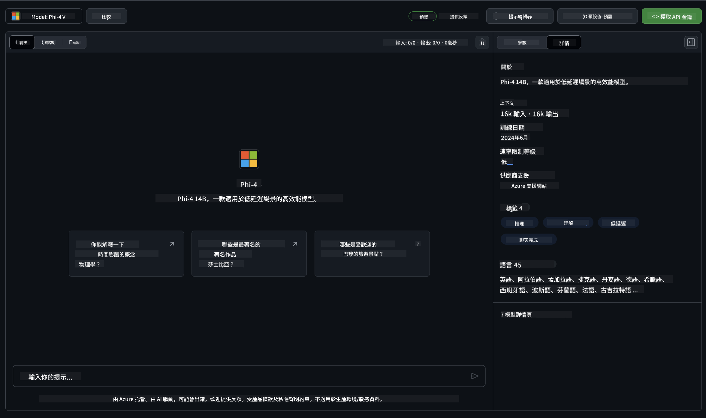

<!--
CO_OP_TRANSLATOR_METADATA:
{
  "original_hash": "fb67a08b9fc911a10ed58081fadef416",
  "translation_date": "2025-05-08T06:25:29+00:00",
  "source_file": "md/01.Introduction/02/02.GitHubModel.md",
  "language_code": "hk"
}
-->
## Phi 家族喺 GitHub Models

歡迎嚟到 [GitHub Models](https://github.com/marketplace/models)！我哋已經準備好，等你探索喺 Azure AI 上面託管嘅 AI 模型。


想了解更多喺 GitHub Models 上面提供嘅模型，請參考 [GitHub Model Marketplace](https://github.com/marketplace/models)

## 可用嘅模型

每個模型都有專屬嘅 playground 同示範代碼



### GitHub Model Catalog 入面嘅 Phi 家族

- [Phi-4](https://github.com/marketplace/models/azureml/Phi-4)

- [Phi-3.5-MoE instruct (128k)](https://github.com/marketplace/models/azureml/Phi-3-5-MoE-instruct)

- [Phi-3.5-vision instruct (128k)](https://github.com/marketplace/models/azureml/Phi-3-5-vision-instruct)

- [Phi-3.5-mini instruct (128k)](https://github.com/marketplace/models/azureml/Phi-3-5-mini-instruct)

- [Phi-3-Medium-128k-Instruct](https://github.com/marketplace/models/azureml/Phi-3-medium-128k-instruct)

- [Phi-3-medium-4k-instruct](https://github.com/marketplace/models/azureml/Phi-3-medium-4k-instruct)

- [Phi-3-mini-128k-instruct](https://github.com/marketplace/models/azureml/Phi-3-mini-128k-instruct)

- [Phi-3-mini-4k-instruct](https://github.com/marketplace/models/azureml/Phi-3-mini-4k-instruct)

- [Phi-3-small-128k-instruct](https://github.com/marketplace/models/azureml/Phi-3-small-128k-instruct)

- [Phi-3-small-8k-instruct](https://github.com/marketplace/models/azureml/Phi-3-small-8k-instruct)

## 快速開始

有啲基本示範已經準備好俾你試，喺 samples 目錄入面可以搵到。如果你想直接跳去你鍾意嘅語言，可以喺以下語言度搵到示範：

- Python
- JavaScript
- C#
- Java
- cURL

仲有一個專用嘅 Codespaces 環境用嚟跑示範同模型。


## 示範代碼

以下係幾個用例嘅示範代碼片段。想了解多啲 Azure AI Inference SDK，可以睇完整文件同示範。

## 設定

1. 建立個人訪問令牌  
唔需要俾任何權限俾呢個令牌。留意呢個令牌會發送到 Microsoft 嘅服務。

要用下面嘅代碼片段，請建立一個環境變量，將你嘅令牌設定成客戶端代碼嘅 key。

如果你用 bash：  
```
export GITHUB_TOKEN="<your-github-token-goes-here>"
```  
如果你用 powershell：  

```
$Env:GITHUB_TOKEN="<your-github-token-goes-here>"
```  

如果你用 Windows 命令提示字元：  

```
set GITHUB_TOKEN=<your-github-token-goes-here>
```  

## Python 示範

### 安裝依賴  
用 pip 安裝 Azure AI Inference SDK（需要 Python >=3.8）：

```
pip install azure-ai-inference
```  
### 執行基本代碼示範

呢個示範展示點樣用 chat completion API 做基本呼叫。佢會用 GitHub AI 模型推論端點同你嘅 GitHub 令牌。呼叫係同步嘅。

```python
import os
from azure.ai.inference import ChatCompletionsClient
from azure.ai.inference.models import SystemMessage, UserMessage
from azure.core.credentials import AzureKeyCredential

endpoint = "https://models.inference.ai.azure.com"
model_name = "Phi-4"
token = os.environ["GITHUB_TOKEN"]

client = ChatCompletionsClient(
    endpoint=endpoint,
    credential=AzureKeyCredential(token),
)

response = client.complete(
    messages=[
        UserMessage(content="I have $20,000 in my savings account, where I receive a 4% profit per year and payments twice a year. Can you please tell me how long it will take for me to become a millionaire? Also, can you please explain the math step by step as if you were explaining it to an uneducated person?"),
    ],
    temperature=0.4,
    top_p=1.0,
    max_tokens=2048,
    model=model_name
)

print(response.choices[0].message.content)
```

### 執行多輪對話

呢個示範展示點樣用 chat completion API 做多輪對話。用模型做聊天應用時，你要管理對話歷史，並且將最新訊息發送俾模型。

```
import os
from azure.ai.inference import ChatCompletionsClient
from azure.ai.inference.models import AssistantMessage, SystemMessage, UserMessage
from azure.core.credentials import AzureKeyCredential

token = os.environ["GITHUB_TOKEN"]
endpoint = "https://models.inference.ai.azure.com"
# Replace Model_Name
model_name = "Phi-4"

client = ChatCompletionsClient(
    endpoint=endpoint,
    credential=AzureKeyCredential(token),
)

messages = [
    SystemMessage(content="You are a helpful assistant."),
    UserMessage(content="What is the capital of France?"),
    AssistantMessage(content="The capital of France is Paris."),
    UserMessage(content="What about Spain?"),
]

response = client.complete(messages=messages, model=model_name)

print(response.choices[0].message.content)
```

### 串流輸出

為咗提升用戶體驗，你會想串流模型嘅回應，咁第一個 token 就會快啲出現，唔使等好耐先有回應。

```
import os
from azure.ai.inference import ChatCompletionsClient
from azure.ai.inference.models import SystemMessage, UserMessage
from azure.core.credentials import AzureKeyCredential

token = os.environ["GITHUB_TOKEN"]
endpoint = "https://models.inference.ai.azure.com"
# Replace Model_Name
model_name = "Phi-4"

client = ChatCompletionsClient(
    endpoint=endpoint,
    credential=AzureKeyCredential(token),
)

response = client.complete(
    stream=True,
    messages=[
        SystemMessage(content="You are a helpful assistant."),
        UserMessage(content="Give me 5 good reasons why I should exercise every day."),
    ],
    model=model_name,
)

for update in response:
    if update.choices:
        print(update.choices[0].delta.content or "", end="")

client.close()
```

## GitHub Models 嘅免費使用同速率限制


[playground 同免費 API 使用嘅速率限制](https://docs.github.com/en/github-models/prototyping-with-ai-models#rate-limits) 係幫你實驗模型同快速原型 AI 應用。超出呢啲限制，要用 Azure 帳戶供應資源，並用嗰邊嘅認證，而唔係 GitHub 個人訪問令牌。你嘅代碼唔使改其他嘢。用呢條鏈接了解點樣突破 Azure AI 嘅免費層限制。

### 免責聲明

記住同模型互動時，你係喺試驗 AI，所以內容可能會有錯誤。

呢個功能有多種限制（包括每分鐘請求數、每日請求數、每次請求嘅 token 數量、同時請求數）唔係設計用嚟做生產用途。

GitHub Models 採用 Azure AI Content Safety。呢啲過濾器係 GitHub Models 體驗嘅一部分，唔可以關閉。如果你選擇用付費服務嘅模型，請自行設定內容過濾器以符合你嘅需求。

呢項服務係喺 GitHub 嘅預發布條款下提供。

**免責聲明**：  
本文件係使用AI翻譯服務 [Co-op Translator](https://github.com/Azure/co-op-translator) 翻譯。雖然我哋致力確保準確性，但請注意自動翻譯可能包含錯誤或不準確之處。原始文件嘅母語版本應被視為權威來源。對於重要資料，建議使用專業人手翻譯。我哋對因使用本翻譯而引起嘅任何誤解或錯誤解讀概不負責。