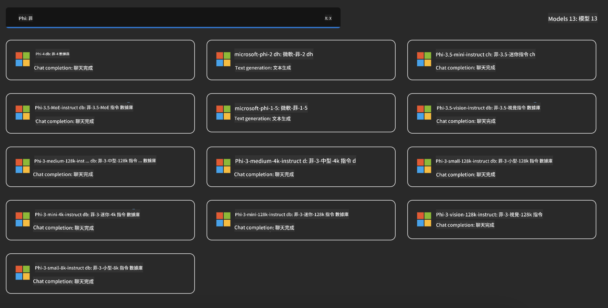
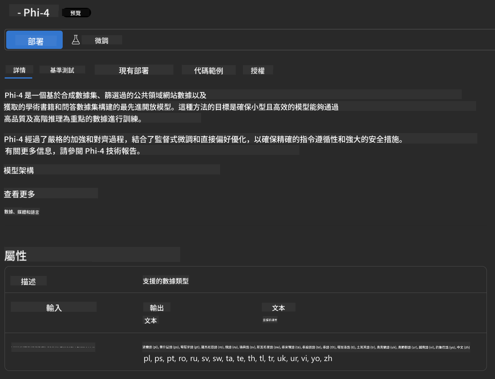
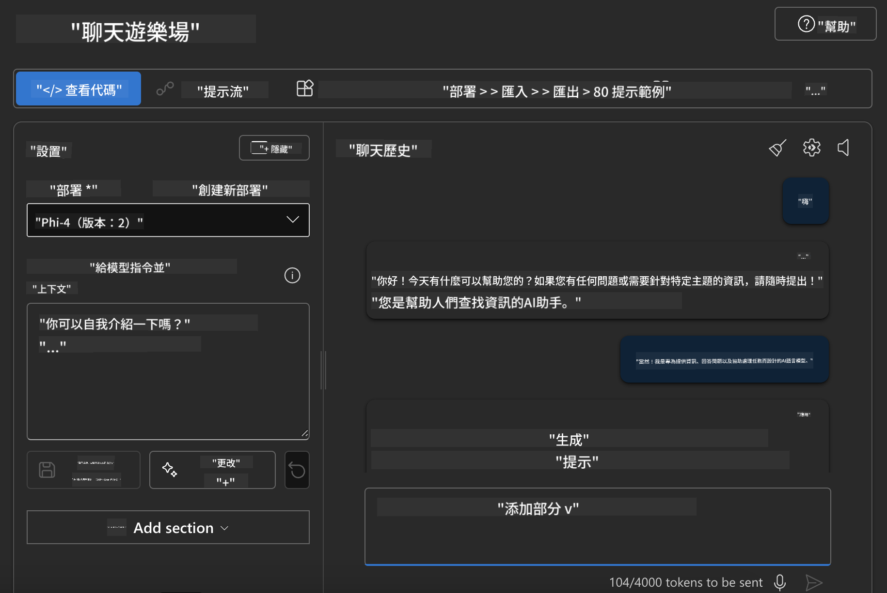

<!--
CO_OP_TRANSLATOR_METADATA:
{
  "original_hash": "70dc9bd6453f70f1a5f6833fe6e24bd0",
  "translation_date": "2025-04-04T17:38:09+00:00",
  "source_file": "md\\01.Introduction\\02\\03.AzureAIFoundry.md",
  "language_code": "hk"
}
-->
## Azure AI Foundry 中的 Phi 系列

[Azure AI Foundry](https://ai.azure.com) 是一個值得信賴的平台，能夠讓開發者以安全、可靠及負責任的方式推動創新，並以人工智能塑造未來。

[Azure AI Foundry](https://ai.azure.com) 為開發者提供以下功能：

- 在企業級平台上構建生成式人工智能應用程序。
- 使用最先進的人工智能工具和機器學習模型進行探索、構建、測試和部署，並基於負責任的人工智能實踐。
- 與團隊合作，完成應用程序開發的全生命周期。

使用 Azure AI Foundry，您可以探索多種模型、服務和功能，並構建最能滿足您目標的人工智能應用程序。Azure AI Foundry 平台支持從概念驗證到完整生產應用的輕鬆擴展。持續監控和改進則能支持長期成功。


除了在 Azure AI Foundry 中使用 Azure AOAI Service，您還可以在 Azure AI Foundry 的 Model Catalog 中使用第三方模型。如果您希望使用 Azure AI Foundry 作為您的人工智能解決方案平台，這是一個不錯的選擇。

我們可以通過 Azure AI Foundry 的 Model Catalog 快速部署 Phi 系列模型。



### **在 Azure AI Foundry 中部署 Phi-4**



### **在 Azure AI Foundry Playground 測試 Phi-4**



### **使用 Python 代碼調用 Azure AI Foundry Phi-4**

```python

import os  
import base64
from openai import AzureOpenAI  
from azure.identity import DefaultAzureCredential, get_bearer_token_provider  
        
endpoint = os.getenv("ENDPOINT_URL", "Your Azure AOAI Service Endpoint")  
deployment = os.getenv("DEPLOYMENT_NAME", "Phi-4")  
      
token_provider = get_bearer_token_provider(  
    DefaultAzureCredential(),  
    "https://cognitiveservices.azure.com/.default"  
)  
  
client = AzureOpenAI(  
    azure_endpoint=endpoint,  
    azure_ad_token_provider=token_provider,  
    api_version="2024-05-01-preview",  
)  
  

chat_prompt = [
    {
        "role": "system",
        "content": "You are an AI assistant that helps people find information."
    },
    {
        "role": "user",
        "content": "can you introduce yourself"
    }
] 
    
# Include speech result if speech is enabled  
messages = chat_prompt 

completion = client.chat.completions.create(  
    model=deployment,  
    messages=messages,
    max_tokens=800,  
    temperature=0.7,  
    top_p=0.95,  
    frequency_penalty=0,  
    presence_penalty=0,
    stop=None,  
    stream=False  
)  
  
print(completion.to_json())  

```

**免責聲明**:  
此文件已使用人工智能翻譯服務 [Co-op Translator](https://github.com/Azure/co-op-translator) 進行翻譯。我們致力於提供準確的翻譯，但請注意，自動翻譯可能包含錯誤或不準確之處。原始語言的文件應被視為具權威性的來源。對於關鍵資訊，建議使用專業的人工作翻譯。我們不對因使用此翻譯而產生的任何誤解或錯誤解釋承擔責任。