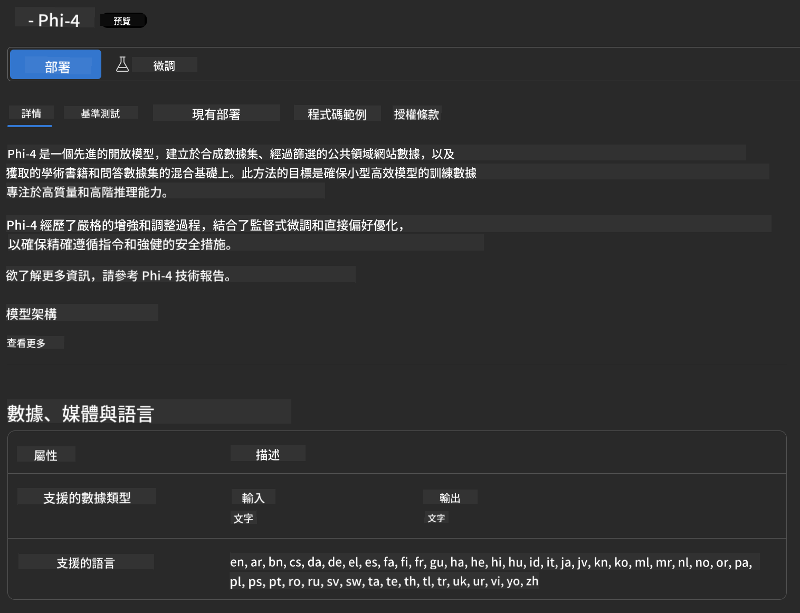

<!--
CO_OP_TRANSLATOR_METADATA:
{
  "original_hash": "3ae21dc5554e888defbe57946ee995ee",
  "translation_date": "2025-05-08T06:20:43+00:00",
  "source_file": "md/01.Introduction/02/03.AzureAIFoundry.md",
  "language_code": "hk"
}
-->
## Phi 家族喺 Azure AI Foundry

[Azure AI Foundry](https://ai.azure.com) 係一個值得信賴嘅平台，幫助開發者用安全、穩妥同負責任嘅方式推動創新，同塑造 AI 嘅未來。

[Azure AI Foundry](https://ai.azure.com) 為開發者設計，方便你：

- 喺企業級平台上建立生成式 AI 應用。
- 利用尖端嘅 AI 工具同機器學習模型去探索、建立、測試同部署，同時遵守負責任 AI 嘅做法。
- 同團隊合作，完成應用開發嘅全生命週期。

用 Azure AI Foundry，你可以探索各種模型、服務同功能，並開始打造最符合你目標嘅 AI 應用。Azure AI Foundry 平台方便你輕鬆擴展，將概念驗證轉化成成熟嘅生產應用。持續監控同優化，助你長遠成功。


除咗喺 Azure AI Foundry 用 Azure AOAI Service，你亦可以喺 Azure AI Foundry Model Catalog 使用第三方模型。如果你想用 Azure AI Foundry 作為 AI 解決方案平台，呢個係一個好選擇。

我哋可以透過 Azure AI Foundry 嘅 Model Catalog 快速部署 Phi 家族模型

[Microsoft Phi Models in Azure AI Foundry Models](https://ai.azure.com/explore/models/?selectedCollection=phi)


### **喺 Azure AI Foundry 部署 Phi-4**



### **喺 Azure AI Foundry Playground 測試 Phi-4**


### **用 Python 代碼調用 Azure AI Foundry Phi-4**

```python

import os  
import base64
from openai import AzureOpenAI  
from azure.identity import DefaultAzureCredential, get_bearer_token_provider  
        
endpoint = os.getenv("ENDPOINT_URL", "Your Azure AOAI Service Endpoint")  
deployment = os.getenv("DEPLOYMENT_NAME", "Phi-4")  
      
token_provider = get_bearer_token_provider(  
    DefaultAzureCredential(),  
    "https://cognitiveservices.azure.com/.default"  
)  
  
client = AzureOpenAI(  
    azure_endpoint=endpoint,  
    azure_ad_token_provider=token_provider,  
    api_version="2024-05-01-preview",  
)  
  

chat_prompt = [
    {
        "role": "system",
        "content": "You are an AI assistant that helps people find information."
    },
    {
        "role": "user",
        "content": "can you introduce yourself"
    }
] 
    
# Include speech result if speech is enabled  
messages = chat_prompt 

completion = client.chat.completions.create(  
    model=deployment,  
    messages=messages,
    max_tokens=800,  
    temperature=0.7,  
    top_p=0.95,  
    frequency_penalty=0,  
    presence_penalty=0,
    stop=None,  
    stream=False  
)  
  
print(completion.to_json())  

```

**免責聲明**：  
本文件係使用AI翻譯服務 [Co-op Translator](https://github.com/Azure/co-op-translator) 進行翻譯。雖然我哋致力確保準確性，但請注意，自動翻譯可能會包含錯誤或不準確之處。原始文件嘅母語版本應視為權威來源。對於重要資訊，建議採用專業人工翻譯。我哋對因使用本翻譯而引起嘅任何誤解或誤釋概不負責。