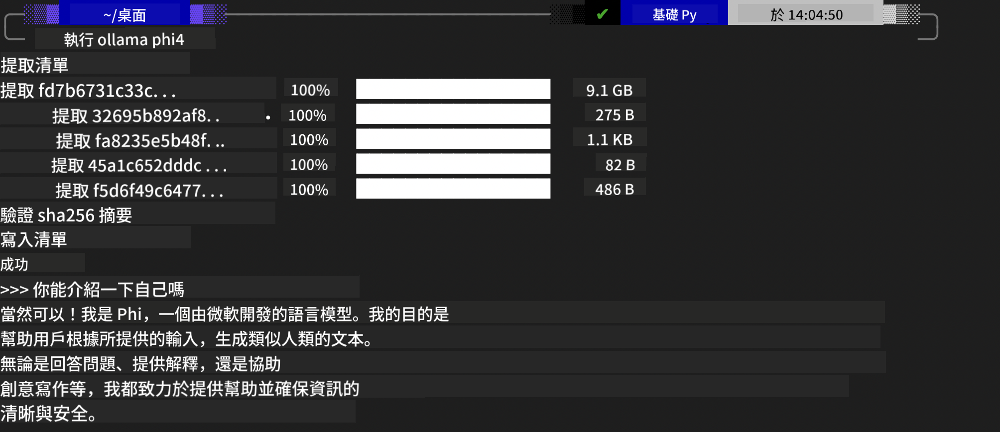
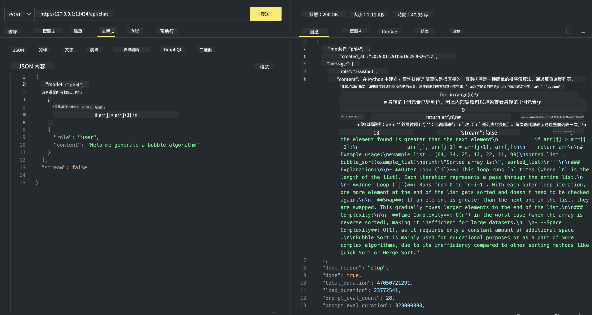

<!--
CO_OP_TRANSLATOR_METADATA:
{
  "original_hash": "ea58f7c3348e894feaeecb90f5bfa98f",
  "translation_date": "2025-04-04T17:39:10+00:00",
  "source_file": "md\\01.Introduction\\02\\04.Ollama.md",
  "language_code": "hk"
}
-->
## Phi Family in Ollama

[Ollama](https://ollama.com) 讓更多人可以透過簡單腳本直接部署開源的 LLM 或 SLM，同時也能建立 API 以支持本地 Copilot 的應用場景。

## **1. 安裝**

Ollama 支援在 Windows、macOS 和 Linux 上運行。你可以透過這個連結安裝 Ollama ([https://ollama.com/download](https://ollama.com/download))。成功安裝後，你可以直接使用 Ollama 腳本在終端窗口調用 Phi-3。你也可以查看 [Ollama 中的所有可用庫](https://ollama.com/library)。如果你在 Codespace 打開這個存儲庫，Ollama 已經預先安裝好了。

```bash

ollama run phi4

```

> [!NOTE]
> 第一次運行時，模型會先下載。當然，你也可以直接指定已下載的 Phi-4 模型。我們以 WSL 為例來運行命令。模型成功下載後，你可以直接在終端上進行互動。



## **2. 從 Ollama 調用 phi-4 API**

如果你想調用 Ollama 生成的 Phi-4 API，可以在終端使用以下命令啟動 Ollama 服務器。

```bash

ollama serve

```

> [!NOTE]
> 如果你在 macOS 或 Linux 上運行，可能會遇到以下錯誤 **"Error: listen tcp 127.0.0.1:11434: bind: address already in use"**。當你運行命令時可能出現這個錯誤。你可以忽略這個錯誤，因為通常表示服務器已經在運行，或者你可以停止並重新啟動 Ollama：

**macOS**

```bash

brew services restart ollama

```

**Linux**

```bash

sudo systemctl stop ollama

```

Ollama 支援兩種 API：generate 和 chat。你可以根據需求調用 Ollama 提供的模型 API，通過向在本地端口 11434 運行的服務發送請求。

**Chat**

```bash

curl http://127.0.0.1:11434/api/chat -d '{
  "model": "phi3",
  "messages": [
    {
      "role": "system",
      "content": "Your are a python developer."
    },
    {
      "role": "user",
      "content": "Help me generate a bubble algorithm"
    }
  ],
  "stream": false
  
}'

This is the result in Postman



## Additional Resources

Check the list of available models in Ollama in [their library](https://ollama.com/library).

Pull your model from the Ollama server using this command

```bash
ollama pull phi4
```

Run the model using this command

```bash
ollama run phi4
```

***Note:*** Visit this link [https://github.com/ollama/ollama/blob/main/docs/api.md](https://github.com/ollama/ollama/blob/main/docs/api.md) to learn more

## Calling Ollama from Python

You can use `requests` or `urllib3` to make requests to the local server endpoints used above. However, a popular way to use Ollama in Python is via the [openai](https://pypi.org/project/openai/) SDK, since Ollama provides OpenAI-compatible server endpoints as well.

Here is an example for phi3-mini:

```python
import openai

client = openai.OpenAI(
    base_url="http://localhost:11434/v1",
    api_key="nokeyneeded",
)

response = client.chat.completions.create(
    model="phi4",
    temperature=0.7,
    n=1,
    messages=[
        {"role": "system", "content": "You are a helpful assistant."},
        {"role": "user", "content": "Write a haiku about a hungry cat"},
    ],
)

print("Response:")
print(response.choices[0].message.content)
```

## Calling Ollama from JavaScript 

```javascript
// 使用 Phi-4 總結文件的範例
script({
    model: "ollama:phi4",
    title: "Summarize with Phi-4",
    system: ["system"],
})

// 總結範例
const file = def("FILE", env.files)
$`Summarize ${file} in a single paragraph.`
```

## Calling Ollama from C#

Create a new C# Console application and add the following NuGet package:

```bash
dotnet add package Microsoft.SemanticKernel --version 1.34.0
```

Then replace this code in the `Program.cs` file

```csharp
using Microsoft.SemanticKernel;
using Microsoft.SemanticKernel.ChatCompletion;

// 使用本地 Ollama 服務端點新增聊天完成服務
#pragma warning disable SKEXP0001, SKEXP0003, SKEXP0010, SKEXP0011, SKEXP0050, SKEXP0052
builder.AddOpenAIChatCompletion(
    modelId: "phi4",
    endpoint: new Uri("http://localhost:11434/"),
    apiKey: "non required");

// 向聊天服務發送簡單的提示
string prompt = "Write a joke about kittens";
var response = await kernel.InvokePromptAsync(prompt);
Console.WriteLine(response.GetValue<string>());
```

Run the app with the command:

```bash
dotnet run

**免責聲明**：  
此文件使用 AI 翻譯服務 [Co-op Translator](https://github.com/Azure/co-op-translator) 進行翻譯。我們致力於提供準確的翻譯，但請注意，自動翻譯可能包含錯誤或不準確之處。原始語言的文件應被視為具權威性的來源。對於重要信息，建議使用專業的人工翻譯。我們對因使用此翻譯而產生的任何誤解或錯誤解釋概不負責。