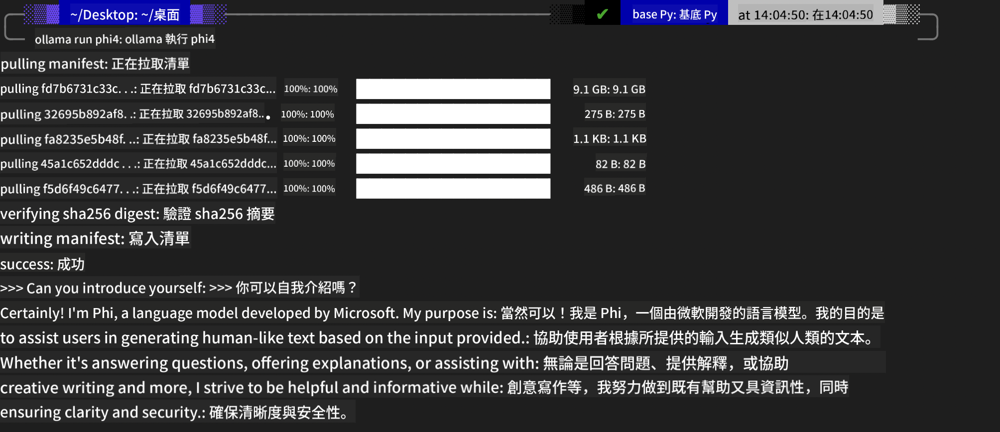
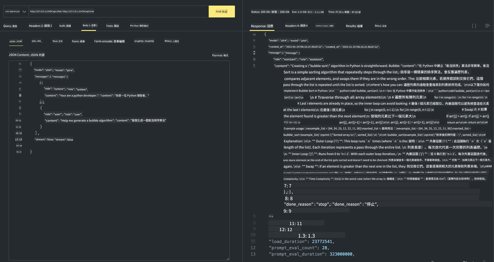

<!--
CO_OP_TRANSLATOR_METADATA:
{
  "original_hash": "0b38834693bb497f96bf53f0d941f9a1",
  "translation_date": "2025-05-08T06:28:58+00:00",
  "source_file": "md/01.Introduction/02/04.Ollama.md",
  "language_code": "hk"
}
-->
## Phi Family in Ollama

[Ollama](https://ollama.com) 令更多人可以透過簡單嘅腳本，直接部署開源嘅 LLM 或 SLM，仲可以建立 API 幫助本地 Copilot 嘅應用場景。

## **1. 安裝**

Ollama 支援喺 Windows、macOS 同 Linux 上運行。你可以透過呢個連結安裝 Ollama ([https://ollama.com/download](https://ollama.com/download))。安裝成功之後，你可以直接喺終端機視窗用 Ollama 腳本呼叫 Phi-3。你可以睇到所有 [Ollama 提供嘅庫](https://ollama.com/library)。如果你係用 Codespace 開呢個倉庫，Ollama 已經預裝好咗。

```bash

ollama run phi4

```

> [!NOTE]
> 第一次運行嘅時候會先下載模型，當然你亦可以直接指定已下載嘅 Phi-4 模型。呢度以 WSL 為例嚟執行命令。模型下載成功後，就可以直接喺終端機互動。



## **2. 從 Ollama 呼叫 phi-4 API**

如果你想呼叫由 Ollama 產生嘅 Phi-4 API，可以喺終端機用以下命令啟動 Ollama 伺服器。

```bash

ollama serve

```

> [!NOTE]
> 如果係 MacOS 或 Linux，請留意可能會遇到以下錯誤 **"Error: listen tcp 127.0.0.1:11434: bind: address already in use"**。執行命令時有機會出現呢個錯誤。你可以忽略，因為通常代表伺服器已經喺運行，或者你可以停止並重新啟動 Ollama：

**macOS**

```bash

brew services restart ollama

```

**Linux**

```bash

sudo systemctl stop ollama

```

Ollama 支援兩個 API：generate 同 chat。你可以根據需要，向本地運行喺 11434 埠嘅服務發送請求，呼叫 Ollama 提供嘅模型 API。

**Chat**

```bash

curl http://127.0.0.1:11434/api/chat -d '{
  "model": "phi3",
  "messages": [
    {
      "role": "system",
      "content": "Your are a python developer."
    },
    {
      "role": "user",
      "content": "Help me generate a bubble algorithm"
    }
  ],
  "stream": false
  
}'

This is the result in Postman



## Additional Resources

Check the list of available models in Ollama in [their library](https://ollama.com/library).

Pull your model from the Ollama server using this command

```bash
ollama pull phi4
```

Run the model using this command

```bash
ollama run phi4
```

***Note:*** Visit this link [https://github.com/ollama/ollama/blob/main/docs/api.md](https://github.com/ollama/ollama/blob/main/docs/api.md) to learn more

## Calling Ollama from Python

You can use `requests` or `urllib3` to make requests to the local server endpoints used above. However, a popular way to use Ollama in Python is via the [openai](https://pypi.org/project/openai/) SDK, since Ollama provides OpenAI-compatible server endpoints as well.

Here is an example for phi3-mini:

```python
import openai

client = openai.OpenAI(
    base_url="http://localhost:11434/v1",
    api_key="nokeyneeded",
)

response = client.chat.completions.create(
    model="phi4",
    temperature=0.7,
    n=1,
    messages=[
        {"role": "system", "content": "You are a helpful assistant."},
        {"role": "user", "content": "Write a haiku about a hungry cat"},
    ],
)

print("Response:")
print(response.choices[0].message.content)
```

## Calling Ollama from JavaScript 

```javascript
// 用 Phi-4 摘要檔案嘅例子
script({
    model: "ollama:phi4",
    title: "Summarize with Phi-4",
    system: ["system"],
})

// 摘要嘅例子
const file = def("FILE", env.files)
$`Summarize ${file} in a single paragraph.`
```

## Calling Ollama from C#

Create a new C# Console application and add the following NuGet package:

```bash
dotnet add package Microsoft.SemanticKernel --version 1.34.0
```

Then replace this code in the `Program.cs` file

```csharp
using Microsoft.SemanticKernel;
using Microsoft.SemanticKernel.ChatCompletion;

// 用本地 Ollama 伺服器端點加入 chat completion 服務
#pragma warning disable SKEXP0001, SKEXP0003, SKEXP0010, SKEXP0011, SKEXP0050, SKEXP0052
builder.AddOpenAIChatCompletion(
    modelId: "phi4",
    endpoint: new Uri("http://localhost:11434/"),
    apiKey: "non required");

// 呼叫簡單嘅提示到 chat 服務
string prompt = "Write a joke about kittens";
var response = await kernel.InvokePromptAsync(prompt);
Console.WriteLine(response.GetValue<string>());
```

Run the app with the command:

```bash
dotnet run

**免責聲明**：  
本文件係使用 AI 翻譯服務 [Co-op Translator](https://github.com/Azure/co-op-translator) 進行翻譯。雖然我哋盡力確保準確，但請注意，自動翻譯可能包含錯誤或不準確之處。原始文件嘅母語版本應視為權威來源。對於重要資料，建議採用專業人工翻譯。我哋對因使用本翻譯而引起嘅任何誤解或誤釋概不負責。