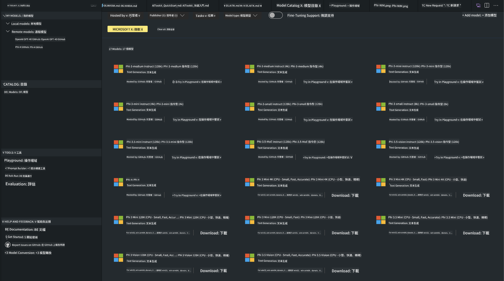
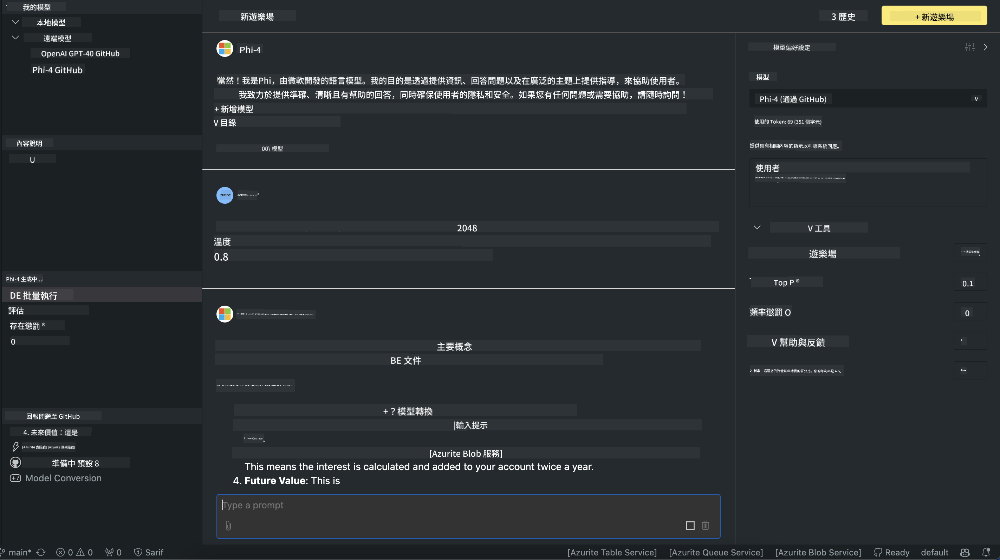

<!--
CO_OP_TRANSLATOR_METADATA:
{
  "original_hash": "9365fb38f5c75c4d7ac9b9a4baa7c9d1",
  "translation_date": "2025-04-04T17:40:11+00:00",
  "source_file": "md\\01.Introduction\\02\\05.AITK.md",
  "language_code": "hk"
}
-->
# Phi Family in AITK

[AI Toolkit for VS Code](https://marketplace.visualstudio.com/items?itemName=ms-windows-ai-studio.windows-ai-studio) 幫助簡化生成式人工智能應用的開發，結合了最先進的人工智能開發工具以及來自 Azure AI Foundry Catalog 和 Hugging Face 等其他目錄的模型。你可以瀏覽由 GitHub Models 和 Azure AI Foundry Model Catalogs 支援的 AI 模型目錄，下載模型到本地或遠端，進行微調、測試並在你的應用中使用。

AI Toolkit 預覽版會在本地運行。根據你選擇的模型，本地推理或微調可能需要 NVIDIA CUDA GPU 等 GPU。你也可以直接用 AITK 運行 GitHub Models。

## 入門指南

[了解如何安裝 Windows 的 Linux 子系統](https://learn.microsoft.com/windows/wsl/install?WT.mc_id=aiml-137032-kinfeylo)

以及[更改預設的 Linux 發行版](https://learn.microsoft.com/windows/wsl/install#change-the-default-linux-distribution-installed)。

[AI Tooklit GitHub Repo](https://github.com/microsoft/vscode-ai-toolkit/)

- 支援 Windows、Linux 和 macOS
  
- 在 Windows 和 Linux 上進行微調需要 Nvidia GPU。此外，**Windows** 還需要安裝 Linux 子系統並使用 Ubuntu 18.4 或更高版本。[了解如何安裝 Windows 的 Linux 子系統](https://learn.microsoft.com/windows/wsl/install) 以及[更改預設的 Linux 發行版](https://learn.microsoft.com/windows/wsl/install#change-the-default-linux-distribution-installed)。

### 安裝 AI Toolkit

AI Toolkit 作為 [Visual Studio Code 擴展](https://code.visualstudio.com/docs/setup/additional-components#_vs-code-extensions) 提供，因此你需要先安裝 [VS Code](https://code.visualstudio.com/docs/setup/windows?WT.mc_id=aiml-137032-kinfeylo)，然後從 [VS Marketplace](https://marketplace.visualstudio.com/items?itemName=ms-windows-ai-studio.windows-ai-studio) 下載 AI Toolkit。
[AI Toolkit 可在 Visual Studio Marketplace 上獲得](https://marketplace.visualstudio.com/items?itemName=ms-windows-ai-studio.windows-ai-studio)，並且可以像其他 VS Code 擴展一樣安裝。

如果你不熟悉如何安裝 VS Code 擴展，可以按照以下步驟操作：

### 登錄

1. 在 VS Code 的活動欄中選擇 **Extensions**。
1. 在擴展搜索欄中輸入 "AI Toolkit"。
1. 選擇 "AI Toolkit for Visual Studio code"。
1. 點擊 **Install**。

現在，你已準備好使用此擴展！

系統會提示你登錄 GitHub，請點擊 "Allow" 繼續。你將被重定向到 GitHub 登錄頁面。

請登錄並按照步驟完成流程。成功完成後，你將被重定向到 VS Code。

擴展安裝完成後，你會在活動欄看到 AI Toolkit 的圖標。

讓我們來探索可用的功能！

### 可用功能

AI Toolkit 的主側邊欄分為以下部分：  

- **Models**
- **Resources**
- **Playground**  
- **Fine-tuning**
- **Evaluation**

這些功能都可以在 Resources 部分找到。開始使用時，請選擇 **Model Catalog**。

### 從目錄下載模型

從 VS Code 側邊欄啟動 AI Toolkit 後，你可以選擇以下選項：



- 從 **Model Catalog** 找到支援的模型並下載到本地
- 在 **Model Playground** 測試模型推理
- 在 **Model Fine-tuning** 中本地或遠程微調模型
- 通過 AI Toolkit 的命令面板將微調的模型部署到雲端
- 評估模型

> [!NOTE]
>
> **GPU Vs CPU**
>
> 你會注意到模型卡顯示了模型大小、平台和加速器類型（CPU、GPU）。對於 **Windows 設備（至少有一個 GPU）**，請選擇僅針對 Windows 的模型版本以獲得最佳性能。
>
> 這確保模型已針對 DirectML 加速器進行優化。
>
> 模型名稱的格式為
>
> - `{model_name}-{accelerator}-{quantization}-{format}`。
>
>要檢查你的 Windows 設備是否有 GPU，打開 **Task Manager**，然後選擇 **Performance** 標籤。如果有 GPU，它們會顯示為 "GPU 0" 或 "GPU 1" 等名稱。

### 在 Playground 中運行模型

設置所有參數後，點擊 **Generate Project**。

模型下載完成後，選擇目錄中的模型卡上的 **Load in Playground**：

- 開始下載模型
- 安裝所有必要的前置條件和依賴項
- 創建 VS Code 工作空間



### 在應用中使用 REST API 

AI Toolkit 提供了一個本地 REST API 網絡服務器 **端口 5272**，使用 [OpenAI chat completions 格式](https://platform.openai.com/docs/api-reference/chat/create)。

這使你可以在本地測試應用，而無需依賴雲端 AI 模型服務。例如，以下 JSON 文件顯示了如何配置請求的主體：

```json
{
    "model": "Phi-4",
    "messages": [
        {
            "role": "user",
            "content": "what is the golden ratio?"
        }
    ],
    "temperature": 0.7,
    "top_p": 1,
    "top_k": 10,
    "max_tokens": 100,
    "stream": true
}
```

你可以使用 [Postman](https://www.postman.com/) 或 CURL（Client URL）工具測試 REST API：

```bash
curl -vX POST http://127.0.0.1:5272/v1/chat/completions -H 'Content-Type: application/json' -d @body.json
```

### 使用 Python 的 OpenAI 客戶端庫

```python
from openai import OpenAI

client = OpenAI(
    base_url="http://127.0.0.1:5272/v1/", 
    api_key="x" # required for the API but not used
)

chat_completion = client.chat.completions.create(
    messages=[
        {
            "role": "user",
            "content": "what is the golden ratio?",
        }
    ],
    model="Phi-4",
)

print(chat_completion.choices[0].message.content)
```

### 使用 .NET 的 Azure OpenAI 客戶端庫

使用 NuGet 將 [Azure OpenAI 客戶端庫](https://www.nuget.org/packages/Azure.AI.OpenAI/) 添加到你的項目中：

```bash
dotnet add {project_name} package Azure.AI.OpenAI --version 1.0.0-beta.17
```

在你的項目中添加一個名為 **OverridePolicy.cs** 的 C# 文件，並粘貼以下代碼：

```csharp
// OverridePolicy.cs
using Azure.Core.Pipeline;
using Azure.Core;

internal partial class OverrideRequestUriPolicy(Uri overrideUri)
    : HttpPipelineSynchronousPolicy
{
    private readonly Uri _overrideUri = overrideUri;

    public override void OnSendingRequest(HttpMessage message)
    {
        message.Request.Uri.Reset(_overrideUri);
    }
}
```

接下來，將以下代碼粘貼到你的 **Program.cs** 文件中：

```csharp
// Program.cs
using Azure.AI.OpenAI;

Uri localhostUri = new("http://localhost:5272/v1/chat/completions");

OpenAIClientOptions clientOptions = new();
clientOptions.AddPolicy(
    new OverrideRequestUriPolicy(localhostUri),
    Azure.Core.HttpPipelinePosition.BeforeTransport);
OpenAIClient client = new(openAIApiKey: "unused", clientOptions);

ChatCompletionsOptions options = new()
{
    DeploymentName = "Phi-4",
    Messages =
    {
        new ChatRequestSystemMessage("You are a helpful assistant. Be brief and succinct."),
        new ChatRequestUserMessage("What is the golden ratio?"),
    }
};

StreamingResponse<StreamingChatCompletionsUpdate> streamingChatResponse
    = await client.GetChatCompletionsStreamingAsync(options);

await foreach (StreamingChatCompletionsUpdate chatChunk in streamingChatResponse)
{
    Console.Write(chatChunk.ContentUpdate);
}
```

## 使用 AI Toolkit 進行微調

- 從模型探索和 Playground 開始。
- 使用本地計算資源進行模型微調和推理。
- 使用 Azure 資源進行遠程微調和推理。

[使用 AI Toolkit 進行微調](../../03.FineTuning/Finetuning_VSCodeaitoolkit.md)

## AI Toolkit 問答資源

請參考我們的 [問答頁面](https://github.com/microsoft/vscode-ai-toolkit/blob/main/archive/QA.md)，了解最常見的問題和解決方案。

**免責聲明**：  
本文檔已使用AI翻譯服務[Co-op Translator](https://github.com/Azure/co-op-translator)進行翻譯。我們致力於提供準確的翻譯，但請注意，自動翻譯可能包含錯誤或不準確之處。原始語言的文件應被視為權威來源。對於重要信息，建議使用專業的人工翻譯。我們對因使用此翻譯而引起的任何誤解或錯誤解釋概不負責。