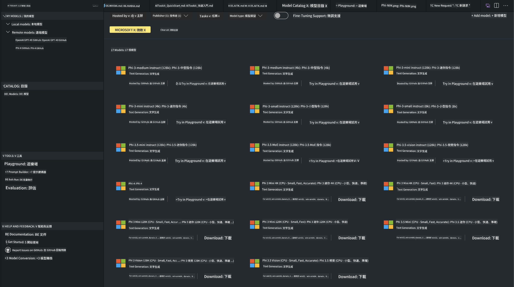
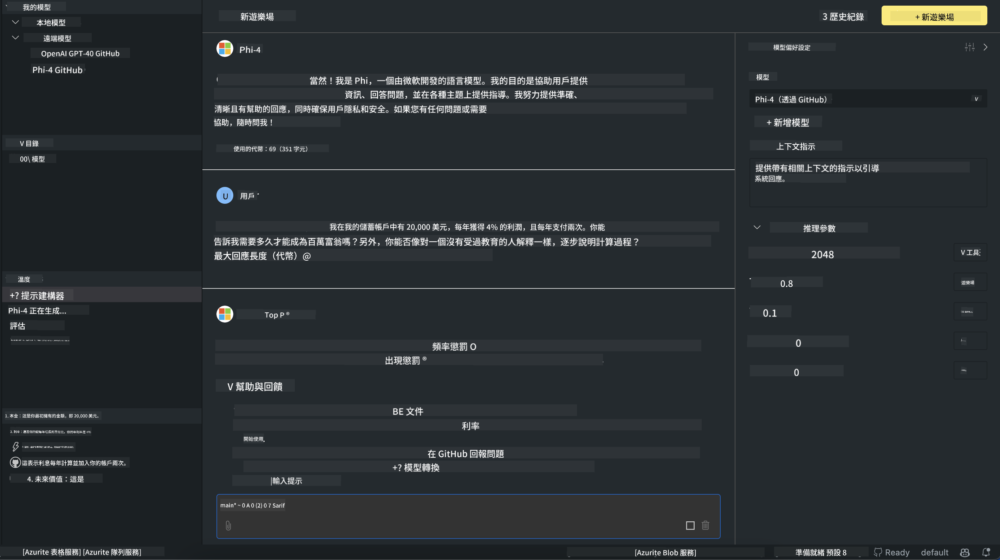

<!--
CO_OP_TRANSLATOR_METADATA:
{
  "original_hash": "4951d458c0b60c02cd1e751b40903877",
  "translation_date": "2025-05-08T06:19:36+00:00",
  "source_file": "md/01.Introduction/02/05.AITK.md",
  "language_code": "hk"
}
-->
# Phi Family in AITK

[AI Toolkit for VS Code](https://marketplace.visualstudio.com/items?itemName=ms-windows-ai-studio.windows-ai-studio) 幫助簡化生成式 AI 應用程式開發，整合來自 Azure AI Foundry Catalog 及其他目錄（例如 Hugging Face）嘅最先進 AI 開發工具同模型。你可以瀏覽由 GitHub Models 同 Azure AI Foundry Model Catalogs 支援嘅 AI 模型目錄，下載到本地或者遠端，進行微調、測試，然後喺應用程式中使用。

AI Toolkit Preview 會喺本地運行。根據你揀嘅模型，係本地推理或者微調，可能需要 NVIDIA CUDA GPU 呢類嘅 GPU。你亦可以直接用 AITK 運行 GitHub Models。

## Getting Started

[了解點樣安裝 Windows subsystem for Linux](https://learn.microsoft.com/windows/wsl/install?WT.mc_id=aiml-137032-kinfeylo)

同埋 [更改預設發行版](https://learn.microsoft.com/windows/wsl/install#change-the-default-linux-distribution-installed)。

[AI Tooklit GitHub Repo](https://github.com/microsoft/vscode-ai-toolkit/)

- Windows、Linux、macOS
  
- 喺 Windows 同 Linux 做微調嘅話，你需要 Nvidia GPU。另外，**Windows** 需要安裝 Ubuntu 18.4 或以上版本嘅 Linux 子系統。[了解點樣安裝 Windows subsystem for Linux](https://learn.microsoft.com/windows/wsl/install) 同 [更改預設發行版](https://learn.microsoft.com/windows/wsl/install#change-the-default-linux-distribution-installed)。

### Install AI Toolkit

AI Toolkit 係以 [Visual Studio Code Extension](https://code.visualstudio.com/docs/setup/additional-components#_vs-code-extensions) 形式發佈，所以你需要先安裝 [VS Code](https://code.visualstudio.com/docs/setup/windows?WT.mc_id=aiml-137032-kinfeylo)，然後喺 [VS Marketplace](https://marketplace.visualstudio.com/items?itemName=ms-windows-ai-studio.windows-ai-studio) 下載 AI Toolkit。  
[AI Toolkit 喺 Visual Studio Marketplace 有得下載](https://marketplace.visualstudio.com/items?itemName=ms-windows-ai-studio.windows-ai-studio)，安裝方法同其他 VS Code 擴充一樣。

如果你未試過裝 VS Code 擴充，可以跟住以下步驟：

### Sign In

1. 喺 VS Code 嘅 Activity Bar 揀 **Extensions**  
1. 喺擴充搜尋欄入「AI Toolkit」  
1. 揀「AI Toolkit for Visual Studio code」  
1. 選擇 **Install**

依家你準備好用呢個擴充喇！

系統會提示你登入 GitHub，請按「Allow」繼續。你會被導向 GitHub 登入頁面。

登入並跟住流程完成後，你會被導回 VS Code。

擴充安裝完成後，你會喺 Activity Bar 見到 AI Toolkit 嘅圖示。

一齊探索可用功能啦！

### Available Actions

AI Toolkit 嘅主側邊欄分為  

- **Models**  
- **Resources**  
- **Playground**  
- **Fine-tuning**  
- **Evaluation**

呢啲都喺 Resources 區域。想開始就揀 **Model Catalog**。

### Download a model from the catalog

喺 VS Code 側邊欄啟動 AI Toolkit 後，你可以揀以下選項：



- 喺 **Model Catalog** 搵支援嘅模型並下載到本地  
- 喺 **Model Playground** 測試模型推理  
- 喺 **Model Fine-tuning** 本地或遠端微調模型  
- 用命令面板部署微調後嘅模型去雲端  
- 評估模型

> [!NOTE]
>
> **GPU Vs CPU**
>
> 你會見到模型卡片會顯示模型大小、平台同加速器類型（CPU、GPU）。如果你嘅 Windows 裝置有至少一塊 GPU，建議揀只針對 Windows 嘅模型版本，咁可以獲得最佳性能。
>
> 呢樣確保模型已針對 DirectML 加速器優化。
>
> 模型名稱格式係  
>
> - `{model_name}-{accelerator}-{quantization}-{format}`。
>
> 想查自己 Windows 裝置有冇 GPU，可以開啟 **Task Manager**，然後揀 **Performance** 標籤。如果有 GPU，會顯示名為「GPU 0」或「GPU 1」咁嘅項目。

### Run the model in the playground

設定好所有參數後，按 **Generate Project**。

模型下載完成後，喺目錄嘅模型卡片揀 **Load in Playground**：

- 開始下載模型  
- 安裝所有先決條件同依賴  
- 建立 VS Code 工作區



### Use the REST API in your application 

AI Toolkit 內建本地 REST API 網頁伺服器，**使用端口 5272**，採用 [OpenAI chat completions 格式](https://platform.openai.com/docs/api-reference/chat/create)。

咁你就可以喺本地測試應用程式，唔使依賴雲端 AI 模型服務。例如，下面嘅 JSON 檔示範點樣設定請求嘅 body：

```json
{
    "model": "Phi-4",
    "messages": [
        {
            "role": "user",
            "content": "what is the golden ratio?"
        }
    ],
    "temperature": 0.7,
    "top_p": 1,
    "top_k": 10,
    "max_tokens": 100,
    "stream": true
}
```

你可以用 [Postman](https://www.postman.com/) 或 CURL（Client URL）工具測試 REST API：

```bash
curl -vX POST http://127.0.0.1:5272/v1/chat/completions -H 'Content-Type: application/json' -d @body.json
```

### Using the OpenAI client library for Python

```python
from openai import OpenAI

client = OpenAI(
    base_url="http://127.0.0.1:5272/v1/", 
    api_key="x" # required for the API but not used
)

chat_completion = client.chat.completions.create(
    messages=[
        {
            "role": "user",
            "content": "what is the golden ratio?",
        }
    ],
    model="Phi-4",
)

print(chat_completion.choices[0].message.content)
```

### Using Azure OpenAI client library for .NET

用 NuGet 加入 [Azure OpenAI client library for .NET](https://www.nuget.org/packages/Azure.AI.OpenAI/) 到你嘅專案：

```bash
dotnet add {project_name} package Azure.AI.OpenAI --version 1.0.0-beta.17
```

加一個叫 **OverridePolicy.cs** 嘅 C# 檔案到專案，貼上以下程式碼：

```csharp
// OverridePolicy.cs
using Azure.Core.Pipeline;
using Azure.Core;

internal partial class OverrideRequestUriPolicy(Uri overrideUri)
    : HttpPipelineSynchronousPolicy
{
    private readonly Uri _overrideUri = overrideUri;

    public override void OnSendingRequest(HttpMessage message)
    {
        message.Request.Uri.Reset(_overrideUri);
    }
}
```

之後喺 **Program.cs** 貼以下程式碼：

```csharp
// Program.cs
using Azure.AI.OpenAI;

Uri localhostUri = new("http://localhost:5272/v1/chat/completions");

OpenAIClientOptions clientOptions = new();
clientOptions.AddPolicy(
    new OverrideRequestUriPolicy(localhostUri),
    Azure.Core.HttpPipelinePosition.BeforeTransport);
OpenAIClient client = new(openAIApiKey: "unused", clientOptions);

ChatCompletionsOptions options = new()
{
    DeploymentName = "Phi-4",
    Messages =
    {
        new ChatRequestSystemMessage("You are a helpful assistant. Be brief and succinct."),
        new ChatRequestUserMessage("What is the golden ratio?"),
    }
};

StreamingResponse<StreamingChatCompletionsUpdate> streamingChatResponse
    = await client.GetChatCompletionsStreamingAsync(options);

await foreach (StreamingChatCompletionsUpdate chatChunk in streamingChatResponse)
{
    Console.Write(chatChunk.ContentUpdate);
}
```


## Fine Tuning with AI Toolkit

- 開始探索模型同 playground  
- 用本地計算資源做模型微調同推理  
- 用 Azure 資源做遠端微調同推理

[Fine Tuning with AI Toolkit](../../03.FineTuning/Finetuning_VSCodeaitoolkit.md)

## AI Toolkit Q&A Resources

常見問題同解決方案請參考我哋嘅 [Q&A page](https://github.com/microsoft/vscode-ai-toolkit/blob/main/archive/QA.md)

**免責聲明**：  
本文件係使用 AI 翻譯服務 [Co-op Translator](https://github.com/Azure/co-op-translator) 進行翻譯。雖然我哋努力確保準確性，但請注意，自動翻譯可能包含錯誤或不準確之處。原始文件嘅母語版本應被視為權威來源。對於重要資料，建議採用專業人工翻譯。我哋對因使用本翻譯而引致嘅任何誤解或誤釋概不負責。