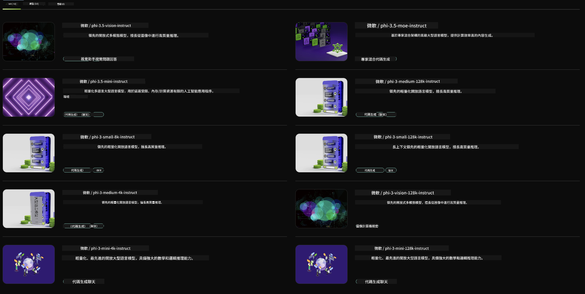

<!--
CO_OP_TRANSLATOR_METADATA:
{
  "original_hash": "6b028cdc5b33b99efb0f061bcff71023",
  "translation_date": "2025-04-04T17:41:55+00:00",
  "source_file": "md\\01.Introduction\\02\\06.NVIDIA.md",
  "language_code": "hk"
}
-->
## Phi Family in NVIDIA NIM

NVIDIA NIM 是一套簡單易用的微服務，旨在加速生成式 AI 模型在雲端、數據中心和工作站的部署。NIM 根據模型家族以及每個模型進行分類。例如，NVIDIA NIM 專為大型語言模型 (LLMs) 設計，將最先進的 LLMs 能力帶入企業應用，提供無與倫比的自然語言處理和理解能力。

NIM 讓 IT 和 DevOps 團隊能夠在自己管理的環境中自我托管大型語言模型 (LLMs)，同時為開發者提供行業標準的 API，幫助他們構建強大的輔助工具、聊天機器人和 AI 助理，徹底改變業務運作。利用 NVIDIA 的尖端 GPU 加速技術和可擴展部署，NIM 提供了最快的推理途徑，性能卓越。

你可以使用 NVIDIA NIM 進行 Phi 家族模型的推理。



### **範例 - NVIDIA NIM 中的 Phi-3-Vision**

假設你有一張圖片 (`demo.png`)，並希望生成 Python 代碼來處理這張圖片並保存它的新版本 (`phi-3-vision.jpg`)。

上述代碼會自動完成以下流程：

1. 設置環境和必要配置。
2. 創建提示，指導模型生成所需的 Python 代碼。
3. 將提示發送給模型並收集生成的代碼。
4. 提取並運行生成的代碼。
5. 顯示原始圖片和處理後的圖片。

這種方法利用 AI 的能力來自動化圖片處理任務，使目標的達成更加簡便快捷。

[範例代碼解決方案](../../../../../code/06.E2E/E2E_Nvidia_NIM_Phi3_Vision.ipynb)

以下是整段代碼的逐步解析：

1. **安裝所需套件**：
    ```python
    !pip install langchain_nvidia_ai_endpoints -U
    ```
    此命令安裝 `langchain_nvidia_ai_endpoints` 套件，並確保使用最新版本。

2. **導入必要模塊**：
    ```python
    from langchain_nvidia_ai_endpoints import ChatNVIDIA
    import getpass
    import os
    import base64
    ```
    這些導入包含與 NVIDIA AI 端點交互、安全處理密碼、操作系統交互以及 base64 格式的編碼/解碼所需的模塊。

3. **設置 API 金鑰**：
    ```python
    if not os.getenv("NVIDIA_API_KEY"):
        os.environ["NVIDIA_API_KEY"] = getpass.getpass("Enter your NVIDIA API key: ")
    ```
    此代碼檢查是否設置了 `NVIDIA_API_KEY` 環境變量。如果沒有，則提示用戶安全地輸入 API 金鑰。

4. **定義模型和圖片路徑**：
    ```python
    model = 'microsoft/phi-3-vision-128k-instruct'
    chat = ChatNVIDIA(model=model)
    img_path = './imgs/demo.png'
    ```
    此步驟設置使用的模型，創建指定模型的 `ChatNVIDIA` 實例，並定義圖片文件的路徑。

5. **創建文本提示**：
    ```python
    text = "Please create Python code for image, and use plt to save the new picture under imgs/ and name it phi-3-vision.jpg."
    ```
    此部分定義了一個文本提示，指導模型生成處理圖片的 Python 代碼。

6. **將圖片編碼為 Base64**：
    ```python
    with open(img_path, "rb") as f:
        image_b64 = base64.b64encode(f.read()).decode()
    image = f''
    ```
    此代碼讀取圖片文件，將其編碼為 base64，並創建帶有編碼數據的 HTML 圖片標籤。

7. **將文本和圖片合併到提示中**：
    ```python
    prompt = f"{text} {image}"
    ```
    此步驟將文本提示和 HTML 圖片標籤合併為一個字符串。

8. **使用 ChatNVIDIA 生成代碼**：
    ```python
    code = ""
    for chunk in chat.stream(prompt):
        print(chunk.content, end="")
        code += chunk.content
    ```
    此代碼將提示發送給 `ChatNVIDIA` model and collects the generated code in chunks, printing and appending each chunk to the `code` 字符串。

9. **從生成內容中提取 Python 代碼**：
    ```python
    begin = code.index('```python') + 9
    code = code[begin:]
    end = code.index('```')
    code = code[:end]
    ```
    此部分通過移除 Markdown 格式提取生成內容中的實際 Python 代碼。

10. **運行生成的代碼**：
    ```python
    import subprocess
    result = subprocess.run(["python", "-c", code], capture_output=True)
    ```
    此代碼將提取的 Python 代碼作為子進程運行並捕獲其輸出。

11. **顯示圖片**：
    ```python
    from IPython.display import Image, display
    display(Image(filename='./imgs/phi-3-vision.jpg'))
    display(Image(filename='./imgs/demo.png'))
    ```
    這些行使用 `IPython.display` 模塊顯示圖片。

**免責聲明**:  
本文件使用人工智能翻譯服務 [Co-op Translator](https://github.com/Azure/co-op-translator) 進行翻譯。我們致力於提供準確的翻譯，但請注意，自動翻譯可能包含錯誤或不準確之處。原始文件的母語版本應被視為權威來源。對於關鍵信息，建議尋求專業人工翻譯。我們對因使用此翻譯而引起的任何誤解或錯誤解釋概不負責。