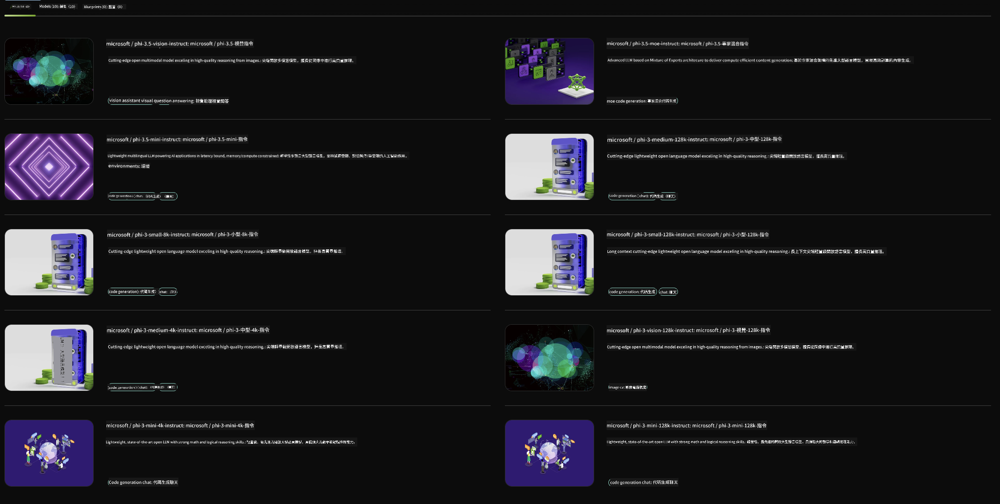

<!--
CO_OP_TRANSLATOR_METADATA:
{
  "original_hash": "7b08e277df2a9307f861ae54bc30c772",
  "translation_date": "2025-05-08T06:21:17+00:00",
  "source_file": "md/01.Introduction/02/06.NVIDIA.md",
  "language_code": "hk"
}
-->
## Phi Family in NVIDIA NIM

NVIDIA NIM 係一套易用嘅微服務，專門用嚟加速喺雲端、數據中心同工作站部署生成式 AI 模型。NIM 會按模型家族同每個模型分類。例如，NVIDIA NIM 針對大型語言模型（LLMs）帶嚟最先進嘅 LLM 能力，用喺企業應用上，提供無可比擬嘅自然語言處理同理解功能。

NIM 方便 IT 同 DevOps 團隊喺自己管理嘅環境中自助部署大型語言模型（LLMs），同時為開發者提供業界標準嘅 API，令佢哋可以打造強大嘅協助工具、聊天機械人同 AI 助手，從而改變業務運作。利用 NVIDIA 尖端嘅 GPU 加速同可擴展嘅部署，NIM 提供最快嘅推理路徑，效能無人能及。

你可以用 NVIDIA NIM 來推理 Phi Family Models



### **Samples - Phi-3-Vision in NVIDIA NIM**

想像你有一張圖片 (`demo.png`)，你想產生 Python 代碼處理呢張圖片，並儲存一個新版本 (`phi-3-vision.jpg`)。

上面嘅代碼會自動化完成以下步驟：

1. 設置環境同必要嘅配置。
2. 建立一個提示，指示模型生成所需嘅 Python 代碼。
3. 將提示發送畀模型，並收集生成嘅代碼。
4. 提取同執行生成嘅代碼。
5. 顯示原始同處理後嘅圖片。

呢個方法利用 AI 嘅力量自動化圖片處理任務，令你更輕鬆、更快完成目標。

[Sample Code Solution](../../../../../code/06.E2E/E2E_Nvidia_NIM_Phi3_Vision.ipynb)

我哋逐步拆解呢段代碼做緊啲乜：

1. **安裝所需套件**：
    ```python
    !pip install langchain_nvidia_ai_endpoints -U
    ```
    呢條命令會安裝 `langchain_nvidia_ai_endpoints` 套件，確保係最新版本。

2. **導入必要模組**：
    ```python
    from langchain_nvidia_ai_endpoints import ChatNVIDIA
    import getpass
    import os
    import base64
    ```
    呢啲導入包含咗同 NVIDIA AI 端點互動、密碼安全處理、操作系統互動同 base64 編解碼相關嘅模組。

3. **設定 API Key**：
    ```python
    if not os.getenv("NVIDIA_API_KEY"):
        os.environ["NVIDIA_API_KEY"] = getpass.getpass("Enter your NVIDIA API key: ")
    ```
    呢段代碼會檢查環境變量 `NVIDIA_API_KEY` 有冇設定，如果冇，會安全咁提示用戶輸入 API key。

4. **定義模型同圖片路徑**：
    ```python
    model = 'microsoft/phi-3-vision-128k-instruct'
    chat = ChatNVIDIA(model=model)
    img_path = './imgs/demo.png'
    ```
    呢度設定咗要用嘅模型，建立咗 `ChatNVIDIA` 嘅實例，並定義圖片檔案嘅路徑。

5. **建立文字提示**：
    ```python
    text = "Please create Python code for image, and use plt to save the new picture under imgs/ and name it phi-3-vision.jpg."
    ```
    呢度定義咗一個文字提示，指示模型產生用嚟處理圖片嘅 Python 代碼。

6. **將圖片編碼成 Base64**：
    ```python
    with open(img_path, "rb") as f:
        image_b64 = base64.b64encode(f.read()).decode()
    image = f''
    ```
    呢段代碼讀取圖片檔案，編碼成 base64，然後建立一個包含編碼資料嘅 HTML 圖片標籤。

7. **將文字同圖片合成提示**：
    ```python
    prompt = f"{text} {image}"
    ```
    呢度將文字提示同 HTML 圖片標籤合併成一個字串。

8. **用 ChatNVIDIA 生成代碼**：
    ```python
    code = ""
    for chunk in chat.stream(prompt):
        print(chunk.content, end="")
        code += chunk.content
    ```
    呢段代碼會將提示發送畀 `ChatNVIDIA`，然後攞返生成嘅代碼字串。

9. **從生成內容中提取 Python 代碼**：
    ```python
    begin = code.index('```python') + 9
    code = code[begin:]
    end = code.index('```')
    code = code[:end]
    ```
    呢段會剔除 markdown 格式，提取出真正嘅 Python 代碼。

10. **執行生成嘅代碼**：
    ```python
    import subprocess
    result = subprocess.run(["python", "-c", code], capture_output=True)
    ```
    呢段會以子程序方式執行提取出嚟嘅 Python 代碼，並捕捉佢嘅輸出。

11. **顯示圖片**：
    ```python
    from IPython.display import Image, display
    display(Image(filename='./imgs/phi-3-vision.jpg'))
    display(Image(filename='./imgs/demo.png'))
    ```
    呢幾行用 `IPython.display` 模組顯示原圖同處理後嘅圖片。

**免責聲明**：  
本文件係用 AI 翻譯服務 [Co-op Translator](https://github.com/Azure/co-op-translator) 進行翻譯。雖然我哋盡力確保準確性，但請注意自動翻譯可能包含錯誤或不準確之處。原始文件嘅母語版本應視為權威來源。對於重要資料，建議採用專業人工翻譯。因使用本翻譯而引起嘅任何誤解或誤釋，我哋概不負責。