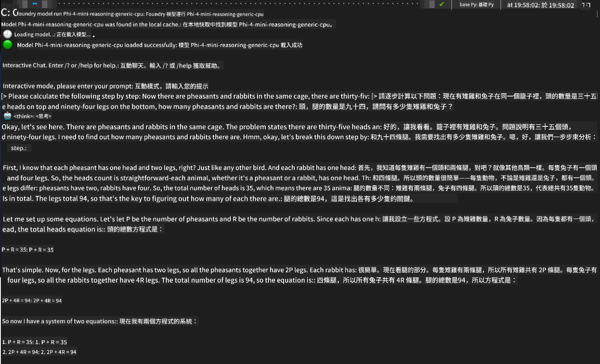

<!--
CO_OP_TRANSLATOR_METADATA:
{
  "original_hash": "52973a5680a65a810aa80b7036afd31f",
  "translation_date": "2025-06-27T13:34:56+00:00",
  "source_file": "md/01.Introduction/02/07.FoundryLocal.md",
  "language_code": "hk"
}
-->
## 在 Foundry Local 使用 Phi-Family 模型入門

### Foundry Local 簡介

Foundry Local 是一款強大的本地裝置 AI 推理解決方案，將企業級 AI 能力直接帶到您的本地硬件。這個教學將指導您如何在 Foundry Local 上設定和使用 Phi-Family 模型，讓您能完全掌控 AI 工作負載，同時保障隱私並降低成本。

Foundry Local 透過在本地設備運行 AI 模型，提供性能、隱私、自訂和成本優勢。它可透過直覺的 CLI、SDK 及 REST API，無縫整合到您現有的工作流程和應用程式中。


### 為什麼選擇 Foundry Local？

了解 Foundry Local 的優勢，有助您在 AI 部署策略上做出明智決策：

- **本地推理：** 在您自己的硬件上本地運行模型，降低成本，同時確保所有資料留在您的裝置上。

- **模型自訂：** 從預設模型中選擇，或使用您自己的模型，以符合特定需求和使用場景。

- **成本效益：** 利用現有硬件，免除雲端服務的持續費用，讓 AI 更加普及。

- **無縫整合：** 透過 SDK、API 端點或 CLI 連接您的應用程式，並能隨需求成長輕鬆擴展至 Azure AI Foundry。

> **入門提示：** 本教學重點介紹如何透過 CLI 和 SDK 使用 Foundry Local，讓您了解兩種方式，方便選擇最適合您的方法。

## 第一部分：設定 Foundry Local CLI

### 第一步：安裝

Foundry Local CLI 是您管理及本地運行 AI 模型的入口。讓我們先在系統上安裝它。

**支援平台：** Windows 與 macOS

詳細安裝說明，請參考 [官方 Foundry Local 文件](https://github.com/microsoft/Foundry-Local/blob/main/README.md)。

### 第二步：探索可用模型

安裝完成後，您可以查看有哪些模型適合您的使用需求。以下指令會列出所有支援的模型：

```bash
foundry model list
```

### 第三步：認識 Phi Family 模型

Phi Family 提供一系列針對不同使用場景及硬件配置優化的模型。以下是 Foundry Local 中可用的 Phi 模型：

**可用 Phi 模型：**

- **phi-3.5-mini** - 適合基本任務的精簡模型
- **phi-3-mini-128k** - 支援較長對話的延伸上下文版本
- **phi-3-mini-4k** - 一般用途的標準上下文模型
- **phi-4** - 具備提升能力的進階模型
- **phi-4-mini** - Phi-4 的輕量版
- **phi-4-mini-reasoning** - 專為複雜推理任務設計

> **硬件相容性：** 每個模型可依系統能力設定不同硬件加速（CPU、GPU）。

### 第四步：運行您的第一個 Phi 模型

現在來個實戰範例。我們將運行擅長逐步解決複雜問題的 `phi-4-mini-reasoning` 模型。

**運行模型的指令：**

```bash
foundry model run Phi-4-mini-reasoning-generic-cpu
```

> **首次設定提醒：** 第一次運行模型時，Foundry Local 會自動下載模型到本地裝置。下載時間依網路速度而異，請耐心等候。

### 第五步：用實際問題測試模型

現在用一個經典邏輯問題測試模型，看看它如何逐步推理：

**範例問題：**

```txt
Please calculate the following step by step: Now there are pheasants and rabbits in the same cage, there are thirty-five heads on top and ninety-four legs on the bottom, how many pheasants and rabbits are there?
```

**預期行為：** 模型會將問題拆解成邏輯步驟，利用雉雞有兩條腿、兔子有四條腿的事實，解出方程式。

**結果：**



## 第二部分：使用 Foundry Local SDK 建立應用程式

### 為什麼使用 SDK？

CLI 適合測試與快速互動，SDK 則讓您能程式化地將 Foundry Local 整合到應用程式中。這帶來更多可能性：

- 建立自訂 AI 應用程式
- 創造自動化工作流程
- 將 AI 功能整合到現有系統
- 開發聊天機器人與互動工具

### 支援的程式語言

Foundry Local 提供多種程式語言的 SDK，以符合您的開發喜好：

**📦 可用 SDK：**

- **C# (.NET)：** [SDK 文件與範例](https://github.com/microsoft/Foundry-Local/tree/main/sdk/cs)
- **Python：** [SDK 文件與範例](https://github.com/microsoft/Foundry-Local/tree/main/sdk/python)
- **JavaScript：** [SDK 文件與範例](https://github.com/microsoft/Foundry-Local/tree/main/sdk/js)
- **Rust：** [SDK 文件與範例](https://github.com/microsoft/Foundry-Local/tree/main/sdk/rust)

### 下一步

1. **選擇您偏好的 SDK**，依據您的開發環境決定
2. **參考該 SDK 專屬文件**，了解詳細實作指南
3. **從簡單範例開始**，再進階建構複雜應用
4. **探索各 SDK 倉庫中提供的範例程式碼**

## 結語

您已學會如何：
- ✅ 安裝及設定 Foundry Local CLI
- ✅ 探索並運行 Phi Family 模型
- ✅ 以實際問題測試模型
- ✅ 了解 SDK 選項以進行應用程式開發

Foundry Local 為您提供強大基礎，將 AI 能力直接帶到本地環境，讓您掌控性能、隱私與成本，同時保有按需擴展至雲端的彈性。

**免責聲明**：  
本文件乃使用 AI 翻譯服務 [Co-op Translator](https://github.com/Azure/co-op-translator) 所翻譯。雖然我們力求準確，但請注意，自動翻譯可能包含錯誤或不準確之處。原始文件之母語版本應被視為權威來源。對於重要資訊，建議採用專業人工翻譯。我們不對因使用本翻譯而引致的任何誤解或誤釋承擔責任。