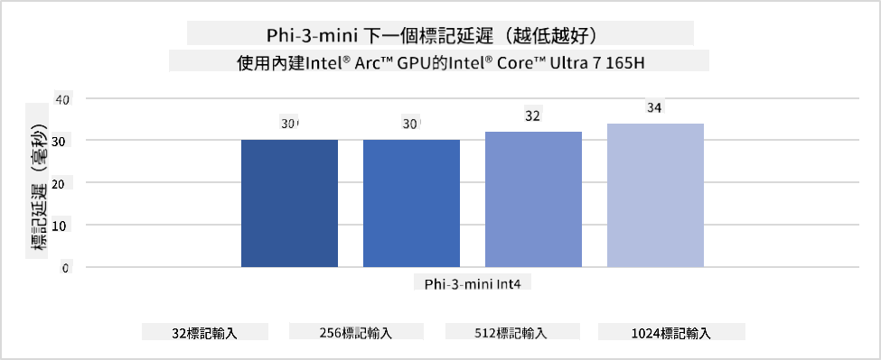
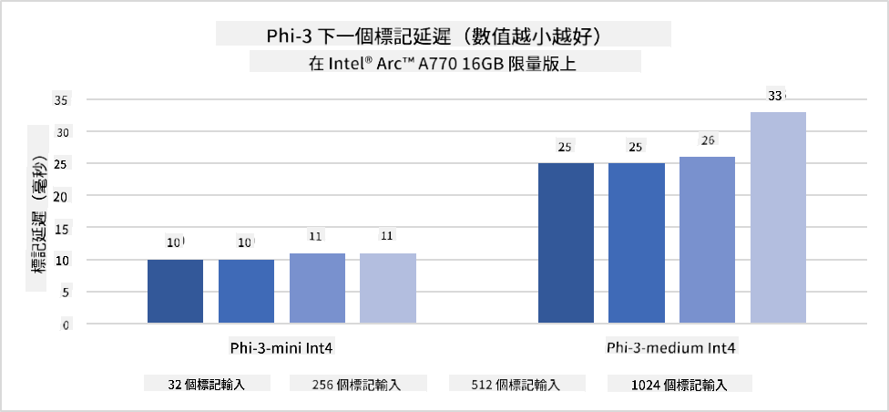
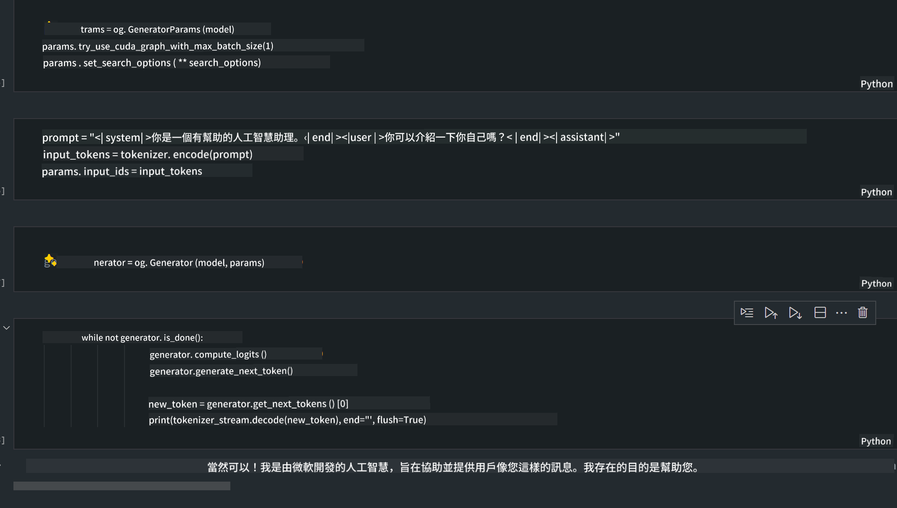
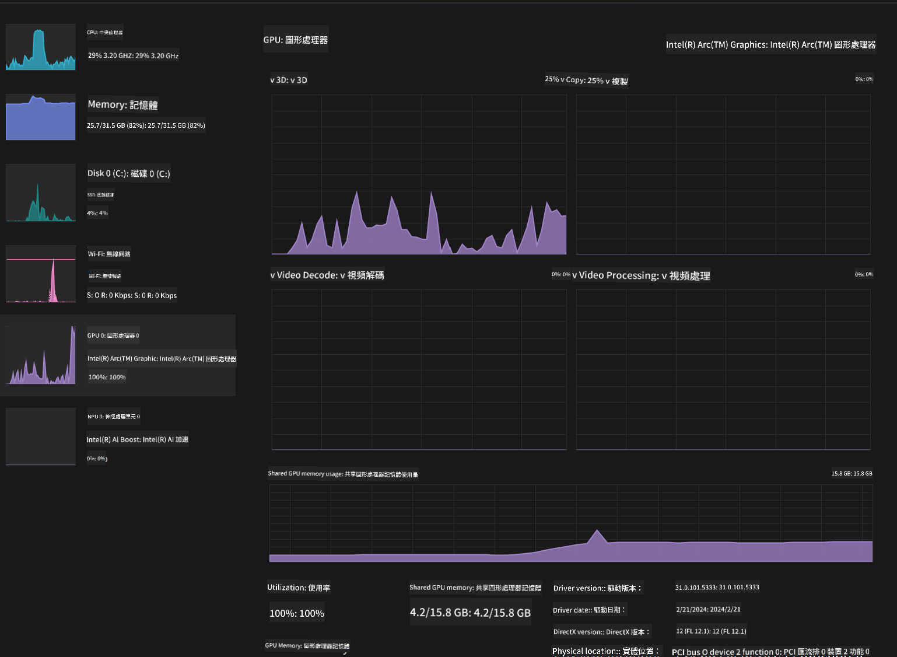

<!--
CO_OP_TRANSLATOR_METADATA:
{
  "original_hash": "5ca6ea8da7aa1335ef287124462b2833",
  "translation_date": "2025-04-04T17:42:56+00:00",
  "source_file": "md\\01.Introduction\\03\\AIPC_Inference.md",
  "language_code": "hk"
}
-->
# **Inference Phi-3 in AI PC**

隨著生成式 AI 的進步以及邊緣設備硬件能力的提升，越來越多生成式 AI 模型可以整合到用戶的自攜設備 (BYOD) 中。AI PC 就是其中之一。從 2024 年開始，Intel、AMD 和 Qualcomm 已與 PC 製造商合作，通過硬件改造推出 AI PC，支持部署本地化生成式 AI 模型。在這篇討論中，我們將聚焦於 Intel AI PC，並探討如何在 Intel AI PC 上部署 Phi-3。

### 什麼是 NPU

NPU (Neural Processing Unit) 是專門設計用於加速神經網絡運算和 AI 任務的處理器或處理單元，通常集成在更大的 SoC 中。與通用的 CPU 和 GPU 不同，NPU 專為數據驅動的並行計算而優化，因此在處理大量多媒體數據（如視頻和圖像）以及神經網絡運算數據方面效率極高。它特別擅長處理 AI 相關任務，例如語音識別、視頻通話中的背景模糊，以及物件檢測等照片或視頻編輯過程。

## NPU vs GPU

雖然許多 AI 和機器學習工作負載都運行於 GPU 上，但 GPU 與 NPU 之間存在重要區別。
GPU 以其並行計算能力著稱，但並非所有 GPU 在處理圖形之外的任務都同樣高效。相比之下，NPU 是專門為神經網絡運算中的複雜計算而設計的，因此在處理 AI 任務方面非常高效。

簡而言之，NPU 是加速 AI 計算的數學高手，在 AI PC 的新時代中扮演了關鍵角色！

***此示例基於 Intel 最新的 Intel Core Ultra 處理器***

## **1. 使用 NPU 運行 Phi-3 模型**

Intel® NPU 設備是一種集成於 Intel 客戶端 CPU 的 AI 推理加速器，從 Intel® Core™ Ultra 世代 CPU（以前稱為 Meteor Lake）開始提供。它支持以能源高效的方式執行人工神經網絡任務。





**Intel NPU 加速庫**

Intel NPU 加速庫 [https://github.com/intel/intel-npu-acceleration-library](https://github.com/intel/intel-npu-acceleration-library) 是一個 Python 庫，通過利用 Intel 神經處理單元 (NPU) 的強大性能，實現高效能的硬件計算，從而提升應用程序效率。

以下是使用 Intel® Core™ Ultra 處理器驅動的 AI PC 上 Phi-3-mini 的示例。


使用 pip 安裝 Python 庫

```bash

   pip install intel-npu-acceleration-library

```

***注意*** 該項目仍在開發中，但參考模型已非常完整。

### **使用 Intel NPU 加速庫運行 Phi-3**

通過 Intel NPU 加速，該庫不會影響傳統編碼過程。只需使用該庫對原始 Phi-3 模型進行量化，例如 FP16、INT8、INT4 等。

```python
from transformers import AutoTokenizer, pipeline,TextStreamer
from intel_npu_acceleration_library import NPUModelForCausalLM, int4
from intel_npu_acceleration_library.compiler import CompilerConfig
import warnings

model_id = "microsoft/Phi-3-mini-4k-instruct"

compiler_conf = CompilerConfig(dtype=int4)
model = NPUModelForCausalLM.from_pretrained(
    model_id, use_cache=True, config=compiler_conf, attn_implementation="sdpa"
).eval()

tokenizer = AutoTokenizer.from_pretrained(model_id)

text_streamer = TextStreamer(tokenizer, skip_prompt=True)
```

量化成功後，繼續執行並調用 NPU 運行 Phi-3 模型。

```python
generation_args = {
   "max_new_tokens": 1024,
   "return_full_text": False,
   "temperature": 0.3,
   "do_sample": False,
   "streamer": text_streamer,
}

pipe = pipeline(
   "text-generation",
   model=model,
   tokenizer=tokenizer,
)

query = "<|system|>You are a helpful AI assistant.<|end|><|user|>Can you introduce yourself?<|end|><|assistant|>"

with warnings.catch_warnings():
    warnings.simplefilter("ignore")
    pipe(query, **generation_args)
```

執行代碼時，我們可以通過任務管理器查看 NPU 的運行狀態。


***示例*** : [AIPC_NPU_DEMO.ipynb](../../../../../code/03.Inference/AIPC/AIPC_NPU_DEMO.ipynb)

## **2. 使用 DirectML + ONNX Runtime 運行 Phi-3 模型**

### **什麼是 DirectML**

[DirectML](https://github.com/microsoft/DirectML) 是一個高性能、硬件加速的 DirectX 12 機器學習庫。DirectML 提供 GPU 加速，用於常見的機器學習任務，支持廣泛的硬件和驅動，包括所有支持 DirectX 12 的 GPU，如 AMD、Intel、NVIDIA 和 Qualcomm。

當獨立使用時，DirectML API 是一個低層次的 DirectX 12 庫，適合高性能、低延遲的應用程序，例如框架、遊戲和其他實時應用程序。DirectML 與 Direct3D 12 的無縫互操作性，以及其低開銷和硬件一致性，使其成為加速機器學習的理想選擇，特別是在需要高性能並且硬件結果的可靠性和可預測性至關重要時。

***注意*** : 最新的 DirectML 已支持 NPU (https://devblogs.microsoft.com/directx/introducing-neural-processor-unit-npu-support-in-directml-developer-preview/)

### DirectML 和 CUDA 的能力及性能比較：

**DirectML** 是由 Microsoft 開發的機器學習庫，旨在加速 Windows 設備上的機器學習工作負載，包括桌面、筆記本和邊緣設備。
- 基於 DX12：DirectML 建立在 DirectX 12 (DX12) 之上，提供廣泛的硬件支持，包括 NVIDIA 和 AMD 的 GPU。
- 更廣泛支持：由於利用 DX12，DirectML 可與任何支持 DX12 的 GPU 一起工作，包括集成 GPU。
- 圖像處理：DirectML 使用神經網絡處理圖像和其他數據，非常適合圖像識別、物件檢測等任務。
- 易於設置：DirectML 設置簡單，不需要 GPU 製造商提供的特定 SDK 或庫。
- 性能：在某些情況下，DirectML 表現良好，甚至可以比 CUDA 更快，特別是某些工作負載。
- 局限性：但在處理 float16 大批量數據時，DirectML 可能會較慢。

**CUDA** 是 NVIDIA 的並行計算平台和編程模型。它允許開發者利用 NVIDIA GPU 的性能進行通用計算，包括機器學習和科學模擬。
- 特定於 NVIDIA：CUDA 與 NVIDIA GPU 緊密集成，專為這些硬件設計。
- 高度優化：對於 GPU 加速任務提供卓越性能，尤其是在使用 NVIDIA GPU 時。
- 廣泛使用：許多機器學習框架和庫（如 TensorFlow 和 PyTorch）都支持 CUDA。
- 可定制性：開發者可以針對特定任務微調 CUDA 設置，以獲得最佳性能。
- 局限性：但 CUDA 的硬件依賴性可能會限制其在不同 GPU 上的兼容性。

### 如何選擇 DirectML 和 CUDA

選擇 DirectML 或 CUDA 取決於具體使用情況、硬件可用性和偏好。
如果您希望更廣泛的兼容性和易於設置，DirectML 可能是一個不錯的選擇。但如果您擁有 NVIDIA GPU 並需要高度優化的性能，CUDA 仍然是強有力的競爭者。總之，DirectML 和 CUDA 各有優勢和劣勢，請根據需求和可用硬件作出選擇。

### **使用 ONNX Runtime 進行生成式 AI**

在 AI 時代，AI 模型的可移植性非常重要。ONNX Runtime 可以輕鬆地將訓練好的模型部署到不同設備上。開發者無需關注推理框架，使用統一的 API 即可完成模型推理。在生成式 AI 時代，ONNX Runtime 也進行了代碼優化 (https://onnxruntime.ai/docs/genai/)。通過優化的 ONNX Runtime，量化的生成式 AI 模型可以在不同終端上進行推理。在使用 ONNX Runtime 進行生成式 AI 時，您可以通過 Python、C#、C/C++ 推理 AI 模型 API。當然，在 iPhone 上部署也可以利用 C++ 的 ONNX Runtime API。

[示例代碼](https://github.com/Azure-Samples/Phi-3MiniSamples/tree/main/onnx)

***編譯生成式 AI 與 ONNX Runtime 庫***

```bash

winget install --id=Kitware.CMake  -e

git clone https://github.com/microsoft/onnxruntime.git

cd .\onnxruntime\

./build.bat --build_shared_lib --skip_tests --parallel --use_dml --config Release

cd ../

git clone https://github.com/microsoft/onnxruntime-genai.git

cd .\onnxruntime-genai\

mkdir ort

cd ort

mkdir include

mkdir lib

copy ..\onnxruntime\include\onnxruntime\core\providers\dml\dml_provider_factory.h ort\include

copy ..\onnxruntime\include\onnxruntime\core\session\onnxruntime_c_api.h ort\include

copy ..\onnxruntime\build\Windows\Release\Release\*.dll ort\lib

copy ..\onnxruntime\build\Windows\Release\Release\onnxruntime.lib ort\lib

python build.py --use_dml


```

**安裝庫**

```bash

pip install .\onnxruntime_genai_directml-0.3.0.dev0-cp310-cp310-win_amd64.whl

```

以下是運行結果



***示例*** : [AIPC_DirectML_DEMO.ipynb](../../../../../code/03.Inference/AIPC/AIPC_DirectML_DEMO.ipynb)

## **3. 使用 Intel OpenVino 運行 Phi-3 模型**

### **什麼是 OpenVINO**

[OpenVINO](https://github.com/openvinotoolkit/openvino) 是一個用於優化和部署深度學習模型的開源工具包。它提供了提升深度學習性能的工具，支持來自 TensorFlow、PyTorch 等流行框架的視覺、音頻和語言模型。OpenVINO 可與 CPU 和 GPU 結合使用，運行 Phi-3 模型。

***注意***：目前 OpenVINO 尚不支持 NPU。

### **安裝 OpenVINO 庫**

```bash

 pip install git+https://github.com/huggingface/optimum-intel.git

 pip install git+https://github.com/openvinotoolkit/nncf.git

 pip install openvino-nightly

```

### **使用 OpenVINO 運行 Phi-3**

與 NPU 類似，OpenVINO 通過運行量化模型完成生成式 AI 模型的調用。我們需要先量化 Phi-3 模型，並通過 optimum-cli 在命令行上完成模型量化。

**INT4**

```bash

optimum-cli export openvino --model "microsoft/Phi-3-mini-4k-instruct" --task text-generation-with-past --weight-format int4 --group-size 128 --ratio 0.6  --sym  --trust-remote-code ./openvinomodel/phi3/int4

```

**FP16**

```bash

optimum-cli export openvino --model "microsoft/Phi-3-mini-4k-instruct" --task text-generation-with-past --weight-format fp16 --trust-remote-code ./openvinomodel/phi3/fp16

```

轉換後的格式如下：


通過 OVModelForCausalLM 加載模型路徑 (model_dir)、相關配置 (ov_config = {"PERFORMANCE_HINT": "LATENCY", "NUM_STREAMS": "1", "CACHE_DIR": ""}) 和硬件加速設備 (GPU.0)。

```python

ov_model = OVModelForCausalLM.from_pretrained(
     model_dir,
     device='GPU.0',
     ov_config=ov_config,
     config=AutoConfig.from_pretrained(model_dir, trust_remote_code=True),
     trust_remote_code=True,
)

```

執行代碼時，我們可以通過任務管理器查看 GPU 的運行狀態。



***示例*** : [AIPC_OpenVino_Demo.ipynb](../../../../../code/03.Inference/AIPC/AIPC_OpenVino_Demo.ipynb)

### ***注意***：以上三種方法各有優勢，但建議使用 NPU 加速進行 AI PC 推理。

**免責聲明**:  
本文檔使用AI翻譯服務[Co-op Translator](https://github.com/Azure/co-op-translator)進行翻譯。儘管我們努力確保準確性，但請注意，自動翻譯可能包含錯誤或不準確之處。應以原文檔的母語版本作為權威來源。對於關鍵信息，建議使用專業人工翻譯。我們對因使用此翻譯而引起的任何誤解或誤釋不承擔責任。