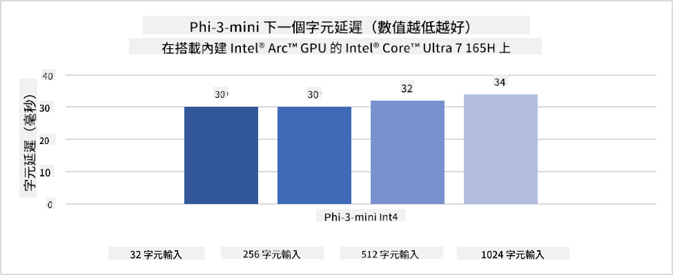
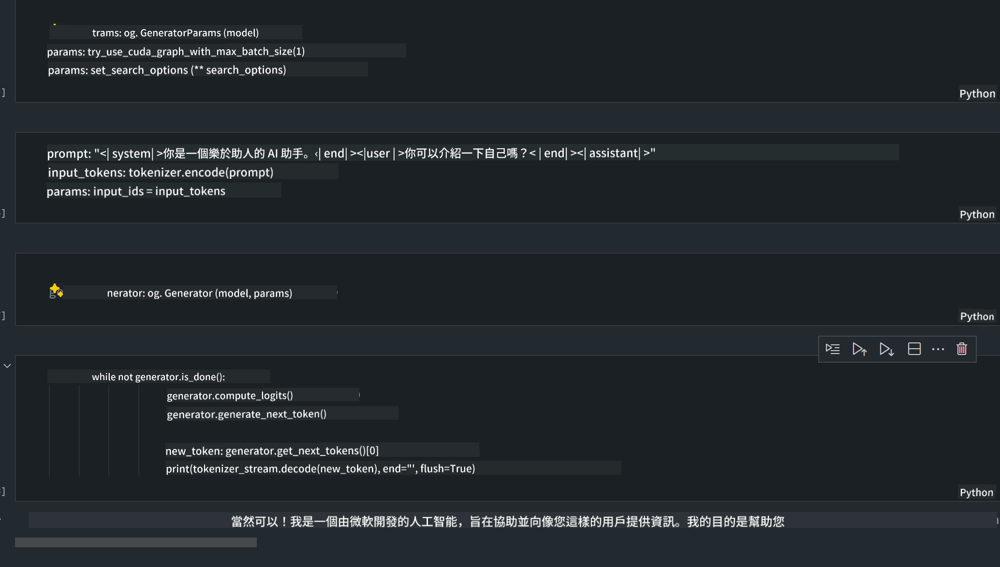

<!--
CO_OP_TRANSLATOR_METADATA:
{
  "original_hash": "e08ce816e23ad813244a09ca34ebb8ac",
  "translation_date": "2025-05-08T05:59:21+00:00",
  "source_file": "md/01.Introduction/03/AIPC_Inference.md",
  "language_code": "hk"
}
-->
# **AI PC 上 Phi-3 推理**

隨著生成式 AI 技術的進步以及邊緣裝置硬件能力的提升，越來越多生成式 AI 模型可以直接整合到用戶的自攜裝置（BYOD）中。AI PC 就是其中一種。自 2024 年起，Intel、AMD 和 Qualcomm 與 PC 製造商合作，透過硬件改良推出 AI PC，方便在本地部署生成式 AI 模型。本文將聚焦 Intel AI PC，介紹如何在 Intel AI PC 上部署 Phi-3。

### 什麼是 NPU

NPU（神經網絡處理器）是集成在較大 SoC 裡專門用於加速神經網絡運算和 AI 任務的處理器。與通用 CPU 和 GPU 不同，NPU 針對數據驅動的並行運算優化，非常擅長處理大量多媒體數據（如影片和圖片）以及神經網絡所需的資料處理。它特別適合 AI 相關任務，例如語音識別、視像通話中的背景模糊，以及影像或影片編輯中的物件偵測。

## NPU 與 GPU 的分別

雖然很多 AI 和機器學習任務會使用 GPU，但 GPU 和 NPU 之間有關鍵差異。
GPU 以其並行運算能力聞名，但並非所有 GPU 在圖形處理以外的任務上效率都相同。NPU 則是專門為神經網絡複雜計算打造，對 AI 任務非常有效率。

總結來說，NPU 就是推動 AI 運算的數學高手，在 AI PC 的新時代扮演重要角色！

***此示例基於 Intel 最新的 Intel Core Ultra 處理器***

## **1. 用 NPU 運行 Phi-3 模型**

Intel® NPU 裝置是與 Intel 客戶端 CPU 整合的 AI 推理加速器，從 Intel® Core™ Ultra 世代 CPU（前稱 Meteor Lake）開始支援。它可實現人工神經網絡任務的節能高效執行。




**Intel NPU 加速庫**

Intel NPU 加速庫 [https://github.com/intel/intel-npu-acceleration-library](https://github.com/intel/intel-npu-acceleration-library) 是一個 Python 庫，利用 Intel 神經網絡處理器 (NPU) 的運算能力，提升應用程式的運算效率，適用於相容硬件上的高速計算。

這是基於 Intel® Core™ Ultra 處理器的 AI PC 上 Phi-3-mini 範例。


用 pip 安裝 Python 庫

```bash

   pip install intel-npu-acceleration-library

```

***注意*** 專案仍在開發中，但參考模型已相當完整。

### **用 Intel NPU 加速庫運行 Phi-3**

利用 Intel NPU 加速，這個庫不會影響傳統的編碼流程。你只需用它來量化原始的 Phi-3 模型，如 FP16、INT8、INT4 等。

```python
from transformers import AutoTokenizer, pipeline,TextStreamer
from intel_npu_acceleration_library import NPUModelForCausalLM, int4
from intel_npu_acceleration_library.compiler import CompilerConfig
import warnings

model_id = "microsoft/Phi-3-mini-4k-instruct"

compiler_conf = CompilerConfig(dtype=int4)
model = NPUModelForCausalLM.from_pretrained(
    model_id, use_cache=True, config=compiler_conf, attn_implementation="sdpa"
).eval()

tokenizer = AutoTokenizer.from_pretrained(model_id)

text_streamer = TextStreamer(tokenizer, skip_prompt=True)
```

量化成功後，繼續呼叫 NPU 運行 Phi-3 模型。

```python
generation_args = {
   "max_new_tokens": 1024,
   "return_full_text": False,
   "temperature": 0.3,
   "do_sample": False,
   "streamer": text_streamer,
}

pipe = pipeline(
   "text-generation",
   model=model,
   tokenizer=tokenizer,
)

query = "<|system|>You are a helpful AI assistant.<|end|><|user|>Can you introduce yourself?<|end|><|assistant|>"

with warnings.catch_warnings():
    warnings.simplefilter("ignore")
    pipe(query, **generation_args)
```

執行程式時，可以透過工作管理員查看 NPU 的運行狀態。


***範例*** : [AIPC_NPU_DEMO.ipynb](../../../../../code/03.Inference/AIPC/AIPC_NPU_DEMO.ipynb)

## **2. 用 DirectML + ONNX Runtime 運行 Phi-3 模型**

### **什麼是 DirectML**

[DirectML](https://github.com/microsoft/DirectML) 是一個高效能、硬件加速的 DirectX 12 機器學習庫。DirectML 為廣泛支援的硬件和驅動提供 GPU 加速，涵蓋 AMD、Intel、NVIDIA、Qualcomm 等廠商所有支援 DirectX 12 的 GPU。

單獨使用時，DirectML API 是一個低階 DirectX 12 庫，適合高效能、低延遲的應用，例如框架、遊戲及其他即時應用。DirectML 與 Direct3D 12 的無縫整合、低開銷及跨硬件一致性，使它非常適合需要高效能及結果可靠性的機器學習加速。

***注意*** : 最新版 DirectML 已支援 NPU(https://devblogs.microsoft.com/directx/introducing-neural-processor-unit-npu-support-in-directml-developer-preview/)

### DirectML 與 CUDA 的能力與效能比較：

**DirectML** 是微軟開發的機器學習庫，專為 Windows 裝置（桌面、筆電及邊緣裝置）加速機器學習工作負載。
- 基於 DX12：DirectML 建構於 DirectX 12 之上，支援包括 NVIDIA 與 AMD 在內的多種 GPU。
- 廣泛支援：利用 DX12，DirectML 可用於任何支援 DX12 的 GPU，甚至是整合 GPU。
- 影像處理：DirectML 利用神經網絡處理影像及其他數據，適合影像識別、物件偵測等任務。
- 安裝簡單：設置容易，不需 GPU 廠商特定的 SDK 或庫。
- 效能：在某些情況下，DirectML 效能優異，甚至比 CUDA 快，特別是特定工作負載。
- 限制：但在 float16 大批量數據處理上，有時可能較慢。

**CUDA** 是 NVIDIA 的平行運算平台及程式模型，讓開發者利用 NVIDIA GPU 進行通用運算，包括機器學習和科學模擬。
- 專為 NVIDIA：CUDA 緊密整合 NVIDIA GPU，專門為其設計。
- 高度優化：為 GPU 加速任務提供優秀效能，尤其是 NVIDIA GPU。
- 廣泛使用：許多機器學習框架（如 TensorFlow、PyTorch）支援 CUDA。
- 可客製化：開發者可針對特定任務調整 CUDA 設定，達到最佳效能。
- 限制：但 CUDA 依賴 NVIDIA 硬件，限制了跨 GPU 廠商的兼容性。

### 選擇 DirectML 或 CUDA

選擇 DirectML 還是 CUDA 取決於你的使用場景、硬件條件及偏好。
若追求廣泛兼容和簡易設置，DirectML 是不錯選擇。但若有 NVIDIA GPU 且需要極致優化效能，CUDA 依然是強力方案。總結來說，兩者各有優缺點，請根據需求和硬件選擇。

### **用 ONNX Runtime 進行生成式 AI**

在 AI 時代，模型的可攜性非常重要。ONNX Runtime 可輕鬆將訓練好的模型部署到不同裝置。開發者無需關注推理框架，統一使用 API 完成模型推理。在生成式 AI 領域，ONNX Runtime 也做了代碼優化 (https://onnxruntime.ai/docs/genai/)，透過優化後的 ONNX Runtime，可在不同終端推理量化後的生成式 AI 模型。使用 ONNX Runtime 進行生成式 AI，可用 Python、C#、C/C++ 調用 AI 模型 API，當然在 iPhone 上部署可利用 C++ 的生成式 AI ONNX Runtime API。

[範例代碼](https://github.com/Azure-Samples/Phi-3MiniSamples/tree/main/onnx)

***編譯生成式 AI ONNX Runtime 庫***

```bash

winget install --id=Kitware.CMake  -e

git clone https://github.com/microsoft/onnxruntime.git

cd .\onnxruntime\

./build.bat --build_shared_lib --skip_tests --parallel --use_dml --config Release

cd ../

git clone https://github.com/microsoft/onnxruntime-genai.git

cd .\onnxruntime-genai\

mkdir ort

cd ort

mkdir include

mkdir lib

copy ..\onnxruntime\include\onnxruntime\core\providers\dml\dml_provider_factory.h ort\include

copy ..\onnxruntime\include\onnxruntime\core\session\onnxruntime_c_api.h ort\include

copy ..\onnxruntime\build\Windows\Release\Release\*.dll ort\lib

copy ..\onnxruntime\build\Windows\Release\Release\onnxruntime.lib ort\lib

python build.py --use_dml


```

**安裝庫**

```bash

pip install .\onnxruntime_genai_directml-0.3.0.dev0-cp310-cp310-win_amd64.whl

```

這是執行結果



***範例*** : [AIPC_DirectML_DEMO.ipynb](../../../../../code/03.Inference/AIPC/AIPC_DirectML_DEMO.ipynb)

## **3. 用 Intel OpenVino 運行 Phi-3 模型**

### **什麼是 OpenVINO**

[OpenVINO](https://github.com/openvinotoolkit/openvino) 是一套開源工具包，用於優化和部署深度學習模型。它提升來自 TensorFlow、PyTorch 等流行框架的視覺、語音和語言模型的深度學習效能。OpenVINO 也可結合 CPU 和 GPU 運行 Phi-3 模型。

***注意***：目前 OpenVINO 尚不支援 NPU。

### **安裝 OpenVINO 庫**

```bash

 pip install git+https://github.com/huggingface/optimum-intel.git

 pip install git+https://github.com/openvinotoolkit/nncf.git

 pip install openvino-nightly

```

### **用 OpenVINO 運行 Phi-3**

與 NPU 類似，OpenVINO 透過運行量化模型完成生成式 AI 模型的調用。我們需先量化 Phi-3 模型，並透過 optimum-cli 在命令列完成模型量化。

**INT4**

```bash

optimum-cli export openvino --model "microsoft/Phi-3-mini-4k-instruct" --task text-generation-with-past --weight-format int4 --group-size 128 --ratio 0.6  --sym  --trust-remote-code ./openvinomodel/phi3/int4

```

**FP16**

```bash

optimum-cli export openvino --model "microsoft/Phi-3-mini-4k-instruct" --task text-generation-with-past --weight-format fp16 --trust-remote-code ./openvinomodel/phi3/fp16

```

轉換後的格式如下圖


透過 OVModelForCausalLM 載入模型路徑(model_dir)、相關配置(ov_config = {"PERFORMANCE_HINT": "LATENCY", "NUM_STREAMS": "1", "CACHE_DIR": ""}) 和硬件加速裝置(GPU.0)

```python

ov_model = OVModelForCausalLM.from_pretrained(
     model_dir,
     device='GPU.0',
     ov_config=ov_config,
     config=AutoConfig.from_pretrained(model_dir, trust_remote_code=True),
     trust_remote_code=True,
)

```

執行程式時，可以透過工作管理員查看 GPU 的運行狀態。


***範例*** : [AIPC_OpenVino_Demo.ipynb](../../../../../code/03.Inference/AIPC/AIPC_OpenVino_Demo.ipynb)

### ***注意***：以上三種方法各有優勢，但建議 AI PC 推理時優先使用 NPU 加速。

**免責聲明**：  
本文件係使用AI翻譯服務 [Co-op Translator](https://github.com/Azure/co-op-translator) 進行翻譯。雖然我哋致力確保準確性，但請注意自動翻譯可能包含錯誤或不準確之處。原始文件嘅母語版本應視為權威來源。對於重要資訊，建議採用專業人工翻譯。我哋對因使用此翻譯而引致嘅任何誤解或誤釋概不負責。