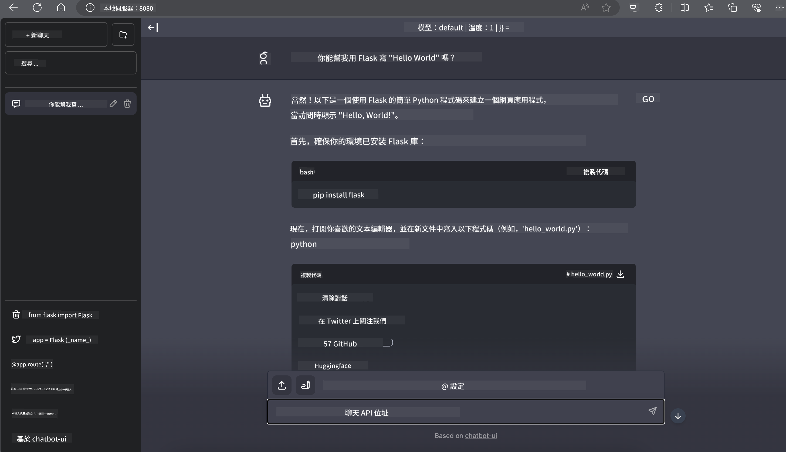

<!--
CO_OP_TRANSLATOR_METADATA:
{
  "original_hash": "5b3df6e1a9927e93cda92801eec65d33",
  "translation_date": "2025-04-04T17:47:36+00:00",
  "source_file": "md\\01.Introduction\\03\\Jetson_Inference.md",
  "language_code": "hk"
}
-->
# **Nvidia Jetson 上的 Phi-3 推理**

Nvidia Jetson 是 Nvidia 推出的嵌入式計算板系列。Jetson TK1、TX1 和 TX2 型號都搭載了 Nvidia 的 Tegra 處理器（或 SoC），整合了基於 ARM 架構的中央處理單元（CPU）。Jetson 是一個低功耗系統，專為加速機器學習應用而設計。Nvidia Jetson 被專業開發者用於創造突破性的 AI 產品，涵蓋所有行業，也被學生和愛好者用於實踐 AI 學習並製作驚人的項目。SLM 部署於像 Jetson 這樣的邊緣設備中，能更好地實現工業生成式 AI 應用場景。

## 在 NVIDIA Jetson 上的部署：
從事自主機器人和嵌入式設備開發的開發者可以利用 Phi-3 Mini。Phi-3 的小型化設計使其非常適合邊緣部署。在訓練過程中參數已經被精心調整，確保了高準確度的響應。

### TensorRT-LLM 優化：
NVIDIA 的 [TensorRT-LLM 庫](https://github.com/NVIDIA/TensorRT-LLM?WT.mc_id=aiml-138114-kinfeylo) 對大型語言模型的推理進行了優化。它支持 Phi-3 Mini 的長上下文窗口，提升了吞吐量和延遲表現。優化技術包括 LongRoPE、FP8 和即時批處理。

### 可用性和部署：
開發者可以通過 [NVIDIA 的 AI](https://www.nvidia.com/en-us/ai-data-science/generative-ai/) 探索 Phi-3 Mini，它擁有 128K 的上下文窗口。該模型以 NVIDIA NIM 的形式打包，作為帶有標準 API 的微服務，可以部署於任何地方。此外，還可以參考 [GitHub 上的 TensorRT-LLM 實現](https://github.com/NVIDIA/TensorRT-LLM)。

## **1. 準備工作**

a. Jetson Orin NX / Jetson NX

b. JetPack 5.1.2+

c. Cuda 11.8

d. Python 3.8+

## **2. 在 Jetson 上運行 Phi-3**

我們可以選擇 [Ollama](https://ollama.com) 或 [LlamaEdge](https://llamaedge.com)

如果你希望同時在雲端和邊緣設備上使用 gguf，LlamaEdge 可以被理解為 WasmEdge（WasmEdge 是一個輕量、高性能、可擴展的 WebAssembly 運行時，適合雲原生、邊緣和去中心化應用。它支持無伺服器應用、嵌入式功能、微服務、智能合約和物聯網設備。通過 LlamaEdge，你可以將 gguf 的量化模型部署到邊緣設備和雲端）。


以下是使用步驟：

1. 安裝並下載相關庫和文件

```bash

curl -sSf https://raw.githubusercontent.com/WasmEdge/WasmEdge/master/utils/install.sh | bash -s -- --plugin wasi_nn-ggml

curl -LO https://github.com/LlamaEdge/LlamaEdge/releases/latest/download/llama-api-server.wasm

curl -LO https://github.com/LlamaEdge/chatbot-ui/releases/latest/download/chatbot-ui.tar.gz

tar xzf chatbot-ui.tar.gz

```

**注意**: llama-api-server.wasm 和 chatbot-ui 需要在同一目錄中

2. 在終端運行腳本

```bash

wasmedge --dir .:. --nn-preload default:GGML:AUTO:{Your gguf path} llama-api-server.wasm -p phi-3-chat

```

以下是運行結果



***示例代碼*** [Phi-3 mini WASM Notebook Sample](https://github.com/Azure-Samples/Phi-3MiniSamples/tree/main/wasm)

總結來說，Phi-3 Mini 在語言建模方面代表了一次重要突破，結合了效率、上下文感知能力以及 NVIDIA 的優化技術。不論是用於構建機器人還是邊緣應用，Phi-3 Mini 都是一個值得關注的強大工具。

**免責聲明**:  
此文件已使用AI翻譯服務 [Co-op Translator](https://github.com/Azure/co-op-translator) 進行翻譯。我們致力於提供準確的翻譯，但請注意，自動翻譯可能包含錯誤或不準確之處。應以原始語言的文件作為權威來源。對於關鍵資訊，建議尋求專業人工翻譯。我們不對因使用此翻譯而引起的任何誤解或錯誤解釋承擔責任。