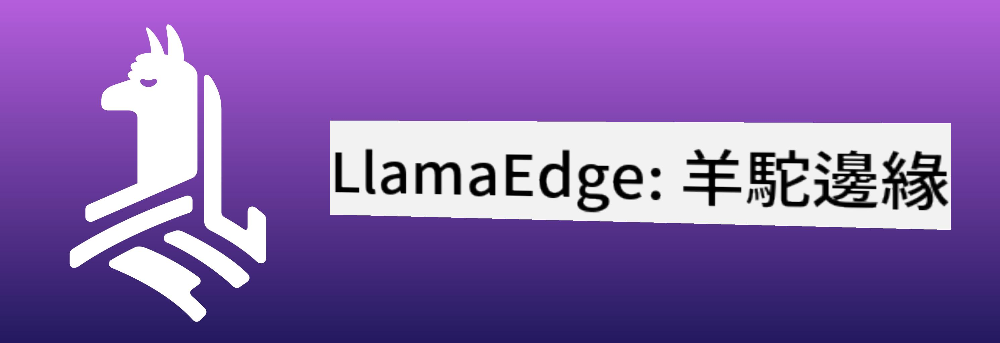
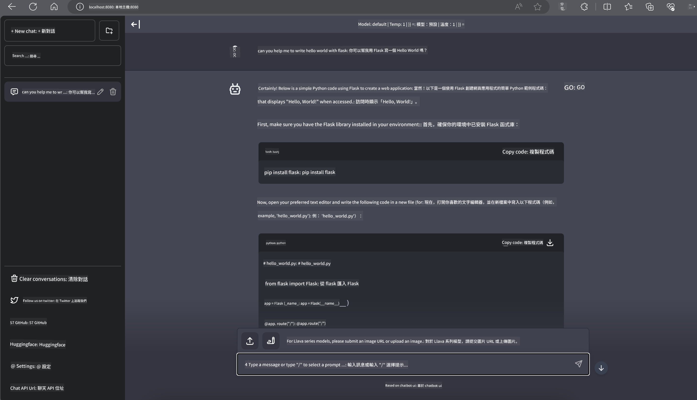

<!--
CO_OP_TRANSLATOR_METADATA:
{
  "original_hash": "be4101a30d98e95a71d42c276e8bcd37",
  "translation_date": "2025-05-08T05:54:57+00:00",
  "source_file": "md/01.Introduction/03/Jetson_Inference.md",
  "language_code": "hk"
}
-->
# **Nvidia Jetson 上嘅 Phi-3 推理**

Nvidia Jetson 係 Nvidia 推出嘅一系列嵌入式運算板。Jetson TK1、TX1 同 TX2 型號都配備咗 Nvidia 嘅 Tegra 處理器（或者 SoC），結合咗 ARM 架構嘅中央處理器（CPU）。Jetson 係低功耗系統，專為加速機器學習應用而設。Nvidia Jetson 俾專業開發者用嚟打造各行各業嘅突破性 AI 產品，亦係學生同愛好者實踐 AI 學習同製作精彩項目嘅平台。SLM 會部署喺 Jetson 等邊緣裝置，令工業生成式 AI 嘅應用場景實現得更好。

## 喺 NVIDIA Jetson 上部署：
從事自動化機械人同嵌入式裝置嘅開發者可以利用 Phi-3 Mini。Phi-3 體積細，啱用喺邊緣部署。訓練期間嘅參數經過仔細調校，確保回應準確度高。

### TensorRT-LLM 優化：
NVIDIA 嘅 [TensorRT-LLM library](https://github.com/NVIDIA/TensorRT-LLM?WT.mc_id=aiml-138114-kinfeylo) 針對大型語言模型推理作出優化。佢支援 Phi-3 Mini 嘅長上下文窗口，提升吞吐量同延遲表現。優化技術包括 LongRoPE、FP8 同 inflight batching。

### 可用性同部署：
開發者可以喺 [NVIDIA's AI](https://www.nvidia.com/en-us/ai-data-science/generative-ai/) 探索帶有 128K 上下文窗口嘅 Phi-3 Mini。佢以 NVIDIA NIM 形式打包，係一個帶標準 API 嘅微服務，可以喺任何地方部署。另外，亦有 [TensorRT-LLM 喺 GitHub 嘅實現](https://github.com/NVIDIA/TensorRT-LLM)。

## **1. 準備工作**

a. Jetson Orin NX / Jetson NX

b. JetPack 5.1.2+

c. Cuda 11.8

d. Python 3.8+

## **2. 喺 Jetson 運行 Phi-3**

我哋可以揀用 [Ollama](https://ollama.com) 或者 [LlamaEdge](https://llamaedge.com)

如果想同時喺雲端同邊緣裝置用 gguf，LlamaEdge 可以理解成 WasmEdge（WasmEdge 係一個輕量、高性能、可擴展嘅 WebAssembly 運行時，適合雲原生、邊緣同去中心化應用。佢支援無伺服器應用、嵌入式函數、微服務、智能合約同物聯網裝置。你可以透過 LlamaEdge 將 gguf 嘅量化模型部署到邊緣裝置同雲端）。



使用步驟如下：

1. 安裝同下載相關庫同文件

```bash

curl -sSf https://raw.githubusercontent.com/WasmEdge/WasmEdge/master/utils/install.sh | bash -s -- --plugin wasi_nn-ggml

curl -LO https://github.com/LlamaEdge/LlamaEdge/releases/latest/download/llama-api-server.wasm

curl -LO https://github.com/LlamaEdge/chatbot-ui/releases/latest/download/chatbot-ui.tar.gz

tar xzf chatbot-ui.tar.gz

```

**注意**：llama-api-server.wasm 同 chatbot-ui 要放喺同一個目錄

2. 喺終端機運行腳本

```bash

wasmedge --dir .:. --nn-preload default:GGML:AUTO:{Your gguf path} llama-api-server.wasm -p phi-3-chat

```

以下係運行結果



***示範代碼*** [Phi-3 mini WASM Notebook Sample](https://github.com/Azure-Samples/Phi-3MiniSamples/tree/main/wasm)

總括而言，Phi-3 Mini 係語言模型嘅重大進展，結合咗高效能、上下文感知同 NVIDIA 嘅優化技術。無論你係打造機械人定邊緣應用，Phi-3 Mini 都係一個值得留意嘅強大工具。

**免責聲明**：  
本文件係使用 AI 翻譯服務 [Co-op Translator](https://github.com/Azure/co-op-translator) 翻譯而成。雖然我哋致力確保準確性，但請注意自動翻譯可能包含錯誤或不準確之處。原文文件嘅母語版本應被視為權威來源。對於重要資料，建議使用專業人工翻譯。對於因使用此翻譯而引致嘅任何誤解或誤釋，我哋概不負責。