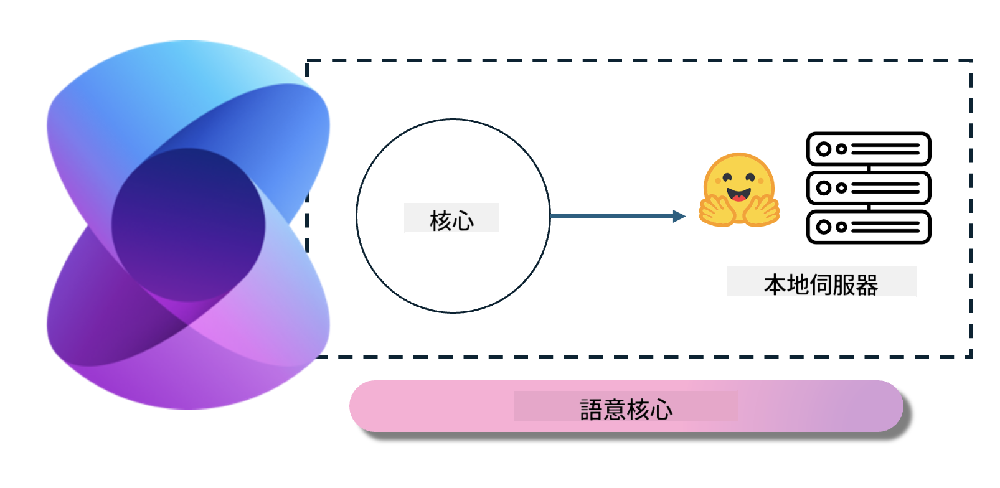
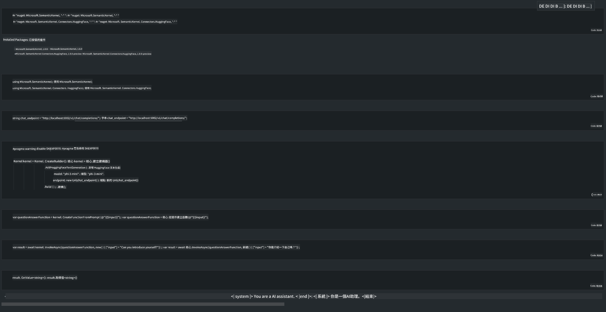

<!--
CO_OP_TRANSLATOR_METADATA:
{
  "original_hash": "12c0d9afaa23861ad5be655fcff4f71d",
  "translation_date": "2025-04-04T17:49:38+00:00",
  "source_file": "md\\01.Introduction\\03\\Local_Server_Inference.md",
  "language_code": "hk"
}
-->
# **在本地伺服器上推理 Phi-3**

我們可以在本地伺服器部署 Phi-3。用戶可以選擇 [Ollama](https://ollama.com) 或 [LM Studio](https://llamaedge.com) 的方案，亦可自行編寫代碼。你可以通過 [Semantic Kernel](https://github.com/microsoft/semantic-kernel?WT.mc_id=aiml-138114-kinfeylo) 或 [Langchain](https://www.langchain.com/) 連接 Phi-3 的本地服務，來構建 Copilot 應用程式。

## **使用 Semantic Kernel 訪問 Phi-3-mini**

在 Copilot 應用程式中，我們通過 Semantic Kernel / LangChain 創建應用程式。這類應用框架通常兼容 Azure OpenAI Service / OpenAI 模型，也支持 Hugging Face 上的開源模型以及本地模型。如果我們想使用 Semantic Kernel 訪問 Phi-3-mini 該怎麼做？以 .NET 為例，我們可以將其與 Semantic Kernel 中的 Hugging Face Connector 結合使用。預設情況下，它可以對應 Hugging Face 上的模型 ID（首次使用時，模型會從 Hugging Face 下載，耗時較長）。你也可以連接到本地自建的服務。相比之下，我們推薦使用後者，因為它在企業應用中特別具有更高的自主性。

從圖中可以看出，通過 Semantic Kernel 訪問本地服務可以輕鬆連接自建的 Phi-3-mini 模型伺服器。以下是運行結果：

***範例代碼*** https://github.com/kinfey/Phi3MiniSamples/tree/main/semantickernel

**免責聲明**：  
此文件使用AI翻譯服務 [Co-op Translator](https://github.com/Azure/co-op-translator) 進行翻譯。我們致力於提供準確的翻譯，但請注意，自動翻譯可能包含錯誤或不準確之處。應以原文文件作為權威來源。如涉及關鍵資訊，建議尋求專業人工翻譯。我們對因使用此翻譯而引起的任何誤解或誤釋不承擔責任。