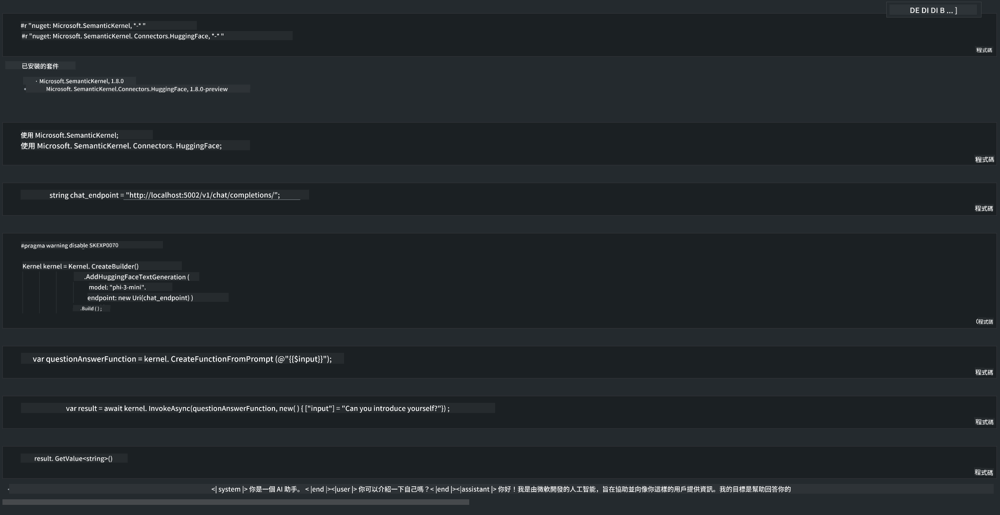

<!--
CO_OP_TRANSLATOR_METADATA:
{
  "original_hash": "bcf5dd7031db0031abdb9dd0c05ba118",
  "translation_date": "2025-05-08T05:56:38+00:00",
  "source_file": "md/01.Introduction/03/Local_Server_Inference.md",
  "language_code": "hk"
}
-->
# **本地伺服器運行 Phi-3 推理**

我哋可以喺本地伺服器部署 Phi-3。用戶可以揀用 [Ollama](https://ollama.com) 或者 [LM Studio](https://llamaedge.com) 嘅方案，亦可以自己寫代碼。你可以透過 [Semantic Kernel](https://github.com/microsoft/semantic-kernel?WT.mc_id=aiml-138114-kinfeylo) 或 [Langchain](https://www.langchain.com/) 連接 Phi-3 嘅本地服務，去建立 Copilot 應用程式。

## **用 Semantic Kernel 存取 Phi-3-mini**

喺 Copilot 應用程式入面，我哋係透過 Semantic Kernel / LangChain 去建立應用。呢種應用框架一般都兼容 Azure OpenAI Service / OpenAI 模型，亦支持 Hugging Face 嘅開源模型同本地模型。如果想用 Semantic Kernel 去存取 Phi-3-mini，應該點做？以 .NET 為例，我哋可以同 Semantic Kernel 入面嘅 Hugging Face Connector 一齊用。預設會對應 Hugging Face 上嘅 model id（第一次用會由 Hugging Face 下載模型，會比較耐）。你亦可以連接自己建嘅本地服務。相比之下，我哋建議用後者，因為自主度較高，特別係企業應用方面。

由圖可見，透過 Semantic Kernel 存取本地服務，可以輕鬆連接自建嘅 Phi-3-mini 模型伺服器。以下係執行結果：

***Sample Code*** https://github.com/kinfey/Phi3MiniSamples/tree/main/semantickernel

**免責聲明**：  
本文件由 AI 翻譯服務 [Co-op Translator](https://github.com/Azure/co-op-translator) 進行翻譯。雖然我們力求準確，但請注意，自動翻譯可能包含錯誤或不準確之處。原始文件的母語版本應視為權威來源。對於重要資訊，建議使用專業人工翻譯。我們不對因使用本翻譯而引起的任何誤解或誤釋負責。