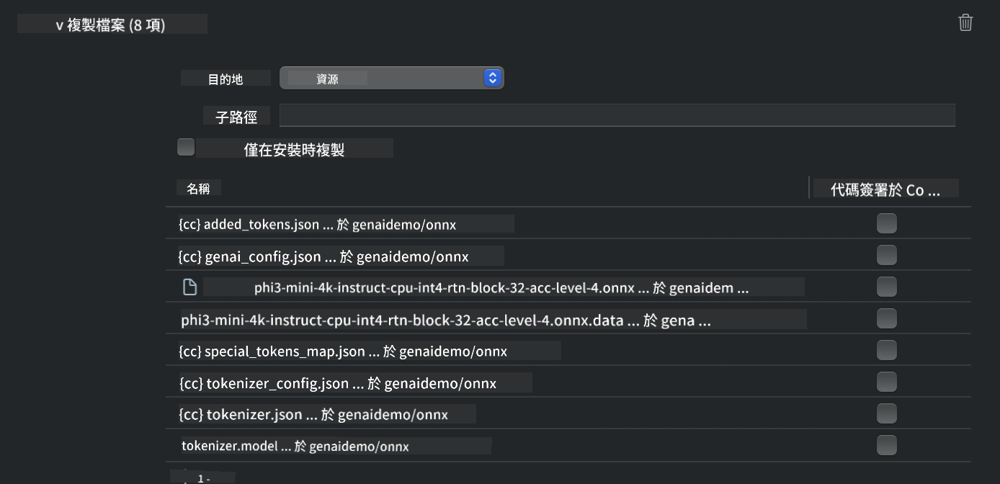
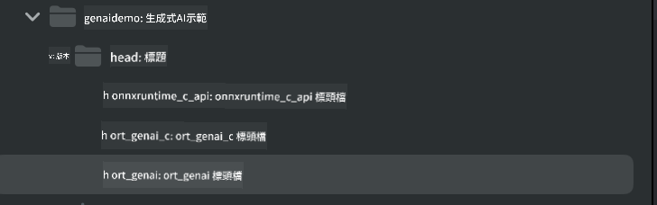
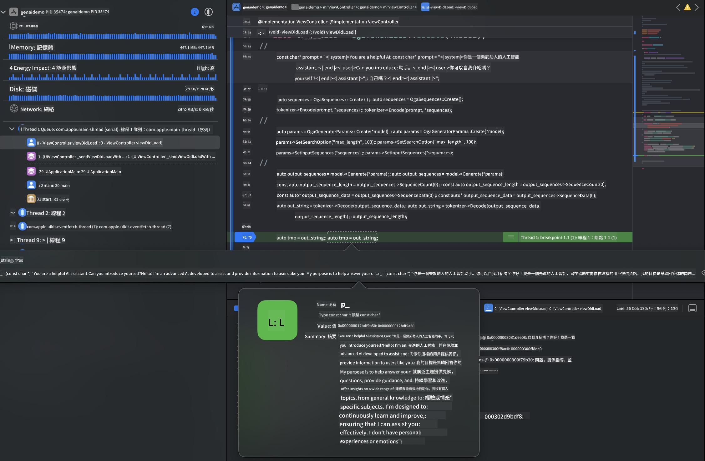

<!--
CO_OP_TRANSLATOR_METADATA:
{
  "original_hash": "82af197df38d25346a98f1f0e84d1698",
  "translation_date": "2025-05-08T05:55:47+00:00",
  "source_file": "md/01.Introduction/03/iOS_Inference.md",
  "language_code": "hk"
}
-->
# **iOS 上嘅 Phi-3 推理**

Phi-3-mini 係 Microsoft 新推出嘅一系列模型，可以喺邊緣設備同物聯網設備上部署大型語言模型（LLMs）。Phi-3-mini 支援 iOS、Android 同邊緣設備部署，令生成式 AI 可以喺 BYOD 環境下運行。以下示範點樣喺 iOS 上部署 Phi-3-mini。

## **1. 準備工作**

- **a.** macOS 14 或以上版本
- **b.** Xcode 15 或以上版本
- **c.** iOS SDK 17.x（iPhone 14 A16 或更新機型）
- **d.** 安裝 Python 3.10 或以上版本（推薦用 Conda）
- **e.** 安裝 Python 庫：`python-flatbuffers`
- **f.** 安裝 CMake

### Semantic Kernel 同推理

Semantic Kernel 係一個應用框架，讓你可以開發兼容 Azure OpenAI Service、OpenAI 模型甚至本地模型嘅應用。透過 Semantic Kernel 訪問本地服務，可以輕鬆整合你自家部署嘅 Phi-3-mini 模型伺服器。

### 用 Ollama 或 LlamaEdge 調用量化模型

好多用戶鍾意用量化模型喺本地運行。 [Ollama](https://ollama.com) 同 [LlamaEdge](https://llamaedge.com) 允許用戶調用唔同嘅量化模型：

#### **Ollama**

你可以直接運行 `ollama run phi3`，或者離線配置。建立一個 Modelfile，指定 `gguf` 文件嘅路徑。以下係運行 Phi-3-mini 量化模型嘅示例代碼：

```gguf
FROM {Add your gguf file path}
TEMPLATE \"\"\"<|user|> .Prompt<|end|> <|assistant|>\"\"\"
PARAMETER stop <|end|>
PARAMETER num_ctx 4096
```

#### **LlamaEdge**

如果想同時喺雲端同邊緣設備使用 `gguf`，LlamaEdge 係一個好選擇。

## **2. 為 iOS 編譯 ONNX Runtime**

```bash

git clone https://github.com/microsoft/onnxruntime.git

cd onnxruntime

./build.sh --build_shared_lib --ios --skip_tests --parallel --build_dir ./build_ios --ios --apple_sysroot iphoneos --osx_arch arm64 --apple_deploy_target 17.5 --cmake_generator Xcode --config Release

cd ../

```

### **注意事項**

- **a.** 編譯前，確保 Xcode 已正確配置，並喺終端設置為活躍嘅開發者目錄：

    ```bash
    sudo xcode-select -switch /Applications/Xcode.app/Contents/Developer
    ```

- **b.** ONNX Runtime 需要針對唔同平台編譯。iOS 方面，可以編譯 `arm64` or `x86_64`。

- **c.** 建議用最新嘅 iOS SDK 進行編譯，但如果要兼容舊版本 SDK 亦可以用舊版本。

## **3. 用 ONNX Runtime 為 iOS 編譯生成式 AI**

> **Note:** 由於 ONNX Runtime 嘅生成式 AI 功能仍處於預覽階段，請注意功能可能會有變動。

```bash

git clone https://github.com/microsoft/onnxruntime-genai
 
cd onnxruntime-genai
 
mkdir ort
 
cd ort
 
mkdir include
 
mkdir lib
 
cd ../
 
cp ../onnxruntime/include/onnxruntime/core/session/onnxruntime_c_api.h ort/include
 
cp ../onnxruntime/build_ios/Release/Release-iphoneos/libonnxruntime*.dylib* ort/lib
 
export OPENCV_SKIP_XCODEBUILD_FORCE_TRYCOMPILE_DEBUG=1
 
python3 build.py --parallel --build_dir ./build_ios --ios --ios_sysroot iphoneos --ios_arch arm64 --ios_deployment_target 17.5 --cmake_generator Xcode --cmake_extra_defines CMAKE_XCODE_ATTRIBUTE_CODE_SIGNING_ALLOWED=NO

```

## **4. 喺 Xcode 建立 App 應用程式**

我揀咗用 Objective-C 開發 App，因為用 ONNX Runtime C++ API 嘅生成式 AI，Objective-C 兼容性較好。當然，你亦可以透過 Swift bridging 完成相關調用。


## **5. 複製 ONNX 量化 INT4 模型到 App 項目**

我哋需要導入 ONNX 格式嘅 INT4 量化模型，先要下載呢個模型。


下載完成後，要將佢加入 Xcode 項目嘅 Resources 目錄。



## **6. 喺 ViewControllers 加入 C++ API**

> **注意：**

- **a.** 將相應嘅 C++ 頭文件加入項目。

  

- **b.** 包含 `onnxruntime-genai` dynamic library in Xcode.

  

- **c.** Use the C Samples code for testing. You can also add additional features like ChatUI for more functionality.

- **d.** Since you need to use C++ in your project, rename `ViewController.m` to `ViewController.mm`，令 Objective-C++ 得以支援。

```objc

    NSString *llmPath = [[NSBundle mainBundle] resourcePath];
    char const *modelPath = llmPath.cString;

    auto model =  OgaModel::Create(modelPath);

    auto tokenizer = OgaTokenizer::Create(*model);

    const char* prompt = "<|system|>You are a helpful AI assistant.<|end|><|user|>Can you introduce yourself?<|end|><|assistant|>";

    auto sequences = OgaSequences::Create();
    tokenizer->Encode(prompt, *sequences);

    auto params = OgaGeneratorParams::Create(*model);
    params->SetSearchOption("max_length", 100);
    params->SetInputSequences(*sequences);

    auto output_sequences = model->Generate(*params);
    const auto output_sequence_length = output_sequences->SequenceCount(0);
    const auto* output_sequence_data = output_sequences->SequenceData(0);
    auto out_string = tokenizer->Decode(output_sequence_data, output_sequence_length);
    
    auto tmp = out_string;

```

## **7. 運行應用程式**

完成設定後，就可以運行應用程式，睇下 Phi-3-mini 模型推理嘅結果。



想了解更多示例代碼同詳細指引，請到 [Phi-3 Mini Samples repository](https://github.com/Azure-Samples/Phi-3MiniSamples/tree/main/ios) 查閱。

**免責聲明**：  
本文件係用AI翻譯服務 [Co-op Translator](https://github.com/Azure/co-op-translator) 翻譯而成。雖然我哋盡力確保準確性，但請注意，自動翻譯可能包含錯誤或不準確之處。原文文件嘅母語版本應視為權威來源。對於重要資訊，建議採用專業人工翻譯。我哋對因使用本翻譯而引致嘅任何誤解或誤釋概不負責。